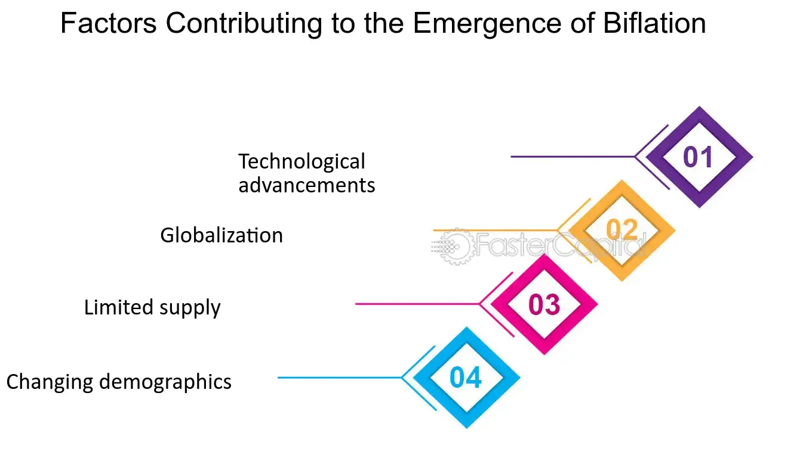

## Table of Contents

## What is biflation?

Biflation is when two opposite things happen in an economy at the same time. Some prices go up, which is called inflation, and other prices go down, which is called deflation. This can be confusing because usually, we think of the economy moving in one direction, either up or down.

For example, the prices of things like food and gas might go up because they are in high demand. At the same time, the prices of things like houses and cars might go down because fewer people want to buy them. Biflation can make it hard for people to understand what is happening with money and prices in the economy.

## How does biflation differ from inflation and deflation?

Biflation is different from inflation and deflation because it involves both of these things happening at the same time in different parts of the economy. Inflation is when the prices of most things go up over time. This can happen when there is more money chasing the same amount of goods, or when the cost of making things goes up. Deflation, on the other hand, is when the prices of most things go down. This can happen when there is less money in the economy or when people are not buying as much, so businesses have to lower their prices to sell their goods.

Biflation, however, means that while some prices are going up (inflation), other prices are going down (deflation). For example, the price of everyday items like food and gas might go up, while the price of big items like houses and cars might go down. This can make the economy feel confusing because different parts of it are moving in opposite directions. Inflation and deflation usually affect the whole economy in one way, but biflation shows that different sectors can be experiencing very different economic pressures at the same time.

## What are the main causes of biflation?

Biflation can happen because of how different parts of the economy work differently. One main cause is the difference between things people need every day and things they can wait to buy. Everyday things like food and gas might go up in price because lots of people need them all the time. This is like inflation. On the other hand, big things like houses and cars might go down in price because fewer people want to buy them right away. This is like deflation.

Another cause of biflation can be changes in technology and how people spend their money. New technology can make some things cheaper, like computers and phones, which can lead to deflation in those areas. At the same time, if people start spending more money on services like healthcare or education, the prices for those services might go up, causing inflation in those areas. So, biflation can show up when different parts of the economy are affected by different forces.

## Can you provide historical examples of biflation?

In the early 2000s, the United States saw signs of biflation. The prices of everyday things like food and gas were going up. This was because more people wanted these things and it cost more to make them. At the same time, the prices of big things like houses were going down. This happened because a lot of people had bought houses with loans they couldn't pay back, and then they had to sell their houses for less money.

Another example was in Japan during the 1990s. Japan had a big economic bubble that burst. After that, the prices of things like electronics and cars went down because Japan made a lot of these things and they became cheaper to make. But at the same time, the prices of things like food and services went up because people still needed these things every day. So, Japan experienced biflation with some prices going up and others going down at the same time.

## How does biflation affect different sectors of the economy?

Biflation can affect different parts of the economy in different ways. For example, the food and energy sectors might see their prices go up because people need these things every day. This means that farmers and oil companies might make more money, but it also means that people have to spend more of their money on these things. On the other hand, the housing and car sectors might see their prices go down. This can be good for people who want to buy a house or a car because they can get them cheaper, but it can be bad for people who sell houses or cars because they make less money.

In the technology sector, biflation can lead to lower prices for things like computers and phones because new technology makes them cheaper to make. This is good for people who want to buy these things, but it can be hard for the companies that make them because they have to keep their prices low. At the same time, sectors like healthcare and education might see their prices go up because more people need these services and they are hard to make cheaper. This can make it harder for people to afford these services, even though they are important.

## What are the signs that an economy might be experiencing biflation?

One sign that an economy might be experiencing biflation is when the prices of everyday things like food and gas are going up, but the prices of big things like houses and cars are going down. This can be confusing because it means some parts of the economy are getting more expensive while others are getting cheaper. For example, you might notice that your grocery bill is higher each month, but at the same time, you see houses in your neighborhood selling for less money than they used to.

Another sign is when new technology makes some things cheaper, like electronics, but the prices of services like healthcare and education are going up. This can happen because new technology can make things like computers and phones less expensive to make, but services that need a lot of people and time, like doctors and teachers, can't get cheaper as easily. So, you might see the price of your new phone going down, but the cost of going to the doctor or sending your kids to school going up.

## How do policymakers typically respond to biflation?

Policymakers have a hard job when they see biflation happening. They need to find ways to help both the parts of the economy where prices are going up and the parts where prices are going down. They might try to make more money available to people so they can keep buying things, even if some things are getting more expensive. This can help keep the economy moving, but it needs to be done carefully so that it doesn't make the problem worse.

Another thing policymakers might do is to help the parts of the economy where prices are going down. For example, they might give money to people to help them buy houses or cars, which can make the prices go up again. At the same time, they might try to control the prices of things like food and gas so they don't go up too fast. Balancing these different needs is tricky, but it's important to help the whole economy stay healthy.

## What impact does biflation have on monetary policy?

Biflation makes it hard for people who make money rules, like central bankers, to decide what to do. Normally, if prices are going up everywhere, they might raise interest rates to slow things down. But with biflation, some prices are going up and others are going down. So, if they raise interest rates, it might make the prices of big things like houses go down even more, which could hurt the economy. But if they don't do anything, the prices of everyday things like food might keep going up, which can also be bad.

Because of this, people who make money rules have to be very careful. They might try to keep interest rates steady and look for other ways to help the economy. For example, they might give money to people to help them buy things, or they might try to control the prices of things like food and gas. It's a tricky balance, but they need to make sure that both the parts of the economy where prices are going up and the parts where prices are going down are taken care of.

## How can investors protect their portfolios during periods of biflation?

During biflation, investors need to be smart about where they put their money. Since some prices are going up and others are going down, they should look for investments that can do well in both situations. For example, they might want to put some money into things like food and energy companies, which can make more money when prices go up. At the same time, they should also look at things like real estate or car companies, which might be cheaper and could be good buys if prices start to go up again.

Another way to protect a portfolio during biflation is to spread the money around in different types of investments. This is called diversification. By putting money into stocks, bonds, and maybe even some real things like gold or real estate, investors can lower their risk. If one part of the economy is doing badly, another part might be doing well, which can help keep the portfolio balanced. It's also a good idea to keep an eye on the economy and be ready to change investments if things start to shift one way or the other.

## What are the long-term economic consequences of biflation?

Biflation can make the economy feel confusing and hard to predict. When some prices go up and others go down at the same time, it can make people unsure about what to do with their money. This can lead to people saving more and spending less, which can slow down the economy. Businesses might also be unsure about what to do because they can't tell if their prices should go up or down. This uncertainty can make it hard for the economy to grow and can lead to fewer jobs and slower progress.

Over time, biflation can make some parts of the economy weaker than others. If the prices of everyday things like food keep going up, people might have less money to spend on big things like houses and cars, even if those prices are going down. This can hurt the companies that make big things and can lead to less building and fewer jobs in those areas. On the other hand, if the prices of big things stay low for a long time, it can make it hard for people who own those things to make money from them. This can lead to more economic problems and make it harder for the economy to recover and grow in a balanced way.

## How does biflation influence consumer behavior and spending?

Biflation can make people feel confused about how to spend their money. When the prices of everyday things like food and gas go up, people have to spend more money just to get by. This means they might not have as much money left over to buy big things like houses or cars, even if those prices are going down. People might start to save more and spend less because they're not sure what will happen next. This can slow down the economy because when people don't spend as much, businesses don't make as much money.

On the other hand, some people might see the lower prices of big things as a chance to buy them. If someone needs a new house or car, they might decide to buy one now while it's cheaper. But they still have to think about how much they're spending on everyday things. So, biflation can make people think a lot about their money and try to balance what they need to buy every day with what they might want to buy in the future. This can make their spending habits change in ways that can affect the whole economy.

## What advanced economic models are used to predict and analyze biflation?

Economists use special models to try to understand and predict biflation. One type of model they use is called a "multi-sector model." This model looks at different parts of the economy, like food, energy, housing, and cars, and sees how prices in each part can go up or down at the same time. By studying these different parts, economists can see how changes in one area might affect another. For example, if food prices go up, people might spend less on cars, which can make car prices go down. These models help economists see the big picture and make better guesses about what might happen next.

Another model that can help with biflation is called a "dynamic stochastic general equilibrium" (DSGE) model. This model is a bit more complicated, but it tries to show how the whole economy works over time. It looks at things like how people spend their money, how businesses make things, and how the government makes rules. By putting all these things together, the DSGE model can show how different parts of the economy might move in different directions. This can help economists predict biflation and figure out what to do about it.

## What is Understanding Inflation?

Inflation is a critical economic concept that denotes the rate at which the general price level for goods and services in an economy increases over time. It reflects a decrease in the purchasing power of a nation's currency. The persistent rise in prices leads to an erosion of consumer purchasing power, impacting both individual economic behavior and broader financial market dynamics.

### Types of Inflation

Several types of inflation can occur, reflecting different underlying causes:

1. **Demand-Pull Inflation:** This form of inflation occurs when the aggregate demand in an economy surpasses aggregate supply. Common triggers include economic expansion, increased consumer spending, government expenditure, and investment. During such periods, producers often raise prices to balance the higher demand, leading to inflationary pressures.

2. **Cost-Push Inflation:** Cost-push inflation arises when there is an increase in the production costs of goods and services, independent of consumer demand. Factors contributing to cost-push inflation include rising wages, increased prices of raw materials, and supply chain disruptions. These additional costs are often passed onto consumers in the form of higher prices.

### Monitoring and Measuring Inflation

Inflation is typically monitored and measured using various indices, the most prominent being the Consumer Price Index (CPI). The CPI measures changes in the price level of a basket of consumer goods and services purchased by households. It is calculated with the following formula:

$$
\text{CPI} = \frac{\text{Cost of Basket in Current Year}}{\text{Cost of Basket in Base Year}} \times 100
$$

This ratio reflects how the cost of a typical basket of goods changes over time, serving as a principal indicator of inflationary trends in an economy. Other measures include the Producer Price Index (PPI), which tracks changes in the selling prices received by domestic producers for their output, and the GDP deflator, which reflects the level of prices of all new, domestically produced, final goods and services in an economy.

Accurate inflation measurement is vital for policymakers, who use these indicators to adjust monetary policy and maintain economic stability. Central banks, like the U.S. Federal Reserve, may alter interest rates in response to inflationary signals, either raising rates to cool down an overheated economy or cutting them to encourage spending during deflationary periods.

## References & Further Reading

[1]: Reulet, N. (2019). ["Understanding Biflation: A Study of Simultaneous Inflationary and Deflationary Pressures."](https://quizlet.com/126912938/ib-econ-chapter-18-inflation-and-deflation-flash-cards/) SSRN Electronic Journal.

[2]: Cukierman, A., & Liviatan, N. (1992). ["Stagflation, Biflation, and Monetary Policy in the Presence of Dual Inflationary Shocks."](https://www.jstor.org/stable/2077746) Journal of Economic Literature, 30(1), 135-187.

[3]: Lopez de Prado, M. (2018). ["Advances in Financial Machine Learning."](https://www.amazon.com/Advances-Financial-Machine-Learning-Marcos/dp/1119482089) Wiley.

[4]: Jansen, S. (2020). ["Machine Learning for Algorithmic Trading."](https://github.com/stefan-jansen/machine-learning-for-trading) Packt Publishing.

[5]: Aronson, D. (2006). ["Evidence-Based Technical Analysis: Applying the Scientific Method and Statistical Inference to Trading Signals."](https://www.amazon.com/Evidence-Based-Technical-Analysis-Scientific-Statistical/dp/0470008741) Wiley.

[6]: Chan, E. P. (2009). ["Quantitative Trading: How to Build Your Own Algorithmic Trading Business."](https://github.com/ftvision/quant_trading_echan_book) Wiley.

[7]: Wilmott, P. (2007). ["Paul Wilmott Introduces Quantitative Finance."](https://www.amazon.com/Paul-Wilmott-Introduces-Quantitative-Finance/dp/0470319585) Wiley.

[8]: Handbook of Economic Forecasting, G. Elliott & A. Timmermann (Eds.) (2006). ["Chapter 1 - Forecasting."](https://www.sciencedirect.com/handbook/handbook-of-economic-forecasting/vol/1/suppl/C)01001-4) Elsevier.

[9]: Fama, E. F. (1965). ["The Behavior of Stock-Market Prices."](https://www.jstor.org/stable/2350752) The Journal of Business, 38(1), 34-105.