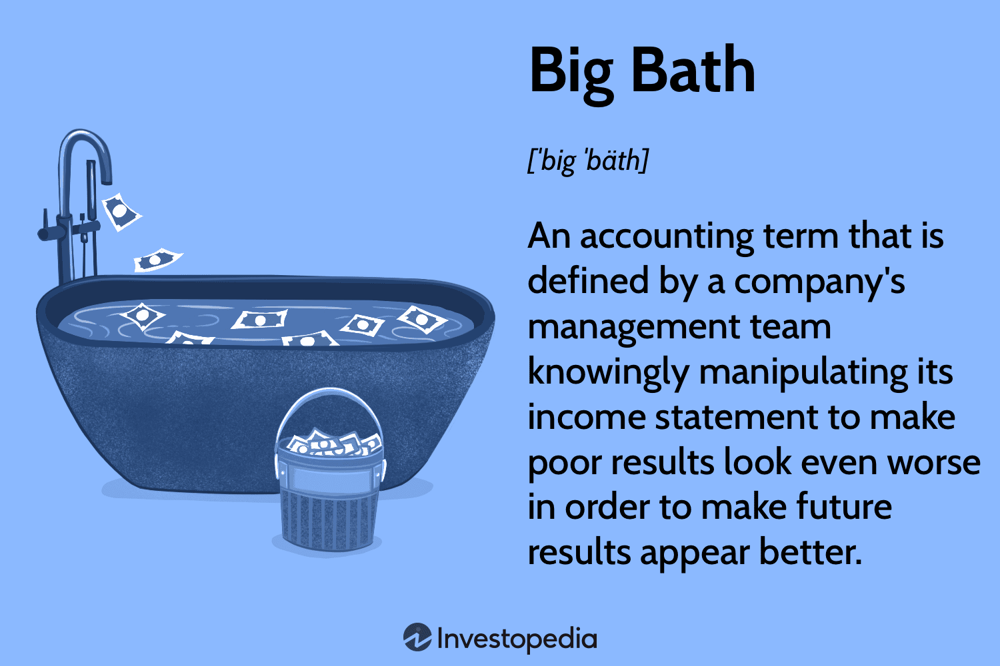

## Table of Contents

## What is Big Bath accounting?

Big Bath accounting is when a company makes its financial situation look worse on purpose. They do this by including all their bad news and losses in one year's financial report. This makes the company's performance look really bad for that year. Companies might do this when they have a new CEO or during a bad economic time. The idea is to make future years look better by comparison.

By taking all the losses at once, the company can start fresh in the next year. This can make the new CEO look good because the financial reports will show improvement over time. However, Big Bath accounting is not honest and can be seen as a way to trick investors. It's important for companies to be transparent and report their finances accurately, so investors can make good decisions.

## Why do companies engage in Big Bath accounting?

Companies use Big Bath accounting when they want to make a bad year look even worse on purpose. They do this by putting all their losses and bad news into one year's financial report. This often happens when there is a new CEO or during tough economic times. The reason they do this is to make the next few years look better by comparison. If a new CEO starts when the company is doing badly, they can use Big Bath accounting to make it seem like they turned things around in the following years.

By taking all the losses at once, the company can start fresh the next year. This can make the new CEO look good because the financial reports will show improvement over time. However, Big Bath accounting is not honest and can be seen as a way to trick investors. It's important for companies to be transparent and report their finances accurately, so investors can make good decisions based on real information.

## Can you provide a simple example of Big Bath accounting?

Imagine a company called ABC Corp. They have a new CEO who starts in a year when the company is not doing well. The new CEO decides to use Big Bath accounting. They include all the bad news and losses from the past few years in this year's financial report. This makes the current year look really bad, with big losses showing up on the [books](/wiki/algo-trading-books).

The reason the CEO does this is to make the next few years look better. If the company starts to recover a little bit, the financial reports will show improvement compared to the very bad year. This makes the new CEO look good because it seems like they turned the company around. However, this is not honest and can trick investors into thinking the company's situation is better than it really is.

## What are the ethical implications of Big Bath accounting?

Big Bath accounting is not ethical because it involves making the company's financial situation look worse on purpose. This can trick investors and other people who look at the company's financial reports. When a company does this, it's not being honest about its real financial health. This can lead to people making bad decisions because they think the company is doing worse than it really is. It's important for companies to be truthful so that investors can trust them and make good choices with their money.

Another problem with Big Bath accounting is that it can hurt the trust people have in the company. If investors find out that the company used Big Bath accounting, they might feel cheated and stop investing in the company. This can make it hard for the company to get money in the future. Also, it can damage the reputation of the company and its leaders. Being honest and transparent is really important for keeping a good relationship with investors and the public.

## How does Big Bath accounting affect financial statements?

Big Bath accounting makes a company's financial statements look really bad on purpose. They do this by putting all their losses and bad news into one year's financial report. This makes that year look worse than it really is. For example, the income statement might show a big loss because the company included all kinds of one-time charges and write-offs. The balance sheet might show less value in assets because the company decided to write down their value a lot.

The reason companies do this is to make the next few years look better by comparison. If the company starts to recover a little bit, the financial statements will show improvement compared to the very bad year. This can make the company's leaders look good because it seems like they turned things around. But it's not honest and can trick investors into thinking the company's situation is better than it really is. It's important for companies to be truthful so that investors can trust them and make good choices with their money.

## What are the legal consequences of Big Bath accounting?

Big Bath accounting can get a company into legal trouble. If the company is not honest about its financial situation, it might break rules set by groups like the Securities and Exchange Commission (SEC). These rules are there to make sure companies tell the truth about their money. If a company uses Big Bath accounting, the SEC might start an investigation. If they find out the company did something wrong, the company could get fined a lot of money. The people who run the company, like the CEO, might also get into personal trouble, like fines or even jail time.

Using Big Bath accounting can also lead to lawsuits from investors. If investors lose money because they made decisions based on the company's dishonest financial reports, they might sue the company. These lawsuits can cost the company a lot of money and time. They can also make it hard for the company to get money from investors in the future. Being honest and following the rules is really important to avoid these kinds of legal problems.

## How can Big Bath accounting be detected by auditors?

Auditors can spot Big Bath accounting by looking closely at a company's financial statements. They check for big, unusual losses or write-offs that happen all at once. If a company suddenly reports a huge loss in one year, auditors might get suspicious. They will look at the reasons for these losses and see if they make sense. If the losses seem too big or if the company is using them to make future years look better, it could be a sign of Big Bath accounting.

Auditors also compare the company's financial statements from year to year. If they see a pattern where one year looks really bad and the next few years look much better, they might think Big Bath accounting is happening. They talk to the company's leaders and ask a lot of questions to understand why the financial statements changed so much. By being thorough and asking the right questions, auditors can find out if a company is trying to trick people with Big Bath accounting.

## What are some real-world examples of Big Bath accounting?

One real-world example of Big Bath accounting happened with Xerox in the early 2000s. Xerox was struggling and decided to use Big Bath accounting to make one year look really bad. They did this by taking all their losses and putting them into one year's financial report. This made that year look much worse than it really was. Xerox did this to make the next few years look better by comparison. They got into big trouble for this, and the SEC fined them $10 million for not being honest about their finances.

Another example is when General Electric (GE) used Big Bath accounting in 2017. GE had a new CEO and was going through a tough time. They decided to take all their losses and put them into one year's financial report. This made that year look really bad, but it helped make the next few years look better. People found out about it, and GE's reputation was hurt. This shows how Big Bath accounting can trick people and cause problems for a company in the long run.

## How do regulatory bodies like the SEC address Big Bath accounting?

The Securities and Exchange Commission (SEC) works hard to stop companies from using Big Bath accounting. They do this by setting rules that say companies have to be honest about their money. If the SEC thinks a company is using Big Bath accounting, they start an investigation. They look at the company's financial reports and ask a lot of questions. If they find out the company did something wrong, they can make the company pay a big fine. They might also punish the people who run the company, like the CEO, with fines or even jail time.

The SEC also tries to stop Big Bath accounting by making sure investors know what's going on. They do this by telling people about the rules and what happens when companies break them. This helps investors be more careful and not get tricked by dishonest financial reports. By keeping a close eye on companies and making sure they follow the rules, the SEC helps keep the market fair and honest for everyone.

## What are the differences between Big Bath accounting and other forms of earnings management?

Big Bath accounting is a type of earnings management where a company makes its financial situation look really bad on purpose. They do this by putting all their losses and bad news into one year's financial report. This makes that year look worse than it really is. The company does this to make the next few years look better by comparison. It's often used when there is a new CEO or during tough economic times. The goal is to make it seem like the new CEO is doing a great job by showing big improvements in the future years.

Other forms of earnings management might not be as extreme as Big Bath accounting. For example, income smoothing is when a company tries to make its earnings look more even from year to year. They do this by moving profits or losses around to avoid big ups and downs. Another type is called "cookie jar accounting," where a company saves up profits in good years and uses them to make bad years look better. Unlike Big Bath accounting, these methods aim to make the company's financial performance look steady and predictable rather than making one year look really bad on purpose.

## How can companies legally restructure to avoid the need for Big Bath accounting?

Companies can legally restructure to avoid the need for Big Bath accounting by making smart changes to how they work. They can sell off parts of the business that are not doing well or are not important to their main goals. This can help them focus on what they do best and get rid of losses. They can also cut costs by finding cheaper ways to do things, like moving to a smaller office or using less expensive materials. By doing these things, companies can make their finances healthier without having to use dishonest methods like Big Bath accounting.

Another way companies can restructure is by bringing in new leaders or changing how the company is run. A new CEO might have fresh ideas on how to make the company better. They can look at the company's finances closely and make plans to improve them over time, instead of trying to make one year look really bad. Companies can also work with financial experts to find legal ways to manage their money better. This can help them avoid the temptation to use Big Bath accounting and keep their financial reports honest and clear.

## What advanced techniques can financial analysts use to identify subtle instances of Big Bath accounting?

Financial analysts can use advanced techniques like trend analysis to spot subtle instances of Big Bath accounting. They look at the company's financial statements over several years to see if there are any unusual patterns. For example, if one year looks much worse than the others, and the next few years show big improvements, it might be a sign of Big Bath accounting. Analysts also use ratio analysis to compare different parts of the financial statements, like the debt-to-equity ratio or the current ratio. If these ratios change a lot in one year, it could mean the company is trying to make that year look bad on purpose.

Another technique is to look at the notes in the financial statements. These notes explain the numbers in more detail and can show if the company is using Big Bath accounting. Analysts also talk to the company's leaders and ask them questions about any big changes in the financial statements. By being thorough and asking the right questions, analysts can find out if a company is using Big Bath accounting, even if it's not easy to see at first.

## References & Further Reading

[1]: Healy, P. M., & Wahlen, J. M. (1999). ["A Review of the Earnings Management Literature and Its Implications for Standard Setting."](https://publications.aaahq.org/accounting-horizons/article/13/4/365/1634/A-Review-of-the-Earnings-Management-Literature-and) Accounting Horizons, 13(4), 365-383.

[2]: Rezaee, Z. (2005). ["Causes, consequences, and deterrence of financial statement fraud."](https://www.sciencedirect.com/science/article/pii/S1045235403000728) Critical Perspectives on Accounting, 16(3), 277-298.

[3]: Levitt, A. (1998). ["The Importance of High-Quality Accounting Standards."](https://www.proquest.com/docview/208925593?pq-origsite=gscholar&fromopenview=true) Speech by SEC Chairman Arthur Levitt at the NYU Center for Law and Business.

[4]: Tse, T. (2004). ["The Business of Misreporting: The Problem and Solution of Financial Statement Fraud."](https://link.springer.com/article/10.1007/s11142-017-9435-x) Harvard University.

[5]: ["Financial Shenanigans: How to Detect Accounting Gimmicks and Fraud in Financial Reports, Fourth Edition"](https://www.amazon.com/Financial-Shenanigans-Fourth-Accounting-Gimmicks/dp/126011726X) by Howard Schilit, Jeremy Perler, and Yoni Engelhart

[6]: Wells, J. T. (2017). ["Corporate Fraud Handbook: Prevention and Detection."](https://onlinelibrary.wiley.com/doi/book/10.1002/9781119351962) 5th Edition, Wiley.