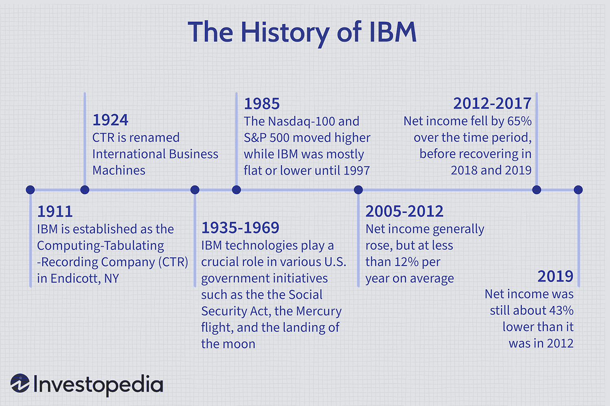

## Table of Contents

## What is the origin of the nickname 'Big Blue' for IBM?

The nickname 'Big Blue' for IBM comes from the 1980s. People started calling IBM this because the company used a lot of blue in its logos and products. Blue was a big part of IBM's look, so the nickname made sense.

Also, IBM was a very big company, one of the biggest in the world. So, the 'Big' part of 'Big Blue' shows how huge and important IBM was in the technology world. The nickname stuck and people still use it today to talk about IBM.

## When was IBM founded and by whom?

IBM was founded on June 16, 1911. The person who started it was a man named Charles Ranlett Flint. He brought together four different companies to make one big company. At first, they called it the Computing-Tabulating-Recording Company, or CTR for short.

Later, in 1924, the company changed its name to International Business Machines, or IBM. A man named Thomas J. Watson became the leader of IBM. He helped the company grow a lot and become very famous around the world.

## What are some key products that contributed to IBM's reputation as 'Big Blue'?

IBM became known as 'Big Blue' because of some important products they made. One big product was the IBM System/360, which came out in 1964. This was a series of computers that could do many different jobs. Companies and governments used these computers a lot because they were very reliable and could grow with their needs. The System/360 helped IBM become a leader in the computer world.

Another product that helped IBM's reputation was the IBM PC, which was released in 1981. This personal computer was easy for people to use at home and at work. It became very popular and helped start the personal computer revolution. The IBM PC showed that IBM could make products for everyone, not just big businesses. These products, along with IBM's use of blue in their branding, helped people start calling them 'Big Blue'.

## How did IBM's corporate culture influence its nickname?

IBM's corporate culture played a big part in its nickname 'Big Blue'. The company was known for being very formal and professional. Employees often wore blue suits, which matched IBM's blue logo and products. This dress code showed how serious and organized IBM was. People saw IBM as a big, reliable company that you could trust. This image of being big and dependable, along with the color blue, helped people start calling IBM 'Big Blue'.

Also, IBM's culture was about working together and being loyal to the company. They had a strong team spirit and everyone worked towards the same goals. This unity made IBM seem even bigger and more powerful. When people thought of IBM, they thought of a huge company that was always in control and leading the way in technology. The nickname 'Big Blue' captured this feeling of strength and reliability that came from IBM's corporate culture.

## What role did IBM play in the development of the personal computer?

IBM played a big role in the development of the personal computer. In 1981, they released the IBM PC, which was one of the first personal computers that many people could use. Before this, computers were mostly big and used by businesses or governments. The IBM PC changed that because it was smaller and easier for regular people to use at home or at work. It used an operating system called MS-DOS, which was made by Microsoft. This was important because it helped Microsoft grow and become a big name in computers too.

The IBM PC also helped set standards for personal computers. It used parts that other companies could make too, like the Intel 8088 processor. This meant other companies could make computers that worked the same way as the IBM PC. This helped the personal computer industry grow fast because more companies could join in and make computers. The success of the IBM PC showed that personal computers were the future, and it helped start a new era where computers were in many homes and offices.

## Can you explain the significance of IBM's blue logo in relation to the nickname?

IBM's blue logo is a big reason why people started calling the company 'Big Blue'. The logo uses a lot of blue color, which people saw in IBM's products and even in the clothes their employees wore. Blue was everywhere in IBM's world, from their computers to their offices. This made people think of IBM whenever they saw the color blue.

The blue logo also made IBM look reliable and trustworthy. Blue is a color that makes people feel calm and safe. So, when people saw IBM's blue logo, they felt like they could trust the company. This feeling, along with IBM being a huge and important company, helped the nickname 'Big Blue' stick. People used 'Big Blue' to talk about how big and dependable IBM was.

## How has the perception of 'Big Blue' evolved over time within the tech industry?

Over the years, the way people in the tech world see 'Big Blue' has changed a lot. At first, 'Big Blue' meant IBM was a huge and reliable company that led the way in technology. In the 1980s and 1990s, IBM was known for making strong computers and helping businesses with big technology projects. People saw IBM as a safe choice because they trusted the company to do a good job.

But as time went on, the tech world changed quickly. New companies came along with fresh ideas and new technology. IBM started to be seen as a bit slower to change. By the 2000s, 'Big Blue' didn't just mean big and reliable anymore. It also meant that IBM was a big company that sometimes struggled to keep up with smaller, faster-moving tech companies. Still, IBM kept working on new things like cloud computing and AI, trying to stay important in the tech world.

## What were some of the major challenges IBM faced during its history that impacted its 'Big Blue' image?

IBM faced many big challenges over the years that changed how people saw its 'Big Blue' image. One big challenge was the fast growth of personal computers in the 1980s and 1990s. IBM was a leader at first with the IBM PC, but soon other companies started making cheaper and better PCs. This made it hard for IBM to keep its lead in the personal computer market. People started to see IBM as a big company that was slow to change and adapt to new technology.

Another challenge came in the late 1990s and early 2000s when the internet and new technology started to grow very quickly. Companies like Microsoft, Apple, and new tech startups were coming up with new ideas and products faster than IBM. IBM had to work hard to stay important in the tech world. They started focusing on things like services, software, and later, cloud computing and AI. These changes helped IBM stay relevant, but the 'Big Blue' image also started to mean a big company that had to work hard to keep up with the fast-changing tech world.

## How did IBM's involvement in government and military projects contribute to its nickname?

IBM's work with the government and military helped make its nickname 'Big Blue' even stronger. The company was known for making big, reliable computers that were used in important government and military projects. For example, IBM made computers that helped with things like the U.S. Census and military data processing. These projects showed that IBM was a big and dependable company that could handle very important and complex jobs. When people thought of IBM, they thought of a company that was trusted by the government and military, which added to the idea of IBM being 'Big Blue'.

Over time, IBM's involvement in these big projects made people see the company as even more powerful and important. The government and military needed technology that worked well and was safe to use. IBM's computers were known for being strong and secure, which made them perfect for these kinds of jobs. This reputation for being a big, reliable company that could work on the most important projects helped the nickname 'Big Blue' stick. People used 'Big Blue' to show how big, strong, and trustworthy IBM was in the eyes of the government and military.

## What strategic shifts has IBM made in recent years, and how do these affect the 'Big Blue' moniker?

In recent years, IBM has made big changes to stay important in the tech world. They moved away from making personal computers and started focusing more on services, software, and new technology like cloud computing and [artificial intelligence](/wiki/ai-artificial-intelligence). IBM bought a company called Red Hat in 2019 to help them grow in the cloud computing market. This showed that IBM wanted to be a leader in helping businesses use the cloud to do their work better. They also worked on AI projects, like the Watson AI system, to help solve big problems in different industries.

These changes have changed how people think about IBM's 'Big Blue' nickname. 'Big Blue' used to mean a big, slow company that was good at making computers. Now, it means a big company that is trying to change and stay important in the fast-moving tech world. IBM is still seen as a reliable and trustworthy company, but now it's also seen as a company that is working hard to be a leader in new technology areas like cloud and AI. The 'Big Blue' nickname still shows that IBM is a big and important company, but it also shows that IBM is trying to keep up with new trends in technology.

## How does IBM's global presence and market dominance relate to the 'Big Blue' nickname?

IBM's global presence and market dominance are big reasons why people call it 'Big Blue'. The company has offices and customers all around the world. This makes IBM seem very big and important. When people think of IBM, they think of a company that is everywhere and helps businesses in many different countries. This global reach helped the nickname 'Big Blue' stick because it showed how huge and powerful IBM was.

IBM's strong position in the market also added to the 'Big Blue' image. For a long time, IBM was the leader in making computers and technology for businesses. They were known for making reliable and high-quality products that many companies trusted. This market dominance made people see IBM as a giant in the tech world. The nickname 'Big Blue' captured this idea of IBM being a big, strong, and leading company in the technology industry.

## What are some expert analyses on the future of IBM and the relevance of 'Big Blue' in the modern tech landscape?

Experts think IBM will keep changing and trying new things in the future. They say IBM is working hard on cloud computing and artificial intelligence. These are big areas in technology right now, and IBM wants to be a leader in them. Experts believe that if IBM can keep up with new trends and make good products in these areas, it can stay important in the tech world. But they also say IBM needs to keep moving fast because the tech world changes quickly, and new companies are always coming up with new ideas.

The 'Big Blue' nickname still means a lot today, but it's a bit different now. It used to mean IBM was a huge, slow-moving company that made computers. Now, 'Big Blue' shows that IBM is a big company that is trying to change and stay important. Experts say the nickname is still relevant because IBM is still a big and trusted name in technology. But they also say 'Big Blue' now shows that IBM is working hard to be a leader in new technology areas like cloud and AI. So, the nickname keeps changing with IBM.

## References & Further Reading

[1]: Bergstra, J., Bardenet, R., Bengio, Y., & Kégl, B. (2011). ["Algorithms for Hyper-Parameter Optimization."](https://dl.acm.org/doi/10.5555/2986459.2986743) Advances in Neural Information Processing Systems 24.

[2]: ["Advances in Financial Machine Learning"](https://www.amazon.com/Advances-Financial-Machine-Learning-Marcos/dp/1119482089) by Marcos Lopez de Prado

[3]: ["Evidence-Based Technical Analysis: Applying the Scientific Method and Statistical Inference to Trading Signals"](https://www.amazon.com/Evidence-Based-Technical-Analysis-Scientific-Statistical/dp/0470008741) by David Aronson

[4]: ["Machine Learning for Algorithmic Trading"](https://github.com/stefan-jansen/machine-learning-for-trading) by Stefan Jansen

[5]: ["Quantitative Trading: How to Build Your Own Algorithmic Trading Business"](https://www.amazon.com/Quantitative-Trading-Build-Algorithmic-Business/dp/1119800064) by Ernest P. Chan