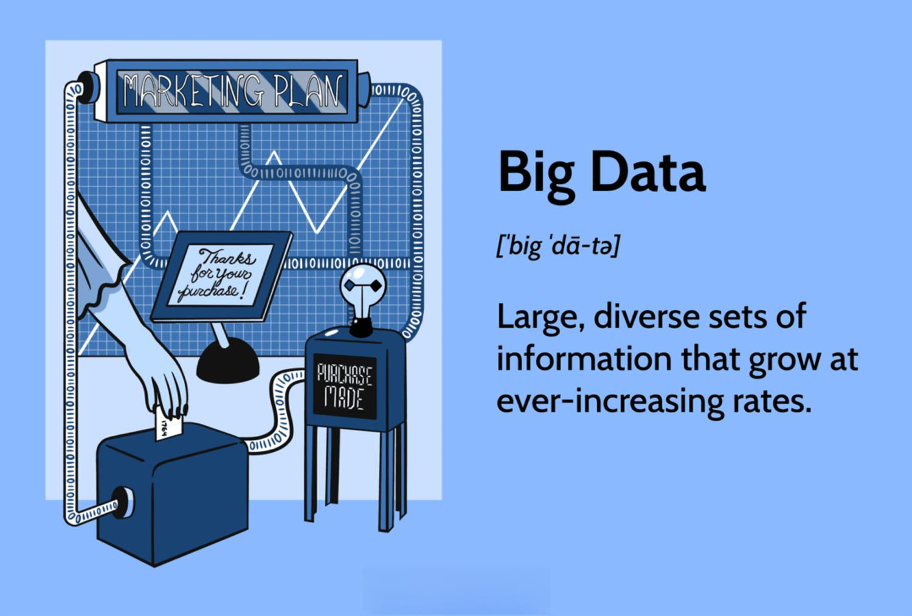

## Table of Contents

## What is big data?

Big data refers to very large sets of information that are too big and complex for regular computer systems to handle easily. It comes from many different places, like social media, online shopping, and sensors in devices. Because there is so much data, special tools and methods are needed to store, process, and analyze it.

These large data sets can help businesses and organizations make better decisions. For example, a company might use big data to understand what customers want, or a hospital might use it to improve patient care. By looking at patterns and trends in the data, people can find useful information that would be hard to see otherwise.

## Why is big data analysis important?

Big data analysis is important because it helps people make smarter choices. When you have a lot of information, you can see patterns and trends that you wouldn't notice otherwise. For example, a store can use big data to figure out what products people like to buy together, and then place those items closer to each other to boost sales. This kind of insight can make businesses run better and help them serve their customers more effectively.

It also plays a big role in many fields like healthcare, where doctors can use big data to predict which patients might get sick and take steps to prevent it. In cities, big data can help plan better traffic routes to reduce congestion. By understanding big data, we can solve problems more efficiently and improve the quality of life for many people. It's like having a superpower that lets us see the bigger picture and make decisions based on facts, not just guesses.

## What are the main sources of big data?

Big data comes from many places. One big source is social media, where people share a lot of information every day. Websites like Facebook, Twitter, and Instagram collect data about what people do, what they like, and what they say. Another source is businesses. When you shop online or in a store, the company keeps track of what you buy, how much you spend, and even how you pay. This information helps them understand their customers better.

Another important source of big data is from sensors and devices. Things like smartphones, fitness trackers, and even cars have sensors that collect data all the time. For example, your phone knows where you are, and your fitness tracker knows how many steps you take. All this data can be used to see how people live and move. Governments also produce a lot of big data. They collect information about things like the weather, traffic, and public health. This data helps them make decisions that affect everyone.

In addition to these, big data can come from the internet itself. Every time you click on a link or watch a video, that action is recorded. Search engines like Google use this data to understand what people are interested in. All these different sources together create a huge amount of information that can be analyzed to learn more about the world.

## What are the common tools and technologies used in big data analysis?

Big data analysis uses many special tools and technologies to handle large amounts of information. One of the most popular tools is Hadoop, which is like a big storage system that can manage and process data across many computers. Another important tool is Apache Spark, which is faster than Hadoop and can do real-time analysis. These tools work together to break down big data into smaller pieces that are easier to handle. They also use programming languages like Python and R, which are good for data analysis because they have many libraries and tools that make it easier to work with data.

Another key technology in big data is NoSQL databases, like MongoDB and Cassandra. These databases are different from traditional ones because they can store lots of different kinds of data, not just numbers and text. They are good for big data because they can handle the variety and [volume](/wiki/volume-trading-strategy) of information that comes from places like social media and sensors. Cloud computing is also very important for big data. Services like Amazon Web Services (AWS) and Google Cloud Platform provide the space and power needed to store and process big data without having to buy a lot of expensive equipment.

Lastly, there are tools like Tableau and Power BI that help turn big data into easy-to-understand pictures and charts. These visualization tools are important because they make it easier for people to see patterns and trends in the data. Machine learning algorithms are also used a lot in big data analysis. They can find hidden patterns and make predictions based on the data, which is very helpful for businesses and researchers. All these tools and technologies work together to make big data useful and understandable.

## How does big data analysis differ from traditional data analysis?

Big data analysis and traditional data analysis are different in many ways. Traditional data analysis usually deals with smaller sets of data that fit easily into regular databases. It often uses simple tools like spreadsheets or basic software to look at the data and find answers to questions. On the other hand, big data analysis deals with huge amounts of information that come from many different places, like social media, sensors, and online transactions. Because there is so much data, special tools like Hadoop and Spark are needed to store and process it. These tools can handle the large volume and variety of data that traditional methods can't.

Another big difference is how the data is processed. Traditional data analysis often happens on one computer, and it can take a long time to get results. Big data analysis uses many computers working together to process the data quickly. This is called distributed computing, and it makes it possible to analyze big data in real-time. Also, big data often includes different types of information, like text, images, and videos, which traditional methods are not good at handling. Big data analysis uses advanced techniques like [machine learning](/wiki/machine-learning) to find patterns and make predictions from this complex data, making it a powerful tool for understanding the world around us.

## What are the key steps in the big data analysis process?

The big data analysis process starts with collecting and storing the data. First, you need to gather information from different sources like social media, sensors, and online transactions. This data can be huge and come in different forms, like text, numbers, or images. To handle it, you need special tools like Hadoop or cloud storage to keep it all organized. Once the data is stored, the next step is to clean and prepare it. This means getting rid of any mistakes or missing parts and making sure the data is ready to be analyzed. It's like tidying up a messy room before you can use it properly.

After the data is ready, the next step is to process and analyze it. This is where you use powerful tools like Apache Spark or machine learning algorithms to look at the data and find patterns or trends. You might be looking for answers to specific questions, like what products customers like to buy together or how to predict the weather. The final step is to share the results in a way that's easy to understand. Tools like Tableau or Power BI can turn the data into charts and graphs that make it clear what the data is telling you. This helps people make better decisions based on the information they've found.

## What are some common challenges faced in big data analysis?

One of the biggest challenges in big data analysis is dealing with the huge amount of information. There's so much data coming from places like social media, online shopping, and sensors that it can be hard to store and process it all. You need special tools and a lot of computer power to handle it, which can be expensive and complicated to set up. Also, the data comes in many different forms, like text, numbers, and pictures, which makes it even harder to work with. You have to clean and organize the data before you can analyze it, and that takes a lot of time and effort.

Another challenge is making sure the data is good quality. Sometimes, the data can have mistakes or missing parts, which can mess up your analysis. You have to be careful to check and fix the data before you use it, or you might get the wrong answers. Privacy is also a big issue. When you're working with data about people, you have to make sure you're not sharing their personal information without permission. This can be tricky because you want to use the data to learn something useful, but you also have to keep people's information safe.

Lastly, finding the right people to do big data analysis can be tough. You need experts who know how to use the special tools and understand the math behind the analysis. These people are in high demand, and it can be hard to find enough of them. Plus, keeping up with new technology and methods is a challenge because things change so fast in the world of big data. You have to keep learning and adapting to stay on top of it all.

## How can big data analysis improve business decision-making?

Big data analysis can help businesses make better decisions by giving them a lot of information about their customers, products, and market trends. When a business looks at big data, it can see patterns and trends that would be hard to notice otherwise. For example, a store might use big data to see what products people like to buy together. This can help the store decide where to place items on the shelves to make it easier for customers to find what they want. By understanding what customers like and how they behave, businesses can make smarter choices about what to sell, how to market their products, and how to improve their services.

Another way big data analysis helps with decision-making is by predicting future trends. By looking at a lot of data from the past, businesses can use special tools to guess what might happen next. For example, a company might use big data to predict how much of a product they will sell in the next month. This helps them plan how much to make or buy, so they don't run out of stock or have too much left over. Big data can also help businesses spot problems early, like a drop in sales or a change in customer behavior. By catching these issues early, businesses can make quick decisions to fix them before they get worse.

## What ethical considerations should be taken into account in big data analysis?

One important ethical consideration in big data analysis is privacy. When businesses and organizations collect a lot of data about people, they need to be careful not to share personal information without permission. People have a right to keep their information private, and big data analysis should respect that. Companies need to use strong security measures to protect the data and make sure it's only used for the right reasons. They also need to be clear with people about what data they're collecting and why, so people can make informed choices about sharing their information.

Another ethical issue is fairness. Big data can sometimes lead to decisions that are not fair to everyone. For example, if a company uses big data to decide who gets a loan, the data might show patterns that seem to favor one group of people over another. This can lead to unfair treatment, even if it's not on purpose. To avoid this, companies need to check their data and the decisions they make to make sure they're not causing harm or being unfair. They should also think about how their use of big data might affect different groups of people and try to make decisions that are good for everyone.

## What advanced techniques are used in big data analysis, such as machine learning and AI?

Machine learning is a big part of big data analysis. It's like teaching a computer to learn from the data it sees. Instead of telling the computer exactly what to do, you give it a lot of information and let it find patterns on its own. For example, a store might use machine learning to look at what customers buy and figure out what they might want to buy next. This can help the store make better decisions about what to sell and how to market their products. Machine learning can also help with things like predicting the weather or finding fraud in bank transactions. It's powerful because it can handle huge amounts of data and find things that people might miss.

Artificial intelligence, or AI, takes machine learning a step further. AI can not only find patterns in data but also make decisions and take actions based on what it learns. For example, a hospital might use AI to look at patient data and help doctors decide the best treatment for each person. AI can also be used in things like self-driving cars, where the car uses data from sensors to make decisions about how to drive safely. Both machine learning and AI make big data analysis more powerful because they can handle complex information and make smart decisions quickly. This helps businesses and organizations solve problems and make better choices.

## How can big data analysis be scaled for large enterprises?

Big data analysis can be scaled for large enterprises by using powerful tools and technologies. One way to do this is by using cloud computing services like Amazon Web Services (AWS) or Google Cloud Platform. These services provide a lot of storage space and computer power, so businesses can handle huge amounts of data without having to buy a lot of expensive equipment. They can also use tools like Hadoop and Apache Spark to process the data quickly across many computers. This is important for large enterprises because they often have a lot of data coming from different parts of their business, and they need to be able to analyze it all at once.

Another way to scale big data analysis is by building a strong team of experts. Large enterprises need people who know how to use the special tools and understand the math behind big data analysis. These experts can help set up the systems and make sure they're working well. They can also keep learning about new technology and methods, which is important because things change fast in the world of big data. By having the right tools and the right people, large enterprises can handle their big data and use it to make better decisions for their business.

## What future trends are expected in the field of big data analysis?

In the future, big data analysis is expected to become even more important as more and more information is collected from places like the internet, smart devices, and businesses. One big trend will be the use of more advanced [artificial intelligence](/wiki/ai-artificial-intelligence) (AI) and machine learning to make sense of all this data. These technologies will get better at finding patterns and making predictions, which will help businesses and organizations make smarter decisions. For example, AI might be used to predict what customers will want to buy next or to help doctors find the best treatments for patients. As these tools get better, they will be able to handle even bigger amounts of data and do it faster than ever before.

Another trend in big data analysis will be a focus on privacy and security. As people become more aware of how their data is used, businesses will need to be more careful about keeping it safe. They will need to use stronger security measures to protect the data and be clear with people about what they're doing with it. There will also be more rules and laws about how data can be used, which will change how big data analysis is done. Despite these challenges, the future of big data looks bright, with new tools and methods making it easier to turn huge amounts of information into useful insights.

## References & Further Reading

[1]: Bergstra, J., Bardenet, R., Bengio, Y., & Kégl, B. (2011). ["Algorithms for Hyper-Parameter Optimization."](https://papers.nips.cc/paper/4443-algorithms-for-hyper-parameter-optimization) Advances in Neural Information Processing Systems 24.

[2]: ["Advances in Financial Machine Learning"](https://www.amazon.com/Advances-Financial-Machine-Learning-Marcos/dp/1119482089) by Marcos Lopez de Prado

[3]: ["Evidence-Based Technical Analysis: Applying the Scientific Method and Statistical Inference to Trading Signals"](https://www.amazon.com/Evidence-Based-Technical-Analysis-Scientific-Statistical/dp/0470008741) by David Aronson

[4]: ["Machine Learning for Algorithmic Trading"](https://github.com/stefan-jansen/machine-learning-for-trading) by Stefan Jansen

[5]: ["Quantitative Trading: How to Build Your Own Algorithmic Trading Business"](https://books.google.com/books/about/Quantitative_Trading.html?id=j70yEAAAQBAJ) by Ernest P. Chan