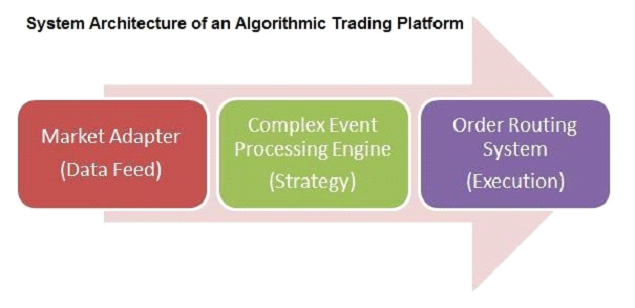

## Table of Contents

## What is Big Data and how does it relate to trading?

Big Data refers to the large and complex sets of data that are generated every day from various sources like social media, financial transactions, and sensors. It's called "big" because it's so huge and complicated that traditional data processing tools can't handle it easily. Instead, special techniques and technologies, like machine learning and advanced analytics, are used to make sense of it all.

In trading, Big Data plays a crucial role. Traders use it to analyze market trends, consumer behavior, and economic indicators to make better decisions. For example, by looking at large amounts of data from social media, traders can understand what people are thinking about certain stocks or products. This can help them predict how stock prices might change. Big Data also helps in creating automated trading systems that can quickly buy or sell based on real-time data analysis, making trading more efficient and potentially more profitable.

## How can Big Data be used to improve trading strategies?

Big Data can help traders make better decisions by looking at lots of information from different places. For example, traders can use data from social media to see what people are saying about a company or a product. If many people are talking positively about a new product, it might mean the company's stock price will go up. Traders can also use data from news articles, financial reports, and even weather forecasts to predict how the market might move. By putting all this information together, traders can spot trends and patterns that they might miss if they only looked at one type of data.

Another way Big Data helps is by making trading faster and more automatic. With so much data coming in every second, it's hard for people to keep up. But computers can process this data quickly and make decisions based on what they find. For instance, a trading system can be set up to automatically buy or sell stocks when certain conditions are met, like if a stock's price reaches a certain level or if there's a big change in the market. This can help traders take advantage of opportunities faster than they could if they were doing everything by hand.

Overall, Big Data gives traders more information to work with and helps them act on that information more quickly. This can lead to better trading strategies and potentially higher profits. By using Big Data, traders can make more informed decisions and stay ahead in the fast-moving world of trading.

## What are the common sources of Big Data in the trading industry?

In the trading industry, Big Data comes from many different places. One common source is market data, which includes stock prices, trading volumes, and other financial information. This data is generated every time someone buys or sells a stock, and it can help traders understand how the market is moving. Another important source is economic data, like unemployment rates, inflation numbers, and GDP growth. This kind of information can give traders a bigger picture of the economy and help them predict how different stocks might perform.

Another source of Big Data in trading is news and social media. News articles, blogs, and posts on platforms like Twitter and Reddit can provide insights into what people are thinking about different companies and products. By analyzing this data, traders can get a sense of public sentiment and how it might affect stock prices. For example, if a lot of people are talking positively about a company, it might mean its stock price will go up. 

Lastly, there's data from alternative sources like satellite imagery, credit card transactions, and even weather data. These might not seem directly related to trading, but they can still be useful. For instance, satellite images can show how busy a company's parking lot is, which might indicate how well the company is doing. And weather data can help traders predict how certain industries, like agriculture or travel, might be affected by weather changes. By using all these different kinds of data, traders can get a more complete picture of the market and make better trading decisions.

## What technologies and tools are essential for processing Big Data in trading?

To process Big Data in trading, traders use special technologies and tools that can handle lots of information quickly. One important tool is Hadoop, which is a system that helps store and process large amounts of data across many computers. Another key technology is Apache Spark, which is faster than Hadoop and can do real-time data processing. This means it can look at data as it comes in, which is very useful for trading where things can change quickly. There are also tools like Kafka, which helps move data around quickly, and NoSQL databases like Cassandra, which can store and retrieve data in a way that's easier for Big Data.

In addition to these tools, traders use [machine learning](/wiki/machine-learning) and artificial intelligence (AI) to make sense of all the data. Machine learning can find patterns in the data that humans might miss, and AI can help make decisions based on those patterns. For example, a machine learning model might look at past stock prices and news articles to predict what will happen next. To make these models work, traders use programming languages like Python and R, which are good for data analysis. They also use platforms like Jupyter Notebooks to write and run their code easily.

Overall, these technologies and tools help traders process Big Data quickly and make better trading decisions. By using Hadoop, Spark, and other systems, traders can handle large amounts of data. And with machine learning and AI, they can turn that data into useful insights that help them trade more effectively.

## How does Big Data help in predicting market trends and making informed trading decisions?

Big Data helps traders predict market trends by looking at a lot of information from different places all at once. Traders use data from stock prices, economic reports, social media, and even things like satellite images and weather forecasts. By putting all this information together, they can see patterns and trends that they might miss if they only looked at one type of data. For example, if a lot of people are talking positively about a company on social media, it might mean the company's stock price will go up. By using Big Data, traders can get a more complete picture of what's happening in the market and make better guesses about what will happen next.

Once traders have all this data, they use special tools and technologies to make sense of it. These tools, like Hadoop and Apache Spark, can handle huge amounts of information quickly. They also use machine learning and artificial intelligence to find patterns in the data and make predictions. For instance, a machine learning model might look at past stock prices and news articles to predict what will happen to a stock's price in the future. By using these technologies, traders can make more informed decisions about when to buy or sell stocks. This can help them make better trades and potentially earn more money.

## What are the challenges faced when integrating Big Data into trading strategies?

One big challenge of using Big Data in trading is dealing with so much information. There's just so much data coming in from different places like stock prices, news, and social media. It can be hard to figure out what's important and what's not. Traders need special tools and computers that can handle all this data quickly. But even with these tools, it can be tough to make sure the data is correct and up-to-date. If the data is wrong or old, traders might make bad decisions.

Another challenge is understanding the data. Even if traders have all this information, it's not always easy to see what it means. They use things like machine learning to help find patterns, but these models can be hard to understand and sometimes they make mistakes. Traders have to be careful and keep checking their models to make sure they're working right. Also, using Big Data can be expensive. The tools and computers needed to process all this data cost a lot of money, and not everyone can afford them.

Lastly, there's the problem of keeping up with changes. The market changes all the time, and what worked yesterday might not work today. Traders need to keep learning and adjusting their strategies. They also have to think about rules and regulations that can change how they use Big Data. It's a lot to keep track of, but if they can do it, using Big Data can help them make better trading decisions.

## Can you explain how machine learning and AI enhance Big Data applications in trading?

Machine learning and AI help traders make sense of Big Data by finding patterns and making predictions. They look at lots of data from different places, like stock prices, news, and social media, and use this information to guess what might happen next in the market. For example, a machine learning model can learn from past stock prices and news articles to predict if a stock's price will go up or down. This helps traders make better decisions about when to buy or sell stocks. By using machine learning, traders can find trends and patterns that they might miss if they were just looking at the data themselves.

Another way machine learning and AI help is by making trading faster and more automatic. With so much data coming in every second, it's hard for people to keep up. But computers can process this data quickly and make decisions based on what they find. For instance, an AI system can be set up to automatically buy or sell stocks when certain conditions are met, like if a stock's price reaches a certain level or if there's a big change in the market. This can help traders take advantage of opportunities faster than they could if they were doing everything by hand. Overall, machine learning and AI make it easier for traders to use Big Data to make better and quicker trading decisions.

## What are some successful case studies of Big Data used in trading strategies?

One successful case of Big Data in trading is how Renaissance Technologies used it to create their Medallion Fund. They gathered lots of data from different places like stock prices, news, and even weather reports. Then, they used special computer programs and math to find patterns in this data. This helped them make really good guesses about what would happen in the market. The Medallion Fund became famous because it made a lot of money, much more than other funds. This showed that using Big Data can help traders do better if they know how to use it right.

Another example is how Two Sigma Investments uses Big Data to make their trading strategies better. They look at data from social media, satellite images, and even credit card transactions to understand what's happening in the market. By putting all this information together, they can see trends that other traders might miss. Two Sigma uses machine learning to help them find these patterns and make decisions quickly. Their success shows that Big Data can help traders make smarter choices and earn more money by understanding the market better.

## How does Big Data affect high-frequency trading and algorithmic trading?

Big Data plays a big role in high-frequency trading and [algorithmic trading](/wiki/algorithmic-trading). High-frequency trading is when computers buy and sell stocks very quickly, often in just a few seconds. These computers need a lot of data to make fast decisions. Big Data gives them information from stock prices, news, and even social media. By using this data, the computers can see what's happening in the market right away and decide when to buy or sell. This makes high-frequency trading faster and more accurate because the computers can react to new information as soon as it comes in.

Algorithmic trading is when computers use math and rules to decide when to trade. Big Data helps these computers by giving them lots of information to work with. For example, they can look at past stock prices and news articles to find patterns and make predictions. By using Big Data, algorithmic trading can be more successful because the computers have more information to make better decisions. This can help traders make more money by finding good opportunities that they might miss if they only used a little bit of data.

## What are the ethical considerations and regulatory issues surrounding Big Data in trading?

Using Big Data in trading brings up some important ethical questions. One big issue is privacy. Traders use a lot of data from places like social media and news, and sometimes this data can be about people's personal lives. It's important to make sure this data is used in a way that respects people's privacy and doesn't harm them. Another ethical concern is fairness. If only some traders can use Big Data because it's expensive, it might not be fair to others who can't afford it. This could make the market less equal and give some people an unfair advantage.

There are also regulatory issues to think about. Governments and financial regulators have rules about how data can be used in trading. These rules are there to make sure the market is fair and safe for everyone. Traders need to follow these rules when they use Big Data, which can be hard because the rules can change and be different in different places. Also, using Big Data can sometimes lead to new problems that regulators haven't thought of yet. For example, if a trading system makes decisions too quickly, it might cause big changes in the market that are hard to control. Regulators need to keep up with these new challenges to make sure the market stays fair and stable.

## How can traders ensure data quality and manage data privacy when using Big Data?

To make sure the data they use is good, traders need to check it carefully. They should look at where the data comes from and see if it's correct and up-to-date. Sometimes, data can have mistakes or be old, which can lead to bad trading decisions. Traders can use special tools to clean the data and make sure it's right. They also need to keep an eye on their data all the time because things can change quickly. By doing these things, traders can trust their data more and make better choices.

When it comes to keeping data private, traders need to be very careful. They should only use data that they're allowed to use and make sure they don't share people's personal information without permission. This means following rules about data privacy and using tools that keep data safe. Traders also need to tell people if they're using their data and why. By being open and honest, traders can use Big Data in a way that respects people's privacy and follows the law.

## What future trends can we expect in the use of Big Data for trading strategies?

In the future, we can expect Big Data to become even more important in trading. Traders will use more and more data from different places, like social media, satellite images, and even things like weather forecasts. This will help them see more patterns and trends in the market, making their trading strategies better. Also, new tools and technologies will come out that can handle even bigger amounts of data faster. This will let traders make decisions quicker and take advantage of opportunities as soon as they happen.

Another trend we might see is more use of artificial intelligence and machine learning. These technologies will get better at finding patterns in Big Data and making predictions. This means traders can use AI to help them make smarter decisions about when to buy or sell stocks. But as Big Data and AI become more common, there will also be more rules and regulations to make sure everything is fair and safe. Traders will need to keep up with these changes and use Big Data in a way that respects people's privacy and follows the law.

## What is the future of algorithmic trading with big data?

The future of algorithmic trading is poised to be significantly shaped by the advancements in [artificial intelligence](/wiki/ai-artificial-intelligence) (AI) and machine learning (ML). These technologies enable the development of sophisticated models that can analyze vast amounts of data and identify intricate patterns that may not be immediately apparent to human traders. AI and ML have the potential to refine predictive analytics, thereby enhancing the accuracy of market forecasts and improving decision-making processes in trading strategies. 

Incorporating machine learning algorithms, such as [deep learning](/wiki/deep-learning) and [reinforcement learning](/wiki/reinforcement-learning), allows trading systems to adapt to changing market conditions. They can dynamically update models based on real-time data, improving the responsiveness and accuracy of trading strategies. For example, neural networks can be employed to process historical price data and generate buy or sell signals. The formula for updating the weights in a [neural network](/wiki/neural-network) during backpropagation is:

$$
w_{ij} = w_{ij} - \eta \frac{\partial L}{\partial w_{ij}}
$$

where $w_{ij}$ is the weight between neurons $i$ and $j$, $\eta$ is the learning rate, and $L$ is the loss function.

Emerging technologies like blockchain and quantum computing also hold transformative potential for algorithmic trading. Blockchain technology can introduce greater transparency and security in trading operations by enabling distributed ledgers that record transactions securely. This can reduce the risk of fraud and enhance trust among market participants. Quantum computing, although still in its nascent stages, promises to revolutionize trading strategies by solving complex optimization problems at unprecedented speeds. Quantum algorithms, such as Shor's algorithm for integer factorization or Grover's algorithm for database search, could dramatically improve the efficiency of computations required for high-frequency trading and portfolio optimization.

Over the next decade, algorithmic trading is expected to see several key trends and innovations. The integration of AI into trading platforms will likely lead to increasingly autonomous systems capable of executing trades with minimal human intervention. Additionally, ethical AI considerations will become paramount as firms seek to ensure that their algorithms operate fairly and without bias.

Interoperability is another anticipated trend, with financial institutions seeking to integrate disparate data sources and trading systems seamlessly. This will require robust APIs and standardized protocols to enable effective communication and data exchange. Furthermore, the advent of 5G technology will enhance the transmission speed and reliability of financial data, enabling quicker decision-making and execution in global financial markets.

The continuous evolution and integration of AI, machine learning, blockchain, and quantum computing into algorithmic trading are set to redefine the landscape of financial markets, offering both significant opportunities for innovation and challenges in terms of implementation and regulation.

## References & Further Reading

[1]: ["Advances in Financial Machine Learning"](https://www.amazon.com/Advances-Financial-Machine-Learning-Marcos/dp/1119482089) by Marcos Lopez de Prado

[2]: ["Machine Learning for Algorithmic Trading"](https://github.com/stefan-jansen/machine-learning-for-trading) by Stefan Jansen

[3]: ["Quantitative Trading: How to Build Your Own Algorithmic Trading Business"](https://www.amazon.com/Quantitative-Trading-Build-Algorithmic-Business/dp/1119800064) by Ernest P. Chan

[4]: Kearns, M., Nevmyvaka, Y. (2013). ["Machine Learning for Market Microstructure and High Frequency Trading."](https://www.cis.upenn.edu/~mkearns/papers/KearnsNevmyvakaHFTRiskBooks.pdf) In "High-Frequency Trading: A Practical Guide to Algorithmic Strategies and Trading Systems", Wiley Trading.

[5]: Chakraborty, B. (2018). ["Big Data Driven Financial Trading: Machine Learning and Natural Language Processing."](https://dl.acm.org/doi/proceedings/10.1007/978-3-319-94301-5) In: "Machine Intelligence and Signal Processing", Springer.

[6]: ["Python for Finance: Mastering Data-Driven Finance"](https://www.amazon.com/Python-Finance-Mastering-Data-Driven/dp/1492024333) by Yves Hilpisch

[7]: Giraud, L., Kipouros, T. (2017). ["The Role of Big Data in the Financial Market."](https://www.researchgate.net/publication/383397952_The_role_of_big_data_in_detecting_and_preventing_financial_fraud_in_digital_transactions) Applied Sciences.