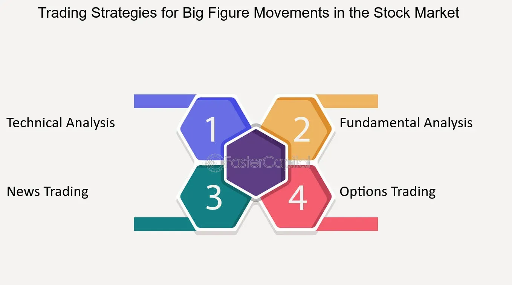

## Table of Contents

## What is the basic definition of 'Big Figure' in finance?

In finance, a 'Big Figure' refers to the main part of a price quote, excluding the smaller units. For example, if a stock is priced at $123.45, the 'Big Figure' would be $123. This term is often used in fast-paced trading environments where traders might only mention the smaller units or 'ticks' when discussing price changes, assuming everyone knows the 'Big Figure.'

Understanding the 'Big Figure' is important because it helps traders communicate quickly and efficiently. Instead of repeating the entire price, they can focus on the changes in the smaller units. This is especially useful in markets like foreign exchange where prices can change rapidly, and traders need to react quickly to new information.

## How does the concept of 'Big Figure' apply to different financial markets?

In the foreign exchange market, the 'Big Figure' is very important. When traders talk about currency pairs like EUR/USD, they often leave out the 'Big Figure' because it stays the same for a while. For example, if EUR/USD is at 1.1850, traders might just say "50" instead of the full price. This helps them talk faster and focus on small changes in the price, which can happen a lot in forex trading.

In the stock market, the 'Big Figure' also helps traders communicate quickly. If a stock is trading at $50.25, traders might just talk about the cents, like "25," assuming everyone knows the 'Big Figure' is $50. This is useful in busy trading rooms where people need to share information fast. It makes it easier to focus on small price movements without saying the whole price every time.

In the bond market, the 'Big Figure' can be used in a similar way. If a bond is priced at 102-16 (which means 102% of its face value plus 16/32nds), traders might just mention "16" when discussing small changes. This helps them focus on the smaller price movements, which can be important in bond trading where prices can change quickly due to [interest rate](/wiki/interest-rate-trading-strategies) changes or other economic factors.

## Can you explain the historical origin of the term 'Big Figure'?

The term 'Big Figure' started a long time ago in the world of finance, especially in trading floors where people had to talk fast. Traders needed a quick way to share prices without saying the whole number every time. So, they began to use 'Big Figure' to mean the main part of the price, and they would only talk about the smaller changes. This made it easier to communicate in busy trading environments where every second counted.

Over time, 'Big Figure' became a common term in different financial markets like stocks, [forex](/wiki/forex-system), and bonds. It helped traders focus on the small price changes that can happen quickly, instead of repeating the big number that often stays the same. This way of talking about prices made trading smoother and more efficient, especially in places where people needed to react fast to new information.

## What are the common mechanisms used to track 'Big Figure' changes?

Traders use different tools to keep an eye on 'Big Figure' changes. One common way is by using trading platforms that show real-time prices. These platforms let traders see the main part of the price, or the 'Big Figure,' and also the smaller changes. This helps them know when the 'Big Figure' changes, which can be important for making trading decisions.

Another way to track 'Big Figure' changes is by using price alerts. Traders can set up alerts on their trading software to notify them when the 'Big Figure' moves. This is helpful because it means they don't have to watch the prices all the time. They can focus on other things and still get a quick message when something important happens with the 'Big Figure.'

## How does the 'Big Figure' affect trading strategies?

The 'Big Figure' can really change how traders make their plans. When the 'Big Figure' stays the same, traders can focus on the small changes in the price. This helps them make quick decisions without worrying about the big number. For example, if a stock's 'Big Figure' is $50, traders might only talk about the cents, like "25" for $50.25. This makes it easier to see small price movements and decide when to buy or sell.

But when the 'Big Figure' changes, it can be a big deal. It might mean the market is moving a lot, and traders need to think about their plans again. For example, if the 'Big Figure' for EUR/USD goes from 1.18 to 1.19, it could mean the euro is getting stronger against the dollar. Traders might need to change their strategies to take advantage of this big move. So, keeping an eye on the 'Big Figure' helps traders stay ready for big changes in the market.

## What are some examples of 'Big Figure' movements and their impacts on the market?

In the stock market, a big change in the 'Big Figure' can shake things up. Let's say a stock has been trading around $50 for a while, and then it suddenly jumps to $51. That's a big move, and it can make traders and investors think twice. They might start buying more if they think the stock is going to keep going up, or they might sell if they're worried about the price getting too high. This can lead to a lot of trading and make the market more lively.

In the forex market, a change in the 'Big Figure' can really move the market too. If the EUR/USD rate goes from 1.18 to 1.19, it's a sign that the euro is getting stronger against the dollar. Traders might start buying more euros, thinking they can make money as the rate goes up. On the other hand, if the rate drops from 1.19 to 1.18, it could mean the euro is weakening, and traders might start selling euros to avoid losing money. These big moves can lead to a lot of trading and can change how people think about the market.

## How can beginners identify 'Big Figure' trends in real-time data?

For beginners, spotting 'Big Figure' trends in real-time data can be made easier by using trading platforms that show live prices. These platforms often have charts and graphs that help you see when the 'Big Figure' changes. For example, if you're looking at a stock priced at $50.25, the 'Big Figure' is $50. If the price moves to $51.00, you'll see the 'Big Figure' change on the chart. By keeping an eye on these charts, you can start to notice when the 'Big Figure' is moving and what that might mean for the market.

Another helpful tool for beginners is setting up price alerts. Many trading apps and websites let you set alerts for when the price hits a certain level. If you're watching a stock and want to know when the 'Big Figure' changes, you can set an alert for when the price moves from $50 to $51, for example. This way, you don't have to stare at the screen all day. The alert will tell you when something important happens, like a 'Big Figure' change, so you can decide what to do next.

## What advanced tools or software are used by professionals to analyze 'Big Figure'?

Professionals use advanced trading platforms like Bloomberg Terminal and Reuters Eikon to analyze 'Big Figure' changes. These platforms give real-time data and let traders see the 'Big Figure' moving on detailed charts and graphs. They can also set up custom alerts to notify them when the 'Big Figure' changes. This helps them make quick decisions without watching the screen all the time. These tools are important because they let professionals focus on the big price movements that can affect their trading strategies.

Another tool that professionals use is [algorithmic trading](/wiki/algorithmic-trading) software. This software can be set up to watch for 'Big Figure' changes and automatically trade based on those changes. For example, if the 'Big Figure' for a stock moves from $50 to $51, the software might buy or sell the stock without the trader having to do anything. This can help professionals take advantage of big price movements faster than if they were trading by hand. Using these advanced tools helps professionals stay ahead in the fast-paced world of finance.

## How do macroeconomic factors influence the 'Big Figure'?

Macroeconomic factors like interest rates, inflation, and employment rates can really change the 'Big Figure' in financial markets. When a country's central bank changes interest rates, it can make the country's currency stronger or weaker. For example, if the U.S. raises interest rates, the dollar might get stronger, which could change the 'Big Figure' for currency pairs like EUR/USD. Inflation also matters because if prices are going up a lot, people might start selling their currency, which can make the 'Big Figure' move. And if a country has a lot of people without jobs, it might make investors worried and cause big changes in the 'Big Figure' for stocks and bonds.

These big economic changes don't just happen in one market; they can affect lots of different markets at the same time. For example, if there's a big economic report that shows a country is doing better than expected, it might make the 'Big Figure' for that country's currency go up. At the same time, it could also make the 'Big Figure' for stocks in that country go up because investors feel more confident. So, keeping an eye on these macroeconomic factors is really important for traders who want to understand why the 'Big Figure' is moving and how it might change their trading plans.

## What are the psychological effects of 'Big Figure' on traders and investors?

The 'Big Figure' can really mess with a trader's head. When the 'Big Figure' changes, it can make traders feel excited or scared. If the 'Big Figure' goes up a lot, traders might get happy and think they can make more money. But if it goes down a lot, they might get worried and start selling their investments to avoid losing money. This can make them do things they might not normally do, like buying or selling too quickly without thinking it through.

These feelings can also affect how traders see the market. When the 'Big Figure' moves, it can make the market feel more up and down. Traders might start to think the market is riskier than it really is, which can make them change their plans. They might decide to take less risk or even stop trading for a while until things calm down. So, the 'Big Figure' can really change how traders feel and what they decide to do.

## How can expert traders use 'Big Figure' to predict market shifts?

Expert traders can use the 'Big Figure' to predict market shifts by watching for big changes in the main part of the price. If the 'Big Figure' for a stock or currency pair changes a lot, it might mean something big is happening in the market. For example, if the 'Big Figure' for a stock goes from $50 to $51, it could be a sign that the stock is getting more popular and might keep going up. Traders can use this information to decide when to buy or sell, trying to get ahead of the market.

Another way expert traders use the 'Big Figure' is by looking at how it moves with big economic news. If there's a report that says a country's economy is doing better than expected, the 'Big Figure' for that country's currency might go up. Traders can watch for these changes and use them to predict where the market might go next. By understanding how the 'Big Figure' reacts to news, traders can make smarter choices about their investments and try to make more money.

## What are the future trends or potential changes in the use of 'Big Figure' in financial markets?

In the future, the way traders use 'Big Figure' might change because of new technology. Trading platforms are getting better at showing real-time data and making it easier to see when the 'Big Figure' changes. This could mean more people use tools like AI and [machine learning](/wiki/machine-learning) to watch for 'Big Figure' movements and make trading decisions faster. These tools can look at a lot of data quickly and help traders spot big price changes before they happen, which could make trading even more fast-paced.

Another thing that might change is how 'Big Figure' is used in different markets. As more people start trading things like cryptocurrencies, the 'Big Figure' might become important in those markets too. For example, if Bitcoin's price goes from $30,000 to $31,000, that's a big change in the 'Big Figure' that traders will want to know about. So, the idea of 'Big Figure' could spread to new markets and help more people understand big price movements and make better trading choices.

## What is the role of financial strategy in trading?

A sound financial strategy is essential for success in trading. Its importance lies in the ability to navigate the complexities of financial markets, capitalize on opportunities, and manage risks effectively. A well-structured strategy acts as a roadmap, guiding traders and investors towards achieving their financial goals while minimizing potential losses.

### Components of a Comprehensive Trading Strategy

A comprehensive trading strategy typically includes several key components:

1. **Market Analysis**: Fundamental and technical analyses are crucial for understanding market dynamics. Fundamental analysis involves evaluating economic indicators, while technical analysis focuses on price patterns and trends.

2. **Position Sizing**: This determines how much capital to allocate to each trade, balancing potential rewards against the risk of loss. Appropriate position sizing can prevent catastrophic losses and optimize returns.

3. **Entry and Exit Points**: Defined rules for entering and exiting trades are essential. This includes identifying specific conditions or signals that trigger a trade and criteria for closing it.

4. **Risk Management**: Effective risk management involves identifying, assessing, and mitigating potential risks. This typically includes setting stop-loss orders and employing hedging strategies to protect against unfavorable market movements.

5. **Performance Evaluation**: Regular assessment of trading performance helps refine strategies. Tracking metrics such as win/loss ratios, average profit/loss, and risk-adjusted returns is crucial for continuous improvement.

### Analysis of Risk Management Techniques

Risk management is a cornerstone of trading strategy, aiming to minimize losses while allowing for potential gains. Key techniques include:

- **Diversification**: Spreading investments across different assets reduces the impact of a single asset's poor performance on the overall portfolio.

- **Stop-Loss Orders**: Automatically selling a position when it reaches a predetermined price helps limit losses.

- **Hedging**: Using financial instruments, such as options or futures, to offset potential losses in the primary investment.

- **Value at Risk (VaR)**: A statistical technique used to estimate the potential loss in value of a portfolio over a defined period for a given confidence interval.

For example, the `Value at Risk` can be calculated using a simple formula:

$$
\text{VaR} = \text{Z} \times \sigma \times \sqrt{t}
$$

where $\text{Z}$ is the Z-score for the desired confidence level, $\sigma$ is the standard deviation of the portfolio's returns, and $t$ represents time.

### Case Study: Successful Trading Strategies and Lessons Learned

One notable case study involves Renaissance Technologies, known for its Medallion Fund. The fund has been successful due to its quantitative approach, leveraging mathematical models and algorithms to identify market inefficiencies. Key lessons include:

- **Data-Driven Decisions**: Relying on extensive data analysis and modeling to inform trades.

- **Robust Risk Management**: Implementing sophisticated risk management systems to monitor and control exposure.

- **Continuous Innovation**: Adaptability and constant refinement of strategies to changing market conditions.

The success of the Medallion Fund demonstrates the potential of integrating comprehensive strategies with advanced computational techniques to achieve superior returns.

In conclusion, a sound financial strategy incorporates well-defined components and robust risk management, as exemplified by successful trading entities. Traders are encouraged to develop, test, and refine their strategies continually in pursuit of financial success.

## References & Further Reading

[1]: Harris, L. (2003). ["Trading and Exchanges: Market Microstructure for Practitioners."](https://www.amazon.com/Trading-Exchanges-Market-Microstructure-Practitioners/dp/0195144708) Oxford University Press.

[2]: Aldridge, I. (2013). ["High-Frequency Trading: A Practical Guide to Algorithmic Strategies and Trading Systems."](https://www.amazon.com/High-Frequency-Trading-Practical-Algorithmic-Strategies/dp/1118343506) Wiley.

[3]: Engle, R. F., & Lange, J. (2001). ["Predicting VNET: A Model of Financial Market Volatility Applied to Trading."](https://cdn.preterhuman.net/texts/finance_and_marketing/stock_market/Engle%20And%20Lange-Predicting%20Vnet%20-%20A%20Model%20Of%20The%20Dynamics%20Of%20Market%20Depth.pdf) The Review of Financial Studies, 14(2), 113-123.

[4]: Rasekhschaffe, K. C., & Jones, R. C. (2019). ["Machine Learning for Stock Selection."](https://www.semanticscholar.org/paper/Machine-Learning-for-Stock-Selection-Rasekhschaffe-Jones/93f4d3262d51785f7efdb4138f78ccdfa97444b1) Financial Analysts Journal, 75(3), 70-88.

[5]: Lo, A. W., Mamaysky, H., & Wang, J. (2000). ["Foundations of Technical Analysis: Computational Algorithms, Statistical Inference, and Empirical Implementation."](https://www.cis.upenn.edu/~mkearns/teaching/cis700/lo.pdf) The Journal of Finance, 55(4), 1705-1765.