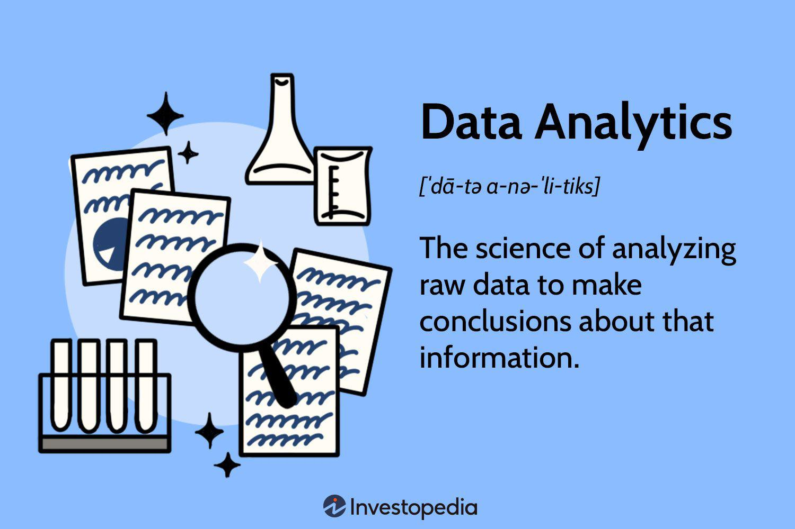

Financial trading mechanisms form the backbone of modern markets, enabling the exchange of commodities, equities, and currencies across global platforms. These mechanisms have evolved significantly, driven by technological advancements and the increasing complexity of financial instruments. At their core, trading mechanisms facilitate the price discovery process and provide liquidity, thereby ensuring that markets function efficiently. Whether through manual interactions on trading floors or via sophisticated electronic platforms, these mechanisms are crucial for executing trades in a timely and effective manner.

A key component of successful trading is the development and implementation of a robust financial strategy. A well-conceived strategy guides traders in decision-making processes, helping them navigate market uncertainties and capitalize on opportunities. Trading strategies can vary widely, from long-term investment approaches to short-term tactical trades. Successful strategies often include components such as market analysis, risk management, and asset allocation, which collectively aim to achieve optimal returns while minimizing exposure to risks.



Within the currency markets, a specialized approach known as big figure trading has gained prominence. The big figure refers to the large integer part of a currency price, which can influence trader behavior and market sentiment. In fast-paced environments, monitoring and exploiting movements around these threshold values can yield significant opportunities for profit. Big figure trading thus underscores the importance of precision and timing in navigating the volatile forex landscape.

Algorithmic (algo) trading represents a significant advancement in trading techniques, leveraging automated processes to execute trades based on pre-defined criteria. Algo trading utilizes computational algorithms to analyze market data, identify trading opportunities, and execute orders at speeds unattainable by human traders. Initially developed for high-frequency trading desks, algorithmic strategies have proliferated across various market segments, offering benefits such as enhanced efficiency, reduced transaction costs, and improved execution accuracy.

This article seeks to explore the intersection of these concepts, examining how traditional trading mechanisms, financial strategies, big figure trading, and algorithmic processes can be integrated to enhance trading outcomes. By understanding and leveraging these elements, traders can position themselves advantageously in the dynamic world of financial markets.

## Table of Contents

## Understanding Trading Mechanisms

Trading mechanisms are fundamental structures that facilitate the buying and selling of financial instruments within markets. These mechanisms are crucial in finance as they uphold market efficiency, providing liquidity and enabling price discovery. Essentially, trading mechanisms ensure that markets operate seamlessly, allowing participants to execute trades with ease, transparency, and fairness.

**Types of Trading Mechanisms**

1. **Manual Trading:**
    Manual trading involves human decision-making and execution of trades. Traders typically analyze market data, apply various strategies, and manually place orders. The flexibility and intuition offered by manual trading can be advantageous when interpreting complex market conditions. However, it is often slow and prone to emotional biases and human errors.

2. **Automated Trading:**
    Automated trading refers to the use of software to execute trading strategies based on predefined criteria. These systems monitor markets and execute trades automatically, depending on signals generated by technical indicators or algorithms. This approach reduces human error, increases execution speed, and allows the simultaneous management of multiple orders and strategies.

3. **Algorithmic Trading:**
    Algorithmic trading involves using algorithms to dictate trading activity. These sophisticated programs can make decisions at speeds and frequencies far beyond human capabilities. They leverage mathematical models and complex computations to identify opportunities for profit. Algorithmic trading improves market efficiency and [liquidity](/wiki/liquidity-risk-premium) significantly, though it also raises concerns about market stability due to its high-speed nature.

**Role of Technology in Evolving Trading Strategies**

Technological advancements have been a driving force in the transformation of trading mechanisms. High-speed internet, powerful computing infrastructure, and advanced data analysis tools have revolutionized how trading is conducted. Artificial intelligence and [machine learning](/wiki/machine-learning) enable the development of more sophisticated algorithms that can dynamically adapt to market changes. Furthermore, blockchain technology is presenting new opportunities in decentralized and transparent trading systems.

**Historical Developments in Trading Mechanisms: A Case Study**

Historically, trading mechanisms have evolved significantly. In the early 20th century, stock exchanges were characterized by floor trading, where traders physically gathered on exchange floors to execute trades verbally or through hand signals. The introduction of electronic communication networks (ECNs) in the late 20th century marked a significant shift. ECNs facilitated electronic trading, eliminating the need for physical presence and dramatically increasing trading [volume](/wiki/volume-trading-strategy) and speed.

A pivotal moment was the introduction of the Nasdaq Stock Market in 1971, which was the first electronic stock market, providing a new model for trading that would become prevalent in global markets. The rise of the internet in the 1990s further accelerated this change, leading to the widespread adoption of online trading platforms accessible to retail investors.

As trading technologies continue to advance, the distinction between automated and [algorithmic trading](/wiki/algorithmic-trading) blurs, with most automated strategies now incorporating some form of algorithmic processing. Consequently, these developments have reshaped roles within the finance sector, emphasizing technological proficiency alongside traditional financial acumen. 

The continual integration of technology into trading mechanisms promises further enhancements in market efficiency but it also mandates robust regulatory frameworks to safeguard market integrity and stability.

## Financial Strategy in Trading

A sound financial strategy is essential for success in trading. Its importance lies in the ability to navigate the complexities of financial markets, capitalize on opportunities, and manage risks effectively. A well-structured strategy acts as a roadmap, guiding traders and investors towards achieving their financial goals while minimizing potential losses.

### Components of a Comprehensive Trading Strategy

A comprehensive trading strategy typically includes several key components:

1. **Market Analysis**: Fundamental and technical analyses are crucial for understanding market dynamics. Fundamental analysis involves evaluating economic indicators, while technical analysis focuses on price patterns and trends.

2. **Position Sizing**: This determines how much capital to allocate to each trade, balancing potential rewards against the risk of loss. Appropriate position sizing can prevent catastrophic losses and optimize returns.

3. **Entry and Exit Points**: Defined rules for entering and exiting trades are essential. This includes identifying specific conditions or signals that trigger a trade and criteria for closing it.

4. **Risk Management**: Effective risk management involves identifying, assessing, and mitigating potential risks. This typically includes setting stop-loss orders and employing hedging strategies to protect against unfavorable market movements.

5. **Performance Evaluation**: Regular assessment of trading performance helps refine strategies. Tracking metrics such as win/loss ratios, average profit/loss, and risk-adjusted returns is crucial for continuous improvement.

### Analysis of Risk Management Techniques

Risk management is a cornerstone of trading strategy, aiming to minimize losses while allowing for potential gains. Key techniques include:

- **Diversification**: Spreading investments across different assets reduces the impact of a single asset's poor performance on the overall portfolio.

- **Stop-Loss Orders**: Automatically selling a position when it reaches a predetermined price helps limit losses.

- **Hedging**: Using financial instruments, such as options or futures, to offset potential losses in the primary investment.

- **Value at Risk (VaR)**: A statistical technique used to estimate the potential loss in value of a portfolio over a defined period for a given confidence interval.

For example, the `Value at Risk` can be calculated using a simple formula:

$$
\text{VaR} = \text{Z} \times \sigma \times \sqrt{t}
$$

where $\text{Z}$ is the Z-score for the desired confidence level, $\sigma$ is the standard deviation of the portfolio's returns, and $t$ represents time.

### Case Study: Successful Trading Strategies and Lessons Learned

One notable case study involves Renaissance Technologies, known for its Medallion Fund. The fund has been successful due to its quantitative approach, leveraging mathematical models and algorithms to identify market inefficiencies. Key lessons include:

- **Data-Driven Decisions**: Relying on extensive data analysis and modeling to inform trades.

- **Robust Risk Management**: Implementing sophisticated risk management systems to monitor and control exposure.

- **Continuous Innovation**: Adaptability and constant refinement of strategies to changing market conditions.

The success of the Medallion Fund demonstrates the potential of integrating comprehensive strategies with advanced computational techniques to achieve superior returns.

In conclusion, a sound financial strategy incorporates well-defined components and robust risk management, as exemplified by successful trading entities. Traders are encouraged to develop, test, and refine their strategies continually in pursuit of financial success.

## Big Figure in Trading

The concept of the "big figure" in currency trading refers to the integral part of an exchange rate in the foreign exchange (Forex) market, omitting the fractional digits. For instance, if the USD/EUR exchange rate is 1.2345, the big figure would be 1.23. This metric is crucial for traders as it provides a simplified view of the market, allowing them to focus on smaller price movements without getting distracted by less significant decimal places.

### How Big Figure Trading Helps Traders in Fast-Paced Markets

In fast-paced trading environments, especially in Forex, traders need to make swift decisions based on rapidly changing data. The big figure offers a quick reference point to assess major price support and resistance levels. Traders can use big figures to recognize psychological levels where price actions might reverse or accelerate. This is because market participants often place orders near these whole number levels, creating significant trading volumes that can impact price direction.

### Strategies to Profit from Big Figure Movements

1. **Psychological Level Strategy**: Traders often anticipate that big figures will act as support or resistance levels. For instance, if a currency pair is approaching a big figure, traders might expect it to struggle in crossing this level due to increased order flow. A common strategy is to place buy orders just above and sell orders just below these levels.

2. **Breakout Trading**: A breakout strategy involves waiting for the price to move decisively through a big figure, indicating potential for further movement in that direction. Traders can open positions in the direction of the breakout, using stop-loss orders to mitigate risk if the breakout fails.

3. **Mean Reversion**: This strategy assumes that prices might temporarily deviate from a big figure before reverting back. Traders might sell short as the price rushes upward past a big figure or buy when prices drop below it, expecting the market to stabilize back around the big figure level.

### Example of Big Figure Impact in International Currency Markets

Consider a scenario in the international Forex market where the EUR/USD pair is approaching a big figure at 1.2000. Historical data might show that significant volumes of buy and sell orders are placed around this level due to its psychological importance. In 2008, when the EUR/USD was trading at 1.2000, traders saw it as a pivotal level primarily due to the European Central Bank's [interest rate](/wiki/interest-rate-trading-strategies) decisions. The impact was profound as traders used big figure strategies to capitalize on the [volatility](/wiki/volatility-trading-strategies) stemming from economic announcements.

In conclusion, understanding and leveraging big figure trading tactics can provide traders with a structured means to navigate fast-paced markets. By recognizing the importance of these psychological levels, traders can enhance their strategies and potentially improve their trade execution efficiency.

## Algorithmic Trading: An Overview

Algorithmic trading is a method of executing orders using automated pre-programmed trading instructions accounting for variables such as time, price, and volume. This approach utilizes complex mathematical models and formulae to make decisions in financial markets, aiming to achieve the best possible outcome by minimizing human intervention and errors. These automated systems are designed to process vast amounts of market data at high speeds, a capability beyond human traders, allowing them to react swiftly to market conditions.

The benefits of algorithmic trading are numerous. Primarily, it allows for the execution of a large number of trades at a speed and frequency that is impossible for a human trader. This speed enables traders to capture opportunities and [arbitrage](/wiki/arbitrage) situations in real-time. Moreover, automated trading systems can be back-tested using historical data to ascertain the viability and performance of a strategy, providing insights into its effectiveness before deployment. Furthermore, algorithms can help to remove the emotional aspect of trading, which often leads to poor decision-making in volatile markets.

Algorithmic trading strategies can be broadly categorized into several types, each serving distinct purposes and tailored to specific market conditions. These strategies include:

1. **Trend Following Strategies**: These involve algorithms that identify and exploit market trends for profit. Using historical data, moving averages, and technical indicators, these strategies signal buy or sell actions based on uptrends or downtrends.

2. **Arbitrage Strategies**: Algorithms that identify price discrepancies between related securities or markets implement arbitrage strategies. These algorithms execute trades simultaneously across different venues to exploit price differentials, ensuring nearly risk-free profit.

3. **Market Making**: Algorithms also engage in market-making by providing liquidity to the markets. They post buy and sell orders to earn from the bid-ask spread while maintaining a neutral market position.

4. **Statistical Arbitrage**: This involves algorithms exploiting statistical mispricing between assets using statistical models. It requires extensive data analysis to identify correlations and profit from their historical deviations.

5. **Sentiment-Based Strategies**: Advanced algorithms can analyze and interpret market sentiment from various sources such as news feeds and social media to predict price movements and execute trades.

Algorithms enhance trade execution and efficiency through precise timing and order placement, reducing the impact of market movements on large trades and minimizing transaction costs. For instance, **Volume Weighted Average Price (VWAP)** and **Time Weighted Average Price (TWAP)** are strategies that focus on executing orders over time to achieve an average market price, ensuring minimal market disruption.

Despite the advantages, algorithmic trading comes with challenges and misconceptions. One major challenge is ensuring the reliability and robustness of algorithms, as errors in coding or logic can lead to significant financial losses. Regulatory scrutiny poses another challenge, as authorities increasingly monitor algorithmic trading activities to prevent market manipulation and ensure fair trading practices.

A common misconception is that algorithmic trading guarantees consistent profits. While algorithms can improve efficiency and exploit market anomalies, they are not immune to incorrect predictions and market volatility. Hence, continuous monitoring and adjustment of strategies are essential to manage risk effectively.

In conclusion, algorithmic trading has become a cornerstone of modern financial markets, offering speed, efficiency, and precision. However, its implementation necessitates careful consideration of strategies, regulatory compliance, and potential risks to maximize benefits.

## Integrating Big Figure and Algo Trading

Integrating big figure trading into algorithmic strategies involves identifying key psychological levels in currency markets and leveraging computational precision to capitalize on these opportunities. Big figure trading capitalizes on significant round numbers in the exchange rate, which often act as psychological triggers for market participants. Incorporating these into algorithms can enhance decision-making processes in trading platforms, allowing traders to benefit from predictable patterns around these levels.

### Adapting Big Figure Trading into Algorithms

To adapt big figure trading into algorithmic strategies, algorithms must be designed to recognize and respond to specific price levels or thresholds that define big figures. This involves setting up conditions within trading systems that trigger buy or sell orders when currency prices approach these levels. Such strategies generally seek to exploit price patterns that occur around these significant levels, which may include breakouts, reversals, or retracements.

For example, Python can be employed to create an algorithm that identifies when the currency exchange rate is nearing a big figure:

```python
def check_big_figure(price, big_figure):
    return abs(price - big_figure) < 0.0005  # Adjust threshold for desired sensitivity

big_figure = 1.3000  # Example big figure
current_price = get_current_price()  # Hypothetical function

if check_big_figure(current_price, big_figure):
    execute_trade('buy' if current_price < big_figure else 'sell')
```

This code snippet provides a basic framework where the algorithm checks if the current price is near a big figure and executes trade orders appropriately based on the current trading conditions.

### Techniques for Identifying Big Figure Opportunities

To effectively identify opportunities for big figure trading within algorithms, machine learning and advanced data analytics techniques can be employed. These techniques enable the comprehensive analysis of historical price data, identifying recurring patterns and the influence of big figures.

Moreover, sentiment analysis can be integrated into these algorithms to gauge market emotions regarding specific currency pairs around these levels. By analyzing news articles, trading forums, and social media posts, algorithms can predict market sentiment, providing additional signals for trading decisions.

### Potential for Enhanced Profits Through Combined Strategies

The combination of big figure trading insights with the precision and speed of algorithmic execution holds the potential for significantly enhanced profits. Algorithms can quickly exploit inefficiencies in execution speeds, slippage, or human error that typically accompany manual trading near big figures.

Automated systems can also execute sophisticated strategies like order fragmentation—which divides large orders into smaller parts to minimize market impact—more efficiently than manual methods. Consequently, these systems boost return potential while maintaining risk control.

### Successful Integration Examples

Numerous trading firms have successfully integrated big figure trading into their algorithmic frameworks. For instance, high-frequency trading ([HFT](/wiki/high-frequency-trading-strategies)) firms use algorithms capable of executing thousands of orders per second, capitalizing on minuscule price differences around big figures across multiple markets. These strategies often incorporate latency arbitrage, taking advantage of delayed market data to transact before others can react to big figure movements.

Similarly, some institutional investors deploy trend-following algorithms that adapt around big figures. These systems might track [momentum](/wiki/momentum) building on either side of a big figure and strategically position trades to profit from anticipated breakouts or reversals.

By integrating big figure analysis into algorithmic systems, traders can harness structured and disciplined approaches to exploit observable industry behavior patterns, potentially gaining an edge in competitive currency markets.

## Real-World Applications and Case Studies

Analyzing real-world applications of trading strategies that integrate big figure trading with algorithmic trading provides valuable insights into the effectiveness and profitability of these approaches. Such integrations have been increasingly used in international [forex](/wiki/forex-system) markets and have demonstrated potential in capturing significant market movements known as big figures.

### Integration of Big Figure Trading in International Forex

Big figure trading focuses on recognizing and exploiting major price levels in currency markets. In international forex, traders often observe whole-number price levels, which tend to act as psychological points of support or resistance. These levels, known as big figures, are especially important in determining market sentiment and potential turning points in currency pairs.

A real-world example of big figure trading can be seen in the euro/US dollar (EUR/USD) currency pair. Traders monitor key levels such as 1.2000, 1.3000, and so on. When the EUR/USD approaches these big figures, traders anticipate potential breakouts or reversals. For instance, if the EUR/USD trades near 1.2000, algorithmic systems may place buy stop orders slightly above and sell stop orders slightly below this level. This approach allows traders to capitalize on the volatile price movements that often occur around such significant thresholds.

### Successful Algo Trading Implementations Capturing Big Figures

Algorithmic trading, when combined with big figure strategies, can enhance the identification of market opportunities. Algos can be programmed to recognize patterns as currency pairs approach big figures, allowing for rapid and precise execution.

A notable implementation involves trend-following algorithms tailored to spot big figure events. For example, algorithms might track moving averages to detect when a currency pair is nearing a big figure, such as in the GBP/USD pair. By integrating these insights with statistical models, algorithms can predict probable price movements and adjust trading positions accordingly.

Moreover, algorithms can employ machine learning to refine their strategies over time. By analyzing historical data of big figure occurrences, machine learning models can improve their predictive accuracy, leading to more profitable trades.

### Lessons Learned and Future Prospects

Through these real-world case studies, key lessons have been identified. First, the integration of big figure trading with algorithmic techniques highlights the importance of psychological price levels in forex markets. Traders and algo developers should consider these levels when designing strategies, as they often present opportunities for exploiting market liquidity.

Second, advanced data analysis and pattern recognition capabilities are critical to the success of these integrated strategies. The ability to process real-time market data and execute trades instantaneously ensures that traders can react to big figure events effectively.

Looking forward, as technology continues to evolve, the prospects for integrating big figure and algorithmic trading are promising. The use of [artificial intelligence](/wiki/ai-artificial-intelligence) and natural language processing to interpret market news in real-time could further enhance the ability to anticipate big figure events. Furthermore, developments in quantum computing might offer even more sophisticated models for analyzing market patterns and executing trades with unprecedented speed and accuracy.

In conclusion, the incorporation of big figure trading within algorithmic strategies exemplifies the synergy between human market insights and technological advancements. By refining these approaches, traders can better navigate the complexities of modern financial markets and potentially achieve superior trading outcomes.

## Challenges and Risks

Algorithmic trading, while providing numerous benefits in terms of speed and efficiency, comes with its own set of challenges and risks. One of the most significant risks is an over-reliance on automated systems, which can fail or behave unexpectedly in volatile market conditions. Such reliance can lead to catastrophic losses if algorithms are not properly monitored or if they react irrationally to sudden market changes.

**Potential Risks of Relying on Algorithmic Trading**

Algorithmic trading systems are designed to execute trades based on predetermined criteria, often without human intervention. This detachment from direct human oversight can lead to issues. For instance, flash crashes, where the market can lose and regain significant value in minutes or even seconds, exemplify how automated systems can exacerbate market instability. A well-known example is the 2010 Flash Crash, where the Dow Jones Industrial Average plummeted by about 1,000 points and rebounded within minutes due to high-frequency trading algorithms' reactions to market conditions.

These systems may also be susceptible to technical glitches, coding errors, or unexpected market scenarios that were not accounted for during development. Such vulnerabilities can result in incorrect trades being executed at a loss or significant capital deployment on illogical trades.

**Market Volatility and Big Figure Trading**

Market volatility impacts big figure trading by influencing significant currency price movements around whole number figures, often referred to as big figures in forex markets. Big figure trading strategies capitalize on these movements, but heightened volatility can lead to increased risk. Sharp movements can trigger stop-loss orders or cause slippage, where the execution price of a trade is worse than expected.

Effective risk management is crucial. Traders should implement comprehensive stop-loss and take-profit strategies to manage potential losses and secure profits. Additionally, the integration of volatility index (VIX) data can aid algorithms in adjusting their strategies dynamically to current market conditions, allowing for more resilient trading operations.

**Mitigating Risks in Integrated Strategies**

To successfully integrate algorithmic and big figure trading strategies, it is imperative to address the unique risks both pose. Diversification of strategies can reduce dependency on a single market condition or algorithmic logic. Additionally, executing stress tests and scenario analyses can identify possible failure points and help refine algorithms.

Risk management frameworks, including Value at Risk (VaR) models, can quantitatively assess potential losses in worst-case scenarios over a given period. Regular [backtesting](/wiki/backtesting) of algorithms on historical data also permits an evaluation of performance under varied market conditions.

**Expert Advice on Managing Trading Strategy Risks**

Experts advocate for a balanced approach that combines algorithmic efficiency with human oversight. Human traders can provide intuitive judgment and market experience that algorithms may lack, serving as a check on potential automated errors or excessive trade volumes prompted by algorithms.

Moreover, maintaining a robust risk management culture across trading operations is essential. This includes ongoing monitoring of algorithmic performance, ensuring compliance with financial regulations, and continuously updating algorithms in response to evolving market data. Regular training sessions and workshops on risk mitigation strategies can also enhance traders' ability to manage complex situations effectively.

In conclusion, while algorithmic trading offers significant potential for enhancing trading efficiency and profitability, being cognizant of its risks and proactively managing them is vital for sustainable success in the financial markets.

## Conclusion

In summarizing the evolution and integration of various financial trading mechanisms and strategies, it becomes evident that the confluence of big figure trading and algorithmic strategies represents a significant advancement in trading methodologies. The discussion highlighted the importance of understanding different trading mechanisms, such as manual, automated, and algorithmic trading, underscoring their role in enhancing trade execution and efficiency. Furthermore, the adoption of sound financial strategies, with a keen emphasis on risk management, was also emphasized as a cornerstone of successful trading endeavors.

The concept of big figure trading, particularly within the currency markets, offers traders a powerful tool to navigate and profit from volatile market conditions. When integrated into algorithmic strategies, big figure trading provides an opportunity for improved decision-making and enhanced profitability. The analysis of real-world applications supported the potential of these integrated strategies, showcasing how modern markets can leverage technological advancements to optimize trading outcomes.

Looking forward, the future of trading mechanisms and strategies is poised for continued evolution. Technological developments, including machine learning and artificial intelligence, will likely further refine and enhance algorithmic trading capabilities. This progression presents an exciting frontier for traders to explore, encouraging them to continually adapt and innovate their approaches to remain competitive.

Feedback and dialogue within the trading community are crucial as these strategies evolve. Engaging in ongoing discussions allows traders to share insights, experiences, and best practices, fostering a collaborative environment that enhances collective knowledge and capability. As trading strategies continue to intersect with technological innovation, this dialogue will be instrumental in navigating the complexities and opportunities of modern financial markets.

## References & Further Reading

[1]: Harris, L. (2003). ["Trading and Exchanges: Market Microstructure for Practitioners."](https://www.amazon.com/Trading-Exchanges-Market-Microstructure-Practitioners/dp/0195144708) Oxford University Press.

[2]: Aldridge, I. (2013). ["High-Frequency Trading: A Practical Guide to Algorithmic Strategies and Trading Systems."](https://www.amazon.com/High-Frequency-Trading-Practical-Algorithmic-Strategies/dp/1118343506) Wiley.

[3]: Engle, R. F., & Lange, J. (2001). ["Predicting VNET: A Model of Financial Market Volatility Applied to Trading."](https://cdn.preterhuman.net/texts/finance_and_marketing/stock_market/Engle%20And%20Lange-Predicting%20Vnet%20-%20A%20Model%20Of%20The%20Dynamics%20Of%20Market%20Depth.pdf) The Review of Financial Studies, 14(2), 113-123.

[4]: Rasekhschaffe, K. C., & Jones, R. C. (2019). ["Machine Learning for Stock Selection."](https://www.semanticscholar.org/paper/Machine-Learning-for-Stock-Selection-Rasekhschaffe-Jones/93f4d3262d51785f7efdb4138f78ccdfa97444b1) Financial Analysts Journal, 75(3), 70-88.

[5]: Lo, A. W., Mamaysky, H., & Wang, J. (2000). ["Foundations of Technical Analysis: Computational Algorithms, Statistical Inference, and Empirical Implementation."](https://www.cis.upenn.edu/~mkearns/teaching/cis700/lo.pdf) The Journal of Finance, 55(4), 1705-1765.