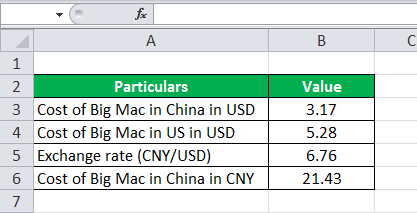

The Big Mac Index is an engaging and insightful measure introduced by the Economist in 1986, serving as a tool for evaluating the Purchasing Power Parity (PPP) of global currencies through the cost of a Big Mac burger. As a product available worldwide with uniform composition and branding, the Big Mac offers a simplified alternative to traditional PPP calculations, which typically use a broad 'basket of goods'. This single-item approach provides a more accessible and easily comparable data point for assessing currency value differences.

This article will explore the Big Mac Index's role in revealing currency overvaluation or undervaluation by examining disparities in burger prices across different countries. By identifying these discrepancies, the Big Mac Index allows a unique glimpse into the economic conditions and comparative cost of living in various nations.



In addition to its function as an informal gauge of economic parity, the Big Mac Index finds relevance in financial trading scenarios. It offers essential insights that can be integrated into algorithmic trading strategies, allowing traders to develop methods to exploit predicted currency changes based on observed pricing anomalies. By incorporating this index as an economic indicator within trading models, the approach provides opportunities both for market analysis and for strategic trading decisions linked to currency valuation shifts.

Moreover, while this measure presents a simplified view of complex economic principles, it maintains significant weight in economic discussions and can illuminate broader market trends when evaluated alongside other financial data. As such, the Big Mac Index is not only a playful tool for economists but also a valuable aid for analysts and traders, offering a straightforward means of engaging with intricate global economic dynamics.

## Table of Contents

## Understanding Purchasing Power Parity (PPP)

Purchasing Power Parity (PPP) is a foundational economic theory used to compare currencies from different countries through the cost of a representative 'basket of goods.' At its core, PPP posits that in the long term, exchange rates should adjust to ensure that identical baskets of goods have the same price when expressed in a common currency. Therefore, the exchange rate between two countries should equal the ratio of the countries' price levels for a fixed basket of goods and services.

The Big Mac Index provides an informal yet illustrative application of PPP by using a single-item basket: the Big Mac burger. This substitution simplifies currency comparison, leveraging a globally recognized and relatively consistent product in terms of composition and branding. The Big Mac is used as a proxy for a broader basket, offering a unique, albeit narrow, lens through which exchange rates and currency valuations can be assessed.

PPP becomes a vital tool in understanding how a currency's valuation corresponds to its purchasing power. Accurate assessment of PPP assists economists in deriving more realistic exchange rates and evaluating a country's economic health. Through an equilibrium state, PPP allows us to recognize if a currency is undervalued or overvalued by comparing the local cost of a basket of goods to that in another country.

For instance, if the price of a Big Mac deviates significantly from its price in the United States after accounting for exchange rates, it may indicate a misalignment in currency values. These insights can inform economic policies and guide financial decisions by reflecting genuine differences in local economic conditions, taxation, and cost of living.

PPP, and proxy interpretations of it such as the Big Mac Index, contribute to the broader discourse of currency valuation, presenting a straightforward means to gauge economic parity between nations. While the Big Mac Index simplifies the complexity inherent in true PPP calculations by focusing on one product, it underscores the utility of PPP in identifying imbalances in purchasing power across countries.

## The Mechanics of the Big Mac Index

The Big Mac Index functions by comparing the price of a Big Mac hamburger across different countries with its price in the United States. This comparison serves as a gauge for assessing currency value disparities relative to the USD. The underlying assumption is that if the cost of a Big Mac is lower in another country than in the U.S., it suggests that the local currency might be undervalued compared to the USD. Conversely, if the local price is higher, the currency might be considered overvalued.

The practical application of the Big Mac Index lies in its potential to predict currency adjustments. By evaluating the relative pricing of a standardized product—an identical Big Mac with the same quality and brand imagery worldwide—economists can infer how currencies might realign to reflect true purchasing power. This insight is vital for understanding the affordability of goods and services across different economies, as it provides a snapshot of each currency's buying power in relation to the U.S. dollar.

The index is based on several economic and logistical factors. It takes into account the cost of ingredients, labor wages, and rental expenses, which vary from country to country. Despite variations in these factors, the end product remains consistent in its composition and is therefore ideal for such cross-border comparisons. This uniformity allows for a straightforward analysis that ignores other complex variations in local economic conditions.

While the Big Mac Index is recognized as a simplified economic tool, it finds frequent mention in major economic discourses and reports. It offers economists and financial analysts a quick and accessible method to discuss and illustrate currency valuation in informal terms. Despite its simplicity, it invites significant discussion about global economic parity and currency valuation, leading to more detailed and complex economic explorations.

## Case Studies and Examples

In August 2023, the Big Mac Index highlighted a significant undervaluation of the British pound (GBP) against the US dollar (USD). By comparing the local price of a Big Mac in the United Kingdom to its price in the United States, one can infer discrepancies between the implied and actual exchange rates. This comparison is expressed through the formula:

$$
\text{Implied Exchange Rate} = \frac{\text{Price of Big Mac in Local Currency}}{\text{Price of Big Mac in USD}}
$$

Analyzing the Big Mac Index allows us to observe global economic variances and their impact on currency valuations. For example, if a Big Mac costs £3.50 in the UK and $5.00 in the US, the implied exchange rate would be:

$$
\text{Implied Exchange Rate} = \frac{3.50}{5.00} = 0.70
$$

If the actual market exchange rate is 0.76 USD/GBP, this suggests that the pound is undervalued by approximately 8% $\left( \frac{0.76 - 0.70}{0.76} \times 100 \right)$.

Such discrepancies between implied and actual rates provide economic insights that extend beyond purely theoretical evaluations. Real-world applications of the Big Mac Index demonstrate its utility in assessing economic conditions:

1. **Currency Arbitrage Opportunities**: Traders can identify potential arbitrage situations where exchanging currencies based on the Big Mac Index and current market rates could yield profits.

2. **Inflation Insights**: By observing differences in Big Mac pricing across countries, insights into local inflation rates can be gained. A rapid increase in the local currency price might indicate higher inflation.

3. **Consumer Purchasing Power**: Discrepancies in Big Mac prices can reflect variations in consumer purchasing power, highlighting regions where individuals may experience more or less economic strain.

4. **Market Predictions**: Large deviations between implied and real exchange rates might suggest impending market corrections. Traders and economists can use this information alongside other indicators to predict potential exchange rate shifts.

Historical examples further illustrate these applications. In past years, the Big Mac Index has accurately signaled overvaluations in countries before subsequent currency adjustments. For instance, in 2011, an analysis showed the Swiss franc was significantly overvalued, and later that year, the Swiss National Bank intervened to cap the currency's appreciation.

The Big Mac Index, despite its simplicity, serves as a practical tool for understanding complex economic dynamics. By revealing imbalances in currency valuations, it offers an accessible entry point into deeper financial analysis and strategy development.

## Algorithmic Trading and Economic Indicators

Algorithmic trading leverages sophisticated computational techniques and large datasets to streamline and enhance decision-making processes in financial markets. Within this framework, the Big Mac Index emerges as a valuable dataset due to its straightforward nature, offering an innovative means of assessing purchasing power parity (PPP) across different currencies. As an economic indicator, the Big Mac Index provides insightful data on global currency discrepancies, which traders can utilize to their advantage.

By incorporating the Big Mac Index into trading algorithms, traders can develop strategies aimed at exploiting short-term mispricings. These mispricings occur when the exchange rate between two currencies does not accurately reflect the price variance of the Big Mac across these regions. For instance, if the cost of a Big Mac indicates an undervaluation of a specific currency, traders may bet on the currency’s long-term adjustment towards its PPP-implied value.

To implement this in a trading strategy, consider a scenario where the price of a Big Mac in euros (EUR) in Europe is significantly lower than the price in US dollars (USD) in the United States after adjusting for the current exchange rate. Here, the trading algorithm might identify a buying signal for the euro, anticipating that EUR/USD exchange rates would adjust over time to reflect the PPP implied by the Big Mac Index.

The algorithm can be structured as follows:

```python
# Example algorithm to exploit Big Mac Index data

def big_mac_trading_strategy(currency_pair, big_mac_prices, current_rate):
    implied_rate = big_mac_prices['domestic'] / big_mac_prices['foreign']
    trade_signal = None

    if implied_rate < current_rate:
        trade_signal = 'Buy foreign currency'  # Foreign currency undervalued
    elif implied_rate > current_rate:
        trade_signal = 'Sell foreign currency'  # Foreign currency overvalued

    return trade_signal

big_mac_prices_usd_eur = {'domestic': 5.00, 'foreign': 4.00}  # Example prices
current_exchange_rate = 0.85  # Current EUR/USD rate

trade_decision = big_mac_trading_strategy('EUR/USD', big_mac_prices_usd_eur, current_exchange_rate)
print(trade_decision)
```

In this method, traders are able to refine their investment strategies by adjusting parameters according to anticipated currency movements based on Big Mac prices. Moreover, by tracking changes in Big Mac pricing over time, algorithms can adapt to market conditions dynamically, providing a robust mechanism for forecasting currency adjustments.

In conclusion, integrating the Big Mac Index into [algorithmic trading](/wiki/algorithmic-trading) systems offers a compelling approach to leveraging economic insights for currency trading. While simplistic, its applications serve as a testament to how non-traditional datasets can inform and enhance trading strategies in a complex economic landscape.

## Limitations and Criticisms of the Big Mac Index

The Big Mac Index, while intriguing and widely referenced, has several notable limitations and criticisms that need consideration. One fundamental limitation of the index is its failure to incorporate variations in ingredient costs, labor wages, and corporate taxes across countries. The index uses the price of a Big Mac as a proxy for purchasing power parity (PPP), but the cost structure of producing a Big Mac can vary significantly due to local economic conditions. For instance, labor costs in a developed country are typically higher than in a developing nation, influencing the burger's final price. Similarly, differences in the taxation of goods and services can skew the intended neutrality of the comparison.

Furthermore, the Big Mac Index's scope is constrained by McDonald's presence, as it only operates in specific countries. This limitation affects the index's ability to provide a comprehensive global currency valuation. Many nations, particularly those with smaller or emerging economies, do not have a McDonald's outlet, thereby excluding them from this analysis and questioning the global applicability of the index.

Additionally, macroeconomic factors such as government intervention, monetary policy, and inflation can impact the Big Mac Index's reliability. Government policies affecting trade tariffs, subsidies, and currency controls can artificially alter local market conditions, leading to price distortions that the index cannot account for. For instance, a government might artificially deflate the local currency to boost exports, affecting the Big Mac price without reflecting true economic parity.

Alternative methods and datasets offer more robust tools for economic analysis. The Consumer Price Index (CPI), for example, encompasses a diverse range of goods and services, providing a more rounded view of inflation and purchasing power across different economies. Another approach is using the GDP deflator, which captures price changes across an economy's entire spectrum of goods and services. These metrics, although more complex, can provide a nuanced understanding of economic conditions that the Big Mac Index oversimplifies.

Incorporating these broader economic indicators into comparative analyses can overcome some of the Big Mac Index's limitations, giving economists and traders more reliable insights into currency valuations and market conditions.

## Conclusion

The Big Mac Index serves as a playful yet practical tool for understanding currency valuations and economic parity. By using the cost of a universally recognized product such as the Big Mac, it simplifies complex economic concepts, offering a relatable gauge of purchasing power discrepancies across different nations. This index highlights fundamental differences in currency valuation by presenting them through the lens of a consumer-based metric that is easy to grasp and analyze. 

Despite its constrained methodology, as it relies on a single product rather than a comprehensive basket of goods, the Big Mac Index offers critical insights into disparities in worldwide purchasing power. It can reveal instances where currencies might be mispriced, providing signals that could guide algorithmic trading strategies. By incorporating this as an economic indicator, traders and economists can devise strategies to exploit these discrepancies, possibly predicting currency adjustments.

This article demonstrates how economics and finance intersect through seemingly simple indicators like the Big Mac Index. Its approach is testament to how unconventional tools can contribute actual value to economic analysis and financial strategies. As a straightforward yet innovative measure, it sheds light on complex global trade and economic narratives that otherwise might be elusive. The broad appeal and simplicity of the Big Mac Index ensure that it captures attention and incites exploration into intricate currency and market behaviors.

As our global economy evolves, unique datasets like the Big Mac Index will continue to influence and inform financial strategies. They offer alternative, sometimes unorthodox, perspectives on market dynamics. In the ever-changing landscape of international finance, the ability to derive actionable insights from diverse sources, including playful measures like the Big Mac Index, remains invaluable. The persistence and adaptability of such indicators reflect their enduring utility in both academic and practical financial arenas, suggesting that novelty does not preclude significance in understanding economic movements.

## References & Further Reading

[1]: ["The Big Mac Index: A Guide"](https://www.economist.com/big-mac-index) by The Economist

[2]: Rogoff, K. (1996). ["The Purchasing Power Parity Puzzle."](https://scholar.harvard.edu/rogoff/publications/purchasing-power-parity-puzzle) Journal of Economic Literature, 34(2), 647-668.

[3]: Taylor, A. M., & Taylor, M. P. (2004). ["The Purchasing Power Parity Debate."](https://www.aeaweb.org/articles?id=10.1257/0895330042632744) Journal of Economic Perspectives, 18(4), 135-158.

[4]: ["Purchasing Power Parity and the Real Exchange Rate"](https://www.imf.org/external/pubs/ft/staffp/2002/01/pdf/sarno.pdf) by Alan M. Taylor and Mark P. Taylor

[5]: ["Currencies, Capital Flows and Crises"](https://www.taylorfrancis.com/books/mono/10.4324/9780203884782/currencies-capital-flows-crises-john-harvey) by Alain P. Chaboud, Svenja D. Haltermann, Georgios Skoulakis, and Jonathan H. Wright

[6]: Lothian, J. R. & Taylor, M. P. (1996). ["Real Exchange Rate Behavior: The Recent Float from the Perspective of the Past Two Centuries."](https://www.semanticscholar.org/paper/Real-Exchange-Rate-Behavior%3A-The-Recent-Float-from-Lothian-Taylor/ce0d2d85617bb04e7bcb3574e9d8a9e278c61682) Journal of Political Economy, 104(3), 488-509.