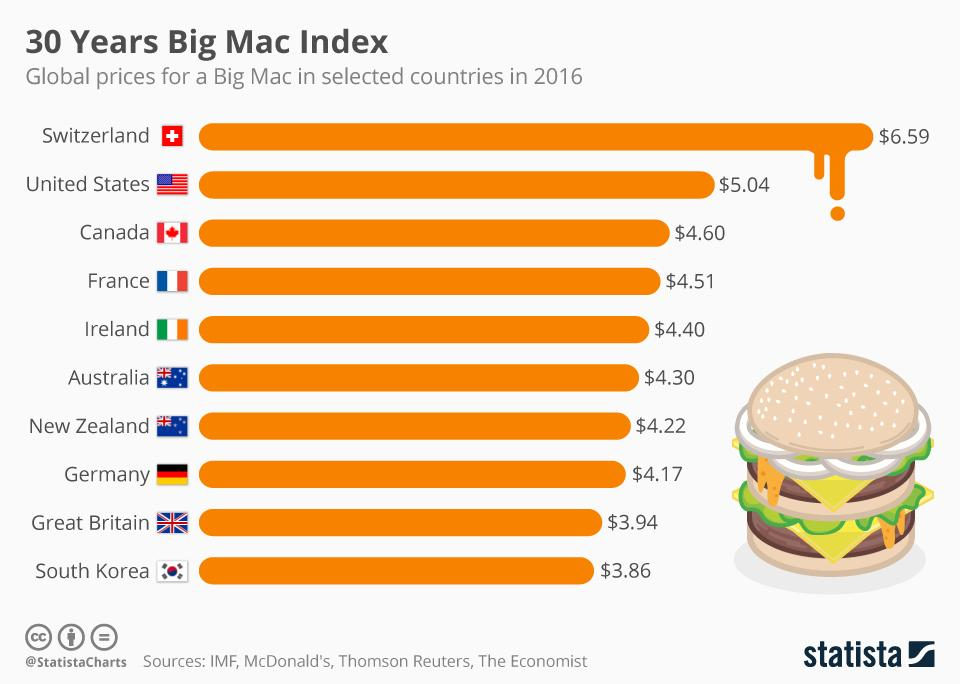

## Table of Contents

## What is the Big Mac Index?

The Big Mac Index is a fun way to compare the prices of things in different countries. It was created by The Economist magazine in 1986. The idea is simple: they look at how much a Big Mac costs in different places around the world. By comparing these prices, you can get an idea of how strong or weak a country's money is compared to another country's money.

This index is based on the theory of purchasing power parity (PPP). PPP means that in the long run, exchange rates should adjust so that a basket of goods costs the same in different countries. The Big Mac is used as that basket of goods because it is the same everywhere. If a Big Mac costs more in one country than another, it might mean that the first country's money is overvalued. The Big Mac Index is not perfect, but it is a simple and fun way to understand economic ideas.

## How does the Big Mac Index relate to purchasing power parity (PPP)?

The Big Mac Index uses the idea of purchasing power parity (PPP) to compare how much things cost in different countries. PPP says that over time, the exchange rates between countries should change so that a set of goods costs the same everywhere. The Big Mac is used as that set of goods because it's the same everywhere. If a Big Mac costs more in one country than another, it might mean that the first country's money is worth more than it should be.

This index is a simple way to see if a country's money is overvalued or undervalued. For example, if a Big Mac costs $5 in the United States and €4 in Germany, and the exchange rate is 1 USD to 0.8 EUR, then the Big Mac should cost €4 (which is $5 x 0.8). If it costs more or less than €4, it suggests that the euro might be overvalued or undervalued compared to the dollar. The Big Mac Index is not perfect, but it helps people understand big economic ideas in a fun and easy way.

## Who created the Big Mac Index and when was it first published?

The Big Mac Index was created by The Economist magazine. It was first published in 1986. The idea came from an economist named Pam Woodall, who worked at The Economist. She thought of using the price of a Big Mac to compare the value of money in different countries.

The Big Mac Index is a simple way to understand something called purchasing power parity. This idea says that over time, the price of goods should be the same in different countries when you change the money into the same currency. The Big Mac is used because it's the same everywhere. By looking at how much a Big Mac costs in different places, you can see if one country's money is worth more or less than it should be.

## What is the purpose of the Big Mac Index?

The Big Mac Index is a tool that helps people understand how the value of money in different countries compares to each other. It was created by The Economist magazine in 1986. The idea is to look at the price of a Big Mac in different countries. Since a Big Mac is the same everywhere, comparing its price can show if one country's money is worth more or less than it should be.

This index is based on something called purchasing power parity (PPP). PPP is a theory that says over time, the price of goods should be the same in different countries when you change the money into the same currency. The Big Mac Index uses this idea to see if a country's money is overvalued or undervalued. It's not a perfect way to measure this, but it's a simple and fun way to understand big economic ideas.

## How is the Big Mac Index calculated?

The Big Mac Index is calculated by looking at the price of a Big Mac in different countries. First, you find out how much a Big Mac costs in each country in their own money. Then, you use the exchange rate to change those prices into one common currency, usually the US dollar. This way, you can compare the prices easily.

Once you have the prices in the same currency, you can see if the Big Mac costs more or less in one country compared to another. If a Big Mac costs more in one country, it might mean that the money in that country is worth more than it should be. This is a simple way to understand something called purchasing power parity, which is a big idea in economics.

## Can you explain what purchasing power parity (PPP) means?

Purchasing power parity (PPP) is a way to compare how much things cost in different countries. It says that over time, the price of a set of goods should be the same everywhere when you change the money into the same currency. For example, if a burger costs $5 in the United States, it should cost the same in another country when you use the exchange rate to change the money. If it costs more or less, it might mean that one country's money is worth more or less than it should be.

PPP helps economists understand if a country's money is overvalued or undervalued. If a burger costs more in one country than it should according to PPP, it might mean that the country's money is overvalued. If it costs less, the money might be undervalued. This idea is important because it helps people see how strong or weak a country's money is compared to other countries.

## What are the limitations of using the Big Mac Index to measure PPP?

The Big Mac Index has some problems when it's used to measure purchasing power parity. One big problem is that it only looks at the price of one thing, a Big Mac. But in real life, people buy lots of different things, like food, clothes, and houses. So, using just one item to compare prices might not give a full picture of how much things cost in different countries. Also, the cost of making a Big Mac can be different in different places. For example, if workers in one country get paid more, it might make the Big Mac more expensive there, even if the money in that country is not really worth more.

Another problem is that the Big Mac Index doesn't think about things like taxes and other costs that can change the price of a Big Mac. In some countries, there might be big taxes on food, which makes the Big Mac more expensive. The index also doesn't take into account how much people earn in different countries. If people in one country earn a lot more money, they might not mind paying more for a Big Mac. So, while the Big Mac Index is a fun and simple way to understand big economic ideas, it's not perfect and should be used carefully.

## How often is the Big Mac Index updated?

The Big Mac Index is usually updated twice a year by The Economist magazine. They look at the price of a Big Mac in many countries around the world and then share the new numbers. This helps people see how the value of money in different countries has changed over time.

Sometimes, The Economist might update the Big Mac Index more often if there are big changes in the world's economy. But most of the time, you can expect to see new numbers in January and July. This way, people can keep track of how the prices compare and learn more about how strong or weak different countries' money is.

## How does the Big Mac Index help in understanding global economic conditions?

The Big Mac Index helps people understand global economic conditions by showing how the value of money in different countries compares. It does this by looking at the price of a Big Mac in many countries around the world. Since a Big Mac is the same everywhere, comparing its price can tell us if one country's money is worth more or less than it should be. This is based on the idea of purchasing power parity, which says that over time, the price of goods should be the same in different countries when you change the money into the same currency. By seeing how much a Big Mac costs in different places, we can get a simple picture of how strong or weak a country's money is.

The Big Mac Index also helps people see how the world's economy is changing. It is updated twice a year, usually in January and July, which means people can keep track of how prices change over time. If the price of a Big Mac goes up a lot in one country compared to others, it might mean that the country's money is getting weaker. On the other hand, if the price stays the same or goes down, it might mean the money is getting stronger. While the Big Mac Index is not perfect and only looks at one item, it is a fun and easy way to understand big economic ideas and see how countries' money values change around the world.

## What are some examples of countries where the Big Mac Index has shown significant deviations from PPP?

The Big Mac Index has shown big differences in some countries. For example, in Switzerland, a Big Mac often costs a lot more than in the United States. This suggests that the Swiss franc might be overvalued compared to the US dollar. In other words, the Swiss money might be worth more than it should be when you look at how much things cost. This can make Swiss products seem more expensive to people from other countries.

Another example is India, where a Big Mac usually costs less than in the United States. This might mean that the Indian rupee is undervalued compared to the US dollar. It suggests that things in India are cheaper, and the Indian money might not be worth as much as it should be. This can make Indian products seem like a good deal to people from other countries.

These examples show how the Big Mac Index can help us see if a country's money is worth more or less than it should be. It's a simple way to understand big economic ideas and see how the value of money changes around the world.

## How can the Big Mac Index be used by investors or economists?

The Big Mac Index can be a helpful tool for investors and economists because it gives them a simple way to understand how the value of money in different countries compares. By looking at the price of a Big Mac in many countries, they can see if one country's money is worth more or less than it should be. This can help investors decide where to put their money. If a country's money seems undervalued, it might be a good place to invest because things could be cheaper there. Economists can also use the Big Mac Index to see how strong or weak a country's money is and predict how it might change in the future.

Another way the Big Mac Index can be useful is by helping investors and economists understand how prices are changing around the world. Since the index is updated twice a year, they can keep track of these changes over time. If the price of a Big Mac goes up a lot in one country, it might mean that the country's money is getting weaker. This can help investors and economists make better decisions about where to invest or how to plan for the future. While the Big Mac Index is not perfect and only looks at one item, it is a fun and easy way to get a quick picture of global economic conditions.

## What other similar indices exist that measure purchasing power parity?

Besides the Big Mac Index, there are other ways to measure how much things cost in different countries. One popular index is the Starbucks Tall Latte Index. This index looks at the price of a tall latte at Starbucks in different countries. Just like the Big Mac, a tall latte is the same everywhere, so comparing its price can show if one country's money is worth more or less than it should be. This helps people understand how strong or weak a country's money is compared to others.

Another index is the IKEA Billy Bookcase Index. This index looks at the price of an IKEA Billy bookcase in different countries. Since IKEA sells the same products all over the world, the price of a Billy bookcase can be used to see how the value of money changes from one country to another. By comparing these prices, people can get an idea of whether a country's money is overvalued or undervalued. Both the Starbucks Tall Latte Index and the IKEA Billy Bookcase Index give a simple way to understand big economic ideas, just like the Big Mac Index.

## What are some case studies and examples?

In August 2023, the Big Mac Index highlighted a significant undervaluation of the British pound (GBP) against the US dollar (USD). By comparing the local price of a Big Mac in the United Kingdom to its price in the United States, one can infer discrepancies between the implied and actual exchange rates. This comparison is expressed through the formula:

$$
\text{Implied Exchange Rate} = \frac{\text{Price of Big Mac in Local Currency}}{\text{Price of Big Mac in USD}}
$$

Analyzing the Big Mac Index allows us to observe global economic variances and their impact on currency valuations. For example, if a Big Mac costs £3.50 in the UK and $5.00 in the US, the implied exchange rate would be:

$$
\text{Implied Exchange Rate} = \frac{3.50}{5.00} = 0.70
$$

If the actual market exchange rate is 0.76 USD/GBP, this suggests that the pound is undervalued by approximately 8% $\left( \frac{0.76 - 0.70}{0.76} \times 100 \right)$.

Such discrepancies between implied and actual rates provide economic insights that extend beyond purely theoretical evaluations. Real-world applications of the Big Mac Index demonstrate its utility in assessing economic conditions:

1. **Currency Arbitrage Opportunities**: Traders can identify potential arbitrage situations where exchanging currencies based on the Big Mac Index and current market rates could yield profits.

2. **Inflation Insights**: By observing differences in Big Mac pricing across countries, insights into local inflation rates can be gained. A rapid increase in the local currency price might indicate higher inflation.

3. **Consumer Purchasing Power**: Discrepancies in Big Mac prices can reflect variations in consumer purchasing power, highlighting regions where individuals may experience more or less economic strain.

4. **Market Predictions**: Large deviations between implied and real exchange rates might suggest impending market corrections. Traders and economists can use this information alongside other indicators to predict potential exchange rate shifts.

Historical examples further illustrate these applications. In past years, the Big Mac Index has accurately signaled overvaluations in countries before subsequent currency adjustments. For instance, in 2011, an analysis showed the Swiss franc was significantly overvalued, and later that year, the Swiss National Bank intervened to cap the currency's appreciation.

The Big Mac Index, despite its simplicity, serves as a practical tool for understanding complex economic dynamics. By revealing imbalances in currency valuations, it offers an accessible entry point into deeper financial analysis and strategy development.

## References & Further Reading

[1]: ["The Big Mac Index: A Guide"](https://www.economist.com/big-mac-index) by The Economist

[2]: Rogoff, K. (1996). ["The Purchasing Power Parity Puzzle."](https://scholar.harvard.edu/rogoff/publications/purchasing-power-parity-puzzle) Journal of Economic Literature, 34(2), 647-668.

[3]: Taylor, A. M., & Taylor, M. P. (2004). ["The Purchasing Power Parity Debate."](https://www.aeaweb.org/articles?id=10.1257/0895330042632744) Journal of Economic Perspectives, 18(4), 135-158.

[4]: ["Purchasing Power Parity and the Real Exchange Rate"](https://www.imf.org/external/pubs/ft/staffp/2002/01/pdf/sarno.pdf) by Alan M. Taylor and Mark P. Taylor

[5]: ["Currencies, Capital Flows and Crises"](https://www.taylorfrancis.com/books/mono/10.4324/9780203884782/currencies-capital-flows-crises-john-harvey) by Alain P. Chaboud, Svenja D. Haltermann, Georgios Skoulakis, and Jonathan H. Wright

[6]: Lothian, J. R. & Taylor, M. P. (1996). ["Real Exchange Rate Behavior: The Recent Float from the Perspective of the Past Two Centuries."](https://www.semanticscholar.org/paper/Real-Exchange-Rate-Behavior%3A-The-Recent-Float-from-Lothian-Taylor/ce0d2d85617bb04e7bcb3574e9d8a9e278c61682) Journal of Political Economy, 104(3), 488-509.