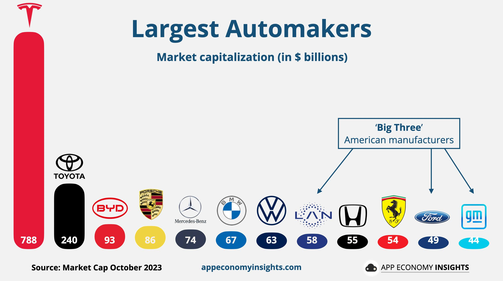

The Big Three automakers of the United States—General Motors, Ford, and Stellantis—have historically held significant positions in the global automotive industry. These companies not only epitomize American industrial might but also serve as pivotal players shaping automotive market trends and technological advancements. A key metric that reflects their standing and investor sentiment is market capitalization. Essentially, market capitalization, or market cap, is derived from the total market value of a company’s outstanding shares of stock. It serves as an indicator of the size of a company, providing investors insight into potential risk and growth opportunities. Market cap is particularly important in the automotive sector, as it reflects underlying business performance, strategic direction, and investor confidence.

Algorithmic trading has become a transformative force in financial markets, bringing profound changes across various sectors, including the automotive industry. This high-speed, high-frequency trading method leverages pre-defined rules and statistical models to automate trading decisions, often resulting in more efficient and liquid markets. For companies like the Big Three, algorithmic trading can lead to volatile shifts in their stock prices and, consequently, their market capitalizations. Such fluctuations can provide both opportunities and challenges to investors and stakeholders aiming to navigate the complexities of the modern financial landscape.

Understanding the interplay between market capitalization and algorithmic trading is critical for investors, market analysts, and automotive industry stakeholders. As the auto industry continues to evolve amidst technological disruptions and regulatory changes, these elements will play a crucial role in shaping the future trajectories of General Motors, Ford, and Stellantis. By focusing on these factors, stakeholders can make informed decisions and develop strategies to capitalize on emerging trends and mitigate risks associated with rapid market changes.

## Table of Contents

## The Big Three Automakers: A Brief Overview

General Motors, Ford, and Stellantis, collectively referred to as the Big Three, have historically dominated the automotive industry in North America and have significantly influenced global automotive trends. General Motors (GM), founded in 1908, quickly became the world's largest automaker by the mid-20th century, a title it held for several consecutive decades. GM's wide range of vehicle brands, including Chevrolet, Cadillac, and GMC, established it as a major player internationally.

Ford Motor Company, established in 1903 by Henry Ford, revolutionized manufacturing with the introduction of assembly line production techniques. This innovation not only lowered costs but also made automobiles accessible to a broader public, spearheading mass car ownership. Ford's iconic models, such as the Model T, Mustang, and the F-Series trucks, have been pivotal in maintaining its market position.

Stellantis, the newest entity among the Big Three, was formed in 2021 through a merger between Fiat Chrysler Automobiles and the French PSA Group. Despite its recent formation, the conglomerate inherits a rich legacy with brands such as Jeep, Dodge, and Chrysler, which have been instrumental in shaping consumer preferences worldwide.

Over the years, these automakers have encountered intense competition from international companies like Toyota, Volkswagen, and Hyundai. Globalization, coupled with shifting economic conditions, has pushed the Big Three to adapt continuously to maintain market relevance. Today, the automotive sector is at a transformative juncture, driven by technological advancements and the pressing need for sustainable practices. 

In response, the Big Three have embarked on strategic realignments, focusing on electric vehicles (EVs) and autonomous driving technologies. General Motors announced its ambitious plans to offer 30 all-electric models globally by 2025 and aims for carbon neutrality by 2040. Ford, with its robust investment in the Ford Model e, plans to increase its global EV production capacity significantly. Similarly, Stellantis has unveiled its Dare Forward 2030 strategy, intending to launch numerous new electric models and achieve carbon neutrality by 2038.

These strategic pivots are not only responses to evolving regulatory landscapes emphasizing emissions reductions but also to consumer demands for sustainable and intelligent mobility solutions. Despite varying challenges, including supply chain disruptions and technological shifts, the Big Three continue to exert substantial influence over the automotive market. Their ongoing evolution reflects broader trends in the industry, as they strive to balance innovation and legacy in a rapidly changing world.

## Understanding Market Capitalization

Market capitalization, commonly referred to as market cap, represents the total market value of a company's outstanding shares of stock. It is calculated by multiplying the current share price by the total number of outstanding shares:

$$

\text{Market Cap} = \text{Share Price} \times \text{Total Outstanding Shares} 
$$

This metric is crucial for investors as it provides insight into a company's size, potential growth, and level of risk. Larger market caps generally suggest a more established company with a lower risk profile, while smaller market caps might indicate higher growth potential but with increased risk.

For the Big Three automakers—General Motors, Ford, and Stellantis—market cap fluctuations are indicative of changes in stock value and investor sentiment. These fluctuations are influenced by various factors, including the companies' financial performance, market trends, and broader economic conditions. Strong financial results typically lead to a higher market cap, as they boost investor confidence and drive stock prices up. Conversely, any negative developments can result in a lower market cap.

A comparative analysis of the market caps of the Big Three with their global competitors, such as Toyota, Volkswagen, and Hyundai, highlights shifts in industry leadership. These shifts can occur due to various reasons, including advancements in technology, changes in consumer preferences, and the introduction of new regulations. For instance, as the industry transitions towards electric vehicles (EVs), automakers that effectively innovate and capitalize on this trend may see greater market cap increases relative to their peers.

Understanding market cap is thus essential for assessing the relative position and potential trajectory of automakers. It not only reflects the current market valuation of a company but also acts as a barometer for investor perceptions and industry dynamics. As the automotive industry continues to evolve, ongoing analysis of market capitalization trends remains a key aspect of strategic decision-making for investors and companies alike.

## Algorithmic Trading in the Auto Industry

Algorithmic trading has revolutionized the way securities are traded by leveraging pre-programmed instructions for fast-paced, high-[volume](/wiki/volume-trading-strategy) trading. These strategies rely on statistical models and algorithms to make instantaneous decisions, often faster than human traders can respond. In the automotive industry, [algorithmic trading](/wiki/algorithmic-trading) significantly impacts the market valuations of major companies such as General Motors, Ford, and Stellantis, commonly referred to as the Big Three.

One of the primary effects of algorithmic trading on the Big Three is its influence on stock prices. Algorithms analyze vast amounts of data, including historical prices, trading volumes, and even news releases, to identify trading opportunities. By executing trades based on these data-driven insights, algorithms can cause rapid price changes, impacting the overall market capitalization of these auto manufacturers.

Market capitalization, calculated as the share price multiplied by the number of outstanding shares, is a dynamic metric reflecting investor perceptions and company performance. Algorithmic trading can lead to fluctuations in stock prices, thereby affecting the market cap of the Big Three. For instance, an algorithm detecting a potential upward trend in Ford's stock due to a new product announcement might execute large buy orders, pushing the stock price—and thus the market cap—higher. Conversely, algorithms may trigger sell orders based on negative news, leading to a decline in market value.

The benefits of algorithmic trading for the automotive industry include enhanced market [liquidity](/wiki/liquidity-risk-premium) and efficiency. By providing a continuous stream of buy and sell orders, algorithms contribute to a liquid market where securities can be traded with minimal impact on their prices. This environment is advantageous for both institutional and retail investors, as it allows for smoother transactions and reduced trading costs.

However, algorithmic trading also presents challenges, notably increased market [volatility](/wiki/volatility-trading-strategies). The sheer speed and volume of algorithmic trades can exacerbate price swings, leading to greater short-term fluctuations. This volatility can be particularly concerning for large companies like the Big Three, where drastic market cap changes can affect investor confidence and strategic planning. Additionally, rapid market movements can trigger stop-loss orders, further amplifying price changes and potentially leading to flash crashes—sudden, severe drops in stock prices followed by swift recoveries.

Overall, while algorithmic trading brings efficiency and liquidity to the automotive market, it also necessitates careful risk management strategies to mitigate the adverse effects of heightened volatility. Understanding these dynamics is crucial for stakeholders in the automotive industry, as they navigate the complexities introduced by automated trading systems.

## Market Cap of the Big Three Vs. Their Competitors

A comparative analysis of the market capitalization of the Big Three automakers—General Motors, Ford, and Stellantis—against their prominent international competitors such as Toyota, Volkswagen, and Hyundai reveals the intricate pressures faced by these American automotive giants. Market capitalization, defined as the total value of a company's outstanding shares of stock, serves as a crucial indicator of a company's size, competitiveness, and investment appeal in both domestic and international territories.

In recent years, market capitalization trends have underscored a shift in industry dynamics influenced by various factors, including technological advancements and changing consumer preferences. Toyota, Volkswagen, and Hyundai, as major global players, often surpass the Big Three in market cap, suggesting competitive challenges rooted in factors like innovation leadership, diversified portfolios, and responsiveness to global market demands.

Technological advancements, notably in electric and autonomous vehicle technologies, are reshaping market dynamics significantly. Companies that effectively leverage these innovations often experience enhanced valuation, evident in patterns where firms like Tesla have witnessed soaring market capitalizations. For the Big Three to maintain or improve their competitive stance, significant investments in these cutting-edge technologies are imperative.

Consumer preferences, increasingly shifting towards sustainability and smart technology, further drive competitive pressures. Incorporating features such as electric drivetrains and advanced connectivity into product lines is not merely a regulatory compliance exercise but a strategic necessity to align with market demand. The Big Three’s ability to pivot towards these preferences influences investor perception and ultimately market capitalization.

Moreover, external market trends and economic conditions also play pivotal roles in shaping valuations. Factors such as currency fluctuations, trade policies, and global economic conditions impact automotive sales and profitability, contributing to variations in market caps over time. 

In summary, while the Big Three maintain historical significance in the automotive landscape, their market capitalization relative to international competitors highlights the critical need for strategic adaptation. Focusing on technological innovation and consumer-driven product development will be key to enhancing their competitive edge and market valuation.

## Impact of Electric Vehicles on Big Three Market Cap

The rise of electric vehicles (EVs) is a transformative [factor](/wiki/factor-investing) impacting the market capitalization of the Big Three automakers: General Motors, Ford, and Stellantis. As the automotive industry undergoes a seismic shift towards sustainability and innovation, the Big Three are increasingly investing in EV technology to remain competitive. This strategic focus is reflected in their market capitalizations, as investors closely monitor these companies' ability to adapt to the evolving landscape.

Investments in EV technology are essential for the Big Three to maintain their competitiveness and market cap. General Motors has announced plans to become a fully electric vehicle company by 2035, committing significant resources towards battery technology and electric models. Ford has similarly ramped up its investment in EVs, emphasizing popular models such as the Mustang Mach-E and electric F-150. Stellantis plans to offer electric or hybrid versions of 98% of its models by 2025. These commitments underscore the importance of EVs as a cornerstone of future growth and valuations in the automotive sector.

Market cap variations among the Big Three can partly be attributed to their progress in EV development. For instance, the market has generally responded favorably to announcements of new EV investments and technology advancements. Companies demonstrating strong EV leadership often witness positive shifts in market cap due to heightened investor confidence and anticipation of long-term profitability. Conversely, those lagging in EV adoption risk market penalties and diminished shareholder value.

Additionally, government policies and environmental regulations significantly influence EV adoption and the resultant market cap of auto manufacturers. Policies such as tax credits for EV buyers and stringent emission standards compel automakers to accelerate their EV strategies. In the United States, the Biden administration's focus on reducing carbon emissions and supporting electric infrastructure offers further incentives for the Big Three to enhance their EV portfolios. These regulatory landscapes create a fertile ground for increased EV sales, potentially driving up the market cap of proactive manufacturers.

In summary, the impact of electric vehicles on the market capitalization of the Big Three is profound, intertwining technological innovation with strategic investment and regulatory compliance. As these companies continue to navigate the shift towards an electrified future, their valuations will likely be reflective of their ability to adapt and lead in the EV space.

## Future Outlook for the Big Three in an Algos-Driven Market

The Big Three automakers face an increasingly complex landscape as AI and algorithmic trading become more prevalent in the market. These technologies are reshaping how markets operate, potentially impacting the future prospects of General Motors, Ford, and Stellantis. Understanding these dynamics is essential for these companies to sustain and enhance their market capitalization.

One potential strategy for the Big Three is to adopt advanced data analytics to optimize their operations and product offerings. By leveraging [machine learning](/wiki/machine-learning) algorithms, these automakers can analyze consumer preferences and market trends with greater precision, allowing for more targeted and effective marketing strategies. This data-centric approach can improve decision-making processes, thus enhancing operational efficiency and fostering innovation in vehicle design and production.

Further integration of technology and innovation can provide a significant competitive edge for the Big Three. Investing in electric and autonomous vehicle technologies remains crucial as demand for environmentally friendly and technologically advanced vehicles continues to grow. Developing proprietary technologies and securing strategic partnerships with tech companies can help the Big Three stay ahead in this rapidly evolving field. Additionally, utilizing AI-driven supply chain management systems can reduce costs and improve delivery times, adding to competitive advantages.

Market adaptability and a strong focus on customer satisfaction are vital in maintaining long-term growth. The Big Three must remain flexible, adjusting to shifts in consumer behavior and regulatory changes swiftly. Emphasizing customer feedback through digital platforms and integrating these insights into product development can lead to higher consumer satisfaction and brand loyalty. For example, implementing AI-driven customer service platforms can enhance consumer interaction and provide personalized experiences, fostering stronger customer relationships.

In conclusion, the future sustainability and growth of the Big Three in an algo-driven market hinge on their ability to embrace technological advances and adapt to changing market conditions. Strategic investments in AI and algorithmic trading tools, along with a steadfast commitment to innovation and customer focus, are pivotal in ensuring their continued relevance and success in the global automotive market.

## Conclusion

The conclusion draws together the integral roles of market capitalization and algorithmic trading in defining the performance and future prospects of the Big Three automakers: General Motors, Ford, and Stellantis. Market capitalization serves as a barometer for these companies' financial health and investor sentiment, reflecting shifts in stock value that are pivotal in gauging competitiveness within both the domestic and global arenas. Algorithmic trading has introduced new dynamics by enhancing liquidity and potentially increasing volatility, necessitating a strategic approach to leverage these aspects beneficially.

Over the decades, the Big Three have undertaken a transformative journey, consistently responding to technological advancements and competitive pressures within the industry. This journey highlights the importance of adaptability in navigating the complexities brought about by rapidly evolving technologies and market dynamics. Such adaptability has been fundamental as the automakers initiated shifts toward electric and autonomous vehicle development in response to shifting consumer preferences and intensifying regulatory landscapes.

The continuous need for innovation cannot be overstated if these companies are to maintain their market relevance and competitive edge. Strategic investments aimed at fostering technological advancements, especially in emerging sectors like electric vehicles, [artificial intelligence](/wiki/ai-artificial-intelligence), and connectivity, are paramount. These investments, aligned with evolving consumer demands and sustainability imperatives, are crucial in crafting pathways for sustainable growth and enhanced market position.

In summary, the interplay of market capitalization and algorithmic trading offers critical insights into the performance of the Big Three while underscoring the broader evolutionary trends within the automotive sector. The ongoing pursuit of innovation and strategic technology adoption will remain central to achieving sustained market successes, ensuring that the Big Three not only retain their historical influence but also thrive in an ever-competitive and technology-driven future.

## References & Further Reading

[1]: Pardo, R. (1992). ["Design, Testing, and Optimization of Trading Systems."](https://archive.org/details/designtestingopt0000pard) Wiley Trading.

[2]: Fergusson, R. (2020). ["Strategies for High-Speed Algorithmic Trading."](https://www.researchgate.net/publication/379958088_Algorithmic_Trading_Strategies_Leveraging_Machine_Learning_Models_for_Enhanced_Performance_in_the_US_Stock_Market) Routledge.

[3]: Lo, A. W., & MacKinlay, A. C. (1999). ["A Non-Random Walk Down Wall Street."](https://www.jstor.org/stable/j.ctt7tccx) Princeton University Press.

[4]: Berman, B. (2018). ["Plug-in Hybrids and Electric Vehicles: A History of Cars."](https://www.sciencedirect.com/science/article/pii/S0301421508005934) McFarland & Company.

[5]: Hull, J. C. (2012). ["Risk Management and Financial Institutions."](https://archive.org/download/quant_books/Risk%20Management%20_%20Financial%20Institutions%20-%20J.%20C.%20Hull.pdf) Wiley Finance.