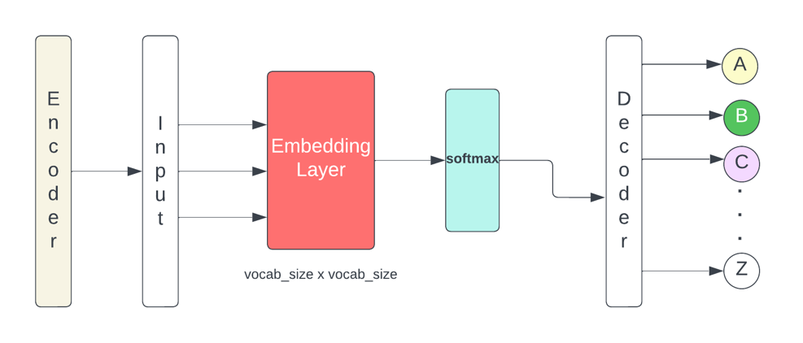

## Table of Contents

## What is a bigram in the context of machine learning?

In machine learning, a bigram is a sequence of two adjacent elements from a string of tokens, which are usually words, letters, or phonemes. Bigrams are used in natural language processing tasks like text classification, language modeling, and speech recognition. For example, if you have the sentence "I love machine learning," the bigrams would be "I love," "love machine," and "machine learning." Bigrams help capture the context and relationships between words, which can improve the performance of machine learning models.

One common application of bigrams is in language modeling, where they help predict the next word in a sequence based on the previous word. For instance, if you see the word "machine," the bigram model might predict that "learning" is a likely next word because "machine learning" is a common phrase. Bigrams can be represented as a probability distribution, where the probability of a bigram is calculated as the frequency of the bigram divided by the frequency of the first word in the bigram. This can be expressed as $$P(w_i|w_{i-1}) = \frac{Count(w_{i-1}, w_i)}{Count(w_{i-1})}$$, where $$w_i$$ is the current word and $$w_{i-1}$$ is the previous word.

## How do bigrams differ from unigrams and trigrams?

Unigrams, bigrams, and trigrams are all types of n-grams used in natural language processing. Unigrams are the simplest form, consisting of single words or tokens. For example, in the sentence "I love machine learning," the unigrams are "I," "love," "machine," and "learning." Unigrams do not consider the context or order of words, so they are useful for basic text analysis but may not capture the relationships between words.

Bigrams, on the other hand, are sequences of two adjacent words or tokens. Using the same example sentence, the bigrams are "I love," "love machine," and "machine learning." Bigrams help capture some context and can improve the performance of language models by considering the relationship between two consecutive words. The probability of a bigram can be calculated using the formula $$P(w_i|w_{i-1}) = \frac{Count(w_{i-1}, w_i)}{Count(w_{i-1})}$$.

Trigrams take this a step further by considering sequences of three adjacent words or tokens. For the sentence "I love machine learning," the trigrams would be "I love machine" and "love machine learning." Trigrams provide even more context than bigrams, which can be beneficial for more complex language modeling tasks. However, as the size of the n-gram increases, the data sparsity problem becomes more significant, meaning there might be fewer instances of each trigram in the training data, which can affect the model's performance.

## What are the common applications of bigrams in natural language processing?

Bigrams are used in many parts of natural language processing. One common use is in language modeling, where bigrams help predict the next word in a sentence. For example, if you see the word "machine," a bigram model might guess that "learning" comes next because "machine learning" is a common phrase. Bigrams are useful here because they look at pairs of words, which gives more context than just looking at single words. The probability of a bigram can be calculated using the formula $$P(w_i|w_{i-1}) = \frac{Count(w_{i-1}, w_i)}{Count(w_{i-1})}$$.

Another important application of bigrams is in text classification. Bigrams can help classify texts by capturing phrases that are important for understanding the text's topic or sentiment. For example, in sentiment analysis, bigrams like "not good" or "very happy" can give more information about the sentiment than single words alone. By using bigrams, models can better understand the meaning and context of the text, leading to more accurate classification.

Bigrams are also used in machine translation and speech recognition. In machine translation, bigrams help improve the translation by considering the context of word pairs. This can lead to more natural and accurate translations. In speech recognition, bigrams can help predict the next word based on the previous word, making the recognition process more efficient and accurate. Overall, bigrams are a powerful tool in natural language processing because they provide a simple way to capture context and improve the performance of various language-related tasks.

## How can bigrams be used to improve text classification?

Bigrams can make text classification better by looking at pairs of words instead of just single words. When you classify text, like figuring out if a review is positive or negative, bigrams help by catching important phrases. For example, if someone writes "not good," a bigram model can see this whole phrase and know it means the review is negative. This is better than just looking at "not" and "good" separately, which might not show the full meaning. By using bigrams, the model can understand the context and relationships between words, which leads to more accurate classification.

In practice, you can count how often bigrams appear in texts and use this information to train a model. For instance, if you want to classify movie reviews, you might find that bigrams like "highly recommend" often show up in positive reviews. You can use a formula to figure out how likely a bigram is to appear, like $$P(w_i|w_{i-1}) = \frac{Count(w_{i-1}, w_i)}{Count(w_{i-1})}$$. This helps the model predict the class of a new text based on the bigrams it contains. By including bigrams in your text classification model, you can improve its ability to understand and classify text more accurately.

## What is the process of extracting bigrams from a text corpus?

To extract bigrams from a text corpus, you first need to break the text into individual words or tokens. This process is called tokenization. Once you have your tokens, you can create bigrams by looking at each pair of adjacent tokens. For example, if you have the sentence "I love machine learning," you would tokenize it into the words "I," "love," "machine," and "learning." Then, you would create bigrams by pairing each word with the one that comes right after it, resulting in "I love," "love machine," and "machine learning."

After you have your bigrams, you can count how often each bigram appears in the entire text corpus. This helps you understand which bigrams are common and which ones are rare. You might want to use a formula to calculate the probability of each bigram, like $$P(w_i|w_{i-1}) = \frac{Count(w_{i-1}, w_i)}{Count(w_{i-1})}$$. This formula tells you how likely it is to see the second word in a bigram after the first word. By counting and calculating these probabilities, you can use the bigrams to improve tasks like language modeling or text classification.

## How do you calculate the frequency of bigrams in a dataset?

To calculate the frequency of bigrams in a dataset, you first need to break down the text into individual words or tokens. This process is called tokenization. After tokenizing the text, you go through the list of tokens and create bigrams by pairing each word with the one that follows it. For example, if you have the sentence "I love machine learning," you would create the bigrams "I love," "love machine," and "machine learning." Once you have your bigrams, you count how many times each bigram appears in the entire dataset. This count is the frequency of the bigram.

To find the frequency, you can use a simple loop to go through all the bigrams and keep track of how often each one shows up. You might store these counts in a dictionary where the keys are the bigrams and the values are their frequencies. If you want to calculate the probability of a bigram, you can use the formula $$P(w_i|w_{i-1}) = \frac{Count(w_{i-1}, w_i)}{Count(w_{i-1})}$$. This formula shows how likely it is to see the second word in a bigram after the first word. By counting and calculating these frequencies and probabilities, you can use the bigrams to improve tasks like language modeling or text classification.

## What are the challenges in using bigrams for language modeling?

Using bigrams for language modeling has some challenges. One big challenge is the problem of data sparsity. This means that not all bigrams appear often enough in the training data to give good predictions. For example, if you see a bigram like "quantum physics" only a few times, it might be hard to predict what comes next accurately. To fix this, you might use smoothing techniques, like adding a small number to the counts of all bigrams to make sure no probability is zero. The formula for this simple smoothing can be $$P(w_i|w_{i-1}) = \frac{Count(w_{i-1}, w_i) + \alpha}{(Count(w_{i-1}) + \alpha \times V)}$$, where $$\alpha$$ is a small number and $$V$$ is the size of the vocabulary.

Another challenge is that bigrams only look at pairs of words, which might not be enough to capture all the context in a sentence. For example, if you want to predict the next word after "I saw the," bigrams won't help much because they don't consider the whole phrase. This can lead to less accurate predictions. To deal with this, you might use trigrams or even longer n-grams, but these come with their own problems because the more words you include, the less often you'll see those exact sequences in your data. Balancing between using enough context and having enough data is a key challenge in language modeling with bigrams.

## How can smoothing techniques be applied to bigram models?

Smoothing techniques are used to fix the problem of data sparsity in bigram models. Data sparsity happens when some bigrams don't appear often enough in the training data, making it hard to predict the next word accurately. One common smoothing method is called add-one smoothing, or Laplace smoothing. This method adds a small number, usually 1, to the count of every bigram. This way, no bigram has a zero probability, which helps the model make better predictions. The formula for add-one smoothing is $$P(w_i|w_{i-1}) = \frac{Count(w_{i-1}, w_i) + 1}{Count(w_{i-1}) + V}$$, where $$V$$ is the size of the vocabulary.

Another smoothing technique is called Good-Turing smoothing. This method adjusts the counts of bigrams based on how often they appear in the data. It uses the idea that if you see a bigram a certain number of times, you can estimate how many bigrams you might see that number of times in a larger dataset. This helps give a more accurate probability to bigrams that are seen rarely or not at all in the training data. By using these smoothing techniques, bigram models can handle the challenge of data sparsity better and make more reliable predictions.

## What role do bigrams play in sequence prediction tasks?

Bigrams are important for sequence prediction tasks because they help predict what comes next in a sequence by looking at pairs of words. For example, if you want to guess the next word in a sentence, knowing the last two words can give you a better idea than just knowing the last word. Bigrams capture the context and relationships between words, which makes the predictions more accurate. In language modeling, bigrams help by showing how likely it is to see a certain word after another word. The probability of a bigram can be calculated using the formula $$P(w_i|w_{i-1}) = \frac{Count(w_{i-1}, w_i)}{Count(w_{i-1})}$$. This formula helps the model understand how often certain word pairs appear together.

In tasks like text generation or autocomplete, bigrams can make the results more natural and useful. For example, if you type "I love," a bigram model might suggest "machine" because "I love machine" is a common phrase. By using bigrams, the model can predict what people are likely to say or type next, making the predictions more helpful. However, bigrams have some challenges, like not having enough data for all possible word pairs. To fix this, smoothing techniques can be used to make sure no bigram has a zero probability, which helps the model make better predictions even when some bigrams are rare or unseen in the training data.

## How do bigrams contribute to feature engineering in machine learning models?

Bigrams help make machine learning models better by adding more information about the relationships between words. When you're trying to understand or predict what people are saying or writing, looking at pairs of words can show you patterns that single words might miss. For example, if you see the bigram "not good" in a review, it tells you more about the sentiment than just seeing "not" or "good" by themselves. By using bigrams as features, you can train models to pick up on these important phrases, which can make the model's predictions more accurate. The probability of a bigram can be calculated using the formula $$P(w_i|w_{i-1}) = \frac{Count(w_{i-1}, w_i)}{Count(w_{i-1})}$$, which helps the model understand how often certain word pairs appear together.

In practice, you can use bigrams to improve tasks like text classification or sentiment analysis. If you want to know if a movie review is positive or negative, bigrams like "highly recommend" or "not worth" can give you a clearer picture than just looking at individual words. To use bigrams in your model, you first need to break down the text into tokens and then create pairs of these tokens. You can count how often each bigram appears and use these counts as features in your model. By doing this, you're giving the model more context, which can lead to better performance in understanding and predicting text.

## What are some advanced techniques for optimizing bigram models?

One advanced technique for optimizing bigram models is using more advanced smoothing methods than simple add-one smoothing. Techniques like Kneser-Ney smoothing can help by giving more accurate probabilities to bigrams that are seen rarely or not at all in the training data. Kneser-Ney smoothing looks at how many different contexts a word appears in, which can help the model better predict words that have many different possible next words. This can be particularly useful in language modeling where capturing the nuances of word usage is important. The formula for Kneser-Ney smoothing can be complex, but it generally involves adjusting the counts of bigrams based on their contexts.

Another technique is to use backoff models, which combine bigrams with unigrams or even trigrams. If a bigram hasn't been seen enough in the training data, the model can "back off" to using the probability of the individual words or a shorter n-gram. This helps deal with the problem of data sparsity by making sure the model can still make good predictions even when certain bigrams are rare. For example, if the bigram "quantum physics" is rare, the model might use the probabilities of "quantum" and "physics" separately to make a prediction. By combining different levels of n-grams, the model can capture more context and improve its performance in tasks like text generation or autocomplete.

## How can the effectiveness of bigram models be evaluated and compared to other n-gram models?

To evaluate the effectiveness of bigram models, you can use metrics like perplexity and accuracy. Perplexity measures how well a model predicts a text by looking at how surprised it is by the actual words. A lower perplexity means the model is better at predicting the text. You can calculate perplexity using the formula $$Perplexity = 2^{-\frac{1}{N} \sum_{i=1}^{N} \log_2 P(w_i|w_{i-1})}$$, where $$N$$ is the number of words and $$P(w_i|w_{i-1})$$ is the probability of the current word given the previous word. Accuracy, on the other hand, measures how often the model's predictions are correct, which is useful for tasks like text classification or sentiment analysis. By comparing these metrics across different models, you can see how well bigram models perform compared to other n-gram models like unigrams or trigrams.

When comparing bigram models to other n-gram models, you need to consider the trade-offs between model complexity and performance. Unigram models are simpler and don't look at word order, so they might not capture the context as well as bigram models. Bigrams, which consider pairs of words, can capture more context and often perform better than unigrams, especially in tasks where word order matters. However, trigrams, which look at three words at a time, can capture even more context but might suffer from data sparsity because there are fewer instances of any specific three-word sequence. By testing these models on the same dataset and using metrics like perplexity and accuracy, you can decide which model works best for your specific task.