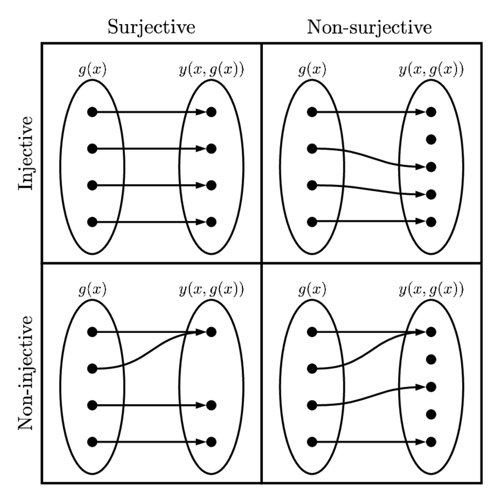

## Table of Contents

## What is a bijective transformation in the context of machine learning?

A bijective transformation in machine learning is a type of function that changes data in a way that every input has a unique output, and every output can be traced back to a unique input. Think of it like a perfect matching game where each piece has a partner and no piece is left out. This kind of transformation is useful because it keeps all the information in the data intact, allowing us to work with the data in a different form without losing any details.

In more technical terms, a bijective transformation is both injective (one-to-one) and surjective (onto). This means that if you have a function $$ f: A \rightarrow B $$, for every element in set A, there's a unique element in set B, and every element in set B comes from a unique element in set A. In machine learning, using bijective transformations can help in preprocessing data or in transforming features in a way that maintains the structure and relationships within the data, which is crucial for the performance of many algorithms.

## How does a bijective transformation differ from other types of transformations?

A bijective transformation is special because it's a perfect matchmaker for data. Imagine you have a set of inputs and a set of outputs. With a bijective transformation, every input gets its own unique output, and every output comes from just one input. This is different from other transformations where you might have some inputs sharing the same output (not injective) or some outputs not being used at all (not surjective). For example, if you think of a function $$ f: A \rightarrow B $$, a bijective transformation ensures that every element in A maps to a unique element in B, and every element in B is mapped to by an element in A.

Other types of transformations don't have this perfect matching. An injective transformation, or one-to-one function, makes sure that different inputs lead to different outputs, but it doesn't guarantee that every possible output will be used. A surjective transformation, or onto function, ensures that every output is used at least once, but different inputs might lead to the same output. A bijective transformation combines the best of both worlds: it's both injective and surjective, making it a complete and reversible transformation. This is crucial in [machine learning](/wiki/machine-learning) because it allows data to be changed and then changed back without losing any information.

## What is the significance of using bijective transformations in neural networks?

Using bijective transformations in neural networks is important because they help keep all the information in the data. Imagine you have a puzzle, and you want to rearrange the pieces but still be able to solve it. Bijective transformations let you do that because every piece of data (input) gets a new spot (output), and you can always go back to the original puzzle. This is helpful in neural networks because they often need to change data to find patterns, but they also need to keep the data's meaning intact.

In simpler terms, think of bijective transformations like a perfect translator. If you have a sentence in one language, a bijective transformation can translate it to another language and back again without losing any meaning. In neural networks, this means you can transform your data to make it easier to work with or to see different aspects of it, and then you can reverse the transformation to understand the results in the original context. This can make neural networks more effective and reliable because they're working with a full and accurate picture of the data.

## Can you explain the concept of an affine coupling layer in bijective transformations?

An affine coupling layer is a special part of bijective transformations used in neural networks. Think of it like a team of helpers that work together to change your data in a way that you can always change it back. The affine coupling layer splits your data into two parts. It leaves one part alone and uses the other part to decide how to change the first part. This way, it can make complex changes to your data but still keep everything reversible.

Imagine you have a box of colorful blocks. The affine coupling layer would take half of the blocks and use them to decide how to move or resize the other half. For example, if you have red and blue blocks, it might use the red blocks to decide how to move the blue blocks. The cool thing is, because it's a bijective transformation, you can always figure out how to put the blocks back to how they were at the start. This is helpful in neural networks because it lets them explore different ways to look at data while making sure they don't lose any important information along the way.

## How do bijective transformations contribute to the invertibility of neural networks?

Bijective transformations help make neural networks invertible, which means you can undo what the network did to your data. Imagine you have a puzzle, and you mix up the pieces. An invertible [neural network](/wiki/neural-network) is like having a map that shows you exactly how to put the pieces back together. Bijective transformations are like the rules of this map. They make sure that every piece of data gets changed in a way that you can always change it back. This is important because it lets the neural network explore different ways to look at data without losing any information.

In simpler terms, think of bijective transformations as a perfect translator for your data. If you have a sentence in one language, a bijective transformation can translate it to another language and back again without losing any meaning. In neural networks, this means you can transform your data to make it easier to work with or to see different aspects of it, and then you can reverse the transformation to understand the results in the original context. This makes neural networks more effective and reliable because they're working with a full and accurate picture of the data.

## What are the practical applications of bijective transformations in machine learning?

Bijective transformations are used in machine learning to change data in a way that keeps all the information. Imagine you have a puzzle, and you want to rearrange the pieces but still be able to solve it. Bijective transformations let you do that because every piece of data gets a new spot, and you can always go back to the original puzzle. This is helpful in neural networks because they need to change data to find patterns, but they also need to keep the data's meaning intact. For example, in normalizing flows, bijective transformations help transform data into a new shape that's easier for the neural network to understand, but they also make sure you can change it back to the original data.

Another practical use of bijective transformations is in data preprocessing. Sometimes, data needs to be changed to fit into a machine learning model. Bijective transformations can change the data in a way that makes it easier to work with, but you can still get back to the original data if you need to. This is important because it means you don't lose any information when you're preparing your data. For instance, when you're scaling or normalizing features, using a bijective transformation ensures that you can always undo the changes and go back to the original values.

In summary, bijective transformations are like perfect translators for data in machine learning. They allow you to change data into different forms to make it easier to analyze or process, but they also ensure that you can always translate it back to the original form without losing any details. This makes them valuable in many areas of machine learning, from preprocessing data to building complex models like normalizing flows.

## How can one implement a simple bijective transformation in a neural network?

Implementing a simple bijective transformation in a neural network can be done using an affine coupling layer. Imagine you have a set of numbers, and you want to change them in a way that you can always change them back. An affine coupling layer splits your data into two parts. It leaves one part alone and uses the other part to decide how to change the first part. For example, if you have numbers $$ x_1, x_2, x_3, x_4 $$, the layer might use $$ x_3 $$ and $$ x_4 $$ to decide how to change $$ x_1 $$ and $$ x_2 $$. This way, you can make complex changes to your data but still keep everything reversible.

Here's how you might implement this in Python using a simple affine coupling layer. You would define a function that takes in the data, splits it into two parts, applies a transformation to one part based on the other, and then combines them back together. The transformation could be something like scaling and shifting the values. This ensures that you can always undo the changes by applying the inverse transformation. By using such a layer in your neural network, you can explore different ways to look at your data without losing any important information along the way.

```python
import torch
import torch.nn as nn

class AffineCouplingLayer(nn.Module):
    def __init__(self, input_dim):
        super(AffineCouplingLayer, self).__init__()
        self.input_dim = input_dim
        self.scale_net = nn.Linear(input_dim // 2, input_dim // 2)
        self.shift_net = nn.Linear(input_dim // 2, input_dim // 2)

    def forward(self, x):
        # Split the input into two parts
        x1, x2 = x.chunk(2, dim=1)

        # Use x2 to decide how to transform x1
        scale = self.scale_net(x2)
        shift = self.shift_net(x2)
        y1 = x1 * torch.exp(scale) + shift

        # Combine the transformed part with the untouched part
        y = torch.cat([y1, x2], dim=1)
        return y

    def inverse(self, y):
        # Split the output into two parts
        y1, y2 = y.chunk(2, dim=1)

        # Use y2 to decide how to reverse the transformation on y1
        scale = self.scale_net(y2)
        shift = self.shift_net(y2)
        x1 = (y1 - shift) / torch.exp(scale)

        # Combine the reversed part with the untouched part
        x = torch.cat([x1, y2], dim=1)
        return x
```

## What are the challenges associated with using bijective transformations in deep learning models?

Using bijective transformations in [deep learning](/wiki/deep-learning) models can be tricky because they need to be perfectly reversible. Imagine you have a puzzle, and you want to rearrange the pieces but still be able to solve it. Bijective transformations help you do that, but they require careful planning to make sure every piece can be put back exactly where it came from. This means the transformations must be designed so that every input has a unique output, and every output can be traced back to a unique input. If this isn't done right, you might lose important information, which can make the model less accurate or even break it.

Another challenge is that bijective transformations can make the model more complex. For example, in a neural network, adding layers that use bijective transformations like affine coupling layers can increase the number of calculations needed. This can slow down the training process and require more computational power. Even though these transformations keep all the data's information, figuring out the right way to use them can be hard. You need to balance the complexity of the model with its performance, making sure it's not too slow or too hard to train.

## How does the use of bijective transformations impact the training process of a neural network?

Using bijective transformations in a neural network can make the training process more complex. Think of bijective transformations like a special way to change your data that lets you change it back without losing anything. This means that every piece of data you put in gets a new spot, and you can always put it back where it came from. But this also means that the neural network has to do more work. It needs to learn not just how to change the data, but also how to reverse those changes perfectly. This can slow down the training because the network has to handle more calculations, and it might need more time and computer power to figure everything out.

On the positive side, bijective transformations can help make the neural network more accurate. Because they keep all the information in the data, the network can explore different ways to look at the data without losing any important details. This can lead to better results because the network can see patterns and relationships that it might miss with other types of transformations. But finding the right balance is key. You want the network to be powerful and accurate, but not so complex that it takes too long to train or needs too much computer power. So, using bijective transformations is like walking a tightrope between complexity and performance.

## Can you discuss any specific algorithms or techniques that utilize bijective transformations?

One specific algorithm that uses bijective transformations is called normalizing flows. Imagine you have a set of data points, and you want to change them into a new shape that's easier for a computer to understand. Normalizing flows use bijective transformations to do this. They take the data and change it step by step, making sure that every step can be undone. This way, the computer can work with the new shape of the data and still go back to the original data if needed. For example, if you have a set of numbers $$ x_1, x_2, x_3 $$, normalizing flows might use a series of bijective transformations to change them into $$ y_1, y_2, y_3 $$ in a way that keeps all the information.

Another technique that uses bijective transformations is called reversible neural networks. Think of these like a special kind of puzzle where you can mix up the pieces and then put them back together perfectly. Reversible neural networks use bijective transformations to make sure that every layer of the network can be undone. This means the network can change the data in complex ways but still keep all the information. For example, if you have a layer that changes the data from $$ x $$ to $$ y $$, you can always use the inverse of that layer to change $$ y $$ back to $$ x $$. This is helpful because it can make the network more efficient and easier to train.

## What are the latest research advancements in the field of bijective transformations for machine learning?

Recent advancements in bijective transformations for machine learning have focused on improving the efficiency and scalability of models like normalizing flows. Researchers have been working on new types of bijective layers that can handle high-dimensional data more effectively. For example, one approach is to use more flexible coupling layers that can capture complex relationships in the data. These layers are designed to be more expressive, allowing the model to transform data in ways that preserve important information while making it easier to train. This has led to better performance in tasks like density estimation and generative modeling, where keeping all the data's details is crucial.

Another area of progress is in the development of reversible neural networks. These networks use bijective transformations to make each layer reversible, which can significantly reduce the memory needed during training. This is because the network can compute the gradients for backpropagation using the forward pass, without needing to store intermediate results. Researchers have been exploring ways to apply reversible networks to a wider range of tasks, including image and text processing. By making networks more memory-efficient, these advancements open up new possibilities for training larger and more complex models on limited computational resources.

## How might future developments in bijective transformations influence the broader field of machine learning?

Future developments in bijective transformations could greatly impact machine learning by making models more efficient and powerful. Imagine you have a puzzle, and bijective transformations help you rearrange the pieces without losing any information. If researchers keep improving these transformations, they could make neural networks better at handling complex data. This means models like normalizing flows might become even better at tasks like generating new data or understanding patterns in existing data. By making these transformations more flexible and easier to use, machine learning could become more accurate and useful in areas like healthcare, where understanding every detail is important.

Another way bijective transformations might influence machine learning is by making it easier to train large models. Think of it like building a big house; you need a lot of materials and space. Reversible neural networks, which use bijective transformations, can help reduce the memory needed to train these big models. If future research makes these networks even more efficient, it could open up new possibilities for using machine learning in fields that need to process a lot of data, like climate science or finance. This could lead to faster and more powerful AI systems that can help solve some of the world's biggest challenges.

## References & Further Reading

[1]: Dinh, L., Krueger, D., & Bengio, Y. (2015). ["NICE: Non-linear Independent Components Estimation."](https://arxiv.org/abs/1410.8516) arXiv preprint arXiv:1410.8516.

[2]: Kingma, D. P., & Dhariwal, P. (2018). ["Glow: Generative Flow with Invertible 1x1 Convolutions."](https://arxiv.org/abs/1807.03039)  Advances in Neural Information Processing Systems 31.

[3]: Papamakarios, G., Nalisnick, E., Rezende, D. J., Mohamed, S., & Lakshminarayanan, B. (2019). ["Normalizing Flows for Probabilistic Modeling and Inference."](https://arxiv.org/abs/1912.02762) arXiv preprint arXiv:1912.02762.

[4]: Rezende, D. J., & Mohamed, S. (2015). ["Variational Inference with Normalizing Flows."](https://arxiv.org/abs/1505.05770) International Conference on Machine Learning.

[5]: Behrmann, J., Grathwohl, W., Chen, R. T. Q., Duvenaud, D., & Jacobsen, J. H. (2019). ["Invertible Residual Networks."](https://arxiv.org/abs/1811.00995)  In Proceedings of the 36th International Conference on Machine Learning.

[6]: Arjovsky, M., & Bottou, L. (2017). ["Towards Principled Methods for Training Generative Adversarial Networks."](https://arxiv.org/abs/1701.04862) arXiv preprint arXiv:1701.04862.