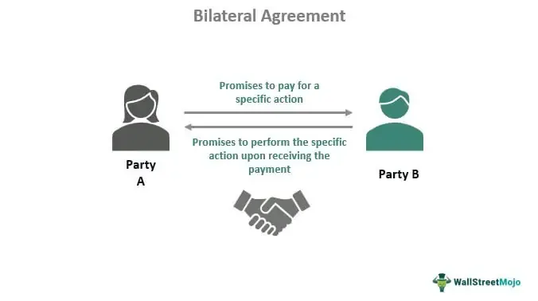

Contracts serve as the backbone of numerous interactions, stretching from daily transactions to intricate financial engagements. They are legally binding documents that define the duties and obligations of the parties involved, ensuring agreed-upon actions are met. Among various types of contracts, bilateral contracts stand out due to their pervasive use in diverse contexts, including personal, professional, and business scenarios. In a bilateral contract, each party makes a promise to the other, creating mutual obligations. This exchange of promises is critical because it forms the legal foundation upon which many transactions operate.

Understanding the mechanics of how contracts function—particularly bilateral ones—is pivotal for anyone navigating the modern legal and financial landscapes. These contracts hold a significant role in regulating agreements in the marketplace by providing a predictable structure for those involved. They offer a legal recourse if one party fails to meet their obligations, thereby reducing the risk of disputes. Moreover, having a sound knowledge of bilateral contracts equips individuals to engage effectively in negotiation processes, manage contractual risks, and foster more stable business relationships.

This article aims to elucidate the concept of bilateral contracts, their operational framework, and their application in specific sectors such as algorithmic trading. Algorithmic trading, which relies heavily on precise, quick execution of trades, frequently incorporates bilateral contracts. These might include agreements between traders and brokers to ensure the smooth function of complex trading strategies and systems. Understanding how these contracts operate within this high-stakes, technology-driven environment can provide valuable insights into both legal and financial aspects of modern trading practices.

## Table of Contents

## Understanding Bilateral Contracts

A bilateral contract is a fundamental legal construct characterized by the reciprocal exchange of promises or obligations between two parties. In this arrangement, each party is simultaneously the promisor and the promisee, meaning each party makes a promise to the other to perform certain duties or obligations. This mutuality of obligations distinguishes bilateral contracts from other forms, such as unilateral contracts.

Bilateral contracts are the predominant type of contract encountered in everyday transactions and business dealings. They are prevalent due to their straightforward design, where each party's duty is contingent upon the performance of the other party. For example, in a sales agreement, the seller promises to deliver goods or services, and in return, the buyer promises to pay a specified amount. Here, both parties have concrete obligations that are interdependent, ensuring that the contract is executed effectively.

Employment contracts are another typical example of bilateral contracts. An employer promises to pay wages and provide specific benefits, while the employee agrees to perform duties as outlined in the job description. Such agreements form the backbone of the workforce structure, offering a clear framework for employment relationships.

Service agreements also serve as common illustrations of bilateral contracts. They involve a service provider promising to perform a specific service in exchange for payment from the client. These agreements are widespread across numerous industries, ranging from technology and consulting firms to maintenance services.

These reciprocal agreements require an alignment of understanding and expectations between the involved parties. This mutual exchange inherently provides a balanced approach, ensuring that both parties are legally bound to their commitments. In essence, bilateral contracts lay the groundwork for predictability and reliability in transactions, facilitating smooth exchanges in both personal and professional domains.

## Key Elements of a Bilateral Contract

A bilateral contract is a legally binding agreement composed of several fundamental elements, essential for its validity and enforceability. These elements are:

**1. Offer:** An offer is a promise made by one party to another, laying the foundation for the contract. It must be clear, detailed, and communicated explicitly to the offeree. The offer sets the terms and conditions that the offering party is willing to commit to, allowing the offeree to evaluate the proposal comprehensively.

**2. Acceptance:** Acceptance occurs when the offeree consents to the terms of the offer, thereby creating a binding agreement. For the acceptance to be valid, it must be unequivocal and communicated directly to the offeror, matching the terms of the offer without modifications. This mutual agreement ensures that both parties have a consensual understanding of the contract.

**3. Consideration:** Consideration refers to the value exchanged between the contracting parties. It is a crucial element that differentiates enforceable contracts from mere promises. Consideration can be monetary, a promise to perform a service, or an agreement to refrain from an action. Both parties must provide something of value that the other party views as inducement for entering into the contract.

**4. Intention to Create Legal Relations:** For a contract to be enforceable, both parties must intend to establish a legal obligation. The intention is assessed objectively, considering the context and nature of the agreement. In commercial transactions, the presumption generally favors the existence of such an intention.

**5. Capacity:** The legal capacity of the parties involved is essential for contract formation. Capacity ensures that parties have the legal authority and mental capability to enter into a contract. This includes being of sound mind, having reached the age of majority, and not being disqualified from contracting by any applicable laws.

Clarity in these elements is crucial for preventing disputes and misunderstandings. Both parties must possess a thorough understanding and mutual assent to the terms for the contract to be valid and enforceable. This clarity ensures that the contractual obligations are explicit, reducing the potential for conflict and facilitating smooth enforcement of the agreed terms.

## Bilateral vs. Unilateral Contracts

Bilateral contracts and unilateral contracts represent two fundamental types of agreements in contract law, each distinguished by the obligations they impose on the involved parties.

### Bilateral Contracts

Bilateral contracts are characterized by mutual obligations, where both parties commit to perform specific duties or promises. This mutuality is foundational, as both parties are bound to fulfill their respective obligations to execute or maintain the contract. For example, in a standard sales agreement, one party agrees to deliver goods, while the other agrees to pay for those goods. Both parties are legally obligated to perform their end of the contract, reciprocating the other's responsibilities.

### Unilateral Contracts

Unilateral contracts, on the other hand, involve an obligation on only one side—the offeror makes a promise that the offeree can accept only by performing a specific act. In this scenario, the contractual obligation is not mutual; instead, the offeror is bound to fulfill their promise contingent on the completion of the requested action by the offeree. A common example is a reward contract, where a person offers a reward for the return of a lost item. The contractual obligation exists only once someone completes the act of returning the item, at which point the offeror is obliged to pay the reward.

### Key Differences and Usage

A significant difference between these two types of contracts is the nature and timing of the acceptance and obligation fulfillment. In bilateral contracts, the acceptance is typically communicated, and obligations arise for both parties simultaneously upon acceptance. Meanwhile, in unilateral contracts, the acceptance is demonstrated through action.

Bilateral contracts are prevalent in scenarios where simultaneous exchange and clear mutual responsibilities are necessary. They are fitting in environments that demand precise accountability from all parties involved, such as employment agreements or service contracts.

Unilateral contracts suit situations where one party is willing to bind themselves only upon the full performance of the requested act, often used in incentives such as offers for reward. These types of contracts can mitigate risk for the offeror, as their obligation is only triggered upon the occurrence of specific acts.

Understanding these distinctions is crucial in various sectors, helping parties determine the contract type that best suits their needs based on the level of obligation and performance involved.

## Example of Bilateral Contract in Algo Trading

In [algorithmic trading](/wiki/algorithmic-trading), bilateral contracts serve as foundational agreements between traders and brokers to facilitate efficient and secure trading processes. These contracts typically stipulate the conditions under which trades will be executed, including the responsibilities of each party involved, fee structures, and proprietary algorithm usage terms.

One essential component of a bilateral contract in algorithmic trading is the execution of trade orders. Such contracts specify the conditions under which a broker will accept and execute trade orders provided by a trader's algorithm. This typically involves defining the trading platform to be used, the acceptable types of orders (market, limit, stop-loss, etc.), and the handling of trade execution, including latency and timing constraints.

Fee structures are another critical aspect, determining how and when brokers are compensated for their services. Bilateral contracts may outline fixed fees based on the number of transactions, [volume](/wiki/volume-trading-strategy) of assets traded, or a percentage of profits generated through the algorithm. This ensures transparency and predictability in financial obligations, which is crucial for maintaining a stable trading relationship.

Furthermore, these contracts often address the use of proprietary algorithms, including intellectual property rights, confidentiality clauses, and performance obligations. For instance, a trader may be required to disclose certain aspects of their algorithm to the broker under a non-disclosure agreement, ensuring that proprietary trading strategies remain protected while allowing the broker to assess and support the trading strategy's implementation.

Through clearly defined terms and conditions, bilateral contracts in algorithmic trading facilitate collaboration between traders and brokers, helping both parties navigate the complexities and demands of modern financial markets effectively.

## Process of Entering Bilateral Contracts in Trading

In the complex environment of algorithmic trading, entering a bilateral contract necessitates clear identification of the obligations for both parties involved. Each participant, whether a trader, broker, or other entity, must have a precise understanding of their respective roles and responsibilities. This ensures that mutual agreement is reached regarding shared objectives, thereby minimizing potential conflicts that may arise from ambiguities.

Drafting precise terms and conditions is crucial within the high-stakes context of trading. Ambiguity in contract language can lead to costly misunderstandings, disputes, or breaches. Therefore, it is recommended to include detailed provisions regarding trade execution processes, fee structures, and usage rights for any proprietary algorithms involved. Additionally, contingencies for unexpected events, such as market disruptions or system failures, should be comprehensively outlined.

Incorporating legal expertise in the drafting and reviewing stages of a bilateral contract is essential to ensure enforceability and compliance with relevant regulations. Legal professionals can provide critical insights into potential legal pitfalls and help structure agreements that withstand scrutiny and align with current legal frameworks. Consequently, their involvement can significantly enhance the reliability of the contract and protect the interests of both parties by ensuring that all clauses are legally sound and enforceable.

These steps collectively facilitate a robust process for formulating bilateral contracts in algorithmic trading, enhancing transparency and fostering stable professional relationships.

## Benefits and Challenges of Bilateral Contracts in Trading

Bilateral contracts in trading offer several benefits, chiefly the ability to establish stable, long-term business relationships where both parties have mutual obligations. This reciprocity ensures that both traders and brokers, for instance, are committed to fulfilling terms that can foster trust over repeated and ongoing transactions. In algorithmic trading, these contracts help delineate the responsibilities and expectations between parties, such as conditions under which trades are executed and the fees involved. By setting these mutual agreements, entities can align their goals, leading to efficient execution and potentially better financial outcomes.

However, bilateral contracts come with challenges, particularly the potential for disputes if the terms are not meticulously defined or are misunderstood by either party. In a high-stakes environment like trading, even minor ambiguities can lead to significant discrepancies and disagreements. For example, if a contract between a trader and a broker does not clearly specify the algorithm's parameters under which trades are automatically executed, misunderstandings could arise, leading to financial losses or legal disputes.

These issues underscore the importance of precision in drafting contracts. Each party must ensure that terms are explicit and unambiguous to minimize potential conflicts. Utilizing legal professionals during the drafting process can greatly aid in identifying possible areas of misinterpretation and ensuring compliance with relevant financial regulations. Implementing such thorough processes helps in reducing the likelihood of disputes and fostering a cooperative trading environment.

## Conclusion

Bilateral contracts serve as fundamental components across numerous industries by providing a framework within which mutual agreements are clearly outlined and legally enforceable. In algorithmic trading, where the pace and complexity of transactions demand precision and reliability, bilateral contracts ensure all parties involved have defined, actionable responsibilities. These contracts form the backbone of relationships in trading environments by clarifying the terms and conditions under which trades are executed, fees are applied, and algorithms are utilized, thus minimizing misunderstandings and disputes.

Effective contract negotiation in algorithmic trading involves thoroughly understanding the structure of bilateral contracts. A comprehensive grasp of core elements—such as offer, acceptance, and consideration—not only facilitates better negotiation outcomes but also enhances risk management strategies. By ensuring each party's obligations and the consequences of non-performance are explicitly detailed, parties can safeguard themselves against potential financial and reputational risks.

Moreover, bilateral contracts in trading can significantly impact the stability and longevity of professional relationships. Their reciprocal nature encourages a cooperative approach, where each party benefits from fulfilling their respective obligations. However, challenges remain, particularly if contract terms are ambiguous or misinterpreted, potentially leading to disputes. Thus, involving legal expertise during the drafting and reviewing process is advisable to ensure enforceability and compliance with applicable regulations.

In conclusion, bilateral contracts are indispensable tools for navigating the complexities of modern financial dealings, particularly in high-stakes environments like algorithmic trading. A thorough understanding of their structure and function is essential for successful risk management and contract negotiation, laying the groundwork for robust and resilient business relationships.

## References & Further Reading

[1]: Eidenmüller, H., & Martini, F. (2010). ["Algorithmic Trading with Agent-Based Models."](https://webarchiv.bundestag.de/archive/2008/1114/wissen/bibliothek/akt_lit/neuerwerb/neuerwerb08.pdf) SSRN Electronic Journal.

[2]: Ayres, I., & Gertner, R. (1992). ["Strategic Contractual Inefficiency and the Optimal Choice of Legal Rules."](https://openyls.law.yale.edu/bitstream/handle/20.500.13051/770/Strategic_Contractual_Inefficiency_and_the_Optimal_Choice_of_Legal_Rules.pdf?sequence=2) The Yale Law Journal, 101(4).

[3]: Hull, J. C. (2018). ["Options, Futures, and Other Derivatives"](https://www.semanticscholar.org/paper/Options%2C-Futures%2C-and-Other-Derivatives-Hull/89bdee500c8623864fc9eb7a471546aa713acc44) (10th Edition). Pearson.

[4]: MacKenzie, D. (2019). ["Trading at the Speed of Light: How Ultrafast Algorithms Are Transforming Financial Markets"](https://ieeexplore.ieee.org/document/9647710) Princeton University Press.

[5]: Sutton, R. S., & Barto, A. G. (2018). ["Reinforcement Learning: An Introduction"](https://web.stanford.edu/class/psych209/Readings/SuttonBartoIPRLBook2ndEd.pdf) (2nd Edition). The MIT Press.