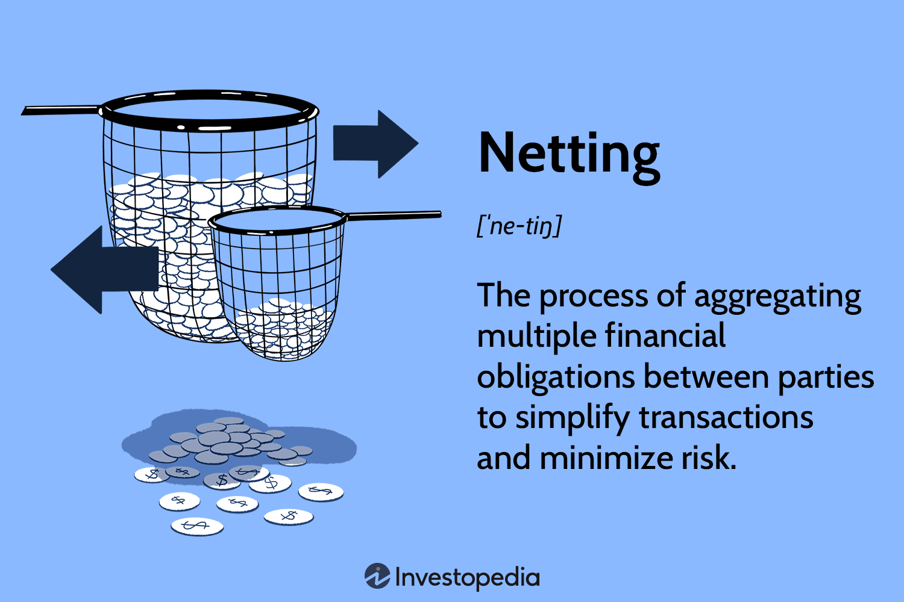

## Table of Contents

## What is bilateral netting?

Bilateral netting is a way for two parties to simplify their financial dealings. Instead of having many separate payments going back and forth, they add up all the amounts they owe each other. Then, they only pay the difference. For example, if Company A owes Company B $100 and Company B owes Company A $80, they would net it out. Company A would only pay Company B the difference, which is $20.

This method helps reduce the risk and costs involved in making multiple payments. It's especially useful in financial markets where there are lots of trades happening every day. By netting their obligations, companies can manage their cash flow better and avoid the hassle of numerous transactions. It also lowers the chance that one party won't be able to pay what they owe, making the financial system more stable.

## Why is bilateral netting important in financial transactions?

Bilateral netting is important in financial transactions because it makes things simpler and safer. When two parties have many trades between them, they can end up owing each other a lot of money in different ways. Instead of making lots of payments, they can add up what they owe and just pay the difference. This means fewer payments to keep track of, which saves time and money. It also means less chance of mistakes or missed payments.

Another reason bilateral netting is important is that it helps manage risk. In the financial world, there's always a chance that someone might not be able to pay what they owe. By netting out their obligations, the two parties reduce the total amount of money at risk. This makes the financial system more stable because it lowers the chance of one party's failure causing big problems for the other. Overall, bilateral netting helps keep things running smoothly and safely in the world of finance.

## What are the basic types of bilateral netting?

There are two main types of bilateral netting: payment netting and close-out netting. Payment netting is when two parties add up all the money they owe each other over a certain time, like a day or a week. They then only pay the difference. For example, if Company A owes Company B $100 and Company B owes Company A $80, they would net it out and Company A would pay Company B $20.

Close-out netting is different. It happens when one party can't pay what they owe, maybe because they went bankrupt. In this case, all the current and future deals between the two parties are added up right away. They figure out who owes what and settle it all at once. This helps protect the other party from losing too much money because they can quickly see the total amount owed and get what they can.

Both types of bilateral netting help make financial dealings simpler and safer. Payment netting reduces the number of payments and the costs that come with them. Close-out netting helps manage risk by quickly settling everything if one party can't pay. Together, they make the financial system more stable and efficient.

## Can you explain the difference between payment netting and novation netting?

Payment netting is when two parties add up all the money they owe each other over a certain time, like a day or a week. They then only pay the difference. For example, if Company A owes Company B $100 and Company B owes Company A $80, they would net it out and Company A would pay Company B $20. This helps reduce the number of payments they need to make, which saves time and money.

Novation netting is different. It's when two parties agree to replace their old deals with a new one. Instead of keeping track of many separate deals, they create one new deal that covers everything. For example, if Company A and Company B have several trades going on, they might agree to cancel those and make one new trade that takes into account all the old ones. This makes things simpler because they only have to manage one deal instead of many.

Both payment netting and novation netting help make financial dealings easier and safer. Payment netting focuses on reducing the number of payments, while novation netting focuses on simplifying the deals themselves. Together, they help companies manage their money better and reduce the risk of problems.

## How does bilateral netting reduce credit risk?

Bilateral netting reduces credit risk by lowering the total amount of money that one party owes to another. When two parties have many trades between them, they might owe each other a lot of money in different ways. Instead of keeping track of all these separate amounts, they add them up and only pay the difference. This means the total amount of money at risk is smaller. If one party can't pay, the other party loses less money because they only have to worry about the net amount, not the full amount of all the trades.

For example, if Company A owes Company B $100 and Company B owes Company A $80, they would net it out and Company A would only pay Company B $20. If Company A can't pay, Company B only loses $20 instead of $100. This makes the financial system safer because it reduces the chance that one party's failure will cause big problems for the other. By lowering the total amount of money at risk, bilateral netting helps keep things stable and protects both parties from big losses.

## What legal frameworks support bilateral netting?

Bilateral netting is supported by different laws around the world to make sure it works well and is safe. In the United States, the Federal Deposit Insurance Corporation Improvement Act (FDICIA) and the Bankruptcy Code help make bilateral netting legal and strong. These laws say that netting agreements are good even if one party goes bankrupt. This helps lower the risk for everyone involved. In Europe, the Financial Collateral Directive and the European Market Infrastructure Regulation (EMIR) do similar things. They make sure that netting agreements are clear and safe, helping keep the financial system stable.

These legal frameworks are important because they make sure that bilateral netting can happen without big problems. They help protect the parties from losing a lot of money if someone can't pay what they owe. By making netting legal and safe, these laws help the financial markets work better and stay strong. They give everyone involved more confidence that their deals will be honored, even in tough times.

## Can you provide examples of bilateral netting in practice?

Imagine two banks, Bank A and Bank B, that trade currencies every day. Over the [course](/wiki/best-algorithmic-trading-courses) of a day, Bank A might owe Bank B $1 million for one trade, while Bank B owes Bank A $800,000 for another. Instead of making two separate payments, they use bilateral netting. They add up the amounts and Bank A only pays Bank B the difference, which is $200,000. This saves both banks time and money because they don't have to handle as many transactions.

In another example, two companies, Company X and Company Y, have ongoing deals to buy and sell goods. Over a week, Company X owes Company Y $50,000, but Company Y owes Company X $30,000. They decide to net their payments at the end of the week. Company X pays Company Y the net amount of $20,000. This makes it easier for both companies to manage their cash flow and reduces the risk of one company failing to pay the other, because the total amount at risk is smaller.

## How do financial institutions implement bilateral netting?

Financial institutions implement bilateral netting by setting up agreements with their trading partners. They use special contracts that say how they will net their payments. These contracts can be for a day, a week, or even longer. The institutions keep track of all the trades they make with each other. At the end of the agreed time, they add up everything they owe each other and only pay the difference. This helps them save time and money because they don't have to make as many payments.

To make sure everything works smoothly, financial institutions use computer systems to keep track of their trades and calculate the net amounts. These systems are very important because they help make sure the netting is done right. The institutions also make sure they follow the laws that support bilateral netting, like the ones in the U.S. and Europe. By doing this, they can reduce the risk of losing money if one of their partners can't pay what they owe. This makes the whole financial system safer and more stable.

## What are the challenges and limitations of bilateral netting?

Bilateral netting can be tricky because it needs both parties to agree on how to do it. They have to trust each other and follow the same rules. If they don't, it can cause problems. Also, the laws about netting are different in different countries. This can make it hard for companies that work in many places to use netting the same way everywhere. They have to make sure they know and follow all the rules where they do business.

Another challenge is that netting can be hard to set up. It needs good computer systems to keep track of all the trades and figure out the net amounts. If the systems are not good, there can be mistakes. Plus, netting only works well if both parties keep trading a lot. If one party stops trading or goes bankrupt, the other party might still lose money. So, even though netting helps a lot, it's not perfect and can have some limits.

## How does bilateral netting affect liquidity management?

Bilateral netting helps with [liquidity](/wiki/liquidity-risk-premium) management by making things simpler for companies. Instead of having to pay out a lot of money for many different trades, they only need to pay the difference between what they owe and what they are owed. This means they can keep more cash on hand because they don't have to make as many payments. For example, if a company owes another company $100 and is owed $80, they just pay $20 instead of $100. This makes it easier for them to manage their money and plan how much cash they need.

However, bilateral netting also has some challenges for liquidity management. If one of the companies stops trading or goes bankrupt, the other company might still lose money. This can make it hard to predict how much cash they will need. Also, setting up netting agreements and systems can take time and money. Companies need good computer systems to keep track of all their trades and calculate the net amounts correctly. If these systems fail, it can cause problems with their cash flow. So, while bilateral netting helps a lot, companies need to be careful and plan well to manage their liquidity.

## What role does technology play in enhancing bilateral netting processes?

Technology helps make bilateral netting easier and more accurate. Special computer systems keep track of all the trades between two parties. These systems add up what each party owes and what they are owed, and then figure out the difference. This way, the parties only have to pay the net amount instead of making many separate payments. Using technology makes sure that the numbers are correct and helps avoid mistakes. It also saves time because everything can be done quickly and automatically.

However, technology also has its challenges. Setting up and maintaining these systems can be expensive and take a lot of work. If the systems have problems or break down, it can cause big issues with the netting process. This might lead to wrong calculations or delays in payments, which can affect the cash flow of the companies involved. So, while technology makes bilateral netting better, companies need to make sure their systems are reliable and up-to-date to get the most out of it.

## How does bilateral netting interact with other risk management techniques in complex financial environments?

Bilateral netting works together with other risk management techniques to keep financial dealings safe and smooth. For example, companies often use credit limits to control how much they can owe each other. By setting these limits, they make sure they don't take on too much risk. When they use bilateral netting, it helps them stay within these limits because they only pay the difference between what they owe and what they are owed. This makes it easier to manage their risk because the total amount of money at risk is smaller.

Another important risk management tool is collateral. Companies might agree to hold some money or assets as a backup in case one of them can't pay. Bilateral netting can make this easier because the amount of collateral needed is less when they only have to cover the net amount. This saves money and helps keep the financial system stable. By combining bilateral netting with credit limits and collateral, companies can manage their risks better and avoid big losses, even in complex financial environments.

## What is the impact on algorithmic trading?

Bilateral netting significantly impacts [algorithmic trading](/wiki/algorithmic-trading) by streamlining the execution of multiple trades. This process involves offsetting the value of multiple positions, where gains in one position can be netted against losses in another. This netting reduces the number of individual transactions that need to be settled, subsequently lowering transaction costs. Such cost efficiencies are vital for high-frequency trading strategies, where profit margins are often slim and highly dependent on minimizing operational expenses.

Algorithmic trading, characterized by its automated execution of trades at high speed and [volume](/wiki/volume-trading-strategy), integrates seamlessly with netting. Automation ensures that netting processes can be executed quickly and without human error, allowing for the efficient management of positions and collateral. This alignment between algorithmically driven trade execution and systematic netting processes enhances liquidity by ensuring that capital is optimally utilized across trading activities.

Furthermore, traders utilize bilateral netting to increase both the liquidity and operational efficiency of their trading systems. By reducing the number of outstanding obligations, traders can rapidly adjust their portfolios in response to market changes without the burden of excessive transactional overhead. This capability is crucial for maintaining competitive edge in markets where liquidity can shift rapidly.

The mechanics of netting in algorithmic trading can be further illustrated by considering the impact on balance sheets. For instance, if a trader holds multiple positions across derivatives with varying risk exposures, netting allows these positions to be consolidated into a smaller net exposure. This consolidation can be crucial for risk management and capital adequacy under regulatory frameworks that increasingly emphasize the efficient use of capital.

In mathematical terms, if $T_i$ represents an individual trade and $N$ is the net position, the bilateral netting can be expressed as:

$$
N = \sum_{i=1}^{n} T_i
$$

Here, $n$ is the number of individual trades. This equation illustrates how various trades are aggregated to form a net position, hence reducing the complexity of execution.

In conclusion, the systematic processes inherent in both bilateral netting and algorithmic trading create a synergy that financial operators can leverage for improved performance and reduced risk in trading environments.

## References & Further Reading

[1]: ["The Handbook of Financial Instruments"](https://www.wiley.com/en-us/The+Handbook+of+Financial+Instruments-p-9781119522966) by Frank J. Fabozzi

[2]: ["Derivatives and Risk Management"](https://www.investopedia.com/ask/answers/052615/how-can-derivatives-be-used-risk-management.asp) by Sundaram Janakiramanan

[3]: Cox, J. C., & Rubinstein, M. (1985). ["Options Markets"](https://archive.org/details/optionsmarkets00coxj). Prentice-Hall.

[4]: ["International Swaps and Derivatives Association (ISDA) Documentation"](https://www.isda.org/book-taxonomy/cdx-documentation/) - Provides standards and guidelines relevant to netting agreements and derivatives.

[5]: Hull, J. C. (2018). ["Options, Futures, and Other Derivatives"](https://www.semanticscholar.org/paper/Options%2C-Futures%2C-and-Other-Derivatives-Hull/89bdee500c8623864fc9eb7a471546aa713acc44). Pearson.