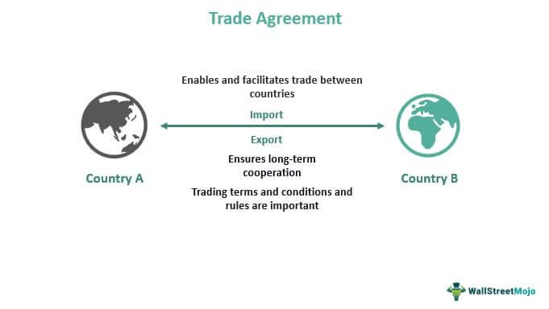

Trade agreements play a critical role in shaping global commerce by facilitating international economic interactions. Through these agreements, countries define the terms of trade, seeking to optimize the flow of goods, services, and investments across borders. Among the various forms of trade agreements, bilateral trade agreements emerge as a significant instrument. These agreements involve two nations establishing mutually beneficial trade terms aimed at enhancing economic exchange by reducing tariffs, addressing trade barriers, and fostering investment. The objective of this article is to explore bilateral trade agreements, focusing on their potential advantages, limitations, and their evolving integration with algorithmic trading in currency markets. 

Algorithmic trading represents a new dimension in the trading landscape, utilizing automated, predefined strategies and algorithms to execute trades with minimal human intervention. This approach offers unprecedented speed and efficiency, especially in volatile markets like foreign exchange, enabling nations engaged in bilateral agreements to navigate complex financial environments more effectively. By examining both bilateral trade agreements and algorithmic trading, we present how these strategies collectively influence modern trade, offering insights into their impact on global commerce and investment patterns. Together, these elements are central to understanding and navigating the international economic strategies of today.

## Table of Contents

## Understanding Bilateral Trade Agreements

Bilateral trade agreements are strategic economic arrangements between two countries that set mutually agreed-upon terms to facilitate and enhance trade and investment. These agreements typically aim to reduce tariffs, quotas, and import/export restrictions, resulting in increased economic exchange and cooperation between the participating nations.

The primary objective of bilateral trade agreements is to create favorable conditions for the flow of goods, services, and capital between the countries involved. By addressing and eliminating specific barriers to trade, these agreements can help in expanding market access and encouraging investment. The reduction or elimination of tariffs, which are taxes imposed on imported goods, is a critical component of these agreements. Lower tariffs result in more competitive pricing for products, potentially increasing demand and trade volume.

A key feature of bilateral trade agreements is their ability to be tailored to the unique economic needs and priorities of the countries involved. This customization can address specific sectors such as agriculture, technology, and manufacturing, enhancing trade according to each country's strengths and requirements.

One illustrative example of bilateral trade agreements is the various agreements the United States has with other countries. The United States-Mexico-Canada Agreement (USMCA), which replaced the North American Free Trade Agreement (NAFTA), is a prominent example. This agreement includes provisions that cover trade in goods and services, intellectual property protection, labor rights, and environmental standards, aimed at fostering stable and equitable economic relations among the three nations.

The effectiveness of bilateral trade agreements can also be observed through their impact on trade volumes and investment flows. By providing a predictable and transparent trading environment, these agreements can attract foreign direct investment (FDI) and spur economic growth. For instance, the Korea-United States Free Trade Agreement (KORUS) has led to substantial growth in trade between the two countries, particularly benefiting industries such as automotive manufacturing and agriculture.

While bilateral trade agreements offer the advantage of simplified negotiations compared to their multilateral counterparts, they may also pose challenges. The exclusive nature of these agreements can sometimes create trade divergences, where non-participating countries might be at a disadvantage, potentially leading to conflicting trade policies.

In summary, bilateral trade agreements play a pivotal role in shaping the global economic landscape by facilitating smoother trade relations, reducing trade barriers, and encouraging strategic economic partnerships between countries. Their flexibility allows for targeted economic cooperation that aligns with national interests and global trade dynamics.

## Advantages of Bilateral Trade Agreements

Bilateral trade agreements (BTAs) have emerged as vital tools for countries seeking to enhance their economic interactions on a global scale. These agreements, forged between two nations, offer several compelling advantages that contribute to economic growth and development.

One of the primary advantages of BTAs is the expansion of market access for goods and services. By reducing or eliminating tariffs, quotas, and other trade barriers, these agreements create a more open and competitive marketplace. This enhanced market access allows domestic producers to reach new consumers, thereby increasing their sales potential and profitability. For instance, the United States-Mexico-Canada Agreement (USMCA) has facilitated greater access to agricultural products across North America, boosting the economic prospects of farmers and agribusinesses in the region [1].

Another significant advantage of BTAs is the simplification of negotiations compared to multilateral trade agreements. With only two parties involved, bilateral negotiations tend to be more straightforward and less time-consuming. This efficiency can lead to quicker implementation of trade policies, enabling countries to promptly realize the economic benefits. For example, the bilateral trade agreement between China and Switzerland was negotiated and came into effect swiftly, bringing immediate advantages to businesses in both countries [2].

BTAs also promote innovation and technology transfer between participating nations. By fostering closer economic ties, these agreements can facilitate the exchange of technological know-how and best practices. As countries collaborate and compete within agreed-upon frameworks, they have the opportunity to adopt advanced technologies and innovative processes. This not only enhances the competitive edge of industries but also contributes to broader economic development. The trade agreement between Japan and Mongolia, for example, has encouraged Japanese companies to invest in Mongolia's mining sector, bringing new technologies and expertise that have boosted productivity and innovation [3].

Overall, bilateral trade agreements serve as powerful instruments for expanding market access, simplifying trade negotiations, and fostering innovation. Their role in shaping the modern economic landscape is undeniable, with each agreement providing tailored benefits that align with the strategic interests of the involved nations.

References:
[1] USMCA Implementation Act, United States Congress.
[2] China-Switzerland Free Trade Agreement, Ministry of Commerce of the People's Republic of China.
[3] Japan-Mongolia Economic Partnership Agreement, Ministry of Foreign Affairs of Japan.

## Disadvantages of Bilateral Trade Agreements

Bilateral trade agreements, while beneficial in several respects, can also present significant disadvantages that may impact participating countries and businesses. One primary concern is the risk of creating uneven playing fields where smaller businesses may suffer. Larger corporations often have more resources and capabilities to quickly adapt to and benefit from new trade terms. In contrast, smaller enterprises might struggle with increased competition and lack the capital to comply with new regulatory requirements, potentially leading to market consolidation and less diversity in the business ecosystem.

Moreover, bilateral trade agreements may inadvertently trigger protectionist measures or lead to competing agreements among countries. When a pair of nations forms an agreement, it can shift the balance of trade by diverting trade flows from third countries, which might respond by implementing their own protectionist strategies. These measures, such as tariffs or import quotas, can escalate into trade disputes or trade wars, thereby compromising the initial intent of fostering open and competitive markets.

Participating countries may also face cultural and social adjustments as a result of these agreements. Bilateral trade agreements can necessitate changes in local laws and regulations to align with the standards and practices of the partner country. This harmonization process can affect domestic industries and employment landscapes, requiring shifts in labor markets and potentially leading to job displacement. Furthermore, cultural norms and consumer preferences might be challenged as the influx of foreign goods and services alters traditional practices and social dynamics.

In conclusion, while bilateral trade agreements aim to enhance economic cooperation and growth between countries, they can also pose risks that must be carefully managed. Addressing the challenges of uneven competition, protectionism, and social adjustments is crucial to ensuring that the benefits of these agreements are broadly shared across all sectors of the economy.

## Role of Algorithmic Trading in Bilateral Trade

Algorithmic trading employs automated systems that execute trades based on pre-defined strategies and market conditions. This sophisticated approach integrates technology and finance to optimize trading processes. By replacing manual trading with rapid, data-driven decision-making, [algorithmic trading](/wiki/algorithmic-trading) can substantially enhance market efficiency and [liquidity](/wiki/liquidity-risk-premium).

Within the domain of bilateral trade agreements, algorithmic trading can have a pronounced impact, particularly on foreign exchange and commodities markets. These trade agreements, which involve two countries establishing specific trade terms, create a framework where currency values and commodity prices are critical. Algorithmic trading platforms can process large volumes of data specific to these agreements, offering real-time insights and facilitating immediate reaction to market changes.

One of the core benefits of algorithmic trading is enhanced liquidity. Liquidity, defined as the ease with which an asset can be bought or sold in a market without affecting its price, is crucial for efficient market operations. Algorithms can match buy and sell orders almost instantaneously, thus maintaining a stable flow of transactions and reducing the bid-ask spread.

Additionally, algorithmic trading enhances efficiency by implementing trades with precision and speed unattainable by human traders. This is particularly beneficial in bilateral trade scenarios where exchange rates can fluctuate due to country-specific news or policy changes. With the ability to execute trades at lightning speed, algorithms can capitalize on small price movements, fostering a more stable and predictable trading environment.

Algorithmic trading's influence on commodities markets is also noteworthy. Bilateral trade agreements often include terms specific to the trade of commodities such as oil, metals, and agricultural products. Through algorithmic systems, traders can analyze complex datasets to forecast price trends and manage risk more effectively. This can lead to optimized trading strategies that align with the terms and conditions of the bilateral agreements.

Despite these advantages, challenges remain in implementing algorithmic trading under bilateral trade agreements. Market participants must consider the risks of increased [volatility](/wiki/volatility-trading-strategies) due to high-frequency trading. Moreover, algorithms must be continually refined to adapt to regulatory changes and economic shifts specific to the countries involved in the agreements.

In summary, algorithmic trading stands as a transformative tool in the context of bilateral trade agreements, enhancing the efficiency and liquidity of financial markets. Its ability to process vast amounts of data and execute trades swiftly aligns well with the dynamic nature of international trade, making it an essential component of modern trade strategies.

## Pros and Cons of Algorithmic Trading

Algorithmic trading refers to the use of complex algorithms to automate and optimize trading in financial markets. This approach has transformed traditional trading by offering distinct advantages such as increased speed, reduced transaction costs, and enhanced market liquidity. Algorithmic systems can execute large volumes of trades at speeds unattainable by human traders, often in milliseconds. This rapid execution can take advantage of fleeting market conditions, which is crucial in today's fast-paced trading environments.

By leveraging algorithms, traders can significantly lower transaction costs. Automated trading reduces the need for manual intervention, cutting down labor costs and minimizing human errors that could lead to financial losses. Additionally, algorithmic trading contributes to market liquidity by facilitating a higher frequency of trades and smoother execution. A liquid market typically enjoys smaller bid-ask spreads, which benefits all market participants.

Despite these advantages, algorithmic trading is not without challenges. Market volatility risk is a significant concern, as algorithms can exacerbate price swings due to their rapid and high-[volume](/wiki/volume-trading-strategy) trading capabilities. This was observable during events such as the 2010 Flash Crash, where automated trading systems contributed to the abrupt and extreme market downturn.

Furthermore, the lack of human oversight presents risks, as systems can malfunction or encounter unforeseen anomalies, leading to massive unintended trades. The potential for system failures necessitates robust safeguards and monitoring mechanisms. Algorithms might also react in predictable patterns under certain conditions, which could be exploited by competitors or lead to unintended consequences like market manipulation.

To mitigate these issues, there's an emerging trend focusing on balancing human and machine collaboration. Future developments are considering hybrid systems where human intuition and decision-making complement the speed and precision of machines. This approach aims to provide the flexibility and adaptability of human oversight while still leveraging the strengths of algorithmic systems.

Algorithmic trading continues to evolve, and its integration with [artificial intelligence](/wiki/ai-artificial-intelligence) and [machine learning](/wiki/machine-learning) promises even greater precision and adaptability in the future. As technology advances, traders and institutions will need to focus on developing strategies that harness the benefits of algorithmic trading while addressing its challenges to ensure stable and fair market environments.

## Conclusion

Bilateral trade agreements and algorithmic trading have become essential components of the modern economic environment. These agreements are vital for nations seeking to enhance their international commerce by establishing mutual terms that foster market expansion, reduce trade barriers, and promote economic cooperation. They facilitate increased economic access and growth, potentially driving innovation through technology and skill transfer. However, they come with challenges such as the risk of economic imbalances and the potential need for societal adjustments.

Algorithmic trading, on the other hand, utilizes automated systems to execute trades based on predefined strategies, significantly contributing to market efficiency and liquidity. While offering benefits like speeding up transactions and reducing costs, it also introduces risks, such as increased market volatility and the possibility of technical failures due to a lack of human intervention. These challenges highlight the importance of developing a balanced collaboration between human and automated systems to mitigate risks.

As technological advancements continue to progress, the future of trade and commerce promises further transformation. Businesses and nations equipped with a comprehensive understanding of these dynamics can better exploit opportunities and manage potential downsides. In an era increasingly driven by technology, the effective integration of bilateral trade agreements and algorithmic trading is critical to maintaining a competitive edge in global markets.

## References & Further Reading

[1]: Bergstra, J., Bardenet, R., Bengio, Y., & Kégl, B. (2011). ["Algorithms for Hyper-Parameter Optimization."](https://papers.nips.cc/paper/4443-algorithms-for-hyper-parameter-optimization) Advances in Neural Information Processing Systems 24.

[2]: ["Advances in Financial Machine Learning"](https://books.google.com/books/about/Advances_in_Financial_Machine_Learning.html?id=oU9KDwAAQBAJ) by Marcos Lopez de Prado

[3]: ["Evidence-Based Technical Analysis: Applying the Scientific Method and Statistical Inference to Trading Signals"](https://www.amazon.com/Evidence-Based-Technical-Analysis-Scientific-Statistical/dp/0470008741) by David Aronson

[4]: ["Machine Learning for Algorithmic Trading"](https://github.com/PacktPublishing/Machine-Learning-for-Algorithmic-Trading-Second-Edition) by Stefan Jansen

[5]: ["Quantitative Trading: How to Build Your Own Algorithmic Trading Business"](https://www.amazon.com/Quantitative-Trading-Build-Algorithmic-Business/dp/1119800064) by Ernest P. Chan