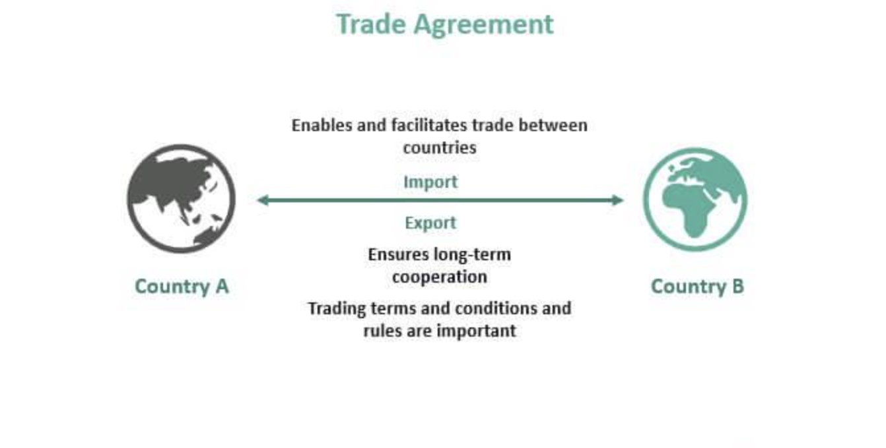

## Table of Contents

## What is a bilateral trade agreement?

A bilateral trade agreement is a deal between two countries to help them trade with each other more easily. It usually involves lowering taxes on goods and services that they exchange, making it cheaper for businesses in both countries to buy and sell things to each other. These agreements can also include rules about how goods are treated when they cross borders, like making sure they meet certain standards or are checked in a certain way.

These agreements are important because they can help countries grow their economies by making it easier to sell their products abroad. For example, if one country is good at making cars and the other is good at growing fruit, they can trade these items more freely. This can lead to more jobs and lower prices for consumers in both countries. However, sometimes these agreements can be controversial if people think they favor one country more than the other or if they hurt certain industries at home.

## How do bilateral trade agreements differ from multilateral trade agreements?

Bilateral trade agreements are deals between just two countries. They focus on making trade easier between these two countries by lowering taxes on goods and setting rules for how they trade. This can help businesses in both countries sell their products to each other more easily. For example, if Country A and Country B have a bilateral agreement, they might agree to lower taxes on cars from Country A and fruit from Country B, making it cheaper for people in both countries to buy these items.

Multilateral trade agreements, on the other hand, involve more than two countries. These agreements aim to create a bigger trading network where many countries agree to lower taxes and follow common rules. A good example is the World Trade Organization (WTO), where many countries work together to make global trade smoother. Multilateral agreements can be more complex because they have to consider the needs and rules of many different countries, but they can also lead to more trade opportunities for everyone involved.

The main difference between the two is the number of countries involved. Bilateral agreements are simpler and more focused, but they only benefit the two countries directly involved. Multilateral agreements can be harder to negotiate and manage, but they can create a larger, more interconnected trading system that benefits more countries and can lead to greater economic growth overall.

## What are the main objectives of entering into a bilateral trade agreement?

The main goal of a bilateral trade agreement is to make trade between two countries easier and cheaper. By lowering taxes on goods and services that they trade, businesses in both countries can buy and sell things to each other at lower costs. This can help their products be more competitive in the other country's market. For example, if one country makes cars and the other grows fruit, a bilateral agreement can make it cheaper for the car-making country to sell cars to the fruit-growing country, and vice versa.

Another important objective is to create more jobs and boost the economy in both countries. When trade becomes easier, businesses can grow and hire more people. This can also lead to lower prices for consumers, because goods from the other country become cheaper. However, it's important to balance these benefits with the potential downsides. Sometimes, industries in one country might struggle if they can't compete with cheaper goods from the other country. So, countries need to carefully consider how a bilateral trade agreement will affect their own industries and workers.

## Can you provide examples of countries that have signed bilateral trade agreements?

The United States and South Korea have a bilateral trade agreement. It's called the U.S.-Korea Free Trade Agreement (KORUS FTA). This deal makes it easier for American companies to sell things like cars and farm products in South Korea. At the same time, South Korean companies can sell electronics and other goods more easily in the U.S. This agreement helps both countries' businesses grow and create jobs.

Another example is the trade agreement between the European Union and Canada, known as the Comprehensive Economic and Trade Agreement (CETA). This agreement helps businesses in the EU sell things like cheese and wine in Canada without paying high taxes. Canadian companies can also sell more of their goods, like fish and minerals, in the EU. Both sides benefit from more trade and lower prices for consumers.

A third example is the bilateral trade agreement between China and Australia. This deal makes it easier for Australia to sell things like beef and wine to China. In return, China can sell more of its goods, like electronics and machinery, to Australia. This agreement helps both countries' economies grow by making it easier for their businesses to trade with each other.

## What are the typical components included in a bilateral trade agreement?

A bilateral trade agreement usually has several key parts. One important part is lowering taxes on goods and services traded between the two countries. This makes it cheaper for businesses to buy and sell things to each other. Another part is setting rules for how goods are treated when they cross borders. This can include making sure they meet certain standards or are checked in a certain way. These rules help make trade smoother and more predictable.

Another common component is protecting intellectual property rights, like patents and trademarks. This helps businesses know that their ideas and products are safe when they trade with the other country. Agreements also often include ways to solve disagreements that might come up. This can be through talks or a special panel that decides on issues. These parts help make sure the agreement works well and is fair for both countries.

Lastly, many bilateral trade agreements include ways to help businesses grow and create jobs. This can be through special programs or by making it easier for companies to invest in the other country. These parts are important because they help both countries' economies grow by making trade easier and more beneficial.

## How do bilateral trade agreements affect tariffs and trade barriers?

Bilateral trade agreements help lower tariffs and trade barriers between two countries. Tariffs are taxes that countries put on goods coming from other places. When two countries make a trade deal, they agree to lower these taxes. This makes it cheaper for businesses in both countries to buy and sell things to each other. For example, if one country makes cars and the other grows fruit, they can trade these items more easily because the taxes are lower.

Trade barriers are rules that can make it hard to trade. These can be things like strict checks at the border or rules that make it hard to sell certain products. Bilateral trade agreements help lower these barriers too. They set clear rules for how goods should be treated when they cross borders. This makes trade smoother and more predictable. When trade barriers are lower, businesses can sell their products in the other country more easily, which can lead to more jobs and help both countries' economies grow.

## What are the economic advantages of bilateral trade agreements for participating countries?

Bilateral trade agreements help countries by making it cheaper and easier for them to trade with each other. When countries lower taxes on goods and services, businesses can buy and sell things more affordably. This means that products from one country can be sold in the other country at lower prices. For example, if one country makes cars and the other grows fruit, they can trade these items more easily. This can lead to more jobs because businesses in both countries can grow and hire more people.

These agreements also help make trade more predictable and fair. By setting clear rules for how goods should be treated when they cross borders, businesses know what to expect. This can help them plan better and feel more confident about trading with the other country. When trade is smoother, it can lead to lower prices for consumers too. Overall, bilateral trade agreements can boost the economies of both countries by making it easier for them to trade and grow their businesses.

## What are the potential disadvantages or risks associated with bilateral trade agreements?

One risk of bilateral trade agreements is that they might hurt certain industries in one country. When taxes on goods are lowered, it can be harder for local businesses to compete with cheaper products from the other country. For example, if a country agrees to lower taxes on imported cars, its own car makers might struggle because they can't sell their cars at the same low price. This can lead to job losses and even the closure of some businesses.

Another disadvantage is that these agreements can be seen as unfair if one country benefits more than the other. Sometimes, one country might have more to gain from the deal, like if it can sell a lot more of its products to the other country. This can cause tension and disagreements between the countries. It's important for both countries to make sure the agreement is balanced and fair so that both sides feel good about the deal.

Lastly, bilateral trade agreements can complicate global trade rules. When countries make many different deals with each other, it can create a confusing web of rules and taxes. This can make it harder for businesses to trade with other countries that are not part of the agreement. It can also make it more difficult for countries to work together on bigger, global trade deals. So, while bilateral agreements can help two countries trade more easily, they can also create challenges for the bigger picture of world trade.

## How do bilateral trade agreements impact small businesses and local economies?

Bilateral trade agreements can help small businesses by making it easier and cheaper for them to sell their products in another country. When taxes on goods are lowered, small businesses can compete better because their products cost less for people in the other country to buy. For example, a small farm in one country might be able to sell more of its fruit to another country because the taxes are lower. This can lead to more sales and help the small business grow. More sales can also mean more jobs for people in the local area, which is good for the local economy.

However, there are also risks for small businesses and local economies. If the other country can sell its products at a lower price because of the agreement, it might be hard for small local businesses to compete. For example, if a big company from the other country starts selling cheaper cars, a small car maker might lose customers and have to close down. This can lead to job losses and hurt the local economy. It's important for countries to think about how these agreements might affect small businesses and local areas, and try to make sure the deals are fair for everyone.

## What role do negotiations play in the formation of bilateral trade agreements?

Negotiations are really important when two countries are trying to make a bilateral trade agreement. They sit down and talk about what each country wants from the deal. They might want to lower taxes on certain products or set rules for how goods are checked at the border. Both countries need to agree on these things, so they have to talk a lot and sometimes make compromises. It's like trying to find a middle ground where both sides are happy with the deal.

Sometimes, negotiations can take a long time because the countries might have different goals or worries. One country might want to protect its own businesses, while the other might want to sell more of its products. They need to listen to each other and work out a plan that helps both sides. If they can't agree, the deal might not happen. But if they can find a way to make it work, the agreement can help both countries trade more easily and grow their economies.

## How are disputes resolved under bilateral trade agreements?

When countries have a bilateral trade agreement, they might sometimes disagree about something in the deal. To solve these disagreements, the agreement usually has a special way to handle disputes. Often, the countries will first try to talk things out and see if they can fix the problem themselves. If talking doesn't work, they might use a special panel of experts. This panel listens to both sides and then decides what should happen. This helps keep the agreement fair and working well for both countries.

Sometimes, the panel's decision can be hard for one country to accept, but it's important to follow it to keep the agreement strong. If a country doesn't follow the decision, it can hurt the trust between the countries and make it harder to trade. So, having a clear way to solve disputes is really important. It helps make sure that even if problems come up, the countries can still work together and keep trading smoothly.

## What are the long-term effects of bilateral trade agreements on global trade patterns?

Bilateral trade agreements can change how countries trade with each other over a long time. When two countries make a deal to lower taxes and make trade easier, they start trading more with each other. This can lead to more businesses in both countries growing and selling their products in the other country. Over time, this can make these two countries depend more on each other for trade. Other countries might see this and want to make similar deals, which can create a network of trade agreements around the world.

However, these agreements can also make global trade more complicated. When countries make many different deals with each other, it can create a confusing web of rules and taxes. This can make it harder for countries that are not part of these agreements to trade with the ones that are. It might also make it harder for countries to work together on bigger, global trade deals. So, while bilateral trade agreements can help two countries trade more easily, they can also change the bigger picture of world trade in ways that are hard to predict.

## References & Further Reading

[1]: Bergstra, J., Bardenet, R., Bengio, Y., & Kégl, B. (2011). ["Algorithms for Hyper-Parameter Optimization."](https://papers.nips.cc/paper/4443-algorithms-for-hyper-parameter-optimization) Advances in Neural Information Processing Systems 24.

[2]: ["Advances in Financial Machine Learning"](https://books.google.com/books/about/Advances_in_Financial_Machine_Learning.html?id=oU9KDwAAQBAJ) by Marcos Lopez de Prado

[3]: ["Evidence-Based Technical Analysis: Applying the Scientific Method and Statistical Inference to Trading Signals"](https://www.amazon.com/Evidence-Based-Technical-Analysis-Scientific-Statistical/dp/0470008741) by David Aronson

[4]: ["Machine Learning for Algorithmic Trading"](https://github.com/PacktPublishing/Machine-Learning-for-Algorithmic-Trading-Second-Edition) by Stefan Jansen

[5]: ["Quantitative Trading: How to Build Your Own Algorithmic Trading Business"](https://www.amazon.com/Quantitative-Trading-Build-Algorithmic-Business/dp/1119800064) by Ernest P. Chan