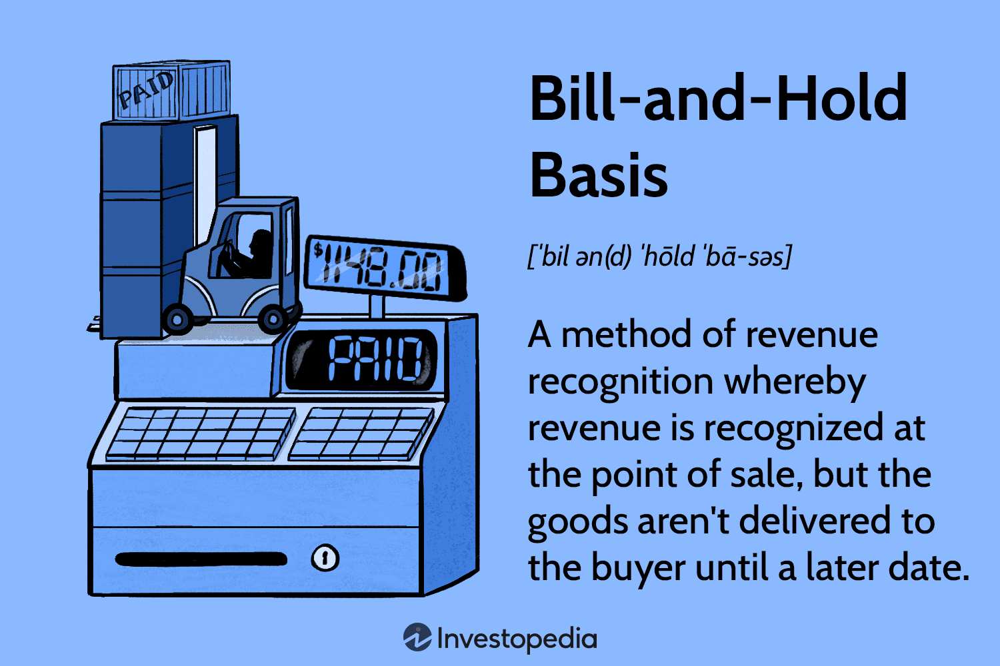

In today's complex financial landscape, an understanding of revenue recognition, trading strategies, and algorithmic solutions is essential for both businesses and investors. These components play a critical role in ensuring organizations not only comply with accounting standards but also operate efficiently in competitive markets. Revenue recognition involves accurately reporting when and how revenue enters the financial statements, thereby providing a transparent view of a company's financial health. As an integral part of accounting, this process ensures stakeholders can make informed decisions based on reliable financial data.

One peculiar method of revenue recognition is the bill-and-hold transaction, where the seller bills a customer for a product but retains physical possession until a future date. While this can align financial results with business realities for industries requiring such deferrals, it necessitates stringent adherence to rules established by regulatory bodies to prevent manipulation or premature revenue recording.



Alongside these accounting nuances, the implementation of algorithmic trading represents a technological evolution in financial markets. By leveraging advanced computer algorithms, this approach executes trades at high speed and frequency, offering a level of precision and efficiency unattainable through traditional trading methods. Algorithmic trading significantly influences market dynamics, providing opportunities for profit while introducing new complexities in risk management.

The interplay between revenue recognition and algorithmic trading shapes the financial ecosystem by impacting how data is analyzed and utilized for decision-making. Accurate financial reporting underpins trading algorithms, which rely on precise and timely information to capitalize on market opportunities. Understanding these relationships and their implications enables businesses and investors to navigate the financial landscape more effectively, ensuring robust decision-making and strategic agility.

## Table of Contents

## Understanding Revenue Recognition

Revenue recognition is a fundamental accounting principle that dictates when and how revenue is recognized in financial statements. This principle is critical because it directly influences the financial performance reported by companies, impacting decisions made by investors, regulators, and other stakeholders.

Revenue recognition is governed by a set of standards designed to ensure that financial statements provide a true and fair view of a company's financial performance. One widely recognized framework is the International Financial Reporting Standard (IFRS) 15, “Revenue from Contracts with Customers,” and its U.S. counterpart, the Financial Accounting Standards Board (FASB) Accounting Standards Codification (ASC) 606. These standards provide a uniform approach to understanding and implementing revenue recognition across different industries and transaction types.

The core idea is to recognize revenue in a manner that reflects the transfer of goods or services to customers in an amount that represents the consideration to which a company expects to be entitled. Under IFRS 15 and ASC 606, revenue recognition follows a five-step process:

1. **Identify the Contract with the Customer**: Contracts can be written, oral, or implied by customary business practices, but they must create enforceable rights and obligations.

2. **Identify the Performance Obligations in the Contract**: A performance obligation is a promise to transfer a good or service to a customer. A contract may have multiple performance obligations.

3. **Determine the Transaction Price**: This step involves estimating the amount of consideration the company expects to receive in exchange for transferring goods or services. This may involve variable consideration, such as discounts, rebates, or performance bonuses.

4. **Allocate the Transaction Price to Performance Obligations**: If a contract includes multiple performance obligations, the transaction price is allocated to each obligation based on its relative standalone selling price.

5. **Recognize Revenue When (or as) the Entity Satisfies a Performance Obligation**: Revenue is recognized when control of the goods or services is transferred to the customer, which can happen at a point in time or over time.

The recognition of revenue can vary significantly depending on the transaction characteristics. For example, subscription-based services recognize revenue over time, corresponding to service delivery, whereas product sales might involve recognizing revenue once the product is delivered and accepted by the customer.

Revenue recognition is essential for accurate financial reporting because it affects the timing of when revenues and profits are recorded. This, in turn, can impact various financial metrics and ratios, influencing business valuations, investment decisions, and assessments of financial health.

By adhering to established accounting standards, companies ensure the consistency, reliability, and comparability of their financial statements, fostering trust and transparency in the financial markets.

## Exploring Bill-and-Hold Transactions

Bill-and-hold transactions represent a distinctive approach to revenue recognition, where a seller records revenue before delivering the product to the buyer. In this arrangement, the seller retains physical possession of the goods, but the buyer has officially purchased them. This practice is particularly prevalent in industries requiring customized products or long production cycles, such as manufacturing and construction.

The method is controversial mainly due to its potential for revenue manipulation. Regulatory bodies, including the U.S. Securities and Exchange Commission (SEC), have established rigorous criteria to govern these transactions and safeguard against revenue inflation. According to the SEC's guidance, a bill-and-hold transaction can qualify for revenue recognition if it meets five conditions typically summarized as:

1. **Persuasive evidence of an arrangement** - There must be a concrete agreement between the buyer and seller outlining the terms of the sale.

2. **The product is ready for delivery** - The goods should be complete and available for shipment, even though the buyer requests the seller to hold them.

3. **The buyer must commit to purchase** - The buyer must formally confirm their purchase obligation. The absence of contingencies or return rights is crucial here.

4. **The seller cannot use the product or redirect it to another customer** - The products should be set aside specifically for the buyer, ensuring they are not available for sale to others.

5. **A fixed delivery schedule** - There should be a clear timeline agreed upon for future delivery.

These criteria are designed to validate the transaction's legitimacy and ensure that revenue is not recognized prematurely. The ethical concerns surrounding bill-and-hold arrangements often focus on the transparency and integrity of financial records. Misuse of this method could result in inflated revenue figures, misleading investors and regulators about a company's financial health.

Real-world instances illustrate both proper application and abuse of these transactions. For example, in the case of McKesson HBOC, a healthcare company was found to have improperly recognized revenue via bill-and-hold tactics to boost financial outcomes artificially. Such abuses have prompted regulators to scrutinize these transactions closely.

Conversely, companies like Boeing have utilized bill-and-hold effectively by adhering to regulatory standards, given the long production timelines and customization involved in aircraft manufacturing. The company's commitment to delivering goods as per contractual terms without misrepresenting financial health showcases the ethical execution of this model.

In summary, while bill-and-hold transactions can be instrumental in industries with unique logistics or production demands, they require stringent adherence to regulatory criteria to prevent ethical breaches and financial misrepresentations.

## The Role of Algorithmic Trading in Financial Markets

Algorithmic trading, often known as algo trading, is a method of executing orders using automated and pre-programmed trading instructions to account for variables such as time, price, and [volume](/wiki/volume-trading-strategy). This systematic approach allows for trades to be conducted at speeds and frequencies that are impossible for a human trader, with the added benefit of reducing transaction costs and minimizing the impact of emotions on trading decisions.

At the core of [algorithmic trading](/wiki/algorithmic-trading) are advanced mathematical models and complex software systems that generate trading signals based on historical and real-time market data. These algorithms can identify profitable opportunities and execute trades across multiple markets and asset classes with impressive efficiency.

Algorithmic trading systems rely heavily on comprehensive datasets to evaluate potential trading opportunities. These datasets typically include historical price and volume data, as well as macroeconomic indicators and news analytics. The integration and real-time analysis of such large datasets can be accomplished through [machine learning](/wiki/machine-learning) techniques, which enable the development of predictive models for financial markets. For instance, a simple moving average crossover strategy is a basic example of an algorithm that triggers buy or sell signals when short-term moving averages intersect long-term ones.

```python
import pandas as pd

# Example of a simple moving average crossover strategy
def moving_average_crossover(data, short_window, long_window):
    data['Short_MA'] = data['Close'].rolling(window=short_window, min_periods=1).mean()
    data['Long_MA'] = data['Close'].rolling(window=long_window, min_periods=1).mean()

    # Buy signal when short MA exceeds long MA
    data['Signal'] = 0
    data.loc[data['Short_MA'] > data['Long_MA'], 'Signal'] = 1
    data.loc[data['Short_MA'] < data['Long_MA'], 'Signal'] = -1

    return data

# Sample stock data as DataFrame
stock_data = pd.DataFrame({'Close': [100, 102, 101, 105, 110, 107, 115]})
result = moving_average_crossover(stock_data, short_window=3, long_window=5)
print(result)
```

The prevalence of algorithmic trading in financial markets has significantly grown over the past decades, now representing a considerable portion of total trading volume. It is particularly dominant in high-frequency trading ([HFT](/wiki/high-frequency-trading-strategies)), where traders seek to capitalize on small price discrepancies often by acting on information milliseconds ahead of the market. The rapid execution times and precision offered by algorithms make it possible to exploit these transient [arbitrage](/wiki/arbitrage) opportunities effectively.

Moreover, algorithmic trading offers substantial benefits to [liquidity](/wiki/liquidity-risk-premium) and market efficiency. By automating the continuous matching of buyers and sellers, these systems contribute to tighter bid-ask spreads and more stable prices. However, it's important to consider the potential downsides, such as the amplification of market [volatility](/wiki/volatility-trading-strategies) and systemic risks, exemplified by events like the 2010 Flash Crash where automated trading algorithms played a role in a rapid, deep market sell-off.

Algorithmic trading also supports risk management and optimal execution strategies. Traders can employ algorithms that mitigate risk exposure by structuring order sequences to minimize market impact or adhere to regulatory compliance requirements, such as best execution practices.

In summary, algorithmic trading has revolutionized modern trading practices by providing remarkable speed, efficiency, and market access. Its role in today's financial markets is indispensable, shaping the architecture of global financial systems and influencing how trading activities are conducted, regulated, and monitored.

## Integrating Revenue Recognition and Algo Trading

Revenue recognition and algorithmic trading, though distinct areas within the financial sector, have a noteworthy intersection. Accurate revenue recognition is essential for the integrity and efficacy of trading algorithms that depend on precise financial data to execute decisions. When financial statements accurately reflect a firm's economic activities, trading algorithms can more reliably assess the performance and predict future market conditions.

### Accuracy in Financial Data

Accurate financial reporting is the bedrock of effective algorithmic trading. Trading algorithms utilize various quantitative models, often incorporating metrics directly derived from financial statements, such as revenue growth, earnings per share, and debt ratios. A misstatement or misinterpretation of these figures, particularly revenue, can lead to incorrect model outputs and suboptimal trading decisions. For instance, if revenue is incorrectly deferenced due to improper recognition, it could exaggerate or understate a company's financial health, affecting algorithm parameters like trends and [momentum](/wiki/momentum).

### Complexity of Transactions

Understanding complex transactions like bill-and-hold is vital for maintaining financial data integrity. Bill-and-hold transactions involve recognizing revenue before the delivery of goods, under specific conditions such as the buyer requesting the arrangement and assuming associated risks. If not accurately accounted for, these transactions can artificially inflate revenue figures. Trading algorithms processing these inflated figures might generate misleading signals, assuming stronger financial performance than is accurate, which can skew models and lead to poor trading decisions.

Consider the Python code snippet below, illustrating a simple algorithmic check on revenue figures based on recognized and deferred revenue:

```python
def evaluate_revenue(recognized_revenue, deferred_revenue):
    # Threshold indicating suspicious transactions
    suspicious_threshold = 0.2  
    total_revenue = recognized_revenue + deferred_revenue
    ratio_deferred = deferred_revenue / total_revenue

    if ratio_deferred > suspicious_threshold:
        return "Review bill-and-hold arrangements"
    else:
        return "Revenue recognition appears normal"

# Example usage
result = evaluate_revenue(80, 20)
print(result) # Output: "Review bill-and-hold arrangements"
```

This code demonstrates a basic check where if the deferred revenue exceeds 20% of the total, it flags a potential issue with revenue recognition.

### Implications for Algorithms

Trading algorithms integrate vast arrays of market data, including financial disclosures and public statements. Any discrepancy or creative accounting, particularly concerning revenue recognition, can introduce biases in forecasts. These algorithms often leverage machine learning models trained on vast datasets, which rely on the quality and accuracy of input data. A deviation in data quality can skew predictions, affecting liquidity, volatility predictions, and influencing trading strategies.

In conclusion, for trading algorithms to serve their purpose of maximizing profitability and managing risk effectively, the financial data they consume must be robust and accurate. Precise revenue recognition and thorough understanding of transactions ensure that derived metrics and models used by these algorithms reflect true economic activities, fostering an environment of informed decision-making.

## Challenges and Risks

Revenue recognition and algorithmic trading present distinct challenges and risks in the financial landscape, necessitating careful consideration and strategic management.

### Revenue Recognition Challenges

**Ethical Concerns:**  
The primary challenge in revenue recognition revolves around ethical issues, primarily due to the temptation for companies to inflate their financial results. Under pressure to meet financial expectations, businesses might manipulate revenue recognition to present a more favorable financial position. One method, the bill-and-hold transaction, requires strict adherence to criteria set by regulatory bodies like the SEC. Non-compliance can lead to financial misstatements, impacting investor confidence and resulting in legal repercussions [SEC, 2022].

**Complexity and Judgment:**  
Revenue recognition often involves significant judgment, particularly when applying accounting standards like ASC 606 or IFRS 15, which require companies to consider the timing and certainty of revenues. Complexities arise in scenarios involving multiple performance obligations or variable consideration, making it challenging to determine the precise moment when revenue should be recognized [FASB, 2014].

### Algorithmic Trading Risks

**Market Volatility:**  
Algorithmic trading, characterized by its speed and volume, can exacerbate market volatility. Algorithms executing trades in milliseconds can lead to rapid market shifts, sometimes resulting in phenomena like flash crashes. This volatility is a risk for traditional investors and traders who might not be able to react swiftly to sudden changes in market prices [Aldridge, 2013].

**Algorithmic Failure:**  
Algorithmic trading systems are vulnerable to programming errors and unforeseen market conditions, which can lead to significant financial losses. A notable example is the 2012 Knight Capital Group incident, where a software glitch resulted in a loss of $440 million in less than an hour [BBC, 2012]. Ensuring robust algorithm testing and incorporating fail-safe mechanisms is crucial to mitigate such risks.

### Mitigation Strategies

**For Revenue Recognition:**  
Implementing strong internal controls and ethical guidelines can help mitigate the risk of revenue misstatement. Regular audits and a strong compliance culture ensure adherence to accounting standards, reducing the potential for unethical practices. Additionally, continuous training on the latest standards and regulations is vital for accounting teams.

**For Algorithmic Trading:**  
Risk management tools and circuit breakers can help manage market volatility associated with algorithmic trading. Employing diversified trading strategies and real-time monitoring of trading algorithms allow for quick identification and resolution of any issues that arise. Additionally, incorporating machine learning techniques can enhance the adaptability and accuracy of trading algorithms, minimizing the risk of errors due to changing market conditions.

In conclusion, the interconnected challenges of revenue recognition and algorithmic trading require a proactive approach to risk management, with a focus on ethical practices, robust systems, and continuous adaptation to regulatory and market changes.

## Conclusion

As financial markets continue to evolve, the convergence of accounting practices and trading technologies is becoming increasingly significant. Grasping the principles of revenue recognition, bill-and-hold transactions, and algorithmic trading is vital for finance professionals aiming to navigate this dynamic landscape. 

Revenue recognition serves as a foundational principle in accounting, crucial for ensuring accurate and transparent financial reporting. Its proper implementation helps in reflecting a company’s financial health, facilitating informed decision-making for investors and stakeholders. The importance of this principle is further highlighted in the context of bill-and-hold transactions, where revenue is recognized prior to the physical delivery of goods. Despite its contentious nature, adhering to regulatory criteria is essential to maintain the integrity of financial statements and prevent revenue inflation.

Simultaneously, algorithmic trading has transformed the way financial markets operate, offering the ability to execute trading strategies with remarkable speed and precision. This technological advancement not only enhances trading efficiency but also demands a comprehensive understanding of financial data for the development and refinement of algorithms. Accurate financial reporting, including complex transactions like bill-and-hold, becomes crucial as algorithms depend heavily on reliable data to function effectively.

Moreover, the interplay between revenue recognition and algo trading underscores the necessity for meticulous accuracy in financial data, reinforcing the demand for urgent attention to accounting standards. The challenges presented by these components, such as ethical considerations in revenue recognition and market volatility induced by trading algorithms, highlight the need for astute risk management strategies.

Overall, keeping abreast of these crucial components within the financial industry is imperative for finance professionals dedicated to excelling in a field where regulatory, technological, and ethical considerations progressively intersect.

## References & Further Reading

[1]: ["Revenue Recognition (ASC 606): The Ultimate Guide"](https://kpmg.com/us/en/frv/reference-library/2024/handbook-revenue-recognition.html) Journal of Accountancy

[2]: ["Algorithmic Trading: Concepts and Applications"](https://www.investopedia.com/articles/active-trading/101014/basics-algorithmic-trading-concepts-and-examples.asp) from the Handbook of Financial Econometrics and Statistics

[3]: ["Advances in Financial Machine Learning"](https://www.amazon.com/Advances-Financial-Machine-Learning-Marcos/dp/1119482089) by Marcos Lopez de Prado

[4]: ["High-Frequency Trading: A Practical Guide to Algorithmic Strategies and Trading Systems"](https://www.ahmetbeyefendi.com/wp-content/uploads/2020/07/High-Frequency-Trading-Irene-Aldridge.pdf) by Irene Aldridge

[5]: FASB. (2014). ["Accounting Standards Codification: Revenue from Contracts with Customers (ASC 606)"](https://fasb.org/page/document?pdf=ASU+2014-09_Section+A.pdf&title=UPDATE%20NO.%202014-09%E2%80%94REVENUE%20FROM%20CONTRACTS%20WITH%20CUSTOMERS%20(TOPIC%20606)%20SECTION%20A%E2%80%94SUMMARY%20AND%20AMENDMENTS%20THAT%20CREATE%20REVENUE%20FROM%20CONTRACTS%20WITH%20CUSTOMERS%20(TOPIC%20606)%20AND%20OTHER%20ASSETS%20AND%20DEFERRED%20COSTS%E2%80%94CONTRACTS%20WITH%20CUSTOMERS%20(SUBTOPIC%20340-40)) 

[6]: BBC. (2012). ["Knight Capital Group's $440 Million Trading Loss Explained"](https://www.bbc.com/news/magazine-19214294)

[7]: ["Quantitative Trading: How to Build Your Own Algorithmic Trading Business"](https://www.amazon.com/Quantitative-Trading-Build-Algorithmic-Business/dp/1119800064) by Ernest P. Chan