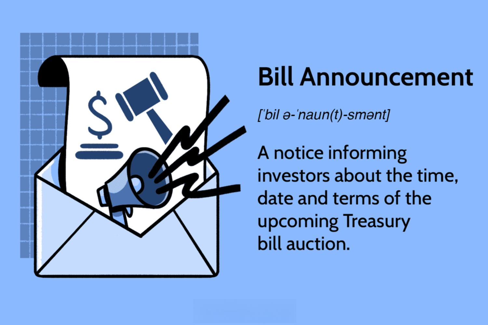

Algorithmic trading has fundamentally transformed financial markets by utilizing computer algorithms to execute trades at speeds and volumes far beyond human capability. This technological evolution offers substantial advantages, such as increased market efficiency and liquidity, but it also presents significant challenges, including heightened risks of market manipulation and systemic instability. As algorithmic strategies become increasingly sophisticated, the necessity for corresponding legislative frameworks to ensure these activities are conducted responsibly becomes evident.

The rapid advancement in trading technologies necessitates parallel developments in regulatory practices. The role of legislation becomes crucial in mitigating potential abuses and ensuring transparency and fairness in trading. Recent years have seen a concerted effort by legal and regulatory bodies to scrutinize and address the implications of algorithmic activities, particularly in trading environments. By scrutinizing the current landscape of algorithmic trading within the context of regulatory measures, this article aims to provide clarity on the ongoing legislative efforts and explore their broader implications for market participants and regulatory bodies alike. Understanding the intricate balance between fostering innovation and ensuring market integrity will be critical in navigating the evolving landscape of algorithmic trading.

## Table of Contents

## Understanding Algorithmic Trading

Algorithmic trading, a critical component of modern financial markets, leverages computer algorithms to execute trades with precision and speed according to predefined criteria. This technique has been transformative, allowing traders to harness the power of technology to optimize their trading strategies. Designed to react swiftly to market conditions, these algorithms can process massive datasets rapidly, facilitating transactions that would be impossible for human traders to execute manually.

The primary advantage of algorithmic trading lies in its ability to transact orders at a faster pace and with greater efficiency than traditional methods. By minimizing human intervention, algorithmic trading can significantly reduce transaction costs and improve the accuracy of trades. The algorithms can be programmed to operate across a multitude of trading venues, reducing latency and capturing arbitrage opportunities that are fleeting in nature.

Algorithmic trading also enables the execution of complex strategies such as statistical arbitrage, market making, and index fund rebalancing. By using mathematical models and statistical analysis, traders attempt to capitalize on inefficiencies observed in the market. Machine learning algorithms are also employed to improve prediction accuracy in anticipating market trends and price movements.

However, with these advantages come inherent risks. One notable concern is the potential for market manipulation. Algorithms can be exploited to artificially influence market prices through techniques such as spoofing, where fake orders are placed with the intention of deceiving other market participants. Additionally, the phenomenon of flash crashes—rapid, deep market price declines followed by a swift recovery—poses a significant threat. These events are often exacerbated by the herding behavior of algorithmic systems responding in unison to market signals.

To mitigate these risks, regulatory bodies emphasize the significance of maintaining fair and transparent trading environments. Regulatory frameworks aim to monitor and control [algorithmic trading](/wiki/algorithmic-trading) activities, ensuring that markets function without undue influence or distortion. Measures such as requiring traders to register as algorithmic traders, periodic audits of their algorithms, and enforcing pre-trade risk checks are strategies employed to safeguard the integrity of the markets.

As algorithmic trading continues to evolve, the oversight by regulatory authorities remains crucial in striking a balance between innovation and market robustness, ensuring that the financial markets operate fairly for all participants.

## Recent Legislation on Algorithmic Trading

In recent years, the rise of algorithmic trading has prompted significant legislative developments aimed at mitigating the potential risks associated with its unchecked operation. One notable legislative effort is the introduction of the Preventing Algorithmic Collusion Act, which seeks to address the growing concern of price fixing facilitated by algorithms. The law aims to close existing loopholes that enable companies to engage in anti-competitive practices through algorithmic means.

The Act emphasizes several critical components designed to enhance market integrity and protect consumer welfare. Firstly, it seeks to establish clear guidelines about permissible algorithmic practices, delineating the boundaries between acceptable strategy and anti-competitive behavior. By doing so, it provides companies with a defined framework to structure their algorithmic operations.

Additionally, the legislation introduces robust monitoring and compliance mechanisms obligating firms to implement transparency measures. Companies are required to maintain a record of their algorithmic activities, ensuring that regulators can conduct thorough inspections when necessary. This is intended to deter manipulative practices and foster a transparent trading environment.

Moreover, the Preventing Algorithmic Collusion Act mandates the development of advanced detection tools by regulatory bodies to identify potential instances of collusion. These tools would leverage [machine learning](/wiki/machine-learning) and data analytics to scrutinize vast quantities of trading data for patterns indicative of anti-competitive conduct.

The potential impact of these legislative measures on the market is significant. By reducing the opportunity for algorithmic collusion, the Act promotes a level playing field, enabling smaller market participants to compete more fairly. Furthermore, enhanced regulatory oversight helps to bolster investor confidence, as the risk of market manipulation is mitigated.

Despite the potential benefits, the Act also raises concerns among industry players regarding implementation costs and the potential stifling of innovation. Critics argue that overly stringent regulations might inhibit technological advancements by imposing burdensome compliance requirements. However, proponents assert that the long-term benefits of a fair and transparent market outweigh the immediate costs.

In summary, recent legislative efforts, such as the Preventing Algorithmic Collusion Act, represent a strategic approach to addressing the challenges posed by algorithmic trading. By closing legislative gaps and encouraging transparency, these measures are poised to significantly influence market dynamics, ensuring that technological progress occurs within a framework of fairness and integrity.

## Challenges and Controversies Surrounding Regulation

Implementing regulations on algorithmic trading is complex, largely due to the intricate nature of the technologies involved and the pushback from industry participants who benefit from the current system's flexibility. At the core of these challenges is the evolving landscape of algorithmic trading, which is powered by sophisticated algorithms capable of making rapid and high-frequency trading decisions. These algorithms are often proprietary, developed by financial institutions for competitive advantage, and the lack of transparency can make regulatory oversight difficult.

One significant challenge is ensuring that regulations keep pace with technological advancements. Algorithms can be highly adaptive, utilizing [artificial intelligence](/wiki/ai-artificial-intelligence) and machine learning techniques to enhance their efficiency and effectiveness. However, this adaptability can also allow entities to exploit regulatory gaps, engaging in activities that may undermine market integrity, such as market manipulation or flash trading. Thus, regulators must possess not only a technical understanding of these algorithms but also the ability to anticipate future developments in technology.

Resistance from industry participants is another hurdle. The financial industry argues that excessive regulation could stifle innovation, hinder market efficiency, and lead to increased costs for compliance. This pushback is particularly evident from high-frequency trading firms and large financial institutions that are at the forefront of using complex algorithms. As regulators aim to curtail the potential negative impacts of algorithmic trading, they must navigate these industry concerns, balancing oversight with the need to maintain a competitive and innovative trading environment.

Moreover, there is an ongoing debate regarding the extent to which algorithms should be regulated. Proponents of stricter regulations argue that thorough oversight is crucial to prevent practices that could lead to unfair market scenarios, such as algorithmic collusion or unintended impacts on market prices. Conversely, opponents believe that too much regulatory intervention might limit the benefits that algorithmic trading can offer, such as improved [liquidity](/wiki/liquidity-risk-premium), reduced transaction costs, and enhanced price discovery.

To address these challenges, there is a call for international cooperation among regulatory bodies. Because financial markets are global, any regulatory framework must consider cross-border implications and strive for coherence across jurisdictions. Without this cooperation, financial entities might exploit regulatory [arbitrage](/wiki/arbitrage) opportunities, operating in locales with more relaxed rules.

In conclusion, the regulatory landscape for algorithmic trading is continuously evolving, shaped by technological advancements, industry dynamics, and the overarching need to protect market participants. Collaborative efforts between technology experts, academics, industry players, and regulators are essential to devise effective regulatory strategies that safeguard market integrity while fostering innovation.

## The Future of Lawmaking in Algorithmic Trading

The regulation of algorithmic trading is poised to evolve significantly as technological advancements and market dynamics continue to transform financial landscapes. One of the primary anticipations for future lawmaking in this area is the enhanced collaboration between technologists and lawmakers. Such collaboration is essential to bridge the gap between complex technologies and the legislative frameworks designed to govern them. The rapid pace of innovation, particularly with the advent of artificial intelligence (AI) and machine learning, demands a nuanced understanding from regulators to craft laws that are both effective and forward-thinking.

AI and machine learning are reshaping trading practices by providing sophisticated tools that amplify the speed and precision of trading activities. These technologies enable the analysis of vast datasets, identification of patterns, and execution of high-frequency trades with minimal human intervention. Consequently, regulators face the challenge of ensuring these technologies are used ethically and do not compromise market integrity. For instance, machine learning algorithms are increasingly being employed for predictive analytics, where they anticipate market movements based on historical data patterns. While this offers significant competitive advantages, it also raises potential issues around data privacy, insider trading, and market manipulation.

Adaptive legislative frameworks will become a cornerstone of future regulatory approaches. Legislators must move towards creating laws that are flexible and capable of evolving alongside technological trends. This may include developing real-time monitoring systems and adaptive compliance protocols that can respond dynamically to the changing landscape of algorithmic trading. For example, implementing sandbox environments where new algorithms can be tested under regulatory oversight before their full deployment in the market may offer a balance between innovation and risk management.

The future also holds the promise of international cooperation in regulatory efforts. As algorithmic trading operates across global markets, harmonizing standards and practices will be crucial in addressing cross-border trading activities and preventing regulatory arbitrage wherein companies exploit differences in international regulations to their advantage. Collaborative efforts through international bodies such as the Financial Stability Board (FSB) or the International Organization of Securities Commissions (IOSCO) can play a pivotal role in setting global benchmarks in algorithmic trading regulation.

In conclusion, the trajectory of lawmaking in algorithmic trading is inherently linked to technological progress. It will require ongoing dialogue between technologists and lawmakers, adaptive legal structures, and international cooperation. By doing so, regulators can effectively manage the complexities introduced by emerging technologies while fostering an environment conducive to innovation and fair market practices.

## Conclusion

Algorithmic trading represents a significant advancement in financial markets by leveraging computer algorithms to execute trades with speed and efficiency. However, the rapid evolution of this technology necessitates careful regulation to harness its benefits while safeguarding market integrity. The Preventing Algorithmic Collusion Act exemplifies a proactive legislative approach to address the potential misuse of algorithms for anti-competitive practices, such as price fixing. By closing existing loopholes, such legislation demonstrates a commitment to adapting to technological changes within the financial sector.

Effective regulation serves a dual purpose: fostering innovation and protecting market participants. As technological advances continue to shape market behaviors, regulatory frameworks must evolve to ensure that these innovations do not compromise market fairness or transparency. This involves continuous collaboration between technologists and lawmakers to create adaptive legislative measures that can keep pace with technological innovations. Moreover, as algorithms become increasingly sophisticated, incorporating artificial intelligence and machine learning, regulatory bodies will need to be vigilant in monitoring their impacts on market dynamics.

In conclusion, algorithmic trading holds the promise of transforming financial markets but poses challenges that require a concerted effort in regulatory oversight. Policymakers must strike a delicate balance between promoting technological progress and ensuring robust protection for investors. Through well-crafted legislation and regulatory vigilance, it is possible to create an environment that supports both the dynamism of algorithmic trading and the fundamental principles of market integrity and fairness.

## References & Further Reading

[1]: Aldridge, I. (2013). ["High-Frequency Trading: A Practical Guide to Algorithmic Strategies and Trading Systems."](https://books.google.com/books/about/High_Frequency_Trading.html?id=8QpIsVUMhmEC) Wiley Finance.

[2]: Narang, R. K. (2013). ["Inside the Black Box: A Simple Guide to Quantitative and High Frequency Trading."](https://onlinelibrary.wiley.com/doi/book/10.1002/9781118662717) Wiley Finance.

[3]: Lewis, M. (2014). ["Flash Boys: A Wall Street Revolt."](https://en.wikipedia.org/wiki/Flash_Boys) W. W. Norton & Company.

[4]: Patterson, S. (2012). ["Dark Pools: High-Speed Traders, A.I. Bandits, and the Threat to the Global Financial System."](https://dl.acm.org/doi/10.5555/2385786) Crown Business.

[5]: Harris, L. (2003). ["Trading and Exchanges: Market Microstructure for Practitioners."](https://www.amazon.com/Trading-Exchanges-Market-Microstructure-Practitioners/dp/0195144708) Oxford University Press.