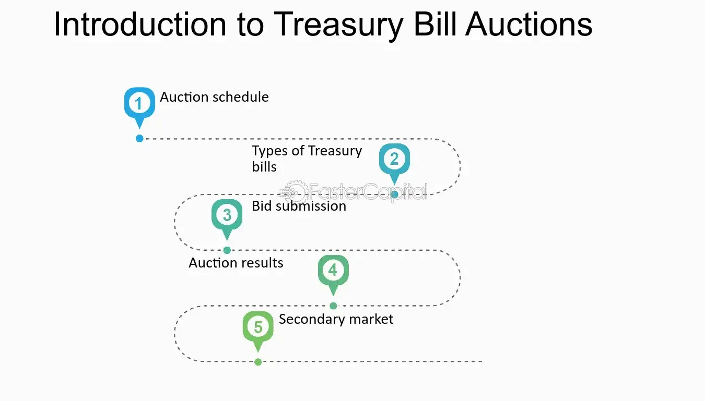

## Table of Contents

## What is a bill auction?

A bill auction is a way for the government to borrow money from people and businesses. The government sells special short-term loans called Treasury bills, or T-bills, to those who want to lend money. These T-bills are sold at an auction, where people and businesses can bid on them. The auction decides who gets to buy the T-bills and how much they have to pay.

At the auction, people and businesses offer to buy T-bills by saying how much they are willing to pay and the interest rate they want. The government then looks at all the bids and picks the ones that offer the best deal for them. The winners get the T-bills and the government gets the money it needs. This helps the government manage its money and keep the economy stable.

## Who can participate in a bill auction?

Anyone can participate in a bill auction as long as they have the money to buy the Treasury bills. This includes regular people, businesses, and even big organizations like banks and investment funds. You don't need to be a special kind of person or have a lot of money to join in, but you do need to follow the rules set by the government.

To take part, you need to have an account with the Treasury Department or go through a bank or broker that can bid for you. These banks and brokers help people who want to buy T-bills but don't want to do the bidding themselves. So, whether you're doing it on your own or with help, a bill auction is open to anyone who wants to lend money to the government.

## How does the bill auction process work?

A bill auction is a way for the government to borrow money by selling Treasury bills, or T-bills. People and businesses who want to lend money to the government can bid on these T-bills. The auction happens online, and anyone can join in if they have the money and follow the rules. You can bid directly through the Treasury Department or use a bank or broker to help you.

At the auction, people and businesses say how much they are willing to pay for the T-bills and what [interest rate](/wiki/interest-rate-trading-strategies) they want. The government then looks at all the bids and picks the ones that are the best deal for them. The winners get the T-bills, and the government gets the money it needs. This helps the government manage its money and keep the economy stable.

## What are the different types of bills auctioned?

The government auctions different types of Treasury bills, or T-bills. The main types are 4-week, 8-week, 13-week, 17-week, 26-week, and 52-week T-bills. Each type has a different time until it matures, which means the time until the government pays back the money it borrowed. The shorter the time, the less interest you get, but you get your money back faster.

When you buy a T-bill, you are lending money to the government for that specific time. For example, if you buy a 13-week T-bill, you will get your money back after 13 weeks, plus a little bit of interest. The longer T-bills, like the 52-week ones, give you more interest because you are lending your money for a longer time. This way, people can choose the T-bill that fits their needs and how long they want to wait to get their money back.

## What is the difference between competitive and non-competitive bidding in bill auctions?

In a bill auction, there are two ways to bid for Treasury bills: competitive and non-competitive bidding. Competitive bidding is when you tell the government exactly how much you are willing to pay for the T-bills and what interest rate you want. This type of bidding is for people who know a lot about the market and want to try to get the best deal. The government looks at all the competitive bids and picks the ones that offer the best terms for them. If your bid is good enough, you get the T-bills at the price and interest rate you asked for.

Non-competitive bidding is simpler and is for people who just want to buy T-bills without worrying about the price or interest rate. When you make a non-competitive bid, you just say how much money you want to spend, and the government gives you T-bills at the average price and interest rate of all the competitive bids that were accepted. This way, you are sure to get some T-bills, but you don't get to choose the exact price or interest rate. Non-competitive bidding is good for people who want a safe and easy way to lend money to the government.

## How can one prepare to participate in a bill auction?

To get ready for a bill auction, first, you need to know when the auctions happen. The U.S. Department of the Treasury has a schedule you can look at to see when they are selling different types of Treasury bills, or T-bills. You can find this schedule on their website. Once you know the dates, decide which T-bills you want to buy. There are different kinds, like 4-week, 8-week, 13-week, and so on. Choose the one that fits how long you want to lend your money to the government.

Next, you need to decide if you want to bid competitively or non-competitively. If you want to bid competitively, you'll need to decide how much you're willing to pay and what interest rate you want. This can be tricky and is usually for people who know a lot about the market. If you want to bid non-competitively, it's simpler. You just say how much money you want to spend, and the government gives you T-bills at the average price and interest rate of the accepted competitive bids. To actually place your bid, you can either do it directly through the Treasury's website if you have an account, or you can go through a bank or broker that can help you with the process.

## What are the risks involved in participating in bill auctions?

When you participate in a bill auction, there are some risks you should know about. One risk is that you might not get the T-bills you want. If you bid competitively and your bid isn't good enough, you won't get any T-bills. Even if you bid non-competitively, there's a limit to how much money the government will accept, so you might not get all the T-bills you asked for. Another risk is that the interest rate you get might be lower than you expected. If you bid non-competitively, you get the average rate of the accepted competitive bids, which might be lower than what you hoped for.

Another risk is that the value of your T-bills can change before they mature. If interest rates go up after you buy your T-bills, the value of your T-bills might go down. This means if you need to sell your T-bills before they mature, you might get less money back than you paid. Also, while T-bills are considered very safe because they are backed by the government, there's always a small chance that something unexpected could happen that affects the government's ability to pay you back. So, it's important to think about these risks before you decide to participate in a bill auction.

## How are the results of a bill auction determined and announced?

The results of a bill auction are determined by the bids that the government receives. When people and businesses bid on Treasury bills, or T-bills, they say how much they are willing to pay and what interest rate they want. The government looks at all the bids and picks the ones that are the best deal for them. For competitive bids, the government accepts the bids with the lowest interest rates first until they have sold all the T-bills they want to sell. For non-competitive bids, the government accepts all the bids up to a certain limit, and these bidders get the T-bills at the average interest rate of the accepted competitive bids.

After the auction is over, the government announces the results. They share information like the total amount of T-bills sold, the interest rate that was accepted, and how much money they got from the auction. This information is usually posted on the U.S. Department of the Treasury's website. People who placed bids can also find out if they got the T-bills they wanted and at what price and interest rate. This helps everyone know what happened at the auction and how much money the government borrowed.

## What strategies can be employed to maximize returns from bill auctions?

To maximize returns from bill auctions, one strategy is to carefully choose between competitive and non-competitive bidding. If you know a lot about the market, you might want to bid competitively. This means you tell the government exactly how much you are willing to pay and what interest rate you want. If your bid is good enough, you can get a better interest rate than the average. But if you don't know much about the market, non-competitive bidding might be better. You just say how much money you want to spend, and you get the T-bills at the average interest rate of the accepted competitive bids. This way, you are sure to get some T-bills, even if the interest rate is not as high as you hoped.

Another strategy is to pay attention to the timing of the auctions and the economic conditions. The interest rates on T-bills can change based on what's happening in the economy. If you think interest rates are going to go up soon, you might want to buy T-bills with a shorter term, like 4-week or 8-week bills. This way, you can get your money back faster and then buy new T-bills at the higher interest rate. If you think interest rates are going to stay the same or go down, you might want to buy T-bills with a longer term, like 26-week or 52-week bills, to lock in the current rate for longer. By keeping an eye on the economy and choosing the right time and term for your T-bills, you can try to get the best return on your money.

## How do bill auctions impact the broader financial market?

Bill auctions have a big effect on the financial market because they help set interest rates. When the government sells Treasury bills, or T-bills, at an auction, the interest rates that people and businesses are willing to accept become a guide for other interest rates in the market. If people bid low interest rates for T-bills, it usually means that other interest rates, like those for loans and bonds, will also be low. This can make borrowing money cheaper for everyone, which can help the economy grow. On the other hand, if people bid high interest rates for T-bills, it can make other interest rates go up, which can slow down the economy because borrowing becomes more expensive.

Bill auctions also affect how much money is available in the financial system. When the government sells T-bills, it takes money out of the hands of people and businesses and puts it into the government's hands. This can change how much money is available for other investments and spending. If the government borrows a lot of money through bill auctions, there might be less money left for other things, which can affect the stock market and other investments. So, bill auctions are important because they help control interest rates and the flow of money in the economy, which can have a big impact on the financial market as a whole.

## What are the historical trends in bill auction participation and yields?

Over the years, the number of people and businesses taking part in bill auctions has changed a lot. In times when the economy is doing well, more people want to buy Treasury bills because they see them as a safe place to put their money. This can make the auctions very competitive, with lots of bids coming in. On the other hand, when the economy is not doing so well, fewer people might want to buy T-bills because they are looking for other ways to make money. The number of people bidding can also change based on what's happening in the world, like big events or changes in government policy.

The interest rates, or yields, on Treasury bills have also gone up and down over time. When the economy is strong and growing, interest rates on T-bills are usually higher because people expect to make more money from other investments. But when the economy is weak or there's a lot of uncertainty, interest rates on T-bills can go down because people want a safe place to keep their money, even if it means getting a lower return. These trends show how bill auctions are closely tied to what's happening in the economy and can give us clues about where things might be headed.

## How does one analyze the performance of different bill auctions over time?

To analyze the performance of different bill auctions over time, you need to look at the interest rates, or yields, that were accepted at each auction. You can find this information on the U.S. Department of the Treasury's website, where they post the results of each auction. By comparing the yields from different auctions, you can see how they have changed over time. For example, if the yields are going up, it might mean that people are expecting the economy to grow and want higher returns on their money. If the yields are going down, it might mean that people are looking for a safe place to put their money because they are worried about the economy.

Another way to analyze the performance of bill auctions is to look at how many people and businesses are bidding and how much money they are willing to spend. If more people are bidding and they are willing to spend more money, it can make the auctions more competitive, which can push up the yields. On the other hand, if fewer people are bidding, the auctions might not be as competitive, and the yields might go down. By looking at these trends over time, you can get a better understanding of how the economy is doing and how people's expectations about the future are changing.

## What is the auction process?

The auction process for Treasury bills involves several critical phases: announcement, bidding, and execution. Each of these phases plays a significant role in determining the pricing and yield of these short-term government securities.

The process begins with the announcement phase. During this phase, the details of the upcoming auction are disclosed to potential investors. This includes information such as the total amount of bills to be issued, the auction date, maturity dates, and any other relevant terms. The announcements are typically made public through official channels such as the government’s financial websites or press releases. This transparency ensures that all market participants, both institutional and individual investors, are aware of the upcoming opportunities.

Following the announcement, the bidding phase commences. The auction system employed here is the electronic Dutch auction system, which is pivotal for understanding the determination of pricing and yield. In a Dutch auction, rather than setting a fixed price for the bills, the auctioneer (in this case, the government or its financial representative) starts with a price above the market level. Bidders submit bids indicating the quantity of bills they wish to purchase and their desired yield. As the auction progresses, the yield is incrementally increased until the total quantity of bids at that yield meets or exceeds the amount of the securities available. This method is advantageous as it reflects real-time demand and helps determine the optimal market clearing yield.

Mathematically, this can be represented by a demand curve $D(y)$ for Treasury bills, where $y$ denotes the yield. The auction aims to find a yield $y_c$ such that:

$$
D(y_c) = Q
$$

where $Q$ is the total quantity of Treasury bills available for auction. 

During the execution phase, all bids at or below the cutoff yield $y_c$ are accepted. Those bids tendered above $y_c$ are rejected. Successful bidders receive their allocation of Treasury bills at a uniform yield, which is typically the highest yield accepted, ensuring equitable treatment among participants. 

Finally, the allocation and settlement procedures occur. Allocation involves distributing the Treasury bills to the successful bidders based on their accepted bids. Settlement refers to the financial transaction where bidders transfer funds equating to the cost of their allocated Treasury bills, and in return, they receive the actual securities. This phase confirms the legal and financial transfer of ownership and is typically finalized within a short period after the auction.

In summary, the auction process for Treasury bills is methodically structured to ensure transparency, efficiency, and fair market pricing through its electronic Dutch auction system. This process not only governs the strategic issuance of public debt but also optimizes the cost of borrowing for governments.

## References & Further Reading

[1]: Bergstra, J., Bardenet, R., Bengio, Y., & Kégl, B. (2011). ["Algorithms for Hyper-Parameter Optimization."](https://dl.acm.org/doi/10.5555/2986459.2986743) Advances in Neural Information Processing Systems 24.

[2]: ["Advances in Financial Machine Learning"](https://www.amazon.com/Advances-Financial-Machine-Learning-Marcos/dp/1119482089) by Marcos Lopez de Prado

[3]: ["Evidence-Based Technical Analysis: Applying the Scientific Method and Statistical Inference to Trading Signals"](https://www.amazon.com/Evidence-Based-Technical-Analysis-Scientific-Statistical/dp/0470008741) by David Aronson

[4]: ["Machine Learning for Algorithmic Trading"](https://github.com/stefan-jansen/machine-learning-for-trading) by Stefan Jansen

[5]: ["Quantitative Trading: How to Build Your Own Algorithmic Trading Business"](https://github.com/LucindaYa/quant-resources/blob/master/Quantitative%20Trading%20How%20to%20Build%20Your%20Own%20Algorithmic%20Trading%20Business.pdf) by Ernest P. Chan