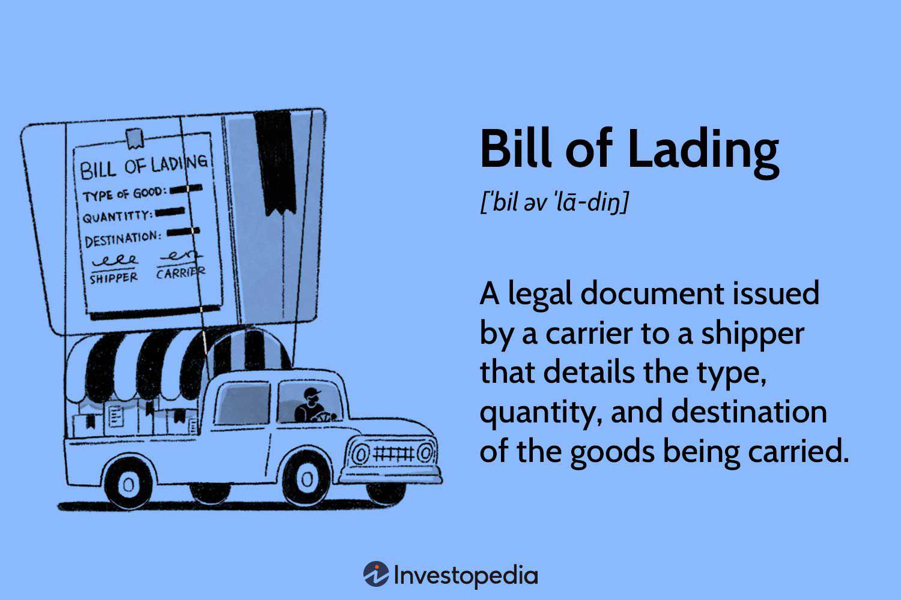

Navigating the world of freight shipping is a complex task, made even more intricate by the extensive documentation involved. Among the many documents in the shipping process, the Bill of Lading (B/L) stands out as one of the most crucial. It serves as a legally binding document, integral to the efficient handling and transportation of goods across the globe. A B/L functions as a receipt, a document of title, and a contract between the shipper and the carrier, ensuring that the shipment details are accurately recorded and legally binding.

In recent years, algorithmic trading has revolutionized various sectors, and freight logistics is no exception. The integration of advancements like algorithmic trading into logistics introduces unprecedented efficiencies and data-driven decision-making. By harnessing the power of algorithms, freight logistics can optimize trade processes, streamline operations, and enhance decision-making accuracy.

This article aims to explore the intersection of these two elements: how the Bill of Lading is pivotal in freight shipping and the role algorithmic trading plays in optimizing the logistics chain. By examining these intersections, we can gain insights into how the traditional processes can be transformed with modern technological advancements, ensuring a more secure, efficient, and responsive freight shipping industry.

## Table of Contents

## Understanding the Bill of Lading

A Bill of Lading (B/L) is a vital document in the freight shipping industry, acting as a cornerstone of the shipping process. It simplifies and legitimizes transactions by connecting the shipper, carrier, and receiver through clearly defined responsibilities and details of the shipment.

The B/L serves three essential functions:

1. **Receipt for Shipped Goods**: The B/L provides a comprehensive description of the cargo received by the carrier, including quantities, weight, dimensions, and any unique characteristics. It serves as a prima facie evidence that goods have been loaded under the agreed conditions.

2. **Document of Title**: As a document of title, the B/L allows the holder to claim ownership or possession of the goods, providing flexibility in trade and commerce. This feature is particularly important in international transactions where the goods may change hands multiple times before reaching their final destination.

3. **Contract of Carriage**: The B/L outlines the terms and conditions under which the goods are transported. It forms a legally binding contract between the shipper and the carrier, ensuring that both parties adhere to their respective roles and responsibilities.

The legal significance of the B/L extends beyond these functions. Its standardized format aids in avoiding disputes, enhancing the security of cargo movements, and acting as a critical piece of evidence in litigation. In cases of theft, loss, or damage, the B/L helps establish liability and resolve potential conflicts effectively.

There are several types of Bills of Lading, each tailored to different needs and scenarios:

- **Inland Bill of Lading**: Used for domestic shipments over land, such as by road or rail, this B/L facilitates the movement of goods from the shipper's location to a port or delivery location within the same country.

- **Ocean Bill of Lading**: Designed for international shipments, this B/L governs the transportation of goods by sea. It is crucial for cross-border trade, enabling the smooth transfer of merchandise between countries.

- **Through Bill of Lading**: This comprehensive document enables the transportation of goods using multiple modes of transportation (e.g., rail, truck, ocean) under a single contract. It simplifies logistics by covering the entire transport journey from the point of origin to the final destination.

- **Negotiable Bill of Lading**: This type provides flexibility in ownership; the holder of the original signed copy can endorse it to another party, making it a negotiable instrument in trade transactions.

These distinct forms of B/Ls play integral roles in the logistics chain, providing clarity and structure to complex shipping arrangements. They ensure all parties involved understand their duties, protect their interests, and facilitate the seamless transfer of goods across vast distances, ultimately contributing to the efficiency and security of global trade.

## Algorithmic Trading in the Freight Shipping Industry

Algorithmic trading, traditionally associated with financial markets, utilizes complex algorithms to automate and optimize trade processes, reducing the need for human intervention and minimizing errors. In recent years, this technology has found significant applications in the freight shipping industry, where it offers numerous benefits.

In the context of freight shipping, [algorithmic trading](/wiki/algorithmic-trading) facilitates the streamlining of operations by processing vast datasets to make informed decisions. By using historical shipping data, market trends, and real-time information, algorithms can significantly reduce operational costs and anticipate logistical needs. The ability to analyze and interpret large volumes of data swiftly aids in making precise predictions and decisions that can optimize the entire logistics process.

The integration of Artificial Intelligence (AI) and Machine Learning (ML) further enhances algorithmic trading capabilities in logistics. These technologies contribute through route planning optimization, load management, and fleet allocation. AI algorithms can predict the most efficient routes by considering factors such as weather conditions, traffic patterns, and port congestion. ML models can dynamically adjust load plans based on capacity and demand fluctuations, ensuring optimal resource utilization. This adaptability enables logistics providers to achieve higher levels of efficiency and reliability.

Moreover, the use of real-time data and predictive analytics enables companies to foresee changes in the market and adjust their logistical strategies accordingly. For instance, algorithms can predict periods of high demand and prepare fleets and routes in anticipation, minimizing delays and disruptions. Predictive models can also assess risks and provide contingency plans, thereby ensuring resilience against unforeseen events.

By employing algorithmic trading techniques, the freight shipping industry can achieve a sophisticated level of logistical management. This not only reduces costs and enhances service quality but also aligns with the modern demand for faster, more reliable supply chain solutions. As global trade continues to evolve, the role of algorithmic trading in logistics is likely to expand, offering further opportunities for innovation and efficiency.

## How Bill of Lading and Algorithmic Trading Intersect

The intersection of Bill of Lading documentation and algorithmic trading introduces significant improvements in the freight shipping industry, providing enhanced transparency, efficiency, and security. Automating Bill of Lading processes, a crucial element for efficient shipping logistics, reduces human error and accelerates the approval of necessary documentation. This automation integrates smoothly across platforms, ensuring seamless data sharing among involved parties. 

For example, leveraging [machine learning](/wiki/machine-learning) algorithms can automate the extraction and validation of data from Bills of Lading, significantly reducing the time taken for document processing. Utilizing Natural Language Processing (NLP) models, such as BERT or GPT, can assist in interpreting the complex text within these documents, allowing for more straightforward data integration and operational efficiency enhancements.

Algorithmic trends also offer predictive capabilities that optimize the allocation of resources in freight shipping. By analyzing historical shipping data, these algorithms can anticipate demand fluctuations and adjust the deployment of assets like vehicles, containers, and staff accordingly. This optimized allocation not only ensures efficiency in resource use but also aids in strategizing the issuance and utilization of Bills of Lading.

Furthermore, the integration of Bills of Lading with algorithmic trading enhances shipment tracking and verification. With real-time data analytics, shipping companies can ensure that all necessary compliance with international shipping regulations is met. This verification is crucial, especially for goods subjected to stringent regulatory standards. For enhanced traceability and compliance, blockchain technology can be integrated to create a decentralized ledger of Bill of Lading transactions, offering an immutable record that can be accessed by all authorized stakeholders globally.

In conclusion, the intersection of Bill of Lading documentation with algorithmic trading mechanisms paves the way for more sophisticated, reliable, and adaptable shipping processes, addressing both current challenges and future demands of global logistics.

## Challenges and Future Trends

The integration of algorithmic trading within the logistics sector presents numerous opportunities for enhancing efficiency and decision-making. However, it is not without its challenges. One significant concern is data privacy. With algorithmic trading relying heavily on large datasets, the protection of sensitive information is paramount. Companies must ensure compliance with international data protection regulations like the General Data Protection Regulation (GDPR) while leveraging data analytics. This involves implementing robust encryption and anonymization techniques to safeguard information.

Additionally, adapting legacy systems to support algorithmic trading poses another challenge. Many logistics companies operate with outdated infrastructure that may be incompatible with new technologies. This requires significant investment in IT resources and retraining personnel to ensure seamless integration and operation. Transitioning from traditional to algorithm-driven systems necessitates careful planning and phased implementation to minimize disruptions.

Looking forward, the logistics industry is exploring blockchain as a transformative technology to address some of these challenges. Blockchain can enhance the security and traceability of shipping documents, including the Bill of Lading. By providing an immutable ledger, blockchain ensures that records remain tamper-proof and transparent. This can significantly reduce fraud and improve trust among stakeholders.

Moreover, the trend towards digitization underscores the need for interoperability and standardization in electronic Bills of Lading. Diverse digital platforms currently lack uniformity, which can lead to inefficiencies and misunderstandings. Developing common protocols and standards is essential for ensuring that digital documents are universally accepted and recognized across different jurisdictions and organizations. This will facilitate smoother operations and transactions in global logistics.

In conclusion, as the logistics industry continues to embrace technological advancements, addressing current challenges and leveraging innovations like blockchain will be crucial. Companies must prioritize data privacy and invest in modernizing their infrastructure to fully realize the potential of algorithmic trading in enhancing efficiency and security in freight shipping.

## Conclusion

The Bill of Lading is a critical component of freight shipping, acting as an essential document that connects shippers, carriers, and receivers, thereby ensuring the seamless flow of goods across regions. It functions as a receipt for cargo, a document of title, and a contract for transportation, cementing its importance in logistics. The precision and reliability provided by the Bill of Lading are instrumental in mitigating disputes and maintaining a trustworthy supply chain.

Algorithmic trading offers fresh avenues for enhancement and efficacy within logistics, providing sophisticated data-driven techniques that optimize trading processes and logistical operations. By utilizing advanced algorithms to process vast data sets, logistic companies can achieve real-time analysis and predictive analytics, paving the way for enhanced route optimization and resource allocation. This approach not only minimizes costs but also heightens the responsiveness and adaptability of supply chains in a rapidly evolving market landscape.

The coordinated use of the Bill of Lading and algorithmic trading has the potential to transform freight shipping, making it more secure, streamlined, and in harmony with global trade requirements. Automation of Bill of Lading tasks can accelerate processing times, while algorithmic insights can preempt market shifts, allowing logistics operations to adjust swiftly to changing demands. This synergy ensures a more efficient use of resources and provides stakeholders with reliable and accessible shipment information.

As industries continue to advance, the adoption of technological innovations in cargo documentation is crucial for maintaining a competitive edge. Harnessing the power of digital solutions and predictive analytics will enable companies to enhance the traceability and verification of goods, promote compliance with international standards, and respond effectively to the complexities of modern trade. Through these advancements, businesses can bolster their logistical frameworks, ensuring longevity and success in a globally interconnected economy.

## References & Further Reading

[1]: Schramm, H.-J. (2012). ["Freight Forwarder's Intermediary Role in Multimodal Transport Chains: An Empirical Confirmation of Theory."](https://www.thefreelibrary.com/CSA%2FSMS%3A+shippers%2C+take+action!+The+implementation+of+the+FMCSA%27s...-a0284368040) Maritime Policy & Management, 39(6), 571-585.

[2]: Alderton, P. M. (2008). ["Reeds Sea Transport: Operation and Economics."](https://books.google.com/books/about/Reeds_Sea_Transport.html?id=DxPSBAAAQBAJ) A&C Black.

[3]: Chung, L., & Fong, A. C. M. (2015). ["Algorithmic Trading with Blockchain Technology: Enhancing Commodity Trading."](https://www.cambridge.org/core/journals/journal-of-financial-and-quantitative-analysis/article/abs/algorithmic-trading-and-market-quality-international-evidence/4B96E916E3E13AFF1DF9B5FCC188F4E0) IEEE International Conference on Industrial Technology (ICIT).

[4]: Tapscott, D., & Tapscott, A. (2018). ["Blockchain Revolution: How the Technology Behind Bitcoin Is Changing Money, Business, and the World."](https://www.tandfonline.com/doi/full/10.1080/10686967.2018.1404373) Penguin.

[5]: Sarokin, D., & Schulkin, J. (2016). ["Eco-Innovation and the Development of Business Models: Lessons Learned from Bioenergy Companies in Germany and the United States."](https://en.wikipedia.org/wiki/Gould_family) Springer.