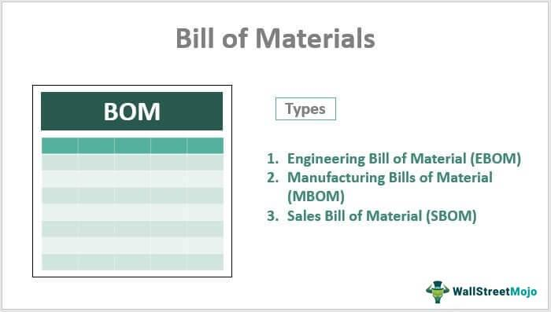

A Bill of Materials (BOM) is a comprehensive list detailing all the parts, components, subassemblies, and raw materials required to produce a final product in the manufacturing industry. It serves as a crucial document in the production process, outlining the hierarchical structure and quantities of items needed, thereby facilitating efficient inventory management, production planning, and cost estimation.

Algorithmic trading, commonly known as algo trading, refers to the use of computer programs to execute trading orders automatically in financial markets. This technology relies on mathematical models and algorithms to make decisions at speeds and frequencies that are impossible for human traders. The system evaluates vast datasets for identifying trading opportunities based on defined criteria, enhancing trading precision, reducing transaction costs, and minimizing human error.

Exploring the unique intersection of BOM and algo trading offers intriguing possibilities for optimization and efficiency. By applying the principles of algorithmic decision-making to BOM management, manufacturers can automate processes such as material requirement planning, sourcing decisions, and supply chain logistics. This integration can lead to significant improvements in operational efficiency, cost reduction, and adaptability to changing market conditions.

The rationale behind this intersection lies in leveraging computational algorithms to transform traditional manufacturing processes into more adaptive and intelligent systems. This approach mirrors the advantages seen in the financial sector, where algorithmic trading has reshaped market dynamics. By marrying these concepts, manufacturing could experience enhanced precision and scalability in handling complex production data.

The purpose of this article is to examine the benefits and methodologies associated with integrating algorithmic strategies into BOM management. By analyzing how these approaches can be aligned, the article aims to shed light on potential enhancements in manufacturing efficiency and suggest pathways for innovation. Such exploration is crucial for industry progress, encouraging further research and practical application in uniting these two domains.

## Table of Contents

## Understanding Bill of Materials (BOM)

A Bill of Materials (BOM) is a comprehensive inventory of raw materials, components, and assemblies required to construct, manufacture, or repair a product. It serves as a crucial document in the manufacturing process, providing detailed information necessary for accurate production planning, cost calculation, and inventory management. Typically, a BOM is hierarchical, reflecting the product structure from the top-level finished product down to individual parts and materials.

### Components and Categories of BOM

A well-structured BOM includes several essential components and can be categorized based on different criteria:

1. **Components**: A BOM generally consists of material descriptions, part numbers, quantities needed, and unit of measure. It may also include additional details like procurement type, lead times, and waste allowances.

2. **Categories**:
   - **Engineering BOM (EBOM)**: Created by the engineering department, it describes the product as designed, containing all engineering specifications and designs.
   - **Manufacturing BOM (MBOM)**: Tailored for the manufacturing process, encompassing all components needed for production, potentially including subassemblies.
   - **Service BOM**: Specific to products that require servicing, detailing parts necessary for maintenance and repair.

### Importance of an Accurate BOM

An accurate BOM is vital for manufacturing processes and inventory management for several reasons:

- **Production Efficiency**: Ensures all necessary components are available, reducing downtime due to missing parts.
- **Cost Management**: Accurate BOMs assist in budgeting by providing detailed cost estimates for materials and production.
- **Quality Control**: Helps maintain product consistency by clearly defining each component required.
- **Inventory Management**: A precise BOM supports efficient stock levels, reducing the risk of excess inventory or shortages.

### Challenges in BOM Management

BOM management can be challenging due to:

- **Complexity**: Products with numerous parts, variants, or frequent design changes can complicate BOM accuracy and update frequency.
- **Data Consistency**: Ensuring that BOMs are consistent and align with real-time data across departments is essential yet complex.
- **Interdepartmental Coordination**: Aligning EBOMs, MBOMs, and service BOMs requires collaboration across engineering, manufacturing, and service teams.

### Technological Advancements in BOM Management

Technological solutions have significantly improved BOM management:

- **Enterprise Resource Planning (ERP) Systems**: Modern ERPs integrate BOM management with other business processes, enhancing data consistency and accessibility.

- **Product Lifecycle Management (PLM) Software**: Offers tools for managing BOM changes efficiently throughout the product lifecycle, ensuring updates reflect in all related documents.

- **Cloud-Based Solutions**: Facilitate real-time collaboration and data sharing across locations, making it easier for global teams to work on a unified BOM.

These advancements have a profound impact on manufacturing efficiency and accuracy, allowing firms to remain competitive by responding swiftly to design changes and maintaining optimal inventory levels.

## Exploring Algorithmic Trading

Algorithmic trading, commonly known as algo trading, involves the use of computer algorithms to automate trading strategies in financial markets. These algorithms execute trades based on pre-set criteria, leveraging computational speed and data analysis to capitalize on market opportunities. As technology evolves, algo trading has become increasingly sophisticated, encompassing a variety of strategies and methodologies.

**Types of Algorithms Used in Trading:**

1. **Market Analysis Algorithms:** These are designed to analyze large volumes of market data efficiently and identify trading opportunities. They utilize historical data and statistical models to forecast future price movements. Common techniques include moving averages, trend-following, and mean-reversion strategies.

2. **Decision-Making Algorithms:** These algorithms evaluate market conditions and decide whether to buy or sell assets. They incorporate risk management and portfolio optimization techniques to align trading decisions with investment goals. Examples include the Capital Asset Pricing Model (CAPM) and value-at-risk (VaR) models.

3. **Execution Strategies:** The focus of these algorithms is to execute orders in the market to minimize transaction costs and market impact. Strategies such as Volume Weighted Average Price (VWAP), Time Weighted Average Price (TWAP), and Percentage of Volume (POV) are often used to break down large orders and manage execution.

**Benefits of Algorithmic Trading:**

- **Speed:** Algorithms can process information and execute trades in milliseconds, which is crucial in today's fast-paced markets where delays can lead to missed opportunities or adverse price movements.

- **Accuracy:** Automation reduces the likelihood of human errors in trading, such as mispricing or incorrect quantity orders, ensuring consistent execution.

- **Scalability:** Algorithms can be easily scaled to handle large volumes of trades across multiple markets and instruments, allowing traders to manage extensive portfolios more effectively.

**Challenges and Risks Associated with Algo Trading:**

While [algorithmic trading](/wiki/algorithmic-trading) offers numerous advantages, it also presents significant challenges and risks. Market [volatility](/wiki/volatility-trading-strategies), system failures, and erroneous algorithms can result in substantial financial losses. Moreover, the complexity of developing and maintaining efficient algorithms requires specialized skills and significant resources. Regulatory issues also pose challenges, as markets are increasingly scrutinized to prevent manipulative practices enabled by high-speed trading.

**Emerging Trends and Innovations:**

Recent advancements in technology have driven innovations in algorithmic trading. Machine Learning (ML) and Artificial Intelligence (AI) are increasingly utilized to enhance prediction accuracy and adapt to evolving market conditions. The incorporation of Natural Language Processing (NLP) allows traders to analyze news and social media sentiment in real-time, providing additional insights into market dynamics.

Moreover, the application of blockchain technology offers potential improvements in transparency, security, and efficiency of transactions in trading ecosystems. Quantum computing, though in its nascent stages, promises to revolutionize algorithmic trading by potentially solving complex optimization problems at unprecedented speeds.

In conclusion, while algorithmic trading has transformed the financial markets by providing speed, precision, and scalability, ongoing innovations continue to address its inherent challenges. As these technologies mature, they will likely offer even more robust trading solutions and strategies.

## The Intersection of BOM and Algo Trading

The intersection of Bill of Materials (BOM) management and algorithmic trading principles presents an intriguing avenue for enhancing manufacturing efficiency. Algorithmic trading involves utilizing computational algorithms to perform tasks like market analysis, decision-making, and execution strategies with precision and speed. These principles can be effectively adapted to BOM management, offering several opportunities for optimization and process improvements.

Adapting algorithmic trading principles to BOM management involves leveraging algorithms for tasks such as data analysis, variability management, and supply chain optimization. These algorithms can help in structuring BOM data efficiently, ensuring accuracy and timely updates across multiple production units. The concept of dynamic decision-making from algorithmic trading could be integrated into BOM systems to automate and optimize inventory levels and resource allocation based on real-time data inputs, thereby improving response times and reducing human error.

One notable opportunity for optimization through algorithms in BOM management is predictive maintenance. Algorithms can analyze historical and real-time data to predict potential breakdowns in machinery used for production, thereby enabling proactive maintenance measures. This can extend machine life, avoid production downtime, and optimize scheduling, ultimately leading to cost savings and enhanced productivity.

A case study highlighting successful integration is the implementation of AI-driven analytics platforms by large manufacturing firms to manage complex BOMs. Companies have successfully used [machine learning](/wiki/machine-learning) algorithms to analyze vast amounts of inventory and procurement data, resulting in more accurate demand forecasting and optimized supply chains. For instance, Tesla's integration of advanced analytical tools for BOM management has played a significant role in its ability to streamline production processes and adapt swiftly to market demands.

The advantages of utilizing algorithms in BOM management are multifaceted, including cost reduction, increased efficiency, and enhanced adaptability. Algorithms can automate routine tasks, thereby decreasing labor costs and minimizing the likelihood of errors. This automation also enables the systems to be scalable, managing growing data volumes without sacrificing performance. The adaptability of algorithmic solutions lies in their capacity to quickly adjust to changes, such as alterations in supply chain logistics or material costs, ensuring that manufacturing processes remain optimal.

Despite the benefits, merging algorithmic principles with BOM management presents challenges. Key challenges include the complexity of integrating algorithms into existing systems and the need for accurate and high-quality data. Ensuring data integrity requires substantial effort, as inaccuracies in BOM data can lead to costly production errors. To address these challenges, companies can implement data governance frameworks and invest in training employees to adapt to new technologies. Additionally, adopting modular software architecture can ease integration by allowing incremental changes without overhauling entire systems.

Addressing these challenges also involves embracing continuous improvement practices where feedback from algorithmic outcomes is analyzed to refine and enhance the system progressively. Collaborating with technology partners and leveraging cloud-based solutions can further support seamless integration and scalability.

By adapting algorithmic trading principles for BOM management, firms can significantly improve efficiency and adaptability, paving the way for more robust and responsive manufacturing processes.

## Technological Solutions and Tools

The integration of Bill of Materials (BOM) management with algorithmic trading principles has given rise to a suite of technological solutions poised to enhance efficiency and accuracy in manufacturing processes. This section provides an overview of the current technologies enabling this integration and outlines the criteria for selecting optimal solutions.

Existing software tools now leverage algorithmic support to improve BOM management significantly. These tools facilitate the automation of routine tasks, ensuring data accuracy and consistency across the various stages of production. Enterprise Resource Planning (ERP) systems, such as SAP or Oracle, incorporate modules that can synchronize BOM data with inventory and production schedules, enhancing operational efficiency.

Artificial Intelligence (AI) and Machine Learning (ML) have emerged as crucial components in this integration. AI algorithms analyze large datasets to predict trends and identify patterns that human operators might miss. Machine learning models can optimize BOM updates, predict component shortages, and streamline the procurement process. For example, predictive analytics can forecast when a specific item in the BOM is likely to be required based on historical consumption patterns, allowing for just-in-time inventory management.

The implementation of these technologies in manufacturing operations hinges on several best practices. First, there is a need for a comprehensive data strategy ensuring high-quality and well-integrated data streams. Establishing clear objectives for the integration process helps align the AI and ML models with business goals. It is also essential to involve cross-functional teams in the planning and execution phases to ensure that the technological capabilities align with the practical needs of the production floor.

When selecting the right technology solutions, several criteria should be considered. Compatibility with existing systems is paramount to ensuring a smooth integration process. Solutions should offer scalability, allowing businesses to adapt to future growth and changes in production [volume](/wiki/volume-trading-strategy). Additionally, ease of use and robust support and training from vendors can facilitate more rapid adoption and minimize disruption during the transition phase. Security features also play a critical role, protecting sensitive production and inventory data from potential breaches.

Overall, by aligning BOM management with algorithmic capabilities, businesses can achieve significant improvements in precision and flexibility. These technological solutions not only enhance the efficiency of manufacturing operations but also position companies to be more adaptive and responsive in a competitive market environment.

## Future Trends and Innovations

Predictions for the future integration of manufacturing and algorithmic trading suggest a transformative impact brought by innovative technologies such as the Internet of Things (IoT), blockchain, and cloud computing. These technologies hold the potential to redefine processes, enhance efficiency, and create smarter systems within the manufacturing sector.

The IoT will play a crucial role by connecting physical manufacturing components to the digital world, enabling real-time monitoring and optimization of the Bill of Materials (BOM). By utilizing IoT-enabled sensors and devices, manufacturers can gather extensive data on the usage, efficiency, and lifecycle of components. This connectivity allows for predictive maintenance, reducing downtime and improving production efficiency by ensuring that components are replaced or serviced before failure.

Blockchain technology introduces a new paradigm for traceability and transparency within manufacturing processes. By utilizing a decentralized ledger, blockchain can securely record each transaction and modification in the BOM, ensuring that each change can be tracked and verified. This can significantly reduce errors, prevent fraud, and enhance trust among various stakeholders, including suppliers, manufacturers, and regulatory bodies.

Cloud computing offers scalable solutions for data storage and analysis, which are essential for managing the large volumes of information generated by IoT devices and blockchain transactions. With cloud platforms, manufacturers can implement advanced data analytics and algorithmic models to optimize the entire production process. Cloud-based systems enable real-time data processing and accessibility, supporting manufacturers in making timely, informed decisions.

The role of big data and predictive analytics is increasingly pivotal, providing insights that can transform traditional BOM management into a more dynamic, adaptive system. Through the application of machine learning algorithms, manufacturers can predict patterns in component demand, identify potential bottlenecks, and optimize resource allocation. This proactive approach minimizes waste and enhances overall production efficiency.

Looking forward, smarter BOM systems are anticipated to evolve, leveraging these technologies. These systems will not only manage inventory with greater precision but will also adapt to changing market demands with agility. For example, combining machine learning with BOM management can lead to an AI-driven approach where the system autonomously adjusts orders and inventory based on predictive insights.

In conclusion, the convergence of IoT, blockchain, cloud computing, big data, and predictive analytics is set to revolutionize manufacturing and algorithmic trading integration. As technology continues to advance, the potential for creating highly efficient, responsive, and intelligent manufacturing systems becomes increasingly tangible.

## Conclusion

The convergence of algorithmic trading principles with Bill of Materials (BOM) management offers significant opportunities for enhancing efficiency and cost-effectiveness in manufacturing. By leveraging algorithmic strategies traditionally used in financial markets, manufacturers can achieve greater accuracy, speed, and adaptability in BOM management processes.

Key points discussed include the potential for process optimization through algorithmic solutions, resulting in reduced operational costs and improved resource allocation. The successful integration of these methodologies, as illustrated by various case studies, underscores the value of applying data-driven decision-making techniques from financial sectors to the manufacturing domain.

Looking ahead, the scalability of such integrated systems is promising, particularly as emerging technologies such as Artificial Intelligence (AI), Machine Learning (ML), and the Internet of Things (IoT) continue to evolve. These advancements are expected to further refine BOM management, offering predictive analytics capabilities and enhancing system responsiveness to market changes.

Continued research and experimentation are essential to fully harness the potential of merging BOM with algorithmic trading methodologies. By investing in these innovations, industries can unlock enhanced productivity levels and remain competitive in an ever-changing economic landscape.

Industry participation and investment in emerging technologies are crucial for driving forward this innovative fusion. Stakeholders are encouraged to explore these intersections, adopt best practices, and contribute to the development of smarter, more efficient manufacturing systems. As technology progresses, these integrations hold the promise of reshaping manufacturing processes for future generations.

## References & Further Reading

[1]: Bergstra, J., Bardenet, R., Bengio, Y., & Kégl, B. (2011). ["Algorithms for Hyper-Parameter Optimization."](https://dl.acm.org/doi/10.5555/2986459.2986743) Advances in Neural Information Processing Systems 24.

[2]: ["Advances in Financial Machine Learning"](https://www.amazon.com/Advances-Financial-Machine-Learning-Marcos/dp/1119482089) by Marcos Lopez de Prado

[3]: ["Evidence-Based Technical Analysis: Applying the Scientific Method and Statistical Inference to Trading Signals"](https://www.amazon.com/Evidence-Based-Technical-Analysis-Scientific-Statistical/dp/0470008741) by David Aronson

[4]: ["Machine Learning for Algorithmic Trading"](https://github.com/stefan-jansen/machine-learning-for-trading) by Stefan Jansen

[5]: ["Quantitative Trading: How to Build Your Own Algorithmic Trading Business"](https://www.amazon.com/Quantitative-Trading-Build-Algorithmic-Business/dp/1119800064) by Ernest P. Chan