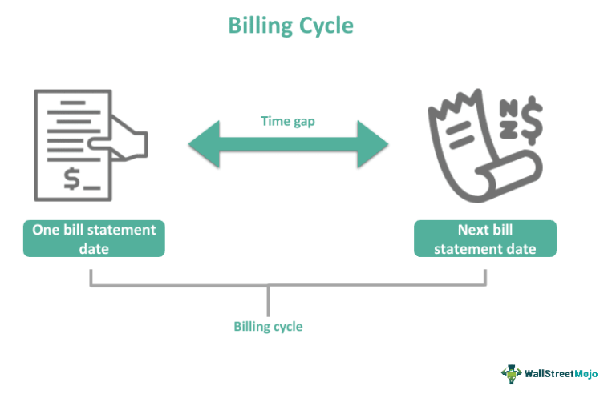

Understanding the intricacies of billing cycles and their impact on business operations is crucial for maintaining financial health. At its core, the billing process is about managing invoice generation, setting appropriate periods, and aligning with payment behaviors. These elements ensure that businesses can maintain a steady revenue stream, anticipate future income, and manage expenses effectively.

In the specific context of algorithmic trading, the importance of efficient billing cycles becomes even more pronounced. Algorithmic trading relies on high-speed and high-frequency transactions, which necessitate precise financial management to optimize cash flow and ensure that trading activities are profitable. Efficient billing processes in this domain help in seamless transaction settlements and accurate financial reporting, making them essential for operational success.



Automation of billing processes presents a significant improvement over manual methods. Automating these processes not only increases accuracy—minimizing human error in calculations and entries—but also reduces administrative overhead. This allows businesses to allocate resources more effectively and concentrate efforts on strategic activities that foster growth and innovation.

This article will explore the intersection between billing cycles and algorithmic trading, offering insights into optimizing billing processes to achieve better financial management and operational efficiency. Through understanding and adapting these processes, businesses can enhance their financial health and performance, particularly in fast-paced and competitive settings like algorithmic trading.

## Table of Contents

## The Invoice Period and Billing Cycle Explained

An invoice period is the timeframe designated for calculating billing and issuing invoices, serving as a critical component in financial management. Typically, businesses adopt monthly billing cycles, which prove essential for managing cash flow and projecting revenues. This regularity allows companies to anticipate revenue streams accurately, facilitating informed decisions regarding financial allocations. By maintaining a consistent billing frequency, businesses can better plan their expenses, investments, and resource allocation.

In algorithmic trading, the precision of invoice periods plays a pivotal role. Timely and accurate invoicing ensures that transaction settlements occur seamlessly, which is crucial given the high-frequency nature of algorithmic trading activities. Accurate invoice periods contribute directly to financial reporting accuracy, aiding in compliance with regulatory standards and enhancing trust with stakeholders.

The consistent application of billing cycles helps businesses maintain robust financial practices, accommodating [algorithmic trading](/wiki/algorithmic-trading)'s unique demands. By aligning invoice issuance with specific trading activities, these companies can achieve more streamlined operations, reducing potential disruptions and enhancing profitability. Regularly revised and correctly implemented invoice periods bridge operational activities with financial documentation, confirming that all transactions are recognized and settled within the designated timeframe.

## The Billing Process in Algorithmic Trading

Algorithmic trading is characterized by rapid, high-frequency transactions where precision is paramount, particularly in the context of billing processes. Ensuring billing accuracy is vital to maintaining profitability, as even minor errors can accumulate quickly due to the [volume](/wiki/volume-trading-strategy) of trades executed. Efficient billing processes serve to prevent discrepancies and align financial records across diverse trading platforms, thus safeguarding against potential financial discrepancies.

In algorithmic trading, the speed and volume of transactions necessitate advanced automated billing tools. Automation in billing significantly reduces error margins, which are common in manual processes. These tools rely on algorithms to process numerous transactions in real time, ensuring that each transaction is accurately recorded and settled. This level of automation enhances transaction transparency by maintaining an audit trail that is consistent and easily verifiable. 

Moreover, automated billing systems handle vast amounts of data efficiently, integrating seamlessly with existing trading platforms. This integration ensures real-time updates in transaction records, which is crucial for maintaining alignment with the ever-shifting dynamics of market trades. The implementation of automated billing systems not only streamlines operations but also offers adaptability to quick changes in market conditions, thereby maintaining operational efficiency.

In conclusion, the integration of automated billing in algorithmic trading is indispensable. It ensures billing accuracy, reduces the incidence of financial discrepancies, and supports the transparency and integrity of transaction records. The alignment of billing processes with trading operations plays a critical role in sustaining profitability and stability in this fast-paced trading environment.

## Strategies for Optimizing Billing Cycles

Optimizing billing cycles requires a strategic approach focused on understanding customer behaviors, business needs, and industry standards. By analyzing customer payment patterns, businesses can tailor their billing strategies to create more effective billing cycles. This involves collecting and evaluating data on when and how often customers pay their invoices. Machine learning algorithms can be implemented to forecast payment behaviors, allowing companies to adjust billing cycles accordingly. For instance, using Python, a simple linear regression model can predict customer payment patterns:

```python
import numpy as np
from sklearn.linear_model import LinearRegression

# Example data
payment_days = np.array([20, 35, 40, 28, 30]).reshape(-1, 1)  # days taken to pay
cycle_length = np.array([1, 2, 3, 4, 5])  # corresponding billing cycle length in months

model = LinearRegression()
model.fit(cycle_length, payment_days)

# Predict the payment days for a 6-month billing cycle
predicted_days = model.predict(np.array([[6]]))
print(f'Predicted payment days for a 6-month cycle: {predicted_days[0]}')
```

Additionally, offering flexible billing options can effectively align with customer preferences, thereby enhancing satisfaction and fostering loyalty. Flexible billing might include options such as varying payment dates, installment plans, or choosing between paper and digital invoices. This adaptability can help accommodate demands across diverse customer bases.

Automating billing cycles is another critical strategy that ensures consistency and significantly reduces administrative workloads. Automation tools generate invoices at predetermined intervals, track payments, and send reminders for due invoices. This minimizes human error and frees up resources for more strategic activities. For example, using automated software that integrates with existing financial management platforms can provide real-time invoicing and transaction updates, ensuring seamless operations.

When setting billing cycles, considering industry norms is important to meet customer expectations and comply with regulatory standards. Billing cycles should not only reflect the company’s cash flow needs but also align with prevailing market practices. For instance, while monthly billing cycles are common, some industries may favor quarterly or bi-annual cycles due to regulatory requirements or customer preferences. Adhering to these standards helps maintain competitiveness and customer trust.

Overall, optimizing billing cycles is a multi-faceted effort that combines data-driven insights, flexible customer-centric policies, and technological advancements to enhance financial operations and customer relationships.

## Automating the Billing Process

Automated billing systems have become quintessential tools in optimizing financial operations by efficiently managing the complexities associated with billing processes. Automation significantly streamlines operations, reducing the likelihood of errors inherent in manual processing. This advanced approach ensures that financial transactions are executed with precision, eliminating discrepancies that can arise due to human error.

One of the primary benefits of automated billing systems is their capability to integrate seamlessly with financial management software. Such integration fosters real-time updates, which are crucial for maintaining accurate data across financial records. This is particularly beneficial when dealing with large volumes of transactions, as it ensures that any changes are immediately reflected across all systems, thereby minimizing the potential for errors and discrepancies.

In the context of algorithmic trading, automation plays a pivotal role. Algorithmic trading necessitates rapid processing and execution of trades, often in high-frequency trading environments where time is of the essence. An automated billing process ensures that billing can swiftly adapt to volatile market changes, maintaining the operational efficiency required in such a fast-paced domain. By streamlining these processes, organizations can focus more on strategic decision-making rather than being bogged down by the minutiae of billing administration.

Moreover, automation in billing allows for enhanced adaptability to market changes, ensuring that billing practices remain as dynamic and responsive as the trading strategies they support. This adaptability is vital for maintaining competitive advantage, as it enables firms to quickly implement changes in billing cycles and payment schedules to align with evolving market conditions.

In summary, automating the billing process offers a multitude of advantages that enhance operational efficiency and reduce error margins in financial transactions. Integrating these systems with financial management software ensures precision and real-time data accuracy, proving crucial for maintaining adaptability in the ever-changing landscape of algorithmic trading.

## Aligning Invoices with Payment Behaviors

Understanding customer payment behaviors plays a critical role in optimizing invoice timings and ensuring a consistent cash flow. By aligning invoice schedules with these behaviors, businesses can significantly increase the likelihood of receiving timely payments.

Offering incentives for early payments can be an effective strategy to encourage prompt settlements. Discounts for early payments not only incentivize customers but also enhance cash flow predictability. For example, a common practice is to offer a 2% discount for payments made within 10 days of invoicing. This could be expressed mathematically as:

$$
\text{Discounted Payment} = \text{Invoice Amount} \times (1 - \text{Discount Rate})
$$

Conversely, imposing penalties for late payments can deter delays and prompt more timely settlements. These penalties might include interest on outstanding balances, calculated using a simple interest formula:

$$
\text{Late Fee} = \text{Outstanding Balance} \times \text{Late Fee Rate} \times \frac{\text{Days Late}}{365}
$$

Customizing invoicing schedules to meet the diverse needs of customers further enhances financial planning. By assessing payment patterns and behaviors, businesses can tailor invoice issuance to coincide with a customer's cash flow cycle. This not only aligns with customer preferences but also contributes to a more reliable income stream.

Moreover, leveraging technologies such as automated billing systems can facilitate this alignment by analyzing payment data to identify optimal invoicing periods. Python and other programming languages can be used to automate this analysis, as demonstrated in the following example:

```python
from datetime import datetime, timedelta

def calculate_discount(invoice_amount, discount_rate):
    return invoice_amount * (1 - discount_rate)

def calculate_late_fee(outstanding_balance, late_fee_rate, days_late):
    return outstanding_balance * late_fee_rate * (days_late / 365)

invoice_amount = 1000
discount_rate = 0.02
outstanding_balance = 1000
late_fee_rate = 0.05
days_late = 10

discounted_payment = calculate_discount(invoice_amount, discount_rate)
late_fee = calculate_late_fee(outstanding_balance, late_fee_rate, days_late)

print(f"Discounted Payment: {discounted_payment}")
print(f"Late Fee: {late_fee}")
```

By incorporating such strategies, businesses not only foster better client relationships but also establish robust financial structures that are responsive to both industry trends and customer expectations.

## Challenges and Solutions in Billing Cycle Management

Billing cycle management is a critical aspect of maintaining financial stability in businesses, particularly those involved in complex transactions such as algorithmic trading. However, the process is fraught with several challenges that can impact efficiency and accuracy. 

### Common Challenges:

1. **Inaccuracies in Billing:**
   Errors in billing can arise from manual data entry, mismatches in data systems, or incorrect invoicing. Such inaccuracies can lead to financial discrepancies, affecting cash flows and customer trust. In financial trading, where transactions occur at rapid speeds, even minor errors can escalate into significant issues.

2. **Integration Issues:**
   Many businesses use multiple software systems to manage different aspects of their operations. The lack of seamless integration among these systems can create synchronization issues, resulting in delayed or incorrect billing. This is especially challenging in algorithmic trading, where real-time data feeds and transactions require tightly coupled systems.

3. **Regulatory Compliance:**
   Billing practices must adhere to various regulations and standards, which can vary by jurisdiction. Non-compliance can result in legal penalties and reputational damage. Keeping up-to-date with changing regulatory environments is a continuous challenge for firms engaged in international trading operations.

### Solutions:

1. **Regular Audits:**
   Conducting regular audits of billing systems and processes helps in identifying and rectifying discrepancies before they escalate. Audits can be automated using software that cross-verifies data entries against transactions to ensure consistency and accuracy. For instance, using tools like Python’s `pandas` library can assist in data validation and analysis:

   ```python
   import pandas as pd

   def audit_billing_data(transaction_data, invoice_data):
       discrepancies = pd.merge(transaction_data, invoice_data, how='outer', indicator=True)
       return discrepancies[discrepancies['_merge'] != 'both']
   ```

2. **Effective Communication:**
   Clear communication with customers about billing cycles, including clarity on payment terms and due dates, can prevent misunderstandings. Communicating updates efficiently can be facilitated through automated email reminders and customer portals that provide access to billing information.

3. **Utilizing Advanced Software Solutions:**
   Employing integrated financial management software can mitigate integration issues by offering a unified platform for managing transactions and billing. Solutions that provide real-time updates and synchronization across systems reduce the risk of errors and enhance operational efficiency.

4. **Staying Informed on Regulatory Changes:**
   Regularly updating billing practices to comply with changing regulations is essential. Subscribing to industry-specific regulatory alerts and engaging with professional consultancy services can help firms stay informed and compliant.

Implementing these strategies can significantly improve the management of billing cycles, ensuring accuracy, compliance, and customer satisfaction. Addressing these challenges with proactive solutions positions businesses for financial stability and growth, particularly in high-stakes environments like algorithmic trading.

## Conclusion

An optimized billing cycle and robust billing processes are essential for financial success, especially in high-speed sectors like algorithmic trading. Efficient billing cycles not only facilitate smooth cash flow but also enhance accuracy and predictability in financial operations. By leveraging advanced technologies to automate billing processes, businesses can significantly reduce manual errors and streamline operations. For instance, integrating automated billing systems with existing financial management software allows for real-time updates, ensuring data consistency and enabling quick decision-making.

One example of implementing technology in billing could involve using Python for automated data analysis. By writing scripts that process and analyze billing data, businesses can detect patterns and make informed adjustments to billing cycles. Here's a simplified example of a Python script that could be used to analyze customer payment behaviors:

```python
import pandas as pd

# Load billing data into a DataFrame
billing_data = pd.read_csv("billing_data.csv")

# Calculate average payment delay
billing_data['Payment_Delay'] = billing_data['Payment_Date'] - billing_data['Due_Date']
average_delay = billing_data['Payment_Delay'].mean()

# Output average delay
print(f"Average Payment Delay: {average_delay}")

# Analyze payment patterns
payment_patterns = billing_data.groupby('Customer_ID')['Payment_Amount'].mean()

# Output payment patterns
print(payment_patterns)
```

By routinely analyzing billing data, businesses can gain valuable insights into customer behaviors and adjust billing strategies to maximize timely payments. This continuous feedback loop not only improves financial planning but also aligns billing practices with customer expectations and regulatory requirements. Through thoughtful optimization and technological integration, companies can navigate common billing challenges more effectively, ultimately enhancing both operational efficiency and financial performance.

## References & Further Reading

[1]: Bergstra, J., Bardenet, R., Bengio, Y., & Kégl, B. (2011). ["Algorithms for Hyper-Parameter Optimization."](https://dl.acm.org/doi/10.5555/2986459.2986743) Advances in Neural Information Processing Systems 24.

[2]: ["Advances in Financial Machine Learning"](https://www.amazon.com/Advances-Financial-Machine-Learning-Marcos/dp/1119482089) by Marcos Lopez de Prado

[3]: Aronson, D. R. (2006). ["Evidence-Based Technical Analysis: Applying the Scientific Method and Statistical Inference to Trading Signals"](https://www.amazon.com/Evidence-Based-Technical-Analysis-Scientific-Statistical/dp/0470008741) Wiley.

[4]: Jansen, S. (2018). ["Machine Learning for Algorithmic Trading"](https://github.com/stefan-jansen/machine-learning-for-trading) Packt Publishing.

[5]: Chan, E. P. (2008). ["Quantitative Trading: How to Build Your Own Algorithmic Trading Business"](https://github.com/ftvision/quant_trading_echan_book) John Wiley & Sons.