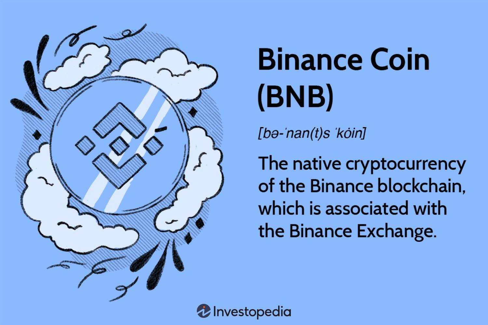

## Table of Contents

## What is Binance Coin (BNB)?

Binance Coin (BNB) is a type of cryptocurrency created by Binance, which is a popular platform for trading digital currencies. BNB started in 2017 and is used to pay for fees on the Binance exchange, like trading fees or listing fees. People can also use BNB to buy things from stores that accept it or to pay for services on other platforms that work with Binance.

Over time, BNB has grown to be used for more than just paying fees. It is now part of a bigger system called the Binance Smart Chain, which lets people create and run their own digital projects, like new cryptocurrencies or apps. BNB helps these projects work smoothly and can be used in many different ways within this system. As BNB becomes more popular, more people and businesses are finding new ways to use it.

## How was Binance Coin created?

Binance Coin (BNB) was created in 2017 by a company called Binance. They wanted to make their own cryptocurrency to use on their trading platform. To start, they did something called an Initial Coin Offering (ICO). This means they sold BNB to people who wanted to buy it before it was available everywhere. They sold a total of 100 million BNB during the ICO, and they used the money to build their exchange.

At first, BNB was based on the Ethereum blockchain, which is like a big digital record book that keeps track of all transactions. But later, Binance made their own blockchain called the Binance Chain. They moved BNB to this new blockchain to make it faster and cheaper to use. Now, BNB is also used on another blockchain they made called the Binance Smart Chain, which lets people do more things with BNB, like creating their own apps and projects.

## What are the primary uses of Binance Coin?

Binance Coin (BNB) is mainly used to pay for fees on the Binance exchange. When people trade cryptocurrencies on Binance, they can use BNB to pay for the fees that come with trading. This can save them money because Binance gives a discount if you use BNB. Besides trading fees, BNB can also be used to pay for listing fees if someone wants to add a new cryptocurrency to the Binance platform.

BNB is not just for the Binance exchange. It is also used on the Binance Smart Chain, which is like a big network where people can create and run their own digital projects. On this network, BNB helps these projects work smoothly. People can use BNB to pay for things within these projects, like using a new app or buying a new type of cryptocurrency. As BNB becomes more popular, more stores and services are starting to accept it as a way to pay for things.

## How can someone acquire Binance Coin?

Someone can acquire Binance Coin (BNB) in a few simple ways. The most common way is by buying it on a cryptocurrency exchange. Many exchanges like Binance, Coinbase, and others let you trade other cryptocurrencies like Bitcoin or Ethereum for BNB. You can also buy BNB directly with regular money like US dollars or Euros on some exchanges. 

Another way to get BNB is by earning it. Some platforms and apps that work with the Binance Smart Chain let you earn BNB by doing things like playing games, completing tasks, or helping to run the network. This is called "earning" or "staking" BNB. So, you don't always have to buy BNB; you can also earn it by participating in different activities on the Binance network.

## What is the role of Binance Coin in the Binance ecosystem?

Binance Coin (BNB) plays a big role in the Binance ecosystem. It is the main cryptocurrency used on the Binance exchange, where people trade different digital currencies. When someone wants to trade on Binance, they can use BNB to pay for the fees that come with trading. This can save them money because Binance gives a discount if you use BNB. Besides trading fees, BNB can also be used to pay for listing fees if someone wants to add a new cryptocurrency to the Binance platform.

BNB is not just for the Binance exchange. It is also used on the Binance Smart Chain, which is a network where people can create and run their own digital projects. On this network, BNB helps these projects work smoothly. People can use BNB to pay for things within these projects, like using a new app or buying a new type of cryptocurrency. As BNB becomes more popular, more stores and services are starting to accept it as a way to pay for things, making it a useful part of the whole Binance ecosystem.

## How does Binance Coin facilitate transactions on the Binance exchange?

Binance Coin (BNB) helps people save money when they trade on the Binance exchange. When someone wants to trade one cryptocurrency for another, they have to pay a fee. If they use BNB to pay this fee, they get a discount. This makes trading cheaper for them. So, BNB is like a special coin that makes trading on Binance less expensive.

Besides saving money on trading fees, BNB can also be used for other things on the Binance exchange. For example, if someone wants to add a new cryptocurrency to the platform, they can pay the listing fee with BNB. This makes BNB useful not just for trading but also for growing the exchange. By using BNB, people can do more things on Binance in a cheaper way.

## What are the benefits of using Binance Coin for trading fees?

Using Binance Coin (BNB) for trading fees on the Binance exchange can save you money. When you trade one cryptocurrency for another, you have to pay a fee. If you use BNB to pay this fee, you get a discount. This means you spend less money every time you trade. Over time, these savings can add up, making it cheaper for you to trade on Binance.

Another benefit is that using BNB for fees helps you stay involved in the Binance ecosystem. BNB is not just for trading fees; it's also used on the Binance Smart Chain, where people create and run their own digital projects. By using BNB, you can be part of this bigger network and maybe even earn more BNB by participating in different activities. So, using BNB for fees is not just about saving money; it's also about being part of a growing community.

## How has the support for Binance Coin evolved over time?

When Binance Coin (BNB) first started in 2017, it was mainly used for paying fees on the Binance exchange. People could use BNB to get a discount on trading fees, which made trading cheaper. At that time, BNB was based on the Ethereum blockchain. But as more people started using BNB, Binance made their own blockchain called the Binance Chain. This made using BNB faster and cheaper because it didn't have to rely on Ethereum anymore.

Over time, the support for BNB grew a lot. Binance created another blockchain called the Binance Smart Chain, which lets people do more things with BNB. Now, BNB is not just for paying fees on the exchange; it's also used to run apps and projects on the Binance Smart Chain. More stores and services are starting to accept BNB as a way to pay for things. This means BNB is becoming more useful and popular, with a bigger community of people using it in different ways.

## What are some of the major partnerships or integrations involving Binance Coin?

Binance Coin (BNB) has formed many important partnerships and integrations over time. One big partnership is with Paxos, a company that helps with stablecoins. Together, they created Binance USD (BUSD), which is a stablecoin that uses BNB. This makes BNB more useful because people can use it to buy and trade BUSD easily. Another important partnership is with Trust Wallet, a mobile wallet that lets people store and use different cryptocurrencies. Trust Wallet added support for BNB, making it easier for people to use BNB on their phones.

BNB has also been integrated into many different services and platforms. For example, it is used on the Binance Smart Chain, where people can create and run their own projects. This means more apps and services are starting to accept BNB as a way to pay for things. Also, some big stores and services like travel booking sites and online shops now accept BNB. This makes BNB more popular and useful because people can use it in more places.

## How is the market capitalization of Binance Coin calculated?

The market capitalization of Binance Coin (BNB) is calculated by taking the total number of BNB coins that exist and multiplying it by the current price of one BNB coin. For example, if there are 100 million BNB coins and each one is worth $10, then the market cap would be 100 million times $10, which equals $1 billion. This number helps people understand how big and valuable BNB is compared to other cryptocurrencies.

Market cap is important because it shows the total value of all the BNB coins together. It can change every day because the price of BNB can go up or down. If more people want to buy BNB and the price goes up, the market cap will get bigger. If fewer people want to buy BNB and the price goes down, the market cap will get smaller. This helps people see how BNB is doing in the market and how it compares to other cryptocurrencies.

## What factors influence the market capitalization of Binance Coin?

The market capitalization of Binance Coin (BNB) is influenced by many things. One big factor is how much people want to buy BNB. If more people want to buy it, the price goes up, and so does the market cap. Another factor is how BNB is used. If more stores and services start accepting BNB, more people might want to buy it, which can make the price and market cap go up. Also, news about Binance and BNB can affect the market cap. Good news, like new partnerships or features, can make people more excited about BNB and increase its value.

Another thing that can change the market cap of BNB is the overall market for cryptocurrencies. If the whole crypto market is doing well, BNB might do well too. But if the market is not doing well, BNB's price and market cap might go down. The number of BNB coins that exist also matters. If Binance decides to burn some BNB, which means they take some coins out of circulation, this can make the remaining coins more valuable and increase the market cap. All these factors together decide how big BNB's market cap is at any time.

## How does Binance Coin's market capitalization compare to other major cryptocurrencies?

Binance Coin (BNB) is one of the biggest cryptocurrencies out there, but it's not as big as Bitcoin or Ethereum. Bitcoin is usually the biggest, with a market cap that can be many times larger than BNB's. Ethereum is often the second biggest, and its market cap is also bigger than BNB's. But BNB is still important and can be in the top 10 cryptocurrencies by market cap, depending on the day.

The market cap of BNB can change a lot because it depends on how much people want to buy it and what's happening in the crypto market. Sometimes, BNB's market cap can get closer to Ethereum's if BNB is doing really well. But most of the time, BNB's market cap is smaller than Bitcoin's and Ethereum's. Still, BNB is a big player in the crypto world and keeps growing as more people and businesses use it.

## What are the dynamics of market capitalization?

Market capitalization, commonly referred to as market cap, is a crucial metric in cryptocurrency valuation. It is calculated by multiplying the total supply of a cryptocurrency by its current price per unit. The formula can be expressed as:

$$
\text{Market Capitalization} = \text{Total Supply} \times \text{Price Per Unit}
$$

For Binance Coin (BNB), market cap serves as an indicator of its overall value in the crypto market, offering insights into its relative size compared to other cryptocurrencies.

**Factors Influencing Market Cap**

Several factors affect the market cap of cryptocurrencies like BNB:

1. **Supply and Demand Dynamics**: The availability of BNB (its total and circulating supply) and the market demand for it significantly influence its price and, consequently, its market cap.

2. **Market Sentiment**: Investor perception, driven by news, partnerships, regulatory updates, and market trends, can impact BNB's price. Positive sentiment typically pushes prices upward, increasing market cap.

3. **Technological Developments**: Innovations within the Binance ecosystem or improvements in the Binance Smart Chain can enhance BNB's appeal, affecting its demand and market cap.

4. **Regulatory Environment**: Regulatory decisions can either bolster confidence in BNB and its associated platforms or deter investors, thereby impacting its market cap.

**Investor Perceptions and Trading Strategies**

Market cap plays a crucial role in shaping investor perceptions. Higher market capitalization often signifies stability and acceptance, attracting institutional and retail investors seeking lower-risk investments. As such, BNB's market cap can influence trading strategies in several ways:

- **Risk Assessment**: Investors often view cryptocurrencies with higher market caps as safer bets, potentially leading to increased adoption of BNB by risk-averse traders.

- **Portfolio Diversification**: Traders seeking a balanced portfolio might consider BNB due to its significant market presence, influencing allocation strategies.

- **Trend Following**: A growing market cap could trigger momentum-based trading strategies, where traders buy into an asset experiencing upward price trends.

**Recent Trends in BNB's Market Capitalization**

BNB has witnessed considerable fluctuations in its market capitalization, affected by the broader trends in the cryptocurrency market and specific developments within the Binance ecosystem. Recent events that have influenced BNB's market cap include:

- **DeFi and NFT Integration**: The integration of decentralized finance (DeFi) applications and non-fungible tokens (NFTs) within the Binance Smart Chain has fueled interest in BNB, driving demand and impacting market cap.

- **Exchange Performance**: As the native cryptocurrency of the Binance exchange, BNB's market cap is closely tied to the platform's performance and user base growth.

- **Regulatory Scrutiny**: Regulatory challenges faced by Binance in various jurisdictions have affected investor sentiment, temporarily impacting BNB's valuation and market cap.

Understanding these dynamics allows traders and investors to make informed decisions regarding their BNB investments, adapting their strategies to align with shifting market cap trends.

 to Algorithmic Trading

Algorithmic trading, often referred to as algo trading, is the use of computer algorithms to execute trading orders at high speed and frequency, thereby replacing the need for manual trading. These algorithms leverage mathematical models to decide the timing, price, and quantity of orders with minimal human intervention, making them a vital tool in modern financial markets. Initially popularized in traditional stock markets, [algorithmic trading](/wiki/algorithmic-trading) has been adopted widely in various asset classes, including commodities, [forex](/wiki/forex-system), and notably, cryptocurrencies.

The rise of algorithmic trading in the cryptocurrency sphere has been driven by the unique characteristics of digital assets: high [volatility](/wiki/volatility-trading-strategies), 24/7 market access, and the significant role of exchanges like Binance. In the crypto market, speed and efficiency are paramount, as prices can exhibit rapid fluctuations within seconds. Consequently, algorithms that can analyze market data and execute trades instantly offer a competitive edge over manual trading methods.

Several types of algorithms are employed in crypto trading, each designed for specific strategies. Common algorithms include:

1. **Market Making**: This involves placing both buy and sell limit orders for a particular cryptocurrency. The algorithm aims to profit from the bid-ask spread by quickly adjusting orders in response to market changes.

2. **Arbitrage**: Arbitrage algorithms exploit price discrepancies of the same asset across different exchanges. By buying low on one exchange and selling high on another, traders can lock in risk-free profits.

3. **Trend Following**: These algorithms identify potential breakouts or trends by analyzing past price movements and market data. They often utilize indicators like moving averages to predict future price directions.

4. **Mean Reversion**: This strategy assumes that the price of an asset will return to its mean or average over time. Algorithms identify overbought or oversold conditions and initiate trades anticipating a reversion to the mean.

While algorithmic trading offers numerous benefits, it also presents distinct challenges, particularly in the volatile cryptocurrency markets. The primary advantages include increased execution speed, reduced transaction costs, and minimization of emotional biases in trading decisions. Algorithms can process data and execute trades across multiple markets simultaneously, an effectual strategy in the round-the-clock crypto market.

However, the fast-paced nature of crypto markets introduces challenges such as ensuring reliable data feeds, managing latency, and handling the complexities of market manipulation. Volatile markets can trigger substantial price swings, potentially leading to significant slippage or unintended trade executions when using poorly designed algorithms. Additionally, excessive reliance on algorithmic trading can exacerbate market volatility, as was evident in several "flash crashes" in both crypto and traditional markets.

In summary, algorithmic trading has established itself as a cornerstone of modern trading methodologies, particularly suited to the dynamic nature of cryptocurrency markets. As the technology and infrastructure continue to improve, the utilization and sophistication of trading algorithms are expected to grow, bringing about more efficient markets while simultaneously presenting new challenges to traders and regulators alike.

## What is the impact of market cap on algorithmic trading?

Changes in Binance Coin's (BNB) market capitalization can significantly influence algorithmic trading strategies, impacting how traders perceive liquidity and manage risk. Binance Coin, as the native token of the Binance ecosystem, plays a crucial role in a wide range of applications, and its market cap serves as a key metric in assessing its market stature and attractiveness to traders.

### Changes in BNB's Market Cap and Algorithmic Trading Decisions

Market capitalization is calculated as the product of the total circulating supply of a cryptocurrency and its current price: 

$$
\text{Market Capitalization} = \text{Circulating Supply} \times \text{Price}
$$

For algorithmic traders, fluctuations in BNB's market cap can signal shifts in liquidity and volatility, which are critical when devising automated trading strategies. A higher market cap typically implies higher liquidity, which means more efficient price discovery and lower transaction costs. Conversely, a declining market cap could indicate reduced liquidity, potentially increasing slippage and affecting trade execution.

Algorithmic traders often use indicators such as market depth and spread to gauge liquidity. In Python, a simple script might use APIs to continuously monitor BNB's market data, adjusting algorithms in real-time:

```python
import requests

def get_market_data(symbol):
    url = f'https://api.binance.com/api/v3/depth?symbol={symbol}'
    response = requests.get(url)
    return response.json()

def evaluate_liquidity(market_depth):
    asks = market_depth['asks']
    bids = market_depth['bids']
    spread = float(asks[0][0]) - float(bids[0][0])
    return spread

bnc_market_depth = get_market_data('BNBUSDT')
spread = evaluate_liquidity(bnc_market_depth)

print(f"The current spread is: {spread}")
```

### Evaluating Liquidity and Risk Factors

Liquidity is vital for the execution of algorithmic trades. High liquidity suggests that a cryptocurrency can be bought or sold with minimal impact on its price. BNB's market cap provides insight into its liquidity; larger capitalizations often correlate with higher trading volumes and deeper markets. In contrast, if the market cap falls, traders must consider the potential for increased price impact, where large trades could significantly move the market price.

Risk management is equally important. A decrease in market cap might signal increased price volatility, necessitating the recalibration of trading algorithms to mitigate potential losses. Algorithmic trading systems can incorporate risk metrics such as Value at Risk (VaR) to evaluate potential losses in the context of BNB's market cap changes.

### Adaptive Strategies for Market Cap Fluctuations

Algorithmic traders often employ adaptive strategies to navigate market cap fluctuations. These strategies can include dynamically adjusting order sizes, modifying stop-loss thresholds, or altering trade frequencies. For instance, during periods of low market cap and high volatility, algorithms might reduce trade volumes to minimize exposure.

Python can facilitate real-time adjustments by implementing machine learning models that predict market conditions:

```python
from sklearn.linear_model import LinearRegression
import numpy as np

# Sample features and labels for training
features = np.array([[100, 200], [200, 400], [300, 600]])
labels = np.array([10, 20, 30])

# Train a simple model
model = LinearRegression().fit(features, labels)

# Predict market condition based on current market cap and price
predicted_condition = model.predict(np.array([[150, 300]]))

print(f"Predicted market condition: {predicted_condition}")
```

### Future Trends in Market Cap and Trading Algorithms

The interplay between BNB's market cap and algorithmic trading strategies is likely to evolve as the cryptocurrency market matures. The increasing sophistication of algorithms and the integration of big data and [artificial intelligence](/wiki/ai-artificial-intelligence) will enhance the capacity to process large volumes of information and execute complex trading strategies.

As regulatory frameworks develop and more institutional players enter the market, algorithmic trading based on market cap fluctuations will become more prevalent. Future trends may also see the incorporation of [alternative data](/wiki/best-alternative-data) sources, such as social media sentiment, to adjust trading strategies in real-time.

In conclusion, the impact of BNB's market cap on algorithmic trading decisions is profound, influencing liquidity assessment, risk management, and adaptive strategy formation. As both the cryptocurrency market and trading technologies continue to advance, understanding these dynamics will be essential for optimizing trade effectiveness and capitalizing on market opportunities.

## References & Further Reading

[1]: Binance. "Whitepaper: Binance Coin", 2017.

[2]: DeFi Pulse. "The Growing Influence of Binance Smart Chain in DeFi", 2022.

[3]: Lopez de Prado, M. (2018). ["Advances in Financial Machine Learning."](https://www.amazon.com/Advances-Financial-Machine-Learning-Marcos/dp/1119482089) Wiley.

[4]: Chan, E. P. (2008). ["Quantitative Trading: How to Build Your Own Algorithmic Trading Business."](https://github.com/ftvision/quant_trading_echan_book) Wiley.

[5]: Jansen, S. (2020). ["Machine Learning for Algorithmic Trading."](https://github.com/stefan-jansen/machine-learning-for-trading) Packt Publishing.