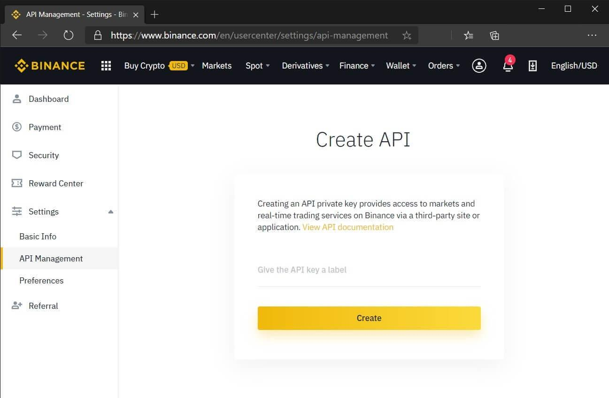

## Table of Contents

## What is the Binance API and why is it useful for traders?

The Binance API is a tool that lets computer programs talk to the Binance cryptocurrency exchange. It helps traders and developers build their own trading tools and connect to Binance's trading system. With the API, you can do things like check prices, make trades, and look at your account information without having to use the Binance website or app.

This API is useful for traders because it lets them automate their trading strategies. Instead of watching the market all the time and making trades by hand, traders can write programs that do this for them. This can save time and help them trade more quickly and accurately. Also, the API gives traders more control over their trading, letting them create custom tools that fit their needs.

## How do you set up a Binance account and obtain API keys?

To set up a Binance account, go to the Binance website and click on the "Register" button. You'll need to enter your email address and create a strong password. After that, you'll get an email to verify your account. Click on the link in the email to finish the registration. Once your account is set up, you should enable two-factor authentication (2FA) for added security. You can do this by downloading an authenticator app on your phone and following the instructions on the Binance website.

To get API keys for your Binance account, log in to your account and go to the "API Management" section. Click on "Create API" and give your key a name that helps you remember what it's for. You'll need to enter your 2FA code to create the key. After you create it, you'll see an API Key and a Secret Key. Make sure to copy and save these keys in a safe place because you won't be able to see the Secret Key again. Use these keys in your trading programs to connect to Binance and start using the API.

## What are the basic steps to install and configure the Binance Python library?

To install the Binance Python library, you first need to make sure you have Python installed on your computer. If you do, open a command prompt or terminal window and type `pip install python-binance`. This command will download and install the library for you. Once it's done, you can start using it in your Python programs.

To configure the Binance Python library, you need to set up your API keys. Open your Python script and import the library with `from binance.client import Client`. Then, create a new Client object and pass your API key and secret key as arguments like this: `client = Client(api_key='your_api_key', api_secret='your_secret_key')`. Make sure to replace 'your_api_key' and 'your_secret_key' with the actual keys you got from Binance. Now you're ready to use the library to interact with the Binance exchange.

## How can you use the Binance API to fetch current market data?

To fetch current market data using the Binance API, you first need to set up the Binance Python library and your API keys. Once you have done that, you can use the `get_symbol_ticker` function to get the latest price of a specific [cryptocurrency](/wiki/cryptocurrency) pair. For example, if you want to check the price of Bitcoin against USDT, you would use `price = client.get_symbol_ticker(symbol='BTCUSDT')`. This will give you a dictionary with the symbol and the current price.

After you get the price, you can print it or use it in your trading program. The API also lets you fetch other types of market data, like the [order book](/wiki/order-book-trading-strategies) or recent trades. To get the order book, you can use `order_book = client.get_order_book(symbol='BTCUSDT')`, which will give you information about the current buy and sell orders. For recent trades, you can use `trades = client.get_recent_trades(symbol='BTCUSDT')`. These functions help you keep track of what's happening in the market and make better trading decisions.

## What are the different types of orders you can place using the Binance API?

When you use the Binance API, you can place different types of orders to buy or sell cryptocurrencies. The most common type is a market order, which lets you buy or sell right away at the current market price. If you want to buy Bitcoin with USDT, you can use a market order to get it quickly. Another type is a limit order, which lets you set a specific price at which you want to buy or sell. For example, if you think Bitcoin will drop to $20,000 before going up again, you can set a limit order to buy it at that price.

There are also more advanced types of orders you can use. A stop-loss order helps you limit your losses by selling a cryptocurrency if its price drops to a certain level. For instance, if you bought Bitcoin at $30,000 and want to sell it if it drops to $25,000, you can set a stop-loss order at $25,000. Another type is a take-profit order, which automatically sells your cryptocurrency when it reaches a higher price you set, helping you lock in profits. If you bought Bitcoin at $30,000 and want to sell it when it reaches $35,000, you can set a take-profit order at that price. These different order types give you more control over your trading strategy.

## How do you implement a simple trading bot using the Binance API in Python?

To make a simple trading bot using the Binance API in Python, you first need to set up your Binance account and get your API keys. Once you have your keys, install the Binance Python library by typing `pip install python-binance` in your command prompt or terminal. After installing the library, you can start writing your trading bot code. Begin by importing the library and creating a client with your API keys. Then, decide on a simple trading strategy, like buying a cryptocurrency when its price goes down and selling it when it goes up.

For example, let's say you want to trade Bitcoin against USDT. You can use the `get_symbol_ticker` function to check the current price of BTCUSDT. If the price is lower than a certain amount you set, your bot can place a market order to buy Bitcoin using the `order_market_buy` function. Once you own Bitcoin, you can keep checking its price. If the price goes above another amount you set, your bot can use the `order_market_sell` function to sell the Bitcoin and make a profit. This simple bot can help you automate your trading and save time, but remember to always be careful and test your bot in a safe way before using real money.

## What are the best practices for managing API rate limits and avoiding account bans?

When you use the Binance API a lot, you need to be careful about how many times you ask for information or make trades. Binance has rules about how often you can do these things, called rate limits. If you ask for too much data or make too many trades in a short time, you might get blocked from using the API for a while. To avoid this, you should add small waits, called delays, between your API requests. This gives the system time to handle your requests without getting overwhelmed. Also, it's a good idea to check the rate limits before you start using the API a lot, so you know how much you can do without getting into trouble.

Another important thing to remember is to keep your trading activity looking normal. If you make a lot of trades very quickly or if your trades follow a strange pattern, Binance might think you're doing something wrong and could ban your account. To prevent this, try to make your trading bot act like a person would. Don't make trades too often, and try to mix up the times and sizes of your trades. It's also a good idea to keep an eye on your account and make sure you're not breaking any of Binance's rules. By being careful and following these tips, you can use the Binance API safely and keep your account in good standing.

## How can you use the Binance API to analyze historical data and backtest trading strategies?

To analyze historical data and backtest trading strategies using the Binance API, you first need to fetch the historical data. You can do this by using the `get_historical_klines` function from the Binance Python library. This function lets you get data about how the price of a cryptocurrency changed over time. You can choose the time frame you want, like one minute, one hour, or one day. Once you have this data, you can save it and use it to see how your trading strategy would have worked in the past.

After you get the historical data, you can write a program to test your trading strategy. This means you go through the data step by step, pretending to buy and sell based on your rules. For example, if your strategy is to buy when the price goes down and sell when it goes up, you can check each piece of data to see if it meets your buying or selling conditions. By doing this, you can see if your strategy would have made money or lost money in the past. This helps you figure out if your strategy is good before you use real money.

## What advanced features does the Binance API offer for professional traders?

The Binance API has some special features that can help professional traders do their work better. One cool thing is that you can use the API to watch the market in real time. This means you can get updates about prices and trades as they happen, which can help you make quick decisions. Another useful feature is that the API lets you trade with something called margin. This means you can borrow money to make bigger trades, which can lead to bigger profits but also bigger risks. The API also supports futures trading, where you can bet on what the price of a cryptocurrency will be in the future. This can be a good way to make money if you're good at guessing where prices are going.

Another advanced feature is the ability to use something called WebSocket. This lets your trading program stay connected to the Binance server all the time, so you can get information even faster than with regular API calls. Professional traders can also use the API to set up something called OCO (One Cancels the Other) orders. This means you can place two orders at the same time, and if one order gets filled, the other one gets canceled automatically. This can help you manage your risk better. Overall, these advanced features give professional traders more tools to work with, helping them trade smarter and more efficiently.

## How do you integrate Binance API with other financial data sources for enhanced analysis?

To make your trading better, you can mix the Binance API with other financial data sources. This means you can get information from different places and use it all together to understand the market better. For example, you might use the Binance API to get the latest prices and trading data for cryptocurrencies. Then, you can add data from other sources, like stock market information or economic news, to see how these things might affect the prices of cryptocurrencies. By putting all this information together, you can see patterns and make better guesses about where prices might go next.

To do this, you need to write a program that can talk to the Binance API and also get data from other places. You can use tools like APIs from stock exchanges or financial news websites to get this extra data. Once you have all the data, you can save it in a way that makes it easy to use, like in a database. Then, you can write code to look at all the data together and find out how different things are connected. This can help you come up with better trading strategies and make smarter decisions when you trade.

## What are common pitfalls and how can you troubleshoot issues when using the Binance API?

When using the Binance API, one common problem is hitting the rate limits. This happens when you ask for too much data or make too many trades in a short time. Binance has rules about how often you can do these things, and if you break them, you might get blocked from using the API for a while. To avoid this, you can add small waits between your requests and keep an eye on how often you're using the API. Another issue is making sure your API keys are safe. If someone else gets your keys, they could use them to trade with your account. Always keep your keys secret and never share them with anyone.

Another pitfall is dealing with errors in your code. Sometimes, the API might not work the way you expect, and you'll get error messages. When this happens, you need to read the error messages carefully to understand what went wrong. You can also check the Binance API documentation for more information about the errors and how to fix them. It's a good idea to test your code in a safe way before using real money, so you can find and fix any problems without losing money. By being careful and paying attention to these common issues, you can use the Binance API more smoothly and safely.

## How can you secure your API interactions and protect your trading account from unauthorized access?

To keep your trading account safe when using the Binance API, you need to make sure your API keys are secure. Never share your API keys with anyone, and always keep them in a safe place. It's a good idea to use strong, unique passwords for your Binance account and enable two-factor authentication (2FA). This means you'll need a special code from your phone to log in, making it much harder for someone else to get into your account. Also, be careful about where you store your API keys in your code. Don't put them directly in your code where others might see them; instead, use a secure way to keep them separate.

Another important thing to do is to keep an eye on your account activity. Binance lets you see a list of all the times someone used your API keys. Check this list often to make sure there's nothing strange going on. If you see something you don't recognize, you can quickly change your API keys or even delete them to stop anyone else from using them. Also, try to use the Binance API in a way that looks normal. Don't make too many trades or requests too quickly, because this might make Binance think your account is being used in a bad way. By being careful and following these tips, you can help keep your trading account safe from people who shouldn't be using it.

## How to set up your algorithmic trading environment with Python?

To set up an [algorithmic trading](/wiki/algorithmic-trading) environment with Python, begin by ensuring you have the necessary software and tools to seamlessly interact with Binance, a leading cryptocurrency exchange. This section outlines a step-by-step guide on installing Python, the required libraries, establishing API connectivity through the binance-python library, and securing your environment using API keys.

### Necessary Software and Tools

To kick-start algorithmic trading with Python, you need the following components:

1. **Python**: Python is a versatile language, widely used in algorithmic trading for its simplicity and powerful libraries. Ensure you have Python 3.x installed. You can download it from the [official Python website](https://www.python.org/downloads/).

2. **pip**: Python’s package manager, pip, is essential for installing and managing libraries. It usually comes installed with Python.

3. **Required Libraries**: Essential libraries for data analysis and trading include:
   - `pandas` for data manipulation
   - `numpy` for numerical operations
   - `matplotlib` for plotting data
   - `binance-python` (also known as `python-binance`) to interact with the Binance API

### Installing Python and Required Libraries

To set up Python and the necessary libraries:

1. **Install Python**: Follow the installation guide on the Python website to download the appropriate version for your operating system.

2. **Verify Installation**:
   ```bash
   python --version
   pip --version
   ```

3. **Install Required Libraries**:
   ```bash
   pip install pandas numpy matplotlib python-binance
   ```

### Setting up the binance-python Library and Establishing API Connectivity

The binance-python library, known as `python-binance`, is crucial for interacting with the Binance API. Follow the steps below to set it up:

1. **Installation**:
   ```bash
   pip install python-binance
   ```

2. **Connecting to Binance API**:
   To connect, you need API keys obtained from Binance. These keys are your credentials to access the trading capabilities.

   - **Create API keys**: Log in to your Binance account, navigate to the API Management section, and create a new API key. Configure necessary permissions, such as enabling spot trading and withdrawal if required.

   - **Secure API Key Handling**: It is crucial to store API keys securely. Avoid hardcoding them into scripts. Instead, consider using environment variables or configuration files.

   Example configuration file (.env):
   ```
   BINANCE_API_KEY=your_api_key
   BINANCE_SECRET_KEY=your_secret_key
   ```

   Example code for loading API keys:
   ```python
   import os
   from binance.client import Client
   from dotenv import load_dotenv

   load_dotenv()  # Load .env file
   api_key = os.getenv('BINANCE_API_KEY')
   api_secret = os.getenv('BINANCE_SECRET_KEY')

   client = Client(api_key, api_secret)
   ```

### Understanding API Keys and Securing Your Trading Environment

API keys are sensitive credentials that authorize trading activities. Adopting best practices for secure management is paramount.

1. **Key Permissions**: Adjust permissions to limit the risk if credentials are compromised. Only allow necessary permissions.

2. **Encryption and Environment Variables**: Use encryption methods to store keys and load them securely through environment variables, ensuring they are not exposed in the source code.

3. **Regular Key Rotation**: Change API keys periodically and update your trading scripts accordingly to mitigate security risks.

By following these steps, you'll establish a robust environment for algorithmic trading using Python and the binance-python library, paving the way for developing and executing trading strategies securely.

## How t build an Algorithmic Trading Strategy?

An algorithmic trading strategy is a structured set of rules that defines the conditions under which trades are initiated and executed in the financial markets. It involves various components, each playing a crucial role in automating the trading process and ensuring its efficacy.

**Key Components**

1. **Market Data Retrieval**: Accessing real-time market data is imperative for evaluating trading conditions and executing strategies efficiently. With binance-python, traders can easily set up market data retrieval by selecting trading pairs and accessing historical and live data. This library provides access to Binance’s extensive market data, including price feeds, trading volumes, and order book information.

2. **Technical Indicators and Analysis**: Technical indicators are mathematical calculations based on historical price, volume, or open interest information that help traders make informed decisions. Popular indicators include moving averages, relative strength index (RSI), and Bollinger Bands. By leveraging these indicators, traders can identify trends, momentum, and volatility, essential for developing effective strategies.

3. **Strategy Development**: The core of algorithmic trading lies in strategy development, which entails defining the specific conditions for trade entry and exit. A simple example could involve using a moving average crossover strategy, where a buy signal occurs when a short-term moving average crosses above a long-term moving average, while a sell signal occurs when the opposite happens.

**Example of a Simple Trading Algorithm Using binance-python**

Below is a basic Python example using binance-python to implement a simple moving average crossover strategy:

```python
from binance.client import Client
import numpy as np

# Initialize the client
api_key = 'your_api_key'
api_secret = 'your_api_secret'
client = Client(api_key, api_secret)

# Function to retrieve historical klines for a trading pair
def get_historical_klines(symbol, interval, lookback):
    klines = client.get_historical_klines(symbol, interval, lookback)
    closes = [float(kline[4]) for kline in klines]
    return np.array(closes)

# Calculate moving averages
def calculate_moving_averages(closes, short_window, long_window):
    short_mavg = np.mean(closes[-short_window:])
    long_mavg = np.mean(closes[-long_window:])
    return short_mavg, long_mavg

# Implementation of the moving average crossover strategy
def moving_average_crossover(symbol, interval, short_window=10, long_window=30):
    closes = get_historical_klines(symbol, interval, '1 month ago UTC')
    short_mavg, long_mavg = calculate_moving_averages(closes, short_window, long_window)

    if short_mavg > long_mavg:
        print("Buy Signal")
        # Place a buy order logic here
    elif short_mavg < long_mavg:
        print("Sell Signal")
        # Place a sell order logic here

# Example for BTCUSDT trading pair
moving_average_crossover('BTCUSDT', Client.KLINE_INTERVAL_1DAY)
```

This example illustrates how to use binance-python to fetch market data for the BTC/USDT pair, calculate short-term and long-term moving averages, and generate buy or sell signals. Proper execution requires integrating these components with robust error handling, risk management, and [backtesting](/wiki/backtesting) to ensure the strategy's viability in real-world scenarios.

By systematically developing and refining these components, traders can build effective algorithmic trading strategies capable of operating autonomously while adapting to dynamic market conditions.

## How to execute trades with binance-python?

Binance offers a variety of order types to cater to different trading strategies and goals, each serving a specific purpose within the trading ecosystem. The primary order types available are market orders, limit orders, stop-limit orders, and OCO (One-Cancels-the-Other) orders.

**Market Orders**: These are executed immediately at the current market price. They are useful when swift execution is more important than price control. Traders should note that market orders may experience slippage, especially in volatile markets.

**Limit Orders**: These orders set a specific price at which to buy or sell and are only executed when the market reaches that price. Limit orders provide control over the execution price but may not fill if the market does not reach the specified level.

**Stop-Limit Orders**: Combining stop and limit orders, this type triggers a limit order once a specified stop price is reached. It is particularly useful for protecting profits or minimizing losses.

**OCO Orders**: These allow users to place two orders simultaneously, with the execution of one canceling the other. For example, a trader may place a stop-limit order and a limit order, allowing them to plan for both upward and downward market movements.

### Placing Orders Using binance-python

The **binance-python** library provides a straightforward way to interact with Binance's trading API, allowing for programmatically placing trades with a few lines of code.

To place a market order using binance-python, the following code snippet can be used:

```python
from binance.client import Client

client = Client(api_key='your_api_key', api_secret='your_api_secret')

# Place a market buy order
order = client.order_market_buy(
    symbol='BTCUSDT',
    quantity=0.001
)
```

Similarly, a limit order can be placed as follows:

```python
# Place a limit sell order
order = client.order_limit_sell(
    symbol='BTCUSDT',
    quantity=0.001,
    price='50000'
)
```

### Real-time Trading and Latency Considerations

Real-time trading demands addressing latency, as delays can impact execution prices and lead to suboptimal trades. Effective coding practices, such as optimizing algorithm efficiency, and choosing servers geographically closer to Binance's servers, can help mitigate latency issues. 

Additionally, monitoring network connectivity and implementing retries for failed API requests can ensure better reliability in trade execution.

### Managing and Monitoring Trades

Effective trade management necessitates continuous monitoring of open orders and account balances. The binance-python library facilitates this with functions that fetch account data and order statuses, allowing traders to dynamically adjust their strategies based on real-time information.

Here is a simple example of checking open orders:

```python
# Get all open orders
open_orders = client.get_open_orders(symbol='BTCUSDT')

# Monitor and manage trades
for order in open_orders:
    print(order)
```

Regularly checking trades and adjusting strategies or parameters based on current market conditions is crucial for maintaining profitability and managing risk effectively. Implementing alerts or notifications for specific trading events can also enhance trade management by promptly informing traders of critical changes.

## How to test and optimize trading strategies?

Backtesting is a fundamental step in the development of algorithmic trading strategies. It involves testing a trading strategy on historical data to evaluate its performance and viability before implementing it in a live trading environment. This process serves as a risk management and optimization tool, providing insight into potential profitability and drawing attention to the weaknesses and strengths of the strategy. By simulating trades over past data, traders can identify trends, patterns, and market behaviors that might influence the strategy's future performance.

**Methods for Simulating Trades and Performance Evaluation**

To simulate trades, one must first acquire historical data, which serves as the foundation for backtesting. The simulation involves executing trades as specified by the strategy's logic, using past price data to feed the decision-making algorithms. During this process, it's imperative to account for factors such as transaction costs, slippage, and market [liquidity](/wiki/liquidity-risk-premium), which can significantly affect performance outcomes.

Performance evaluation metrics include metrics such as the Sharpe ratio, maximum drawdown, and profit [factor](/wiki/factor-investing), among others. These metrics provide a quantifiable means to assess the returns relative to the risk taken. A well-backtested strategy should demonstrate consistent performance across different market conditions and time periods.

**Tools and Libraries for Backtesting Strategies**

Python offers several libraries that facilitate backtesting. The use of these libraries simplifies the process of importing historical data, executing trades, and analyzing results:

1. **Backtrader**: A versatile backtesting library that supports strategy testing, optimization, and visualization. It allows for the incorporation of indicators, analyzers, and data feeds with ease.

   ```python
   import backtrader as bt

   class MyStrategy(bt.Strategy):
       def __init__(self):
           self.sma = bt.indicators.SimpleMovingAverage(self.data, period=15)

       def next(self):
           if not self.position:
               if self.data.close[0] > self.sma[0]:
                   self.buy()
           else:
               if self.data.close[0] < self.sma[0]:
                   self.sell()
   ```

2. **Zipline**: Developed by Quantopian, Zipline is a higher-level backtesting library that integrates with the Quandl data provider and supports automatic calculation of statistics and performance metrics.

3. **PyAlgoTrade**: This is another popular choice for developing trading strategies in a straightforward manner. It includes functionalities for plotting, event-driven backtesting, and technical indicators.

**Optimization Techniques to Enhance Strategy Performance**

Once backtesting reveals a strategy's baseline performance, optimization tools and techniques are employed to refine it further. Optimization involves adjusting the strategy's parameters to identify configurations that yield the best results. Techniques such as grid search and genetic algorithms are commonly used in this process.

- **Grid Search**: This technique systematically explores a range of parameter values and measures the performance across different combinations. While exhaustive, it may become computationally expensive with numerous parameters.

- **Genetic Algorithms**: Inspired by the process of natural selection, genetic algorithms iteratively adjust parameters to evolve toward a set of optimal values. They offer a more efficient means for optimizing complex strategies by exploring the parameter space intelligently.

The optimization process helps in fine-tuning a strategy for better adaptability and performance across various market conditions. However, it is crucial to avoid overfitting, where a strategy becomes overly tailored to historical data and performs poorly on unseen data. Validation on out-of-sample data is recommended to ensure robustness.

In conclusion, backtesting and optimization are essential practices for the successful deployment of algorithmic trading strategies. By leveraging sophisticated tools and conducting thorough performance evaluations, traders can enhance their strategies, ensuring they are robust, profitable, and aligned with their risk tolerance and market understanding.


## References & Further Reading

[1]: Bergstra, J., Bardenet, R., Bengio, Y., & Kégl, B. (2011). ["Algorithms for Hyper-Parameter Optimization."](https://papers.nips.cc/paper/4443-algorithms-for-hyper-parameter-optimization) Advances in Neural Information Processing Systems 24.

[2]: ["Advances in Financial Machine Learning"](https://www.amazon.com/Advances-Financial-Machine-Learning-Marcos/dp/1119482089) by Marcos Lopez de Prado

[3]: ["Evidence-Based Technical Analysis: Applying the Scientific Method and Statistical Inference to Trading Signals"](https://www.amazon.com/Evidence-Based-Technical-Analysis-Scientific-Statistical/dp/0470008741) by David Aronson

[4]: ["Machine Learning for Algorithmic Trading"](https://github.com/stefan-jansen/machine-learning-for-trading) by Stefan Jansen

[5]: ["Quantitative Trading: How to Build Your Own Algorithmic Trading Business"](https://books.google.com/books/about/Quantitative_Trading.html?id=j70yEAAAQBAJ) by Ernest P. Chan