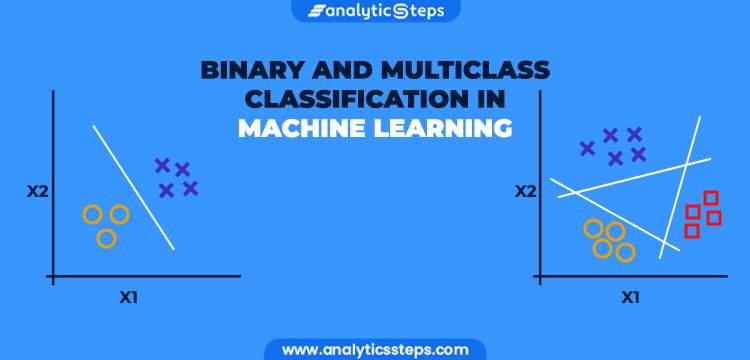

## Table of Contents

## What is binary classification in machine learning?

Binary classification in machine learning is a type of supervised learning where the goal is to categorize data into one of two groups. For example, it can be used to decide if an email is spam or not, or if a tumor is malignant or benign. The algorithm learns from examples where the correct answer is known, and then it uses that knowledge to make predictions on new, unseen data.

The process involves training a model on a dataset that includes features and corresponding labels. These labels are binary, meaning they can only be one of two values, often represented as 0 and 1. During training, the model adjusts its internal parameters to better predict the correct label for each example. Once trained, the model can then be used to classify new data points into one of the two categories.

Common algorithms used for binary classification include logistic regression, support vector machines, and decision trees. Logistic regression, for instance, uses a sigmoid function to output probabilities between 0 and 1, which can then be thresholded to make a binary decision. The formula for the sigmoid function is $$ \sigma(z) = \frac{1}{1 + e^{-z}} $$. This approach helps in making clear distinctions between the two classes based on the input features.

## Can you explain the difference between binary and multiclass classification?

Binary classification is when you want to sort things into just two groups. For example, deciding if an email is spam or not spam. The computer learns from examples that are already labeled as one of the two groups. It then uses what it learned to guess the group for new examples. In binary classification, the answer is always one of two choices, like yes or no, true or false, or 0 and 1.

Multiclass classification, on the other hand, is when you want to sort things into more than two groups. For example, sorting pictures into categories like dogs, cats, and birds. The computer still learns from labeled examples, but now it has to figure out which of several groups a new example belongs to. Instead of just two choices, the answer can be one of many different categories.

Both types of classification use similar methods to learn from data, but the key difference is in how many groups they can sort things into. Binary classification uses algorithms like logistic regression, where the output is a probability that can be turned into a yes/no decision with a formula like $$ \sigma(z) = \frac{1}{1 + e^{-z}} $$. Multiclass classification might use algorithms like decision trees or neural networks, which can handle multiple categories more easily.

## What are some common algorithms used for binary classification?

Some common algorithms for binary classification include logistic regression, support vector machines (SVM), and decision trees. Logistic regression is popular because it's easy to understand and works well for many problems. It uses a special function called the sigmoid function to turn numbers into probabilities. The formula for the sigmoid function is $$ \sigma(z) = \frac{1}{1 + e^{-z}} $$. This helps the computer decide if something belongs to one group or the other based on how likely it is.

Support vector machines, or SVMs, are another common choice. They work by finding the best line or hyperplane that separates the two groups as clearly as possible. This line is called the decision boundary. SVMs are good at handling data that's hard to separate and can work well even when the data isn't perfectly divided into two groups.

Decision trees are also used for binary classification. They work by asking a series of questions about the data, and each answer leads to a different branch of the tree until it reaches a final decision. Decision trees are easy to understand and explain, making them a good choice when you need to show others how the classification works. Each of these algorithms has its own strengths and can be chosen based on the specific problem you're trying to solve.

## How do you prepare data for a binary classification model?

To prepare data for a binary classification model, you first need to gather and clean your data. This means checking for missing values and deciding how to handle them, like filling them in or removing them. You also need to make sure all your data is in the right format. For example, if you have text data, you might need to turn it into numbers that the computer can understand. This process is called feature engineering, where you create or change features to make them useful for the model. You also need to label your data, making sure each example is marked as either 0 or 1 to show which group it belongs to.

After cleaning and labeling, you split your data into two parts: a training set and a test set. The training set is used to teach the model how to classify new data, while the test set is used to check how well the model works on data it hasn't seen before. It's important to make sure these sets are similar to each other, so you use a random split. Sometimes, you might also need to balance your data if one group has a lot more examples than the other. This can help the model learn better. Once your data is ready, you can start training your binary classification model, like using logistic regression with the sigmoid function $$ \sigma(z) = \frac{1}{1 + e^{-z}} $$ to turn the model's output into a probability.

## What is the role of a threshold in binary classification?

In binary classification, a threshold is like a dividing line that helps decide which group something belongs to. When the model makes a guess, it gives a number that shows how likely it thinks something is to be in one group. The threshold is the point where we say, "If the number is higher than this, it's in group A; if it's lower, it's in group B." For example, if we're using logistic regression, the model's output is a probability between 0 and 1, calculated using the sigmoid function $$ \sigma(z) = \frac{1}{1 + e^{-z}} $$. If we set the threshold at 0.5, anything with a probability above 0.5 goes into one group, and anything below goes into the other.

Choosing the right threshold is important because it can change how well the model works. If you set it too high, you might miss some things that should be in one group. If it's too low, you might put things in the wrong group. You can change the threshold to make the model better at catching everything in one group, but that might make it worse at telling the groups apart. It's all about finding a balance that works best for what you need the model to do.

## How can you evaluate the performance of a binary classification model?

To evaluate the performance of a binary classification model, you can use different measures that show how well the model is doing. One common way is to look at accuracy, which is the percentage of correct guesses out of all the guesses the model made. But accuracy can be misleading if one group has a lot more examples than the other. So, you might also use precision and recall. Precision tells you how many of the things the model said were in one group actually belong there. Recall tells you how many of the things that should be in that group the model actually found. You can also use the F1 score, which is a mix of precision and recall, to get a single number that shows how well the model is doing overall.

Another way to evaluate a binary classification model is by looking at a confusion matrix. This is a table that shows how many times the model guessed right and wrong for each group. It helps you see if the model is making more mistakes in one direction than the other. You can also use a tool called the Receiver Operating Characteristic (ROC) curve, which plots the true positive rate against the false positive rate at different thresholds. The area under the ROC curve (AUC) gives you a number between 0 and 1 that shows how good the model is at telling the groups apart. The closer the AUC is to 1, the better the model is at classifying things correctly.

## What are confusion matrices and how are they used in binary classification?

A confusion matrix is a table that helps you see how well a binary classification model is doing. It shows you how many times the model guessed right and wrong for each group. Imagine you're trying to tell if an email is spam or not spam. The confusion matrix would show you how many times the model correctly said an email was spam (true positives), how many times it correctly said an email was not spam (true negatives), how many times it wrongly said an email was spam when it wasn't (false positives), and how many times it wrongly said an email was not spam when it was (false negatives). This table makes it easy to see where the model is making mistakes.

You can use the numbers in the confusion matrix to figure out other important measures like accuracy, precision, and recall. Accuracy is just the total number of correct guesses divided by the total number of guesses. Precision is the number of true positives divided by the total number of times the model said something was positive. Recall is the number of true positives divided by the total number of things that actually were positive. For example, if you're using logistic regression, the model's output is a probability between 0 and 1, calculated using the sigmoid function $$ \sigma(z) = \frac{1}{1 + e^{-z}} $$. By looking at the confusion matrix, you can adjust the threshold of this function to improve these measures and make your model better at telling the two groups apart.

## Can you describe the concepts of precision, recall, and F1-score in the context of binary classification?

Precision, recall, and F1-score are important ways to measure how well a binary classification model is doing. Precision tells you how many of the things the model said were in one group actually belong there. Imagine you're trying to find all the spam emails. Precision would tell you how many of the emails the model marked as spam are actually spam. You calculate precision by dividing the number of true positives (correctly identified spam emails) by the total number of positives the model predicted (all emails marked as spam). If your model has a high precision, it means when it says something is in a group, it's usually right.

Recall, on the other hand, tells you how many of the things that should be in that group the model actually found. Using the same spam email example, recall would tell you how many of all the actual spam emails the model was able to find. You calculate recall by dividing the number of true positives by the total number of actual positives (all the spam emails). A high recall means the model is good at finding most of the things that belong in a group. The F1-score is a way to combine precision and recall into one number. It's the harmonic mean of precision and recall, which means it gives you a single score that balances both measures. The formula for the F1-score is $$ F1 = 2 \times \frac{\text{precision} \times \text{recall}}{\text{precision} + \text{recall}} $$. A high F1-score means the model is doing well at both being precise and finding most of the things it should.

## How does the ROC curve and AUC help in assessing binary classification models?

The ROC curve, or Receiver Operating Characteristic curve, is a way to see how good a binary classification model is at telling two groups apart. It's a graph that shows how the true positive rate (the number of things the model correctly said were in one group) changes as you change the threshold for deciding which group something goes in. The true positive rate is plotted against the false positive rate (the number of things the model wrongly said were in the other group). By looking at the ROC curve, you can see how the model's performance changes as you make it more or less strict about which group things go in. If the curve is close to the top-left corner of the graph, it means the model is doing a good job at telling the groups apart.

The AUC, or Area Under the Curve, is a number that comes from the ROC curve. It's the area under the ROC curve, and it can be anywhere from 0 to 1. A higher AUC means the model is better at telling the groups apart. If the AUC is 1, the model is perfect at separating the groups. If it's 0.5, the model is no better than guessing randomly. The AUC is a useful way to compare different models because it gives you one number that shows how well the model is doing overall. For example, if you're using logistic regression, the model's output is a probability between 0 and 1, calculated using the sigmoid function $$ \sigma(z) = \frac{1}{1 + e^{-z}} $$. By adjusting the threshold of this function, you can see how it affects the ROC curve and AUC, helping you choose the best model for your needs.

## What techniques can be used to handle imbalanced datasets in binary classification?

When you have an imbalanced dataset in binary classification, it means one group has a lot more examples than the other. This can make the model focus too much on the bigger group and not learn well about the smaller one. One way to fix this is by using a technique called oversampling. This means you make more copies of the examples from the smaller group until it's the same size as the bigger group. Another way is undersampling, where you take away some examples from the bigger group until it's the same size as the smaller one. Both methods help balance the data so the model can learn better about both groups.

Another technique to handle imbalanced datasets is to use something called SMOTE, which stands for Synthetic Minority Over-sampling Technique. SMOTE creates new examples for the smaller group by mixing the features of the existing examples in that group. This helps the model learn more about the smaller group without just copying the same examples over and over. You can also change how much the model pays attention to each group by using class weights. This means you tell the model to care more about getting the smaller group right, which can help it learn better. For example, if you're using logistic regression, you might adjust the model's focus by setting different weights in the cost function, like $$ \text{Cost} = -\frac{1}{m} \sum_{i=1}^{m} \left[ y^{(i)} \log(h_\theta(x^{(i)})) + (1 - y^{(i)}) \log(1 - h_\theta(x^{(i)})) \right] $$, where you can change the weights to emphasize the minority class.

## How can feature selection impact the performance of a binary classification model?

Feature selection is about choosing which pieces of information, or features, are most important for your model to look at when it's trying to tell two groups apart. When you pick the right features, your model can learn better and make more accurate guesses. If you use too many features, especially ones that aren't really helpful, the model might get confused and make worse guesses. This is called overfitting, where the model learns the training data too well but doesn't do well on new data. By [picking](/wiki/asset-class-picking) only the best features, you help the model focus on what really matters and avoid being distracted by unimportant details.

One way feature selection helps is by making the model simpler and faster. When you have fewer features, the model doesn't have to do as much work to learn, so it can train faster and make predictions quicker. Also, if you're using a model like logistic regression, which uses the sigmoid function $$ \sigma(z) = \frac{1}{1 + e^{-z}} $$ to turn numbers into probabilities, choosing the right features can make the model's decisions clearer and more accurate. By focusing on the features that really help tell the two groups apart, you can improve how well your model works and make it easier to understand why it's making the guesses it does.

## What are some advanced methods or ensemble techniques for improving binary classification performance?

One advanced way to improve binary classification is by using ensemble techniques, which combine the predictions of multiple models to make better guesses. One popular ensemble method is called Random Forests. It works by making a lot of decision trees, each trained on a different part of the data. When you want to classify something new, all the trees vote on what group it should go in, and the group with the most votes wins. This helps because different trees might be good at different things, so together they can make better guesses than any one tree alone. Another ensemble method is boosting, like AdaBoost, where you train models one after the other. Each new model focuses more on the examples the last model got wrong, so over time, the models get better at telling the groups apart.

Another advanced method is using neural networks, especially [deep learning](/wiki/deep-learning) models. These can learn very complex patterns in the data by stacking many layers that each do a little bit of processing. For binary classification, you might use a sigmoid function at the end of the network to turn the output into a probability. The formula for the sigmoid function is $$ \sigma(z) = \frac{1}{1 + e^{-z}} $$. Neural networks can be very good at finding the important features by themselves, but they need a lot of data to train well and can take a long time to learn. You can also use techniques like cross-validation to make sure your model is working well. This means you split your data into different parts, train your model on some parts, and test it on the others to see how well it does on data it hasn't seen before.