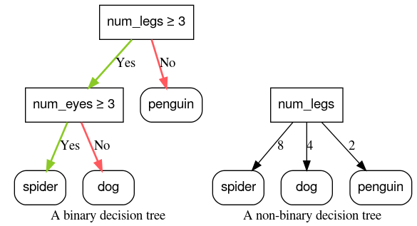

## Table of Contents

## What is a binary condition in the context of machine learning?

In machine learning, a binary condition refers to a situation where there are only two possible outcomes or categories. This is commonly seen in classification problems where the goal is to predict whether an instance belongs to one class or another. For example, a model might be trained to determine if an email is spam or not spam, or if a patient has a certain disease or does not have it. The simplicity of binary conditions makes them useful for many applications because they can be easily interpreted and acted upon.

Binary conditions are often represented mathematically using binary variables, which can take on the values of 0 or 1. In a machine learning context, these values might represent "no" and "yes," "false" and "true," or "negative" and "positive." For instance, if we are predicting whether it will rain tomorrow, we might use a binary variable $$ y $$ where $$ y = 0 $$ means "no rain" and $$ y = 1 $$ means "rain." This clear-cut representation helps in training models and making decisions based on the model's predictions.

## How does binary classification differ from other types of classification?

Binary classification is a type of classification where you only have two groups to sort things into. Imagine you're sorting apples and you only need to decide if they are good or bad. That's binary classification - just two choices. In machine learning, this could be used to predict if an email is spam or not spam, or if a patient has a disease or doesn't have it. The model learns to draw a line between the two groups, and anything on one side of the line gets labeled as one group, and anything on the other side gets labeled as the other group.

Other types of classification can have more than two groups. For example, instead of just sorting apples into good or bad, you might sort them into good, okay, and bad. This is called multiclass classification. Here, the model needs to learn how to draw lines to separate more than two groups. There's also multilabel classification, where each item can belong to more than one group at the same time. Like if you're sorting fruits and a fruit can be both sweet and juicy. The main difference is that binary classification is simpler because it only deals with two outcomes, while other types deal with more complexity.

## What are some common applications of binary condition in machine learning?

Binary conditions are used in many everyday applications of [machine learning](/wiki/machine-learning). One common use is in email spam detection. Here, the machine learning model decides if an email is spam or not spam. It looks at things like the words used in the email, who sent it, and other signs to make this decision. If the model thinks the email is spam, it might move it to a spam folder, helping to keep your inbox clean.

Another popular application is in medical diagnosis. Doctors can use machine learning models to predict if a patient has a certain disease or not. For example, a model might use data like a patient's age, symptoms, and test results to decide if they have diabetes. If the model says "yes," it can help doctors decide on the next steps for treatment. This binary decision, represented as $$ y = 0 $$ for "no disease" and $$ y = 1 $$ for "disease," simplifies the process and makes it easier to act on the results.

Binary conditions are also used in fraud detection for credit cards. The model looks at transaction details to determine if a transaction is fraudulent or legitimate. If the model flags a transaction as fraudulent, it might block the transaction or alert the cardholder. This quick decision-making process, based on a binary outcome, helps prevent financial losses and keeps users safe.

## Can you explain the concept of a decision boundary in binary classification?

In binary classification, a decision boundary is like an imaginary line that separates the two groups you're trying to sort. Imagine you're sorting red apples from green apples. The decision boundary would be the line where red turns into green. In machine learning, this line helps the computer decide which group a new apple belongs to. If an apple falls on one side of the line, it's put in one group, and if it falls on the other side, it goes in the other group. This makes it easier for the computer to make quick decisions.

The decision boundary can be simple or complex, depending on the data. For example, if you're sorting apples by size and color, the line might be straight if the apples are easy to tell apart. But if the apples are more mixed up, the line might be curved or even made up of several pieces. In math, we can write the decision boundary as an equation. For a simple straight line, it might look like $$ y = mx + b $$, where $$ m $$ is the slope and $$ b $$ is where the line crosses the y-axis. This equation helps the computer know exactly where to draw the line and make its decisions.

## What metrics are typically used to evaluate the performance of binary classifiers?

When we want to see how well a binary classifier is doing, we use a few key numbers to check its performance. One of the most common metrics is accuracy, which tells us the percentage of correct predictions out of all predictions. It's calculated as the number of correct predictions divided by the total number of predictions. But accuracy alone can be misleading, especially if one class is much bigger than the other. That's why we also look at other metrics like precision and recall. Precision measures how many of the positive predictions were actually correct, while recall measures how many of the actual positives were caught by the model. 

Another useful metric is the F1 score, which is the harmonic mean of precision and recall. The F1 score gives us a single number that balances both precision and recall, making it helpful when we care about both false positives and false negatives. The F1 score is calculated as $$ F1 = 2 \times \frac{\text{precision} \times \text{recall}}{\text{precision} + \text{recall}} $$. We also use the confusion matrix to get a detailed view of the classifier's performance. The confusion matrix shows us the number of true positives, true negatives, false positives, and false negatives, which helps us understand where the model is making mistakes. By looking at all these metrics together, we get a good picture of how well our binary classifier is working.

## How does the choice of algorithm affect binary classification outcomes?

The choice of algorithm can have a big impact on how well a binary classifier works. Different algorithms have different strengths and weaknesses, so the one you pick should match the kind of data you're working with and what you want the classifier to do. For example, if your data is easy to separate into two groups, a simple algorithm like logistic regression might work well. Logistic regression tries to find a straight line that separates the groups, and it uses a formula like $$ P(y=1) = \frac{1}{1 + e^{-(b_0 + b_1x)}} $$ to predict the probability of something being in one group. But if the groups are mixed up in a more complicated way, you might need a more powerful algorithm like a support vector machine (SVM) or a [neural network](/wiki/neural-network). These algorithms can find curved or complex decision boundaries that fit the data better.

Another thing to think about is how fast the algorithm runs and how easy it is to understand. Some algorithms, like decision trees, are easy to explain because they make decisions based on simple yes/no questions. But they might not be as accurate as more complex algorithms like random forests or gradient boosting machines. These more complex algorithms combine many decision trees to make better predictions, but they can be harder to explain and might take longer to train. So, when [picking](/wiki/asset-class-picking) an algorithm, you have to balance accuracy, speed, and how easy it is to understand the results. The right choice depends on your specific needs and the trade-offs you're willing to make.

## What are the challenges associated with imbalanced datasets in binary classification?

When working with binary classification, imbalanced datasets can make things tricky. An imbalanced dataset is when one group has a lot more examples than the other group. For example, if you're trying to predict if a credit card transaction is fraudulent, most transactions will be normal, and only a few will be fraudulent. This imbalance can trick the model into thinking that the bigger group is always the right answer, making it predict the majority class most of the time. This leads to high accuracy but poor performance in predicting the minority class, which is often the more important one. For instance, if the model always predicts "not fraudulent," it might seem accurate because most transactions are not fraudulent, but it won't catch any fraud.

To deal with imbalanced datasets, we have to use special techniques. One common method is to change the dataset itself by either adding more examples to the smaller group (oversampling) or removing examples from the bigger group (undersampling). Another approach is to adjust the model's focus so it pays more attention to the minority class. This can be done by using different costs for misclassifying examples from each group. For example, in a model like logistic regression, we might use a cost function that gives a higher penalty for misclassifying a fraudulent transaction than a normal one. This helps the model learn to be better at spotting the minority class. These techniques help make the model more fair and useful, even when the data is imbalanced.

## How can feature selection impact the performance of a binary classifier?

Feature selection can really change how well a binary classifier works. When you pick the right features, you help the model focus on the most important information and ignore the stuff that's not helpful. This can make the model more accurate and faster to train. For example, if you're trying to predict if an email is spam, choosing features like certain words or the sender's address can make a big difference. If you pick good features, the model can draw a clear line between spam and not spam. But if you pick bad features, the model might get confused and make more mistakes.

On the other hand, if you don't choose the right features, the model might struggle to tell the two groups apart. Imagine trying to sort apples into good and bad ones, but you only look at their color instead of their taste or texture. The model might not be able to draw a good decision boundary, leading to more wrong guesses. Feature selection also helps avoid something called overfitting, where the model learns the training data too well but doesn't work well on new data. By picking the right features, you make the model simpler and more likely to work well on new examples.

## What advanced techniques can be used to improve binary classification models?

One advanced technique to improve binary classification models is called ensemble learning. This method combines the predictions of multiple models to make a better final prediction. Imagine you have a group of friends, and each friend is good at guessing whether a fruit is an apple or an orange. If you ask all your friends and then take a vote, you're more likely to get the right answer than if you just asked one friend. In machine learning, popular ensemble methods include Random Forests and Gradient Boosting Machines. Random Forests build many decision trees and then average their predictions, while Gradient Boosting Machines build trees one at a time, each one trying to fix the mistakes of the last. These methods can help make the model more accurate and less likely to overfit the data.

Another technique is to use [deep learning](/wiki/deep-learning), specifically neural networks, which can learn very complex patterns in the data. Neural networks have layers of connected nodes that can learn to recognize features on their own, without you having to pick them out. For example, a neural network might learn to recognize the difference between spam and not spam emails by looking at the words and patterns in the emails. The more layers a neural network has, the more complex the patterns it can learn. A common type of neural network for binary classification is the logistic regression neural network, which uses a function like $$ P(y=1) = \frac{1}{1 + e^{-z}} $$ where $$ z $$ is a combination of the input features and the learned weights. By training on large amounts of data, these networks can become very good at making accurate predictions.

## How do ensemble methods like Random Forests and Boosting enhance binary classification?

Ensemble methods like Random Forests and Boosting help make binary classification better by combining the predictions of many smaller models. Think of it like having a team of friends where each friend is good at guessing whether a fruit is an apple or an orange. If you ask all your friends and then take a vote, you're more likely to get the right answer than if you just asked one friend. Random Forests work by building a bunch of decision trees, where each tree makes its own guess. Then, it takes a vote among all the trees to decide the final answer. This voting helps smooth out mistakes that any single tree might make, making the overall prediction more accurate and less likely to overfit the data.

Boosting, on the other hand, builds trees one at a time, where each new tree tries to fix the mistakes made by the previous trees. Imagine you're learning to sort apples and oranges, and after your first try, you realize you often mistake small oranges for apples. The next time, you focus more on the size to improve your guesses. Boosting works similarly by giving more weight to the examples that were hard to classify correctly before. A popular boosting method is Gradient Boosting, which uses a formula like $$ F_m(x) = F_{m-1}(x) + \gamma_m h_m(x) $$ to update the model. Here, $$ F_{m-1}(x) $$ is the previous model, $$ h_m(x) $$ is the new tree, and $$ \gamma_m $$ is a learning rate that controls how much the new tree affects the final prediction. By focusing on the hard examples and slowly improving, boosting can lead to very accurate binary classifiers.

## What role does cross-validation play in optimizing binary classification models?

Cross-validation is a way to check how well a binary classification model works without using the same data for training and testing. Imagine you're learning to sort apples and oranges, and you want to make sure you're good at it, not just with the apples and oranges you've already seen but also with new ones. Cross-validation helps by splitting your data into different parts, training the model on some parts, and then testing it on the other parts. This way, you get a better idea of how the model will do with new data it hasn't seen before. It's like practicing sorting with different sets of fruits to make sure you're really learning the difference, not just memorizing the ones you've seen.

One common way to do cross-validation is called k-fold cross-validation. Here, you divide your data into k equal parts, or "folds." You train the model k times, each time using k-1 folds for training and the remaining fold for testing. For example, if you have 100 apples and oranges and you choose k=5, you'd split them into 5 groups of 20. You'd train the model on 80 fruits and test it on the other 20, repeating this process 5 times with different groups as the test set. The average performance across all k folds gives you a good estimate of how well your model will work on new data. This helps you pick the best settings for your model and avoid overfitting, making your binary classifier more reliable and accurate.

## Can you discuss the impact of hyperparameter tuning on binary classification performance?

Hyperparameter tuning is like adjusting the knobs on a machine to make it work better. In binary classification, hyperparameters are settings that you choose before training the model, like the learning rate or the number of trees in a Random Forest. When you tune these hyperparameters, you're trying to find the best settings that make your model more accurate. For example, if you're using a logistic regression model, you might want to adjust the regularization parameter $$ C $$. A higher value of $$ C $$ means less regularization, which can make the model fit the training data better but might lead to overfitting. By trying different values and seeing which one works best, you can make your model perform better on new data.

One way to do hyperparameter tuning is by using a method called grid search. This means you try out a lot of different combinations of hyperparameters and see which one gives the best results. For example, if you're using a Random Forest, you might try different numbers of trees and different maximum depths for each tree. You could use a code block like this to set up a grid search in Python:

```python
from sklearn.model_selection import GridSearchCV
from sklearn.ensemble import RandomForestClassifier

param_grid = {
    'n_estimators': [100, 200, 300],
    'max_depth': [None, 10, 20, 30]
}

rf = RandomForestClassifier()
grid_search = GridSearchCV(estimator=rf, param_grid=param_grid, cv=5)
grid_search.fit(X_train, y_train)

print("Best parameters:", grid_search.best_params_)
print("Best cross-validation score:", grid_search.best_score_)
```

By running this code, you can find the best settings for your Random Forest model. This helps make your binary classifier more accurate and reliable, because you're using the best possible settings for your data.

## References & Further Reading

[1]: Hastie, T., Tibshirani, R., & Friedman, J. (2009). ["The Elements of Statistical Learning: Data Mining, Inference, and Prediction."](https://link.springer.com/book/10.1007/978-0-387-84858-7) Springer.

[2]: Géron, A. (2019). ["Hands-On Machine Learning with Scikit-Learn, Keras, and TensorFlow: Concepts, Tools, and Techniques to Build Intelligent Systems."](https://www.amazon.com/Hands-Machine-Learning-Scikit-Learn-TensorFlow/dp/1098125975) O'Reilly Media.

[3]: Murphy, K. P. (2012). ["Machine Learning: A Probabilistic Perspective."](https://www.cs.ubc.ca/~murphyk/MLbook/pml-toc-1may12.pdf) MIT Press.

[4]: Bishop, C. M. (2006). ["Pattern Recognition and Machine Learning."](https://link.springer.com/book/9780387310732) Springer.

[5]: Goodfellow, I., Bengio, Y., & Courville, A. (2016). ["Deep Learning."](https://link.springer.com/article/10.1007/s10710-017-9314-z) MIT Press.

[6]: James, G., Witten, D., Hastie, T., & Tibshirani, R. (2013). ["An Introduction to Statistical Learning: With Applications in R."](https://link.springer.com/book/10.1007/978-1-0716-1418-1) Springer.

[7]: Breiman, L. (2001). ["Random Forests."](https://link.springer.com/article/10.1023/A:1010933404324) Machine Learning, 45(1), 5-32.

[8]: Friedman, J. H. (2001). ["Greedy Function Approximation: A Gradient Boosting Machine."](https://www.jstor.org/stable/2699986) Annals of Statistics, 29(5), 1189-1232.