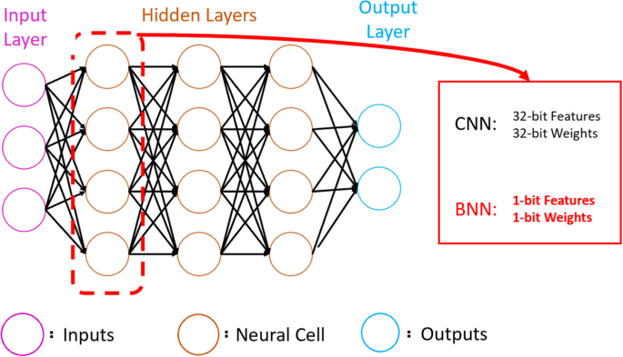

## Table of Contents

## What are Binary Neural Networks (BNNs) and how do they differ from traditional neural networks?

Binary Neural Networks (BNNs) are a type of neural network where the weights and sometimes the activations are constrained to only two possible values, typically -1 and +1. This is different from traditional neural networks, which use a wide range of real numbers for their weights and activations. The main advantage of BNNs is that they require much less memory and computational power, making them ideal for use in devices with limited resources, like mobile phones or embedded systems.

In traditional neural networks, the weights are updated during training using gradient descent, which involves calculating the gradient of the loss function with respect to each weight. In BNNs, because the weights are binary, the update process is more complex. Instead of directly updating the weights, BNNs often use a technique called "straight-through estimator" to approximate the gradient. This allows the network to learn even though the weights can only take on binary values. While BNNs can be less accurate than traditional networks, their efficiency makes them a valuable tool in certain applications.

## Why are BNNs important in the field of machine learning?

Binary Neural Networks (BNNs) are important in machine learning because they make it possible to run complex models on devices with limited resources. Traditional neural networks need a lot of memory and processing power, which can be a problem for smaller devices like smartphones or embedded systems. BNNs, on the other hand, use weights that can only be -1 or +1, which means they use much less memory and can run faster. This makes BNNs very useful for applications where you want to use machine learning on devices that can't handle big, traditional networks.

Another reason BNNs are important is that they can help make [machine learning](/wiki/machine-learning) more energy-efficient. Because BNNs use less power to run, they can be used in situations where energy use is a big concern, like in battery-powered devices or in large data centers where energy costs can be high. By using BNNs, we can make machine learning models that are not only smaller and faster but also kinder to the environment. This is a big step forward in making machine learning more accessible and sustainable.

## How do BNNs reduce the computational complexity and memory usage compared to full-precision networks?

Binary Neural Networks (BNNs) reduce computational complexity and memory usage by using weights that are either -1 or +1 instead of a wide range of real numbers like in full-precision networks. In a full-precision network, each weight might be stored as a 32-bit floating-point number. This means a lot of memory is needed, especially for big networks with millions of weights. But in a BNN, each weight can be stored as just one bit, which is much smaller. This makes BNNs use a lot less memory, so they can run on smaller devices like smartphones or embedded systems.

BNNs also make calculations simpler and faster. In full-precision networks, multiplying and adding weights and activations can be slow because they use many bits. But in BNNs, these operations can be done using simple bitwise operations. For example, multiplying a binary weight by an activation can be done with an XOR operation, which is very fast on modern hardware. This makes BNNs run faster and use less power, which is great for devices where energy use matters a lot.

## What is the basic architecture of a BNN?

The basic architecture of a Binary Neural Network (BNN) is similar to a traditional [neural network](/wiki/neural-network) but with some key differences. A BNN has layers of neurons, just like a regular network, but the weights connecting these neurons are binary, meaning they can only be -1 or +1. This makes the network simpler and faster to run. In a BNN, the input data is also often binarized, which means it's turned into binary values before it goes through the network. This helps keep the whole process quick and efficient.

The way a BNN works is by using these binary weights to process the input data. When the data goes through the network, it's multiplied by the binary weights. This can be done with simple bitwise operations, like XOR, which are much faster than the usual multiplication and addition in full-precision networks. After going through the layers, the output of the BNN can be used for tasks like classification or prediction, just like in a regular neural network. The key is that BNNs can do all this while using less memory and power, which makes them great for smaller devices.

## How are weights and activations binarized in BNNs?

In Binary Neural Networks (BNNs), weights are binarized by using a simple rule: if a weight is positive, it becomes +1, and if it's negative, it becomes -1. This is done using a function called the sign function, which looks at the value of a weight and decides if it should be +1 or -1. The sign function can be written as $$ \text{sign}(x) = \begin{cases} +1 & \text{if } x \geq 0 \\ -1 & \text{if } x < 0 \end{cases} $$. By using this function, the weights in a BNN are turned into binary values, which saves a lot of memory and makes calculations faster.

Activations in BNNs are also binarized, but the process can be a bit different. One common way to binarize activations is to use a step function. If the activation value is above a certain threshold, it becomes +1, and if it's below the threshold, it becomes -1. This helps keep the data moving through the network in a simple, binary form. Binarizing both weights and activations means that the whole network can work with just simple bitwise operations, making it much faster and more efficient than networks that use full-precision values.

## What are the challenges faced when training BNNs?

Training Binary Neural Networks (BNNs) can be tricky because the weights can only be -1 or +1. This makes it hard to use the usual way of training neural networks, which is called gradient descent. In gradient descent, we change the weights a little bit at a time to make the network better at its job. But with BNNs, we can't change the weights a little bit because they can only be -1 or +1. Instead, we use something called the "straight-through estimator" to guess how the weights should change. This method helps the network learn, but it's not as accurate as the usual way of training.

Another challenge is that binarizing the weights and activations can make the network lose some information. When we turn the weights and activations into -1 or +1, we're throwing away a lot of the details that help the network make good predictions. This can make BNNs less accurate than full-precision networks. To deal with this, we sometimes use a trick called "weight clipping," where we let the weights have a small range of values during training, and then turn them into -1 or +1 when we're done. This can help the network learn better, but it still takes a lot of work to get BNNs to perform well.

## How does the training process of BNNs differ from that of conventional neural networks?

Training Binary Neural Networks (BNNs) is different from training conventional neural networks because BNNs use weights that can only be -1 or +1. In conventional neural networks, we use gradient descent to slowly change the weights to make the network better at its job. But with BNNs, we can't change the weights a little bit because they can only be -1 or +1. Instead, we use a method called the "straight-through estimator" to guess how the weights should change. This method helps the network learn, but it's not as accurate as the usual way of training.

Another big difference is that binarizing the weights and activations in BNNs can make the network lose some information. When we turn the weights and activations into -1 or +1, we're throwing away a lot of the details that help the network make good predictions. This can make BNNs less accurate than full-precision networks. To deal with this, we sometimes use a trick called "weight clipping," where we let the weights have a small range of values during training, and then turn them into -1 or +1 when we're done. This can help the network learn better, but it still takes a lot of work to get BNNs to perform well.

## What are some common techniques used to improve the performance of BNNs?

One common technique to improve the performance of Binary Neural Networks (BNNs) is called "weight clipping." During training, we let the weights have a small range of values instead of just -1 or +1. This helps the network learn better because it can keep more information. After training, we turn the weights back into -1 or +1. This method can make BNNs more accurate, but it still needs a lot of work to get right.

Another technique is called "knowledge distillation." We train a big, full-precision network first, and then use it to teach a smaller BNN. The big network is like a teacher, showing the BNN how to make good predictions. This can help the BNN learn faster and be more accurate. By using these techniques, we can make BNNs work better even though they use less memory and power.

## Can you explain the concept of 'BiDet' in the context of BNNs?

BiDet, or Binary Detector, is a special way to make Binary Neural Networks (BNNs) work better. In BNNs, the weights can only be -1 or +1, which can make it hard for the network to learn well. BiDet helps by using a different way to decide if the weights should be -1 or +1. Instead of just using the sign function, which looks at if a weight is positive or negative, BiDet uses a more careful way to make this choice. This can help the BNN learn better and make more accurate predictions.

The idea behind BiDet is to use a "soft" decision during training. This means that instead of making a hard choice between -1 and +1 right away, BiDet lets the weights have a small range of values during training. This is done using a function that smoothly changes the weights. After training, the weights are turned into -1 or +1. This method helps the BNN keep more information and learn better, making it more useful for tasks where accuracy is important.

## How do BNNs perform on different types of tasks, such as image classification or natural language processing?

Binary Neural Networks (BNNs) can be used for tasks like image classification, but they might not be as accurate as full-precision networks. In image classification, BNNs turn the weights and sometimes the image data into -1 or +1. This makes the network use less memory and run faster, which is great for devices like smartphones. But because BNNs lose some information when they turn everything into binary values, they might not be as good at recognizing small details in images. Researchers are working on ways to make BNNs better at this, like using techniques called "weight clipping" or "knowledge distillation" to help the network learn more accurately.

For natural language processing (NLP), BNNs can also be used, but they face similar challenges. In NLP, BNNs would turn the weights and sometimes the text data into binary values. This can make the network faster and use less power, which is good for things like voice assistants on mobile devices. However, because BNNs lose some of the details in the text when they binarize it, they might not be as good at understanding the nuances of language as full-precision networks. To improve this, researchers use methods like "BiDet" to help BNNs make better decisions during training, which can lead to better performance in NLP tasks.

## What are the current limitations of BNNs and areas of ongoing research?

The main limitation of Binary Neural Networks (BNNs) is that they can be less accurate than full-precision networks. This is because BNNs turn the weights and sometimes the data into just -1 or +1, which means they lose some information. This can make it hard for BNNs to recognize small details in images or understand the nuances of language in natural language processing. Another challenge is that training BNNs is tricky because the weights can't be changed a little bit at a time like in regular networks. Instead, we use methods like the "straight-through estimator" to help the network learn, but these methods are not as accurate as the usual way of training.

Researchers are working on several ways to improve BNNs. One area of ongoing research is how to make BNNs more accurate without losing their benefits of using less memory and power. Techniques like "weight clipping" and "knowledge distillation" are being explored to help BNNs learn better. "Weight clipping" lets the weights have a small range of values during training and then turns them into -1 or +1 when training is done. "Knowledge distillation" uses a big, full-precision network to teach a smaller BNN, helping it learn faster and be more accurate. Another area of research is improving the training process of BNNs. Methods like "BiDet" are being developed to help BNNs make better decisions during training, which can lead to better performance in tasks like image classification and natural language processing.

## How might BNNs impact future developments in edge computing and IoT devices?

Binary Neural Networks (BNNs) could make a big difference in edge computing and IoT devices because they use less memory and power. Edge computing means doing calculations on the device itself instead of sending data to a big computer far away. BNNs can run on small devices like smartphones or sensors because they turn the weights into just -1 or +1. This makes them faster and uses less energy, which is perfect for IoT devices that need to work a long time on a small battery.

Researchers are working hard to make BNNs even better for these uses. They want to make BNNs more accurate without losing their benefits. They use methods like "weight clipping" and "knowledge distillation" to help BNNs learn better. "Weight clipping" lets the weights have a small range of values during training and then turns them into -1 or +1 when done. "Knowledge distillation" uses a big network to teach a smaller BNN. These improvements could make BNNs very useful for edge computing and IoT, helping devices do smart tasks without needing a lot of power or memory.