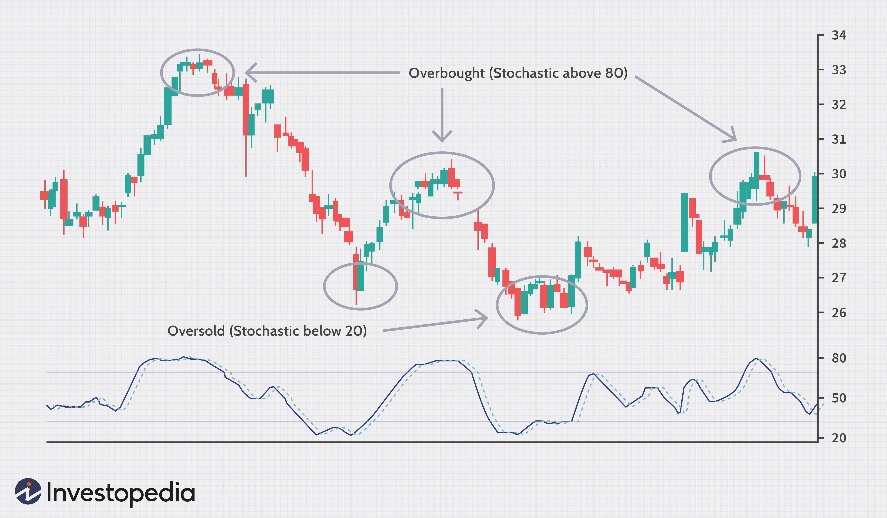

Binary options and algorithmic trading represent exciting opportunities in the financial markets due to their unique ability to cater to both profit-seeking individuals and risk-conscious investors. By understanding the functionality of these financial tools, market participants can unlock new avenues for generating returns and managing potential losses effectively. Binary options offer a straightforward mechanism: traders predict the direction of an asset's price within a specific timeframe, with outcomes resulting in predetermined profits or losses. On the other hand, algorithmic trading employs advanced computer programs to execute trades based on pre-set criteria, often exploiting speed and efficiency.

This article seeks to provide an in-depth exploration of binary options and algorithmic trading by presenting key examples and case studies illustrating their implementation and impact. The aim is to empower traders and investors with the knowledge to successfully navigate these complex yet rewarding strategies, enhancing both their skill and confidence in financial markets. Understanding these instruments can pave the way for making informed trading decisions and optimizing investment outcomes. This comprehensive overview will elucidate the intricate workings of these financial instruments, shedding light on their advantages, risks, and future trends.

## Table of Contents

## Understanding Binary Options Trading

Binary options trading involves predicting whether the price of a specific asset will go up or down within a predetermined time frame. The key features of binary options include their simplicity and structured risk, where traders know the potential profit or loss beforehand.

### Basics of Binary Options

Binary options are financial instruments that allow traders to speculate on the direction of an asset's price. There are primarily two types of binary options: call and put options. A call option is purchased when a trader believes the price of an asset will increase, while a put option is chosen when a decrease is anticipated. 

The process involves selecting an asset, choosing an expiration time, and predicting the price movement relative to the current price. If the prediction is correct at the time of expiration, the trader earns a fixed return. However, if the prediction is incorrect, the trader loses the initial investment.

### Hedging and Speculation

Binary options are versatile and can be used for both hedging and speculative purposes. For hedging, traders can use binary options to manage risk by offsetting potential losses in other investments. For example, an investor holding stocks can buy put options to hedge against a potential fall in stock prices.

On the speculative side, binary options attract traders looking for opportunities to profit from short-term market fluctuations without owning the underlying asset. This can be particularly appealing in volatile markets, where price movements offer chances for quick gains.

### Risks and Benefits

Binary options trading presents several benefits, such as simplicity and clarity regarding potential outcomes. Traders appreciate knowing their maximum profit and loss upfront, which aids in effective financial planning and risk management. The fixed nature of binary options can be less intimidating for novice traders.

However, binary options also come with significant risks. The all-or-nothing payout structure means that unsuccessful trades lead to total loss of the invested amount. Additionally, the short duration of trades can lead to impulsive decision-making, often influenced by market [volatility](/wiki/volatility-trading-strategies).

### Appeal to Traders

Binary options are appealing to both novice and seasoned traders for various reasons. Beginners are drawn to their straightforward nature, which requires no in-depth knowledge of the underlying asset, while experienced traders appreciate the instruments for their versatility in executing sophisticated strategies.

Binary options also provide an entry point into the world of trading with a relatively low capital requirement, making them accessible to a wider audience. Seasoned traders utilize binary options for their ability to leverage insights from technical and [fundamental analysis](/wiki/fundamental-analysis) in a simplified manner.

### Conclusion

Understanding the dynamics of binary options trading, including their advantages and risks, is crucial for anyone considering this form of speculative or hedging tool. As with any financial instrument, a well-informed approach can mitigate risks and maximize potential rewards.

 to Algorithmic Trading

Algorithmic trading, often referred to as algo trading, leverages computer programs to execute large volumes of trades at speeds and frequencies outstripping human capabilities. At its core, algo trading works by automating the trading process based on predefined criteria like timing, price, quantity, or any mathematical model. This method not only optimizes trading efficiency but also reduces the potential for human error and bias.

**How Algo Trading Works:**

Algo trading employs algorithms—sets of specific instructions or rules coded into computer programs—to make trading decisions. Traders set the parameters they wish to follow, such as "buy 100 shares of a stock if its 50-day moving average goes above the 200-day moving average." The algorithm continuously monitors the market and executes trades automatically once those conditions are met.

Technologies behind algo trading include high-performance computing platforms, extensive data feeds, and sophisticated programming languages like Python, C++, and Java. These technologies facilitate the rapid processing of market data and timely execution of trades.

**Types of Algorithmic Trading Strategies:**

1. **Trend Following**: This strategy involves algorithms designed to detect movements in stock prices and invest correspondingly. Classic indicators for trend following include moving averages, channel breakouts, and related technical analysis tools. The advantage of this strategy lies in its simplicity and effectiveness across various market conditions.

2. **Market Making**: In market making, algorithms provide liquidity by simultaneously quoting buy and sell prices, capitalizing on the spread between them. This requires fast execution and rapid order placement, typically only achievable through sophisticated algorithms to minimize risks associated with holding inventory.

3. **Arbitrage Opportunities**: Algorithms can identify and exploit price differentials of a financial asset between two or more markets, locking in a low-risk profit. This strategy, however, requires fast execution and is often sensitive to transaction costs.

4. **Statistical Arbitrage**: This involves trading based on statistical models and relationships between different financial instruments. Statistical arbitrage often uses large data sets and statistical techniques like cointegration, linear regression, or principal component analysis.

**Role of Data Analysis:**

Data analysis is crucial in developing effective [algorithmic trading](/wiki/algorithmic-trading) strategies. Algorithms rely heavily on historical and real-time data to forecast market trends and make informed decisions. Advanced statistical models and [machine learning](/wiki/machine-learning) techniques are often employed to identify patterns and generate predictive analytics. Python libraries such as Pandas, NumPy, and Scikit-learn play pivotal roles in handling and analyzing financial data.

**Legal and Ethical Considerations:**

With the widespread use of algorithmic trading, legal and ethical issues have become paramount. Regulatory bodies worldwide set stringent rules to prevent market manipulation, such as the development of "flash crashes" attributed to high-frequency trading algorithms. Compliance with regulations like the Markets in Financial Instruments Directive (MiFID) in Europe and the Dodd-Frank Act in the U.S. is mandatory for firms engaged in algorithmic trading.

Ethically, there's a significant debate around the fairness and transparency of algorithmic trading. Critics argue that its high-speed nature may disadvantage traditional traders, while advocates claim it enhances market efficiency and [liquidity](/wiki/liquidity-risk-premium). Ensuring accountability and minimizing systemic risks remain key challenges in regulating algo trading.

In conclusion, algorithmic trading represents a crucial intersection between technology and finance, driving significant advances in market practices and efficiencies. However, the accompanying legal and ethical complexities highlight the ongoing need for robust regulatory frameworks and ethical standards.

## Examples of Binary Options in Practice

Binary options trading involves predicting the outcome of price movements of various assets within a specific time frame. Successful execution of binary options trades largely depends on the trader’s ability to accurately forecast the future direction of asset prices. Below are examples and insights into how binary options have been effectively utilized in financial markets.

### Real-World Examples of Successful Binary Options Trades

1. **Currency Pairs**: One of the most common uses of binary options is in trading currency pairs. For instance, a trader might predict that the EUR/USD currency pair will increase in value over the next hour. If the prediction is correct, the trader earns a predetermined payout, often ranging between 70-90% of the initial investment.

2. **Commodity Trading**: Commodities such as gold and oil are frequently embraced by binary options traders. For example, during periods of economic uncertainty, a trader might wager that gold prices will rise due to its status as a 'safe haven' asset.

### Case Studies in Effective Use

1. **Hedging Strategies**: Some traders use binary options for hedging against potential losses in their broader investment portfolios. For instance, an investor with significant exposure to tech stocks might use binary options to speculate on a potential market correction. By betting on a decline in the NASDAQ index, any losses in the tech portfolio can be partially offset by gains in the binary options trade.

2. **Speculative Trades**: In 2016, a trader could have exploited binary options to profit from Brexit outcomes. By predicting a decline in the British pound's value post-referendum, traders could secure lucrative returns as the currency experienced significant volatility.

### Evaluating Assets for Binary Options Trading

Evaluating assets for binary options trading requires a keen understanding of market dynamics and asset-specific factors. Traders typically consider several criteria:

- **Volatility**: Assets with higher volatility can present more significant opportunities for profit due to the larger potential movements in price.
- **Liquidity**: Highly liquid assets ensure that traders can enter and exit positions with ease.
- **Historical Data**: Analyzing past price movements can provide valuable insights into future performance.

### Factors Making Certain Assets Popular

Certain assets are favored by binary options traders due to their predictable nature and liquidity. These include:

- **Major Forex Pairs**: Such as EUR/USD, GBP/USD, and USD/JPY, which offer high liquidity and frequent trading opportunities.
- **Stock Indices**: Like the S&P 500 or DAX, which reflect broader market movements and are influenced by macroeconomic factors.

### Examples of Profitable and Failed Trades

Understanding both successful and failed trades is crucial for comprehending the dynamics of binary options trading.

- **Profitable Trades**: A trader who correctly anticipates the monthly non-farm payroll (NFP) announcement’s impact on the USD might place a call option on the USD/JPY, reaping substantial profits if the currency pair moves in the predicted direction.

- **Failed Trades**: Conversely, a trade predicting a short-term decline in oil prices shortly before an unexpected geopolitical event causing a supply disruption could result in losses as prices surge instead of falling.

By studying these dynamics, traders can better grasp the intricate play between market forces and the valuation of binary options. The key to successful binary options trading lies in thorough research, market analysis, and understanding the interconnectivity of financial markets.

## Case Studies in Algorithmic Trading

Algorithmic trading has evolved into a critical component of modern financial markets, leveraging computer program capabilities to execute fast and efficient trading decisions. Understanding its applications through case studies highlights both the success and challenges of this influential technology.

One notable success story in algorithmic trading is the rise of Renaissance Technologies, a quantitative [hedge fund](/wiki/hedge-fund-trading-strategies) renowned for its Medallion Fund. The Medallion Fund is famous for using sophisticated algorithms and a rigorous statistical approach to achieve outstanding returns. Algorithms employed by Renaissance scour market data for patterns and trends, executing trades within microseconds[1]. This level of precision and speed highlights algorithmic trading's potential for wealth generation when applied effectively.

Hedge funds and institutional investors frequently use algorithmic trading to optimize their trading strategies. These entities typically have access to extensive resources, including advanced technology and large datasets, enabling them to exploit market inefficiencies. For instance, they deploy high-frequency trading ([HFT](/wiki/high-frequency-trading-strategies)) strategies to profit from small price discrepancies across different markets. Algorithms can pinpoint [arbitrage](/wiki/arbitrage) opportunities across global stock exchanges and [carry](/wiki/carry-trading) out trades long before human traders can even perceive the opportunity[2].

However, algorithmic trading is not without risks, as evidenced by past market disruptions. A notable instance is the 2010 Flash Crash, where U.S. stock markets plummeted briefly due to rapid, automated sell-offs triggered by algorithmic trading. During this event, the Dow Jones Industrial Average dropped nearly 1,000 points in minutes, underscoring vulnerabilities in relying solely on algorithms without adequate oversight[3]. This event highlighted the importance of incorporating reliable fail-safes and testing in algorithmic systems to prevent such market disruptions.

Learning from historical failures is crucial in refining algorithmic strategies. For example, Long-Term Capital Management (LTCM) is a case study where reliance on complex models without considering low-probability events led to its downfall. LTCM's failure reinforced the need for stress testing algorithms against various market scenarios and integrating robust risk management practices[4].

Algorithmic trading continually evolves with advancements in technology. Innovations such as machine learning and [artificial intelligence](/wiki/ai-artificial-intelligence) (AI) play an increasingly significant role. AI algorithms can adaptively learn from historical data, improving their accuracy and adaptability over traditional models. Moreover, the rise of [alternative data](/wiki/best-alternative-data) sources, like social media sentiment and satellite imagery, offers traders new tools for gaining a competitive edge[5]. As these technologies mature, algorithmic trading is expected to become even more pervasive and sophisticated, continuing to shape the financial landscape.

References:
1. Zuckerman, G. (2009). *The Greatest Trade Ever: The Behind-the-Scenes Story of How John Paulson Defied Wall Street and Made Financial History*. Random House.
2. Aldridge, I. (2013). *High-Frequency Trading: A Practical Guide to Algorithmic Strategies and Trading Systems*. Wiley.
3. U.S. Securities and Exchange Commission. (2010). *Findings Regarding the Market Events of May 6, 2010*. [link](https://www.sec.gov/news/studies/2010/marketevents-report.pdf)
4. Lowenstein, R. (2000). *When Genius Failed: The Rise and Fall of Long-Term Capital Management*. Random House.
5. Kearns, M., & Nevmyvaka, Y. (2020). *Machine Learning for Asset Managers*. Cambridge University Press.

## Integrating Binary Options with Algorithmic Trading

Integrating binary options with algorithmic trading strategies presents an intriguing frontier in financial markets. This approach leverages both the simplicity of binary options and the efficiency of algorithmic execution, aiming to optimize trading outcomes. The integration requires a sophisticated infrastructure, incorporating tools and software dedicated to such tasks.

### Tools and Software for Integration

To effectively combine binary options with algorithmic trading, traders utilize a variety of software platforms. These platforms allow for the automation and execution of trades based on algorithms. Software like MetaTrader 4/5, TradingView, and custom Python scripts using libraries such as NumPy and Pandas are commonly employed. For instance, MetaTrader enables automated trading through expert advisors (EAs), which can be programmed to execute trades based on predefined binary options strategies. Additionally, brokers often provide APIs that can be accessed through languages like Python to further customize and create trading bots.

### Benefits of Automation in Binary Options Trading

The automation of binary options trading offers several advantages. Firstly, it eliminates emotional decision-making, enabling more disciplined adherence to trading strategies. Algorithms can swiftly analyze vast data sets to identify potential trading opportunities, thus increasing the speed and efficiency of trading operations. Secondly, automation allows for [backtesting](/wiki/backtesting) strategies against historical data, providing insights into potential profitability without risking capital. This process aids in refining trading strategies before applying them to live markets.

### Challenges and Limitations

Despite its benefits, automated trading in binary options faces challenges. The binary options market can be volatile and unpredictable, and computer algorithms may not always account for sudden market shifts. Additionally, the development of robust algorithmic strategies requires significant technical expertise. Concerns over latency and the execution speed of trades also pose limitations, as delays can lead to suboptimal trading results. Furthermore, not all binary options brokers offer the technical infrastructure required for high-frequency trading, which is crucial for effective algorithmic execution.

### Future Trends and Innovations

The integration of machine learning and artificial intelligence with algorithmic trading is a notable trend. These technologies can enhance the accuracy and adaptability of trading strategies, allowing for real-time learning and adjustments to changing market conditions. The use of big data analytics is also gaining traction, providing deeper market insights and enhancing predictive capabilities for binary options trading. Moreover, the increasing availability of cloud computing services is likely to democratize access to sophisticated algorithmic trading tools, enabling more traders to explore this integrated approach.

In conclusion, while integrating binary options with algorithmic trading presents a range of opportunities, it requires careful consideration of the tools and strategies applied. As technology evolves, so too will the capabilities and applications of automated trading systems, potentially transforming the landscape of binary options trading.

## Risks and Considerations

Binary options and algorithmic trading present notable opportunities but also significant risks that traders must carefully consider. Understanding these risks and implementing effective risk management strategies are crucial for successful trading in these areas.

**Risks in Binary Options and Algorithmic Trading**

Binary options trading, often perceived as straightforward, involves predicting the direction of price movements within a defined timeframe. However, this simplicity masks inherent risks. The fixed return or loss structure of binary options can lead to substantial financial loss if not managed properly. Since traders must pay the full premium upfront, a wrong prediction results in a total loss of the investment in that specific option.

Algorithmic trading, which relies on complex algorithms and computer programs to execute trades, introduces its own set of risks. These include technological failures, such as software bugs or server outages, which can result in significant losses. Moreover, incorrect model assumptions or poor data quality can lead to erroneous trading decisions.

**Importance of Risk Management Strategies**

Effective risk management is essential to navigate these risks. For binary options, strategies such as diversification across different assets or expiry times, setting predetermined loss limits, and using demo accounts for practice are advisable. In algorithmic trading, thorough backtesting of strategies, continuous monitoring of algorithms, and implementing fail-safes like circuit breakers can mitigate risks.

**Regulatory Frameworks' Impact**

Both binary options and algorithmic trading are subject to regulatory scrutiny. Regulatory frameworks, such as those enforced by the U.S. Securities and Exchange Commission (SEC) and the Commodity Futures Trading Commission (CFTC), aim to ensure fair trading practices and protect investors. Regulations can dictate trading parameters, reporting requirements, and operational standards, directly influencing trading strategies and operations.

For binary options, regulations often focus on broker licensing and transparency to prevent fraud. In algorithmic trading, regulations may address the speed and [volume](/wiki/volume-trading-strategy) of trades to mitigate risks like market manipulation or "flash crashes."

**Psychological Factors in Trading**

Trader psychology also plays a critical role in binary options and algorithmic trading. Binary options' all-or-nothing nature can lead to emotional decisions fueled by greed or fear, impacting consistency and strategy adherence. Algorithmic traders may rely heavily on automated systems, but human oversight is required to adjust strategies in response to unforeseen market conditions. 

The pressure to perform or recover losses can lead to impulsive decisions, further exacerbating risks. Recognizing the emotional triggers that impact decision-making and implementing measures to maintain discipline are vital for effective trading.

**Continuous Learning and Adaptation**

Markets are dynamic, and conditions can change rapidly, necessitating continuous learning and adaptation. Traders should keep abreast of regulatory changes, technological advancements, and market trends to refine their strategies. Encouraging a culture of learning and flexibility allows both individual traders and firms to respond to challenges effectively and capitalize on new opportunities.

By understanding and addressing these considerations, traders can better position themselves to leverage the opportunities within binary options and algorithmic trading while managing the associated risks.

## Conclusion

Binary options and algorithmic trading present significant opportunities within financial markets, offering diverse methods for investors to engage with, manage risk, and potentially profit from asset price movements. Throughout this article, we have explored how binary options allow traders to capitalize on price predictions over fixed durations. This distinct form of trading, with its straightforward call and put options, appeals to both beginners and experienced traders due to its comparatively simple mechanics and defined risk-reward profile.

Algorithmic trading, on the other hand, provides a technologically advanced approach to executing trades based on pre-set criteria, utilizing sophisticated data analysis and computational techniques. The development of strategies such as [trend following](/wiki/trend-following) and [market making](/wiki/market-making), facilitated by cutting-edge technologies, underscores the innovative nature of algorithmic trading. Additionally, the integration of algorithmic trading into binary options can enhance efficiency and execution accuracy through automation, even as it presents new challenges.

As traders and investors investigate these flexible financial tools, it's essential to approach them with caution and a comprehensive understanding of the associated risks. Rigorous risk management is non-negotiable, given the fast-paced nature of markets and the potential for rapid changes. Understanding the legal, ethical, and psychological factors affecting trading practices is equally crucial.

Continual learning and adaptation to emerging trends are the cornerstones of successful participation in financial markets. Traders should remain informed about evolving technologies and market dynamics, using this knowledge to refine their strategies and maintain a competitive edge.

In conclusion, while binary options and algorithmic trading represent exciting possibilities, they require a disciplined and knowledgeable approach. By equipping themselves with the right tools and information, traders can navigate and harness the full potential these financial innovations offer.

## References & Further Reading

[1]: Aldridge, I. (2013). ["High-Frequency Trading: A Practical Guide to Algorithmic Strategies and Trading Systems."](https://www.amazon.com/High-Frequency-Trading-Practical-Algorithmic-Strategies/dp/1118343506) Wiley.

[2]: Lowenstein, R. (2000). ["When Genius Failed: The Rise and Fall of Long-Term Capital Management."](https://archive.org/details/whengeniusfailed00lowe) Random House.

[3]: U.S. Securities and Exchange Commission. (2010). ["Findings Regarding the Market Events of May 6, 2010."](https://www.sec.gov/about/reports-publications/newsstudies2010marketevents-reportpdf)

[4]: Kearns, M., & Nevmyvaka, Y. (2020). ["Machine Learning for Asset Managers."](https://www.cis.upenn.edu/~mkearns/papers/KearnsNevmyvakaHFTRiskBooks.pdf) Cambridge University Press.

[5]: Lopez de Prado, M. (2018). ["Advances in Financial Machine Learning."](https://www.amazon.com/Advances-Financial-Machine-Learning-Marcos/dp/1119482089) Wiley.