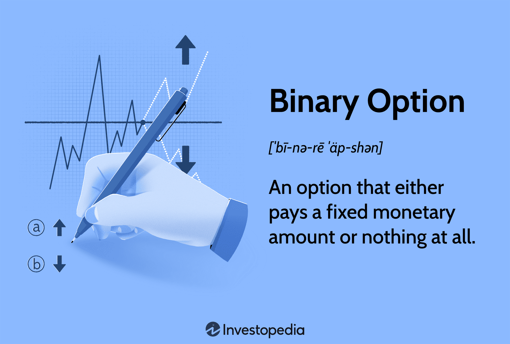

## Table of Contents

## What are binary options and how do they work?

Binary options are a type of financial trading where you predict if the price of something, like a stock or currency, will go up or down within a certain time. It's called "binary" because there are only two possible outcomes: you either win a fixed amount of money or you lose your investment. For example, if you think the price of gold will go up in the next hour, you can buy a binary option that pays out if you're right.

When you trade binary options, you choose an asset and decide if its price will be higher or lower than the current price at the end of the option's time period. This time can be as short as a few minutes or as long as a day. If you predict correctly, you get a payout, usually between 70% to 90% of your investment. If you're wrong, you lose the money you put in. It's important to understand that binary options can be risky because of the short time frames and the all-or-nothing nature of the outcomes.

## What are the key differences in binary options trading regulations outside the United States?

In the United States, binary options are regulated by the Securities and Exchange Commission (SEC) and the Commodity Futures Trading Commission (CFTC). These agencies make sure that trading is fair and safe. Only a few brokers are allowed to offer binary options, and they must follow strict rules. This means that if you trade binary options in the U.S., you are protected by these regulations.

Outside the United States, the rules can be very different. In Europe, for example, binary options are regulated by the European Securities and Markets Authority (ESMA). They have put limits on how much you can trade and how much you can lose. In other places like Australia and Canada, the rules might be less strict, and there might be more brokers to choose from. This can make trading easier but also riskier because there might be less protection for traders.

In some countries, binary options are not regulated at all. This means that anyone can offer binary options trading, and there's no one making sure it's fair. Traders in these places need to be very careful because they might lose money if they deal with dishonest brokers. Always check the local rules and make sure you understand the risks before you start trading binary options outside the U.S.

## Which countries offer legal binary options trading platforms?

In the United States, binary options trading is legal but regulated tightly by the Securities and Exchange Commission (SEC) and the Commodity Futures Trading Commission (CFTC). Only a few brokers are allowed to offer binary options, and they have to follow strict rules to make sure trading is fair and safe. This means that if you live in the U.S. and want to trade binary options, you can do it legally but with limited choices.

In Europe, binary options are also legal and regulated by the European Securities and Markets Authority (ESMA). They have rules to protect traders, like limits on how much you can trade and how much you can lose. Countries like the United Kingdom, Germany, and France have their own rules too, but they all work together to keep trading safe. In other places like Australia and Canada, binary options are legal and regulated, but the rules might be less strict, so there are more brokers to choose from.

Some countries don't have specific rules for binary options, so trading can be legal but risky. For example, in places like Russia and South Africa, there might not be strict regulations, so you need to be careful and check if the broker is trustworthy. Always look up the local rules and understand the risks before you start trading binary options in any country.

## What are the most popular binary options brokers available outside the US?

Outside the United States, some of the most popular binary options brokers are IQ Option, Olymp Trade, and Binomo. These brokers are known for being easy to use and offering many different types of trades. IQ Option is very popular because it has a good app and you can start trading with just a little money. Olymp Trade is liked for its simple platform and the chance to trade many different things like stocks and currencies. Binomo is another good choice because it has a lot of tools to help you learn and practice trading.

These brokers are all regulated in different places, which means they have to follow some rules to keep trading safe. IQ Option is regulated by CySEC in Cyprus, Olymp Trade is regulated by the International Financial Commission, and Binomo is regulated by the same commission. This helps make sure that the brokers are fair and that your money is safe. But remember, even though these brokers are popular and regulated, trading binary options can still be risky. Always make sure you understand how it works and the risks before you start trading.

## How can someone outside the US open a binary options trading account?

To open a binary options trading account outside the US, start by choosing a reputable broker. Popular choices include IQ Option, Olymp Trade, and Binomo. These brokers are known for being user-friendly and offering a variety of trading options. Once you've picked a broker, visit their website and look for the "Sign Up" or "Register" button. You'll need to fill out a form with your personal information like your name, email address, and phone number. Make sure to use accurate information because you'll need to verify your identity later.

After you've filled out the registration form, you'll need to verify your account. This usually involves uploading a copy of your ID, like a passport or driver's license, and sometimes a proof of address, like a utility bill. Once your account is verified, you can make a deposit. Most brokers allow you to start with a small amount, like $10 or $20. Choose a payment method that works for you, such as a credit card, e-wallet, or bank transfer. Once your deposit is confirmed, you can start trading binary options. Remember to read the broker's terms and conditions and understand the risks involved before you begin.

## What are the common strategies used in binary options trading?

One common strategy in binary options trading is the [trend following](/wiki/trend-following) strategy. This means you watch the market to see if prices are going up or down over time. If you see that prices are mostly going up, you might decide to buy a binary option that pays out if the price keeps going up. If prices are going down, you would choose an option that pays out if the price keeps falling. This strategy works well when there is a clear trend in the market, but it can be risky if the trend suddenly changes.

Another strategy is the range trading strategy. With this, you look for times when the price of an asset stays within a certain range. You might buy a binary option that pays out if the price stays between two points, or you might bet on the price breaking out of that range. This can be a good strategy in markets that don't have a strong trend and where prices move up and down within a set range. It's important to be patient and wait for the right moment to trade.

A third strategy is the news trading strategy. This involves watching for big news events that can affect the market, like economic reports or announcements from governments. When these events happen, they can cause big changes in prices. You can use this information to buy binary options that you think will benefit from these changes. For example, if a company is about to release good earnings, you might buy an option that pays out if the stock price goes up. This strategy requires you to stay informed and act quickly when news comes out.

## What are the risks associated with binary options trading outside the US?

Trading binary options outside the US can be risky because the rules might not be as strict as they are in the US. In some countries, there are no strong laws to protect traders, so you might deal with brokers who are not honest. These brokers could take your money or not let you take out your winnings. Also, because the rules can be different in each country, it can be hard to know if a broker is safe and trustworthy. It's important to check the rules in your country and make sure the broker is regulated by a good authority.

Another risk is that binary options can be very tricky to trade. They have short time periods, sometimes just a few minutes, and you can lose all your money if you guess wrong. This can be stressful and lead to big losses if you're not careful. Also, some brokers might trick you with promises of big profits or use complicated terms to confuse you. It's important to learn as much as you can about binary options and start with a small amount of money that you can afford to lose. This way, you can practice and learn without risking too much.

## How does taxation on binary options profits work in different countries?

In different countries, the way binary options profits are taxed can be very different. In the United States, any money you make from binary options is usually seen as regular income. This means you have to pay taxes on it just like you would on money from a job. The tax rate depends on how much money you make in total. In Europe, the rules can vary from one country to another. For example, in the UK, binary options profits are taxed as capital gains, but you get a certain amount of money you can make without paying taxes. In Germany, profits are also seen as capital gains, but they have a flat tax rate.

In other parts of the world, like Australia and Canada, binary options profits are usually treated as income and taxed at the regular income tax rate. Some countries, like Russia and South Africa, might not have clear rules about binary options, so it can be hard to know if you need to pay taxes on your profits. It's always a good idea to check the tax laws in your country and maybe talk to a tax expert to make sure you're doing everything right. Remember, not paying taxes on your profits can get you into trouble, so it's important to follow the rules.

## What advanced tools and indicators are used by expert traders in binary options?

Expert traders in binary options often use advanced tools and indicators to help them make better decisions. One common tool is the Moving Average Convergence Divergence (MACD). This tool helps traders see if the market is trending up or down by looking at the difference between two moving averages. Another popular indicator is the Relative Strength Index (RSI), which shows if an asset is overbought or oversold. This can help traders guess if the price might go up or down soon. Bollinger Bands are also used a lot; they show how much the price is moving around its average, which can help traders find good times to buy or sell.

Another set of tools that expert traders use are chart patterns and technical analysis software. Chart patterns like head and shoulders, triangles, and flags can show traders where the price might go next. Technical analysis software can help by drawing these patterns automatically and giving traders signals about when to trade. Some traders also use economic calendars to keep track of important news events that might affect the market. These tools and indicators can make trading easier and more accurate, but they still need to be used carefully because the market can be unpredictable.

## How can one assess the credibility and safety of a binary options broker outside the US?

To assess the credibility and safety of a binary options broker outside the US, start by checking if the broker is regulated by a well-known authority. Look for brokers regulated by groups like the Cyprus Securities and Exchange Commission (CySEC) or the Financial Conduct Authority (FCA) in the UK. These groups make sure brokers follow rules to keep your money safe. Also, read reviews from other traders to see if they had good experiences with the broker. Look for comments about how easy it is to take out your money and if the broker pays out winnings quickly.

Another way to check a broker's credibility is to see how long they have been in business and if they have a good reputation. Brokers that have been around for a long time and have a lot of happy customers are usually more trustworthy. Make sure the broker has a clear and easy-to-understand website with all the information you need about their services and fees. Also, try out their demo account if they offer one. This lets you practice trading without risking real money and can help you see if the broker's platform is easy to use and reliable.

## What are the latest trends and developments in binary options trading outside the US?

In recent years, one of the big trends in binary options trading outside the US has been the focus on better regulation and safety for traders. Many countries have started to put stricter rules in place to protect people from dishonest brokers. For example, the European Securities and Markets Authority (ESMA) has set limits on how much traders can lose and how much they can trade. This has made trading safer but also changed how brokers operate. Another trend is the rise of mobile trading apps, making it easier for people to trade binary options from their phones. Brokers like IQ Option and Olymp Trade have good apps that let you trade on the go.

Another development is the use of more advanced tools and technology in trading. Traders are using more sophisticated indicators and software to help them make better decisions. Tools like the Moving Average Convergence Divergence (MACD) and the Relative Strength Index (RSI) are becoming more popular. Also, there's a growing interest in using [artificial intelligence](/wiki/ai-artificial-intelligence) and [machine learning](/wiki/machine-learning) to predict market trends. These technologies can analyze a lot of data quickly and help traders find good trading opportunities. Overall, these trends are making binary options trading more accessible and potentially more profitable, but it's still important for traders to be careful and understand the risks.

## How do regulatory changes impact binary options trading strategies and profitability outside the US?

Regulatory changes outside the US have a big impact on how people trade binary options and how much money they can make. When rules get stricter, like in Europe where the European Securities and Markets Authority (ESMA) set limits on how much traders can lose, it makes trading safer but can also limit how much money traders can make. These rules mean brokers have to change how they offer binary options, which can make it harder for traders to use certain strategies that worked before. Traders might have to be more careful and use different ways to trade, like focusing on smaller trades or using more tools to help them predict the market better.

Even though stricter rules can make trading less profitable, they also help make the market more fair and safe. When brokers know they have to follow strict rules, they are less likely to trick people or take their money. This can make traders feel more confident and might even attract more people to start trading binary options. So, while regulatory changes can make it harder to make big profits quickly, they also help create a safer trading environment where traders can learn and grow their skills over time.

## What is the understanding of financial derivatives?

Financial derivatives are financial contracts that derive their value from the performance of an underlying entity. These could be assets such as stocks, bonds, commodities, or market indices. Derivatives function primarily as vehicles for transferring risk between parties, thus serving as crucial instruments for risk management in financial markets.

The functions of derivatives are manifold, allowing for hedging, speculation, and [arbitrage](/wiki/arbitrage). Hedging involves reducing the risk of adverse price movements in an asset, usually by taking an opposite position in the market. For example, an investor holding a stock can use derivatives like futures or options to protect against potential declines in that stock's price. Speculating, on the other hand, entails attempting to profit from future price fluctuations without necessarily owning the underlying asset. This can be seen in the use of options to bet on the future direction of asset prices. Arbitrage takes advantage of price differentials in different markets or formats to achieve a risk-free profit.

The landscape of financial derivatives is diverse, with several types of contracts offering unique characteristics and applications:

1. **Options**: These are contracts that provide the buyer with the right, but not the obligation, to buy or sell an asset at a predetermined price on or before a specific date. Options can be further classified into call options, giving the right to buy, and put options, offering the right to sell.

2. **Futures**: These are standardized contracts obligating the buyer to purchase, and the seller to sell, an asset at a predetermined future date and price. Futures are commonly used for hedging risks in commodities and financial securities.

3. **Swaps**: Swaps involve the exchange of cash flows or other financial instruments between parties. A common example is an interest rate swap, where two parties exchange fixed and floating rate interest payments to benefit from changing interest rates.

4. **Forwards**: Similar to futures, forwards are contracts to buy or sell an asset at a specified future date for a price agreed upon today. Unlike futures, forwards are customized and traded over-the-counter, meaning they are not standardized or traded on exchanges.

Mathematically, the valuation and risk management of derivatives often involve complex models. For instance, the Black-Scholes model is widely used for evaluating options pricing. A basic form of the model's formula, applied to European call options, is:

$$
C = S_0 \cdot N(d_1) - X \cdot e^{-rT} \cdot N(d_2)
$$

where:
- $C$ is the call option price,
- $S_0$ is the current price of the stock,
- $X$ is the strike price of the option,
- $r$ is the risk-free interest rate,
- $T$ is the time to maturity,
- $N(d)$ is the cumulative distribution function of the standard normal distribution,
- $d_1 = \frac{\ln(S_0/X) + (r + \sigma^2/2)T}{\sigma\sqrt{T}}$,
- $d_2 = d_1 - \sigma\sqrt{T}$,
- and $\sigma$ represents the volatility of the stock.

In conclusion, derivatives play a pivotal role in financial markets, providing mechanisms for managing financial risks, accessing diverse trading strategies, and enabling market efficiency. While they offer opportunities for substantial gains, they can also pose significant risks if not managed correctly. As such, a deep understanding of derivatives' structural and functional intricacies is essential for any investor or trader engaging with these financial instruments.

## What are the risks and rewards of binary options trading?

Binary options trading presents a distinctive risk-reward dynamic where the potential for high returns is juxtaposed with a significant risk of total capital loss. The inherent all-or-nothing payout structure of binary options trades stipulates that if the option expires 'in the money', the trader receives a fixed payout. Conversely, if it expires 'out of the money', the entire investment is forfeited. This binary outcome highlights the importance of effective risk management strategies to mitigate potential losses.

Risk management in binary options trading is crucial. A common technique is using a fixed percentage of total capital per trade, commonly around 1-2%, to prevent substantial drawdowns. Mathematically, if $P$ is the probability of a win and $R$ the return rate, then the expected value $E$ of a binary option is:

$$
E = P \times R - (1-P)
$$

A positive expected value signifies a profitable strategy in the long run, though achieving this requires accurate market analysis and disciplined trade execution.

Additionally, regulatory risks are a significant consideration. The oversight of binary options varies internationally, with stringent regulations in countries like the United States but lighter or absent in other regions. Traders should remain vigilant of offshore brokers who might operate in less regulated environments, resulting in increased vulnerability to fraud and deceitful practices. To mitigate these risks, conducting thorough due diligence on trading platforms and confirming their regulatory compliance is advised.

Binary options offer enticing profit prospects, but they are accompanied by considerable risks. A judicious approach, entailing comprehensive risk management and cognizance of regulatory environments, is imperative for traders to safeguard their investments while exploiting potential opportunities in binary options trading.

## References & Further Reading

[1]: ["Binary Options: Strategies for Directional and Volatility Trading"](https://books.google.com/books/about/Binary_Options.html?id=1YIsMcb990YC) by Alex Nekritin

[2]: Hull, J. C. (2017). ["Options, Futures, and Other Derivatives"](https://www.semanticscholar.org/paper/Options%2C-Futures%2C-and-Other-Derivatives-Hull/89bdee500c8623864fc9eb7a471546aa713acc44). Pearson.

[3]: Lopez de Prado, M. (2018). ["Advances in Financial Machine Learning"](https://www.amazon.com/Advances-Financial-Machine-Learning-Marcos/dp/1119482089). Wiley.

[4]: Aronson, D. (2006). ["Evidence-Based Technical Analysis: Applying the Scientific Method and Statistical Inference to Trading Signals"](https://www.amazon.com/Evidence-Based-Technical-Analysis-Scientific-Statistical/dp/0470008741). Wiley.

[5]: Chan, E. P. (2009). ["Quantitative Trading: How to Build Your Own Algorithmic Trading Business"](https://github.com/ftvision/quant_trading_echan_book). Wiley Finance.

[6]: Jansen, S. (2018). ["Machine Learning for Algorithmic Trading"](https://github.com/stefan-jansen/machine-learning-for-trading). Packt Publishing.