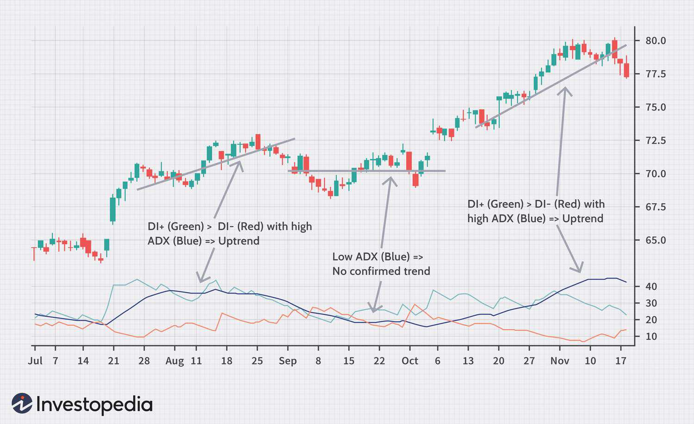

Binary options are a unique financial instrument that have gained attention in the US trading landscape for their straightforward structure and potential for rapid returns. Unlike traditional options, binary options have a simple "yes" or "no" outcome, which means a trader either receives a fixed monetary amount or nothing at all, depending on whether their prediction about the price movement of an underlying asset is correct at expiration. This simplicity and the allure of quick profits have contributed to their appeal among both novice and seasoned traders in the US. However, the relatively high risk associated with binary options necessitates a nuanced understanding and strategic approach to trading them.

Algorithmic trading, characterized by the use of computer algorithms to automate trading decisions, has emerged as a game-changer in the financial markets, including within the binary options domain. By leveraging algorithms, traders can analyze large data sets, identify patterns, and execute trades at speeds and efficiencies that surpass human capabilities. This technological advancement opens up new avenues for enhancing trading strategies in binary options, potentially optimizing returns and reducing human error. The impact of algorithmic trading on binary options is significant, as it offers the possibility of systematic, disciplined trading based on quantitative analysis rather than speculation or emotional impulse.



This article aims to explore the intersection of binary options and algorithmic trading within the US context. It will examine how the integration of algorithms may transform the binary options market, influencing trading strategies, risk management, and regulatory dynamics. Through a detailed examination, the article seeks to provide insights into this emergent confluence, outlining the benefits, challenges, and future prospects of combining binary options with algorithmic trading strategies.

## Table of Contents

## Understanding Binary Options in the US

Binary options are a type of financial instrument that allows traders to speculate on the direction of asset prices within a predetermined timeframe. The basic mechanics of binary options involve predicting whether the price of an asset will be above or below a specified level, known as the strike price, at the option's expiration. If the trader predicts correctly, they receive a fixed payout; otherwise, they lose the investment. Binary options are considered "all-or-nothing" because of their simplistic payoff structure.

In the United States, the regulatory landscape for binary options is more stringent compared to other regions, primarily to protect investors from fraud. Binary options trading is regulated by the Commodity Futures Trading Commission (CFTC) and the Securities and Exchange Commission (SEC) in the US. These agencies ensure that platforms offering binary options operate transparently and comply with federal securities laws. One of the requirements is that binary options platforms must be registered and approved as exchanges by these regulatory bodies to legally offer services to US residents. 

Key platforms and exchanges offering binary options trading in the US include the North American Derivatives Exchange (Nadex) and the Cantor Exchange. These platforms are regulated by the CFTC, which adds a layer of oversight and safety for traders. Nadex, for example, provides a wide range of markets, including [forex](/wiki/forex-system), commodities, stock indices, and events, allowing traders to engage in binary options backed by real markets.

## The Role of Algorithmic Trading

Algorithmic trading refers to the use of computer algorithms to automate trading decisions and execute orders on financial markets based on predefined criteria. These algorithms can analyze vast amounts of data, identify trading opportunities, and execute trades at speeds unattainable by human traders. Algorithmic trading operates by processing market data, applying mathematical models, and executing orders without human intervention, thereby reducing the time lag between decision-making and order execution.

The advantages of [algorithmic trading](/wiki/algorithmic-trading) in the context of binary options are significant. One major benefit is speed and efficiency; algorithms can execute trades in milliseconds, which can be crucial in binary options where decisions need to be made quickly based on small price movements. Algorithmic trading also allows for the [backtesting](/wiki/backtesting) of strategies on historical data, enabling traders to fine-tune their strategies based on past performance. Furthermore, algorithmic systems can monitor multiple markets and assets simultaneously, thus providing better opportunities for portfolio diversification and risk management.

Algorithmic trading also offers the benefit of removing emotional biases from trading decisions. Human traders are susceptible to emotional responses such as fear and greed, which can lead to poor trading decisions. Algorithms, on the other hand, adhere strictly to their programmed logic, thereby maintaining discipline in decision-making processes.

However, implementing algorithmic trading in binary options poses several challenges. One primary challenge is market [volatility](/wiki/volatility-trading-strategies). Binary options are inherently risky due to their all-or-nothing payoff structure, and market volatility can greatly affect price movements. Algorithms need to be designed with robust risk management techniques to handle such volatility, which may include setting predefined stop-loss levels or employing volatility filters to avoid trading during highly volatile periods.

Furthermore, the quality of data is crucial for algorithmic trading systems; poor data quality can lead to erroneous trading signals and potentially significant losses. Thus, continuous monitoring and updating of data sources are essential. Additionally, while algorithmic trading can process large amounts of data, it requires substantial computational resources and technical infrastructure, which might be a barrier for individual traders with limited resources.

Overall, while algorithmic trading offers substantial benefits in efficiency and discipline for binary options trading, it requires careful consideration of the associated challenges, especially those posed by market volatility and the technical requirements for implementing such systems effectively.

## Integrating Algo Trading with Binary Options

Integrating algorithmic trading with binary options can significantly enhance the decision-making process and efficiency in trading. This integration involves the application of algorithmic strategies to manage the complexities and fast-paced nature of binary options trading. 

### Strategies for Successful Integration

**Trend Following Algorithms**

One common strategy for applying algorithms in binary options trading is trend-following. Algorithms can be designed to identify and follow market trends by analyzing historical price patterns and using indicators such as moving averages or the Relative Strength Index (RSI). This approach aims to capitalize on the [momentum](/wiki/momentum) of price movements. Python can be employed to develop and test such algorithms. A simple example is using the `pandas` library to compute moving averages:

```python
import pandas as pd

def compute_moving_average(data, window):
    return data.rolling(window=window).mean()

data = pd.Series([100, 102, 101, 105, 110])  # Example price data
moving_average = compute_moving_average(data, window=3)
```

**High-Frequency Trading (HFT) in Binary Options**

High-frequency trading strategies can also be adapted for binary options. [HFT](/wiki/high-frequency-trading-strategies) utilizes sophisticated algorithms to execute a large number of orders in fractions of a second, exploiting small price fluctuations. However, this requires substantial computational resources and proximity to trading servers to minimize latency.

### Case Studies and Examples

**Market Making Strategies**

Market making, a strategy where a trader quotes both a buy and a sell price in a financial instrument, can be adapted using algorithms. An example is Nasdaq OMX launching a platform that offered binary options on the NFL games, where [liquidity](/wiki/liquidity-risk-premium) providers used algorithms to manage bid-ask spreads dynamically to hedge their positions while profiting from the spread.

### Tools and Platforms

For traders looking to integrate algorithmic trading with binary options, several tools and platforms can facilitate this process.

**MetaTrader 4 (MT4) and MetaTrader 5 (MT5)**

These are among the most popular trading platforms that support algorithmic trading through Expert Advisors (EAs). Although primarily used for Forex, they can be adapted for binary options through plugins and custom scripts.

**cTrader**

cTrader offers a robust API for developing custom trading algorithms, including those for binary options. It provides a programming environment (cAlgo) that allows traders to write algorithms in C#.

**Nadex**

As one of the major exchanges in the US offering binary options, Nadex provides an intuitive platform with a straightforward API that can be integrated with algorithmic trading systems.

In conclusion, the integration of algorithmic trading with binary options holds great promise. By leveraging strategies such as [trend following](/wiki/trend-following) and [market making](/wiki/market-making), traders can enhance their potential for profit while using platforms like MetaTrader and Nadex to efficiently implement their algorithms. However, it is crucial to remain mindful of the complexities and risks inherent in these approaches.

## Risks and Considerations

Binary options and algorithmic trading [carry](/wiki/carry-trading) several risks that traders must be aware of before engaging in such practices.

### Potential Risks Associated with Binary Options and Algorithmic Trading

Binary options are inherently high-risk financial instruments due to their all-or-nothing payout structure. The simplicity of binary options—predicting whether a financial asset will rise or fall in price within a set time frame—appeals to many traders, but this simplicity disguises significant risks. The rapid pace of trades can lead to substantial financial losses if not carefully managed.

Algorithmic trading involves using computer algorithms to automatically execute trades based on predefined criteria. While this can increase trading speed and efficiency, it also introduces risks such as technical failures, software bugs, and inadequate strategies. A poorly coded algorithm can lead to erroneous trades, potentially resulting in significant financial loss.

### Regulatory Warnings and the Risk of Fraud in Binary Options

The U.S. Commodity Futures Trading Commission (CFTC) and the Securities and Exchange Commission (SEC) have both issued warnings about the inherent risks and potential for fraud in binary options trading. Many binary options platforms operate without proper regulatory oversight, increasing the risk of fraud. Some of these platforms have been known to manipulate trading software to distort prices and payouts, refuse to credit customer accounts, or refuse to pay out legitimate withdrawal requests.

Traders should be cautious about platforms that are not registered with financial regulatory authorities. The Financial Industry Regulatory Authority (FINRA) also advises investors to ensure they are dealing with reputable and registered firms before engaging in binary options trading.

### Best Practices for Mitigating Risks When Combining Algo Trading with Binary Options

To mitigate the risks associated with binary options and algorithmic trading, traders can adopt several best practices:

1. **Thorough Backtesting and Validation**: Before deploying an algorithm, conduct rigorous backtesting and simulate trading to ensure the algorithm behaves as expected in various market conditions.

   ```python
   import pandas as pd
   import numpy as np

   # Example of backtesting a simple moving average strategy
   def backtest_strategy(data, short_window=40, long_window=100):
       signals = pd.DataFrame(index=data.index)
       signals['signal'] = 0.0

       signals['short_mavg'] = data['Close'].rolling(window=short_window, min_periods=1, center=False).mean()
       signals['long_mavg'] = data['Close'].rolling(window=long_window, min_periods=1, center=False).mean()

       signals['signal'][short_window:] = np.where(signals['short_mavg'][short_window:] > signals['long_mavg'][short_window:], 1.0, 0.0)

       # Generate trading orders
       signals['positions'] = signals['signal'].diff()

       return signals

   # Usage
   # data = pd.read_csv('historical_data.csv') # Load historical data
   # signals = backtest_strategy(data)
   ```

2. **Regulatory Compliance**: Work only with platforms and exchanges that comply with the regulations established by authorities such as the CFTC and SEC. This reduces exposure to fraud and unethical practices.

3. **Risk Management**: Implement robust risk management strategies, including stop-loss orders and diversification of assets, to control potential losses.

4. **Continuous Monitoring**: Even with automated systems, continuous monitoring is essential. Market conditions can change rapidly, and algorithms that perform well under certain conditions may not succeed in others.

5. **Educate and Stay Informed**: Continuous education on both algorithmic trading techniques and binary options market developments is crucial for adapting to changes and mitigating potential risks.

By being aware of potential risks and implementing these best practices, traders can better navigate the complexities of combining binary options with algorithmic trading.

## Future of Binary Options and Algo Trading in the US

The future of binary options and algorithmic trading in the United States is shaped by emerging trends, potential regulatory changes, and technological advancements. These factors contribute to the evolving landscape, offering both opportunities and challenges for traders and investors.

**Emerging Trends**

1. **AI and Machine Learning Integration**: The integration of artificial intelligence (AI) and machine learning (ML) in trading algorithms is a significant trend. These technologies enable more sophisticated data analysis and pattern recognition, which can enhance decision-making processes. For example, AI-driven models can adapt to changing market conditions and optimize trading strategies for binary options, potentially increasing profitability.

2. **Increased Data Availability**: With the rise of big data, traders have access to vast amounts of information, facilitating more informed trading decisions. This increased data availability empowers algorithmic trading systems to incorporate a wide variety of inputs and refine strategies based on real-time market data.

3. **Diversification of Algorithmic Strategies**: As algorithmic trading becomes more prevalent in binary options, there is a growing emphasis on developing diverse strategies. Traders are exploring different approaches, such as statistical arbitrage, sentiment analysis, and volatility prediction, to mitigate risks and maximize returns.

**Potential Regulatory Changes**

Regulatory changes are anticipated to impact binary options and algorithmic trading in the U.S. The Commodity Futures Trading Commission (CFTC) and the Securities and Exchange Commission (SEC) are key regulatory bodies that may introduce new regulations to enhance market transparency and protect investors. Potential changes include stricter oversight of trading platforms and more rigorous disclosure requirements. Such regulations could increase compliance costs for traders and platforms but may also bolster investor confidence and reduce fraudulent activities.

**Market Evolution and Technology**

1. **Enhanced Trading Platforms**: The evolution of trading platforms is expected to continue, with advancements in user interfaces, execution speed, and analytical tools. These improvements aim to provide traders with a more efficient and user-friendly experience while enabling better integration of algorithmic strategies.

2. **Blockchain and Smart Contracts**: The adoption of blockchain technology and smart contracts presents opportunities for securing transactions and automating trade settlements. These technologies could provide greater transparency and efficiency in binary options trading, reducing the risk of manipulations and ensuring fair practices.

3. **Analytics and Predictive Modeling**: The future will likely witness more refined analytics and predictive modeling techniques. These advancements will facilitate the development of algorithms that can anticipate market movements with greater precision, thus improving the accuracy of binary options trading strategies.

**Forecast**

The binary options and algorithmic trading market in the U.S. is expected to evolve rapidly as technology and regulatory landscapes change. Traders can anticipate a more sophisticated trading environment characterized by advanced algorithms, enhanced data analytics, and robust regulatory frameworks. As these elements converge, the potential for increased profitability and risk mitigation will grow, albeit alongside challenges in compliance and strategy adaptation.

In summary, the future of binary options and algorithmic trading in the U.S. is promising, with technology playing a central role in shaping market dynamics. While potential regulatory changes may introduce challenges, they also offer opportunities for building a more secure and transparent trading environment. Traders must remain adaptable, leveraging technological advancements to navigate the evolving landscape effectively.

## Conclusion

Binary options and algorithmic trading represent a convergence of straightforward financial instruments with sophisticated trading technologies, particularly within the US market. Binary options provide a simple mechanism for traders to speculate on the movement of assets with a yes/no proposition, which, when combined with algorithmic trading, can automate and enhance decision-making processes, allowing for potentially faster and more accurate trading outcomes.

Despite the simplicity and potential profitability, binary options, especially within the algorithmic domain, come with inherent risks. The regulatory landscape in the US is stringent, with the Commodity Futures Trading Commission (CFTC) and Securities and Exchange Commission (SEC) imposing strict guidelines to prevent fraud and protect traders. These regulations require traders and platforms to ensure compliance, which adds a layer of complexity.

Algorithmic trading can enhance binary options trading by improving efficiency and enabling traders to execute strategies that may be difficult to perform manually, such as high-frequency trading. However, the sophistication of these algorithms can introduce vulnerabilities, such as heightened exposure to market volatility and potential misfires, leading to significant losses. It's critical for traders to balance technology use with risk management strategies to mitigate these pitfalls.

For those considering this trading approach, staying informed about ongoing regulatory changes, advancements in trading algorithms, and the evolving market landscape is essential. Engaging with educational resources, continuously testing strategies, and remaining adaptable to new tools and techniques can offer significant advantages. As the landscape of binary options and algorithmic trading continues to develop, traders are encouraged to cultivate a robust understanding of both markets to capitalize on their benefits and safeguard against potential pitfalls.

## References & Further Reading

[1]: Bergstra, J., Bardenet, R., Bengio, Y., & Kégl, B. (2011). ["Algorithms for Hyper-Parameter Optimization."](https://papers.nips.cc/paper/4443-algorithms-for-hyper-parameter-optimization) Advances in Neural Information Processing Systems 24.

[2]: ["Advances in Financial Machine Learning"](https://www.amazon.com/Advances-Financial-Machine-Learning-Marcos/dp/1119482089) by Marcos Lopez de Prado

[3]: ["Evidence-Based Technical Analysis: Applying the Scientific Method and Statistical Inference to Trading Signals"](https://www.amazon.com/Evidence-Based-Technical-Analysis-Scientific-Statistical/dp/0470008741) by David Aronson

[4]: ["Machine Learning for Algorithmic Trading"](https://github.com/stefan-jansen/machine-learning-for-trading) by Stefan Jansen

[5]: ["Quantitative Trading: How to Build Your Own Algorithmic Trading Business"](https://www.amazon.com/Quantitative-Trading-Build-Algorithmic-Business/dp/1119800064) by Ernest P. Chan