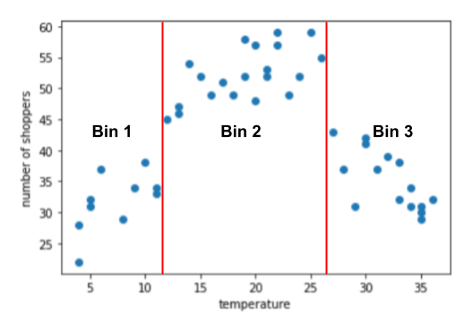

## Table of Contents

## What is binning in the context of machine learning?

Binning is a data preprocessing technique used in machine learning to group continuous data into discrete categories or bins. This process helps simplify the data, making it easier to analyze and model. For instance, if you have data on people's ages, you might group them into bins like '0-18', '19-35', '36-60', and '61+'. By doing this, you transform a continuous variable into a categorical one, which can be useful for certain types of analysis or algorithms that work better with categorical data.

One common use of binning is to handle outliers or to smooth the data. For example, if you have a dataset with income levels, and a few individuals have extremely high incomes, these outliers can skew your analysis. By binning the income data, you can group these high incomes into a single bin, reducing their impact on your model. Additionally, binning can help in creating more stable and interpretable models by reducing the effect of noise and minor fluctuations in the data.

## Why is binning used in data preprocessing?

Binning is used in data preprocessing to make data easier to work with. When you have a lot of numbers, like ages or incomes, it can be hard to see patterns or make predictions. By putting these numbers into groups, or bins, you turn a long list of numbers into a smaller list of categories. This makes it simpler to understand and use the data. For example, instead of dealing with every single age from 1 to 100, you might group ages into categories like 'child', 'young adult', 'adult', and 'senior'.

Another reason to use binning is to handle unusual data points, called outliers. Sometimes, a few numbers in your data set can be much higher or lower than the rest. These outliers can mess up your analysis or predictions. By putting these unusual numbers into a bin with other numbers, you can reduce their impact. This way, your data becomes smoother and more reliable for making decisions or building models. Binning also helps in creating clearer and easier-to-understand models by reducing small changes or noise in the data.

## What are the different types of binning methods?

Binning methods are ways to group numbers into categories. One common type is equal-width binning, where you divide the range of numbers into equal parts. For example, if you have ages from 1 to 100, you might make bins like 1-25, 26-50, 51-75, and 76-100. This is simple but can lead to bins with different numbers of items if the data is uneven. Another type is equal-frequency binning, where you make sure each bin has about the same number of items. This can be useful when you want to spread out your data evenly, but it can make the bin sizes different.

Another method is k-means binning, which uses a clustering algorithm to group similar numbers together. This can be more complex but can lead to more meaningful bins based on the natural groupings in your data. There's also adaptive binning, where the bin sizes change based on the data's density. This method can be useful for capturing the shape of your data more accurately. Each of these methods has its own use, depending on what you want to do with your data.

Lastly, there's custom binning, where you decide the bin boundaries yourself based on what makes sense for your specific situation. For example, if you're looking at income levels, you might choose bins like 'low', 'medium', and 'high' based on what those terms mean in your context. This method gives you the most control over how your data is grouped, but it requires more thought and understanding of your data.

## How does equal-width binning work?

Equal-width binning is a way to group numbers into categories where each category, or bin, has the same size. Imagine you have ages from 1 to 100. To use equal-width binning, you decide how many bins you want, say 4. You then divide the total range (100 - 1 = 99) by the number of bins (4) to get the width of each bin. In this case, each bin would be about 25 years wide. So, your bins would be 1-25, 26-50, 51-75, and 76-100. This method is simple because you just need to do some basic math to set up your bins.

However, equal-width binning can have a problem if your data is not spread out evenly. For example, if most of your data is in the lower ages, like between 1 and 30, the first bin (1-25) might have a lot more numbers than the others. This can make some bins less useful because they might have too many or too few items. Despite this, equal-width binning is easy to understand and apply, making it a good choice when you want a simple way to group your data.

## How does equal-frequency binning differ from equal-width binning?

Equal-frequency binning is different from equal-width binning because it focuses on making sure each bin has about the same number of items, not the same size. Imagine you have ages from 1 to 100 again. With equal-frequency binning, you decide how many bins you want, say 4. Instead of dividing the range by the number of bins, you sort the ages and then split them so each bin has roughly the same number of ages. So, if you have 100 ages, each bin would have about 25 ages. This method is good when you want to spread out your data evenly, but it can make the bin sizes different. For example, one bin might be 1-15, another 16-30, another 31-60, and the last 61-100.

Equal-width binning, on the other hand, makes bins that are all the same size. Using the same example of ages from 1 to 100, if you want 4 bins, you divide the range (99) by 4 to get a bin width of about 25. So, your bins would be 1-25, 26-50, 51-75, and 76-100. This method is simple and easy to understand, but it can lead to bins with very different numbers of items if the data is uneven. For instance, if most ages are between 1 and 30, the first bin (1-25) might have a lot more ages than the others. Equal-width binning is great when you want a straightforward way to group your data, but it might not handle uneven data as well as equal-frequency binning.

## What is the purpose of using k-means binning?

K-means binning is used to group numbers into categories in a smart way. Instead of just splitting numbers into equal parts or making sure each group has the same number of items, k-means binning looks at the numbers and tries to find natural groups. It does this by using a special math method called k-means clustering. This method puts numbers that are close to each other into the same group, making the groups more meaningful because they are based on how the numbers are spread out.

Using k-means binning can help you understand your data better because it shows you where the natural breaks in your data are. For example, if you have a list of ages, k-means binning might show you that there are natural groups around certain ages, like a group for young children, another for teenagers, and another for adults. This can be more useful than just splitting the ages into equal parts because it respects the natural patterns in your data.

## Can you explain how decision tree binning is performed?

Decision tree binning is a way to group numbers into categories using a decision tree. A decision tree is like a flowchart that helps you make decisions by asking questions and following the answers. In decision tree binning, the tree looks at your numbers and tries to find the best way to split them into groups. It does this by finding points where splitting the data makes the groups as different from each other as possible. For example, if you have ages from 1 to 100, the tree might decide to split at age 18 because that's where the data changes a lot, like between children and adults.

Once the decision tree has made all its splits, you end up with bins that are based on the natural patterns in your data. This method is good because it can find complex patterns that other binning methods might miss. For instance, it might find that ages 1-12, 13-18, 19-35, and 36-100 are good groups because they show different stages of life. Decision tree binning is useful when you want to understand your data better and make sure your bins are based on what the data is telling you, not just on simple math.

## What are the advantages of using binning for handling continuous variables?

Binning helps make continuous data easier to understand and use. When you have a lot of numbers, like ages or incomes, it can be hard to see patterns or make predictions. By grouping these numbers into bins, you turn a long list of numbers into a smaller list of categories. This makes it simpler to analyze the data and can help you see trends more clearly. For example, instead of looking at every single age from 1 to 100, you might group ages into categories like 'child', 'young adult', 'adult', and 'senior'. This way, you can quickly understand the age distribution in your data.

Binning also helps handle unusual data points, called outliers. Sometimes, a few numbers in your data set can be much higher or lower than the rest. These outliers can mess up your analysis or predictions. By putting these unusual numbers into a bin with other numbers, you can reduce their impact. This makes your data smoother and more reliable for making decisions or building models. Binning can also help create clearer and easier-to-understand models by reducing small changes or noise in the data, making it a useful tool in data preprocessing.

## What are the potential drawbacks of binning in machine learning?

Binning can sometimes lose important details in your data. When you group numbers into bins, you turn a lot of different numbers into just a few categories. This can make it hard to see small but important differences between the numbers. For example, if you bin ages into groups like '0-18', '19-35', '36-60', and '61+', you might miss important details about people who are 17 versus 18, even though they are in the same bin. This loss of detail can make your models less accurate because they are based on less specific information.

Another problem with binning is that it can make your data less smooth. When you put numbers into bins, you are forcing them into categories that might not fit well with the natural patterns in your data. This can lead to sudden jumps between bins, which can make your models less reliable. For example, if you have income data and you bin it into 'low', 'medium', and 'high', people right at the edge of a bin might be treated very differently even though their incomes are almost the same. This can cause problems in your analysis and predictions.

## How does binning impact the performance of machine learning models?

Binning can help [machine learning](/wiki/machine-learning) models by making data easier to understand and use. When you group numbers into bins, you turn a long list of numbers into a smaller list of categories. This can make it simpler for the model to find patterns and make predictions. For example, if you have ages from 1 to 100, binning them into groups like 'child', 'young adult', 'adult', and 'senior' can help the model see the age distribution more clearly. Binning can also handle unusual data points, called outliers, by putting them into bins with other numbers. This makes the data smoother and can lead to more reliable predictions.

However, binning can also cause problems for machine learning models. When you bin numbers, you lose some of the detailed information in your data. This can make your models less accurate because they are based on less specific information. For example, if you bin ages into groups like '0-18', '19-35', '36-60', and '61+', you might miss important differences between people who are 17 and 18, even though they are in the same bin. Binning can also make your data less smooth, causing sudden jumps between bins. This can make your models less reliable, especially if the bins do not fit well with the natural patterns in your data.

## What considerations should be taken into account when choosing the number of bins?

When choosing the number of bins, you need to think about how detailed you want your data to be. If you use too few bins, you might miss important patterns in your data. For example, if you bin ages into just two groups, like 'young' and 'old', you might not see the differences between teenagers and young adults. On the other hand, if you use too many bins, you might end up with groups that are too small to be useful. This can make your data hard to understand and can lead to overfitting in your models, where they fit the training data too closely but don't work well on new data.

Another thing to consider is the size of your dataset. If you have a lot of data, you can use more bins without making each bin too small. But if you have less data, you need to be careful not to use too many bins, or you might end up with bins that don't have enough data points to be meaningful. A common rule of thumb is to use the square root of the number of data points as a starting point for the number of bins. For example, if you have 100 data points, you might start with around $$ \sqrt{100} = 10 $$ bins. However, you should always check your data and adjust the number of bins based on what makes sense for your specific situation.

## How can binning be optimized for specific machine learning algorithms?

Binning can be optimized for specific machine learning algorithms by choosing the right method and number of bins that fit the algorithm's needs. For example, decision tree algorithms can benefit from decision tree binning because it finds natural splits in the data that can help the tree make better decisions. If you're using a decision tree, you might want to use fewer bins to avoid overfitting, where the tree fits the training data too closely but doesn't work well on new data. On the other hand, if you're using a k-nearest neighbors (KNN) algorithm, you might want to use more bins to keep more detail in the data, because KNN relies on the distances between data points.

Another way to optimize binning is by looking at the performance of your model. You can try different numbers of bins and see which one gives you the best results. For example, if you're using a logistic regression model, you might start with the square root of the number of data points as the number of bins, like $$ \sqrt{n} $$ where n is the number of data points. Then, you can adjust the number of bins up or down and see how it affects the model's accuracy. This way, you can find the best number of bins for your specific dataset and algorithm.

## References & Further Reading

[1]: Han, J., Pei, J., & Kamber, M. (2011). [Data Mining: Concepts and Techniques](https://www.sciencedirect.com/book/9780123814791/data-mining-concepts-and-techniques) (3rd ed.). Morgan Kaufmann.

[2]: Mohammad, T. (2012). ["Data Preprocessing Techniques for Machine Learning"](https://www.scalablepath.com/data-science/data-preprocessing-phase) arXiv:1209.1134.

[3]: Hastie, T., Tibshirani, R., & Friedman, J. (2009). [The Elements of Statistical Learning: Data Mining, Inference, and Prediction](https://link.springer.com/book/10.1007/978-0-387-84858-7) (2nd ed.). Springer.

[4]: James, G., Witten, D., Hastie, T., & Tibshirani, R. (2013). [An Introduction to Statistical Learning](https://link.springer.com/book/10.1007/978-1-0716-1418-1). Springer.

[5]: Liu, H., & Motoda, H. (2007). [Computational Methods of Feature Selection](https://www.taylorfrancis.com/books/edit/10.1201/9781584888796/computational-methods-feature-selection-huan-liu-hiroshi-motoda). Chapman & Hall/CRC. 

[6]: Aggarwal, C. C. (2015). [Data Mining: The Textbook](https://link.springer.com/book/10.1007/978-3-319-14142-8). Springer.