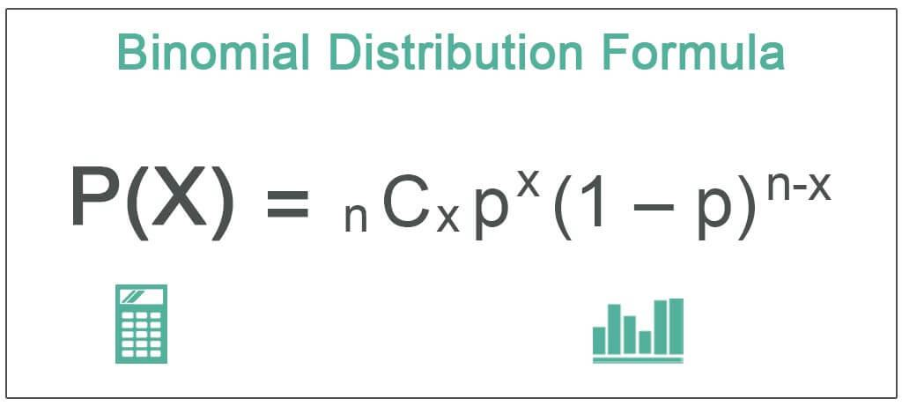

In today's finance-driven world, understanding statistical models is essential for making informed decisions. Among these models, the binomial distribution plays a significant role, particularly in its applications in statistical analysis and algorithmic trading. As a key concept in probability theory, the binomial distribution provides the foundations for predicting and evaluating the outcomes of various binary events.

The binomial distribution is crucial for its ability to model real-world processes that hinge on two possible outcomes, commonly referred to as "success" and "failure." This makes it especially useful in the finance sector, where it is employed to assess and manage risk, optimize trading strategies, and analyze market trends.



Algorithmic trading, or algo trading, relies extensively on statistical models to make predictions about market movements and trade outcomes. By utilizing the insights provided by binomial distribution, traders can enhance their decision-making processes, leading to more optimized trading outcomes and improved risk management. The distribution's statistical properties enable traders and analysts to quantitatively understand and predict the probability of achieving specific outcomes, making it a valuable tool for both new and experienced professionals in the finance industry.

This article will explore the statistical properties of binomial distribution, its practical applications in finance, and how traders can leverage these insights for more strategic trading outcomes. Whether you are new to finance or an established professional, understanding and implementing these concepts can significantly enhance your ability to make data-driven decisions.

## Table of Contents

## Understanding Binomial Distribution

The binomial distribution is a fundamental concept in probability theory and statistics, serving as a discrete probability distribution that models the number of successes in a given number of independent binary trials, known as Bernoulli trials. Each trial consists of two possible outcomes: success and failure. The trials are characterized by a constant probability of success, denoted as $p$. The number of trials is represented by $n$.

Central to the understanding of the binomial distribution are its key properties: the mean and variance. The mean of the distribution is calculated as $np$, where $n$ is the total number of trials and $p$ is the probability of success in each trial. This mean provides an expectation of the number of successes one might anticipate after conducting all the trials.

The variance, representing the distribution's spread or variability, is given by $np(1-p)$. This formula accounts for the number of trials, the probability of success, and the probability of failure (represented as $1-p$). Together, the mean and variance offer a comprehensive view of the expected outcomes and variability within a set of trials, enhancing the understanding of binary outcomes in various contexts.

The binomial distribution can be effectively modeled using the binomial probability formula, which calculates the probability of achieving exactly $k$ successes in $n$ trials: 

$$

P(X = k) = C(n, k) \cdot p^k \cdot (1-p)^{n-k} 
$$

where $C(n, k)$ is the binomial coefficient, calculated as $\frac{n!}{k!(n-k)!}$, representing the number of ways to choose $k$ successes from $n$ trials.

These statistical characteristics allow the binomial distribution to be applied in various practical scenarios, especially those involving predictive models and assessments of binary outcomes. Understanding these foundational elements provides traders, analysts, and researchers with tools necessary for evaluating probabilities in numerous applications, including finance, science, and engineering.

## Binomial Distribution in Financial Context

In finance, the binomial distribution serves as a valuable tool for assessing risk and predicting probable outcomes in various trading scenarios. By modeling the number of successful trades within a set of transactions, this statistical method offers insights into market behaviors that are crucial for strategic financial decision-making.

One of the primary applications of the binomial distribution in finance is to predict the number of successful trades. Traders and analysts use this model to calculate the probability of achieving a certain number of successful trades over a given period. This method supports the development of trading strategies by providing an understanding of the likelihood of outcomes based on historical data. For instance, by assigning a probability of success to individual trades, the distribution enables traders to forecast potential profit or loss scenarios effectively.

Estimating stock price movements is another area where the binomial distribution is applied. In this context, the distribution can be utilized to model future stock prices over discrete time intervals, assuming at each interval that the stock price can move to one of two possible values: up or down. The binomial tree model, a popular method derived from the binomial distribution, is employed to estimate the expected price of stocks and options, allowing traders to price options more accurately and manage portfolios with greater precision.

Beyond trading strategies, the binomial distribution plays a role in modeling credit default risks. Financial institutions rely on binomial models to evaluate the probability of a borrower defaulting on a loan. By treating each borrower as an independent trial with a specific probability of default, institutions can estimate the risk associated with lending portfolios. This analysis aids in risk assessment and pricing strategies, ensuring that interest rates and loan terms are appropriately aligned with the perceived risk.

The following Python code snippet demonstrates how one might calculate the probability of a specified number of defaults in a portfolio using a binomial distribution:

```python
import scipy.stats as stats

# Define parameters
n = 100  # number of loans
p = 0.02  # probability of default per loan
k = 5  # target number of defaults

# Calculate binomial probability
probability_of_k_defaults = stats.binom.pmf(k, n, p)
print(f"Probability of exactly {k} defaults: {probability_of_k_defaults:.5f}")
```

This approach provides essential data for determining capital reserves and setting appropriate risk margins, ultimately contributing to the financial health and stability of institutions.

The binomial distribution's ability to quantify binary outcomes and associated probabilities makes it indispensable in financial modeling, supporting effective risk management and strategic planning across diverse financial activities.

## Algorithmic Trading and Statistical Analysis

Algorithmic trading has transformed the landscape of financial markets, employing sophisticated statistical models to forecast market trends and make trading decisions. Among these models, the binomial distribution stands out for its effectiveness in predicting binary outcomes, such as the success or failure of a trade.

Statistical analysis using the binomial distribution is essential for traders aiming to assess the probability that their trading strategies will yield profits. By considering a series of independent and identically distributed binary outcomes, traders can estimate the likelihood of a specific number of successful trades within a set of total trades. This is mathematically represented as:

$$
P(X = k) = C(n, k) \cdot p^k \cdot (1-p)^{n-k}
$$

where $P(X = k)$ is the probability of having $k$ successful trades, $C(n, k)$ is the binomial coefficient, $p$ is the probability of success on an individual trade, and $n$ is the total number of trades.

Traders can leverage these insights to establish expected success rates, thereby automating their decision-making processes for entering or exiting trades. By defining parameters such as the success probability $p$ and the number of trades $n$, traders can develop strategies that align with their risk tolerance and financial objectives.

The application of the binomial distribution in [algorithmic trading](/wiki/algorithmic-trading) involves the integration of systematic trading rules that respond dynamically to the probability calculations. Python, for instance, offers several libraries, such as NumPy and SciPy, which simplify these operations. Here is a brief example illustrating how one might calculate the probability of achieving a certain number of successful trades using Python:

```python
from scipy.stats import binom

# Parameters
n = 15  # total trades
p = 0.6  # probability of success per trade
k = 8  # number of successful trades

# Calculate binomial probability
probability = binom.pmf(k, n, p)
print(f"The probability of exactly {k} successful trades out of {n} is {probability:.4f}")
```

This analytical approach supports traders in structuring their trading systems with precision, ensuring that trades are executed based on statistically sound principles. The seamless integration of binomial distribution calculations into algorithmic trading platforms enhances the accuracy and effectiveness of trading strategies, making it a vital component of modern financial analytics.

## Practical Applications in Algo Trading

Traders often rely on the binomial distribution to compute the likelihood of achieving a desired number of successful trades from a fixed total number of trades. This process involves determining the probability of success in a single trade and using this information to forecast the outcomes over multiple trades. By applying the binomial probability formula, traders gain invaluable insights into expected trading performance.

The binomial formula $P(X = k) = C(n, k) \cdot p^k \cdot (1-p)^{(n-k)}$, where $C(n, k)$ is the binomial coefficient, helps traders quantify the probability of securing exactly $k$ successes in $n$ independent trade attempts. For instance, if a trading strategy has a 60% chance (p = 0.6) of success per trade and the trader conducts 15 trades, the chance of achieving exactly 8 successful trades can be calculated using the formula.

Risk management is a critical component that leverages these probability calculations to establish appropriate risk parameters and tolerance levels. With a clear understanding of the likely outcomes, traders can set stop-loss and take-profit limits, ensuring that they maintain a balanced approach towards potential risks and rewards. By configuring these strategies based on calculated probabilities, traders enhance their ability to survive unfavorable market conditions while capitalizing on favorable ones.

Furthermore, binomial distribution plays a pivotal role in decision-making processes for automated trading systems. By integrating statistical analysis within algorithmic frameworks, traders can automate the determination of entry and [exit](/wiki/exit-strategy) points for trades. This ensures a systematic and disciplined trading approach, reducing emotional bias and enhancing the overall reliability of trading strategies. The application of binomial [statistics](/wiki/bayesian-statistics) enables automated systems to continuously adapt and optimize trading decisions in response to market dynamics, boosting both efficiency and potential profitability.

## Calculating Binomial Probabilities

The binomial distribution provides a probabilistic framework for determining the likelihood of a given number of successes in a fixed number of independent trials, each with the same probability of success. The associated probability mass function is expressed as:

$$
P(X = k) = C(n, k) \times p^k \times (1-p)^{n-k}
$$

where $C(n, k)$ represents the binomial coefficient, commonly calculated as $\frac{n!}{k!(n-k)!}$, $n$ is the total number of trials, $k$ is the number of successful outcomes of interest, and $p$ denotes the probability of success on each trial.

### Practical Example

Consider a scenario where a trader seeks to determine the probability of achieving exactly 8 successful trades out of a total of 15, given a 60% probability of success per trade. Here, $n = 15$, $k = 8$, and $p = 0.6$.

#### Step-by-step Calculation

1. **Calculate the Binomial Coefficient $C(15, 8)$:**

   \[ C(15, 8) = \frac{15!}{8!(15-8)!} = \frac{15 \times 14 \times 13 \times 12 \times 11 \times 10 \times 9}{8 \times 7 \times 6 \times 5 \times 4 \times 3 \times 2 \times 1}
$$

   Calculating this yields $C(15, 8) = 6,435$.

2. **Compute $p^k = 0.6^8$:**

   \[ 0.6^8 \approx 0.0168
$$

3. **Determine $(1-p)^{n-k} = 0.4^7$:**

   \[ 0.4^7 \approx 0.0016384
$$

4. **Calculate the Probability:**

   \[ P(X = 8) = 6,435 \times 0.0168 \times 0.0016384 \approx 0.103
$$

Thus, the probability of achieving exactly 8 successful trades out of 15, with each individual trade having a 60% success chance, is approximately 10.3%.

### Python Implementation

To simplify and ensure accuracy, Python can be used for this computation:

```python
from math import comb

# Parameters
n = 15
k = 8
p = 0.6

# Compute probability using the binomial formula
probability = comb(n, k) * (p ** k) * ((1 - p) ** (n - k))

print(f"The probability of exactly {k} successful trades out of {n} is approximately {probability:.3f}.")
```

This Python script employs the `comb` function from the `math` module for efficient computation of the binomial coefficient, enhancing both speed and precision. Through such practical applications, traders can model and predict outcomes, supporting decision-making and strategy optimization.

## Software and Tools for Binomial Analysis

In statistical computing, a variety of software tools and libraries are available to assist traders and analysts in performing binomial analysis effectively. Among these, Python stands out due to its versatile libraries such as NumPy and SciPy, which simplify complex calculations. NumPy provides support for large, multi-dimensional arrays and matrices, while SciPy adds additional functionality for statistical distributions, making them invaluable for calculating and visualizing binomial distributions.

In Python, the `scipy.stats` module includes a binomial distribution function that can be used to compute probabilities. For example, to calculate the probability of observing exactly $k$ successes in $n$ trials with a success probability $p$, one would utilize the following code:

```python
from scipy.stats import binom

# Parameters
n = 15  # number of trials
k = 8   # number of successes
p = 0.6 # probability of success

# Calculate binomial probability
probability = binom.pmf(k, n, p)
print(f"Probability of {k} successful trades out of {n} is {probability:.4f}")
```

For those inclined to use R, it offers the `dbinom` function in its `stats` package as a counterpart, also designed for calculating the probability of a given number of successes in a binomial distribution. This provides an efficient method for performing the same computations as in Python, highlighting R's strengths in statistical analysis.

Excel, a widely used tool in the financial industry, offers functions such as `BINOM.DIST` to compute binomial probabilities directly within spreadsheets. This functionality is particularly useful for traders who prefer integrating statistical analysis with their data in a single platform.

Moreover, algorithmic trading platforms themselves generally incorporate or provide access to binomial analysis functions. Platforms such as MetaTrader or ThinkOrSwim might include custom scripting languages or allow integration with external scripts to perform these calculations, facilitating seamless implementation in trading strategies.

These tools enable traders to compute and visualize binomial distributions efficiently, thereby bolstering their analytical capabilities and improving the robustness of their trading strategies. Understanding how to leverage these software options offers a significant advantage in the fast-paced environment of algorithmic trading.

## Conclusion

The binomial distribution serves as a fundamental tool for algorithmic traders and analysts, primarily due to its powerful capabilities in predicting binary outcomes. This function is crucial in trading, where decisions often hinge on the success or failure of a strategy over a series of trades. By assessing the likelihood of specific outcomes, traders can make informed decisions that optimize profitability and minimize risk.

The application of the binomial distribution facilitates understanding the probabilities associated with trading, allowing practitioners to anticipate and prepare for various scenarios. It enables traders to compute the expected number of successes in a series of trades, thereby providing insights into potential return on investments. Understanding these probabilities equips traders with the data necessary to set realistic expectations and to implement risk management strategies effectively.

Moreover, implementing these statistical concepts through computational tools like Python, utilizing libraries such as NumPy and SciPy, further enhances the reliability and efficiency of algorithmic trading processes. These tools offer functions that simplify the computation and visualization of binomial distributions, making statistical analysis not only more accessible but also more accurate.

In conclusion, integrating the binomial distribution into the analytical framework of trading strategies significantly strengthens decision-making capabilities. It empowers traders to systematically evaluate potential outcomes and adjust their strategies accordingly, contributing to a robust risk management approach that is essential for long-term success in financial markets.

## References & Further Reading

[1]: ["Introduction to Probability"](https://open.umn.edu/opentextbooks/textbooks/1529) by Dimitri P. Bertsekas and John N. Tsitsiklis

[2]: Cuthbertson, K., & Nitzsche, D. (2001). ["Quantitative Financial Economics: Stocks, Bonds and Foreign Exchange."](https://books.google.com/books/about/Quantitative_Financial_Economics.html?id=iEQetzC6qZ0C) John Wiley & Sons.

[3]: ["Advances in Financial Machine Learning"](https://www.amazon.com/Advances-Financial-Machine-Learning-Marcos/dp/1119482089) by Marcos Lopez de Prado

[4]: ["Quantitative Trading: How to Build Your Own Algorithmic Trading Business"](https://www.amazon.com/Quantitative-Trading-Build-Algorithmic-Business/dp/1119800064) by Ernest P. Chan

[5]: ["Risk Management and Financial Institutions"](https://books.google.com/books/about/Risk_Management_and_Financial_Institutio.html?id=1J1QDwAAQBAJ) by John C. Hull

[6]: ["Machine Learning for Algorithmic Trading"](https://github.com/stefan-jansen/machine-learning-for-trading) by Stefan Jansen

[7]: ["Evidence-Based Technical Analysis: Applying the Scientific Method and Statistical Inference to Trading Signals"](https://www.amazon.com/Evidence-Based-Technical-Analysis-Scientific-Statistical/dp/0470008741) by David Aronson

[8]: Ross, S.M. (2014). ["Introduction to Probability Models"](https://www.sciencedirect.com/book/9780124079489/introduction-to-probability-models) Academic Press.