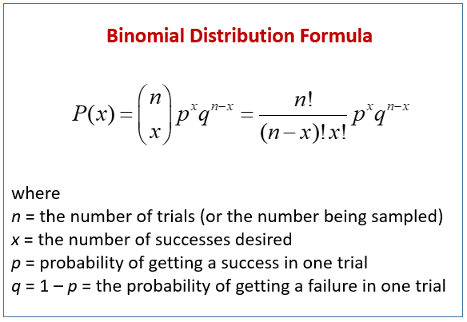

## Table of Contents

## What is the binomial distribution?

The binomial distribution is a way to figure out the chances of getting a certain number of successes in a set number of tries. Imagine you are flipping a coin. Each flip is a try, and getting heads could be a success. If you flip the coin 10 times, the binomial distribution can tell you the probability of getting exactly 5 heads out of those 10 flips.

It's useful when each try has only two possible outcomes, like yes or no, success or failure. The tries must be independent, meaning the result of one try doesn't affect the others. Also, the probability of success should stay the same for each try. For example, if you're checking if it rains on certain days, each day's chance of rain should be the same and whether it rains today shouldn't affect tomorrow's chances. This makes the binomial distribution a handy tool for many real-life situations.

## What are the key parameters of a binomial distribution?

The binomial distribution has two main parameters: the number of trials, often called 'n', and the probability of success on each trial, called 'p'. 'n' is just how many times you do something, like flipping a coin 10 times. 'p' is the chance that each flip will come up heads, say 50% or 0.5. These two numbers are all you need to set up a binomial distribution and figure out the chances of different outcomes.

For example, if you're looking at the chance of getting exactly 3 heads in 10 coin flips, you would use 'n' as 10 and 'p' as 0.5. These parameters help you calculate the probability of getting exactly 3 successes (heads) out of your 10 trials (flips). By changing 'n' or 'p', you can explore different scenarios and see how the probabilities change.

## How is the binomial distribution formula derived?

The binomial distribution formula comes from thinking about the chances of getting a certain number of successes in a set number of tries. Imagine you're flipping a coin 10 times and want to know the chance of getting exactly 5 heads. Each flip is independent, and the chance of getting heads stays the same each time. To find the probability of getting exactly 5 heads, you need to consider all the different ways you could get 5 heads in 10 flips. This is where combinations come in. The number of ways to choose 5 heads out of 10 flips is given by the combination formula, which is "10 choose 5".

Once you know how many ways you can get 5 heads, you need to figure out the probability of any one specific sequence that has 5 heads and 5 tails. The chance of getting heads on any single flip is 'p', and the chance of getting tails is '1 - p'. So, the probability of one specific sequence with 5 heads and 5 tails is 'p' to the power of 5 (for the heads) times '(1 - p)' to the power of 5 (for the tails). Multiply this by the number of ways to get 5 heads (from the combination formula), and you get the binomial distribution formula: P(X = k) = (n choose k) * p^k * (1 - p)^(n - k). Here, 'n' is the number of trials, 'k' is the number of successes you're looking for, and 'p' is the probability of success on each trial.

## What are the assumptions underlying the binomial distribution?

The binomial distribution is based on some important assumptions. First, each trial or experiment has to have only two outcomes. Think of it like flipping a coin where you can only get heads or tails. In more general terms, these outcomes are called success and failure. You need to decide what counts as a success before you start. Second, all the trials need to be independent. This means the outcome of one trial doesn't affect the outcome of any other trial. If you flip a coin, whether you get heads on the first flip doesn't change your chances of getting heads on the next flip.

Another key assumption is that the probability of success stays the same for every trial. In our coin flip example, the chance of getting heads should be the same every time you flip the coin. If you're checking if it rains on certain days, the chance of rain should be the same for each day you look at. These assumptions make the binomial distribution a useful tool for figuring out the chances of getting a certain number of successes in a set number of tries.

## How do you calculate the mean and variance of a binomial distribution?

The mean of a binomial distribution tells you what you would expect on average if you did the experiment many times. It's pretty simple to find: just multiply the number of trials, which we call 'n', by the chance of success in each trial, which is 'p'. So, the mean, or expected value, is 'n' times 'p'. If you're flipping a coin 10 times and the chance of getting heads is 0.5, the mean would be 10 times 0.5, which equals 5. This means, on average, you'd expect to see 5 heads out of 10 flips.

The variance of a binomial distribution shows how spread out the results might be. To calculate it, you multiply the number of trials 'n' by the probability of success 'p', and then multiply that by the probability of failure, which is '1 - p'. So, the variance is 'n' times 'p' times '1 - p'. If you're still flipping that coin 10 times with a 0.5 chance of heads, the variance would be 10 times 0.5 times 0.5, which equals 2.5. This tells you how much the number of heads you get might vary from the mean of 5.

## Can you explain the shape of the binomial distribution and how it changes with different parameters?

The shape of a binomial distribution looks like a bell curve, but it can be a bit lumpy or jagged depending on the number of trials and the probability of success. When you have a small number of trials, the distribution can look like a series of spikes, with each spike showing the chance of getting a certain number of successes. As the number of trials goes up, the distribution starts to look more like a smooth bell curve. If the probability of success is close to 0.5, the distribution will be symmetrical, meaning it's just as likely to get a lot of successes as it is to get a lot of failures. But if the probability of success is very high or very low, the distribution will be skewed, leaning more towards one side.

Changing the parameters of the binomial distribution can make it look quite different. If you increase the number of trials but keep the probability of success the same, the distribution will spread out more but still keep the same general shape. The peak of the distribution, which shows the most likely number of successes, will move to the right if you increase the probability of success, and to the left if you decrease it. If the probability of success is very close to 0 or 1, the distribution will become very narrow and tall, because almost all the trials will end up with the same result. So, playing around with the number of trials and the probability of success can really change how the binomial distribution looks.

## What is the relationship between the binomial distribution and the normal distribution?

The binomial distribution and the normal distribution are connected in a special way. When you have a lot of trials in a binomial distribution, and the probability of success is not too close to 0 or 1, the binomial distribution starts to look a lot like a normal distribution. This is called the Central Limit Theorem. It's like magic: even though the binomial distribution is made up of counting successes, it turns into a smooth bell curve when you do a lot of trials.

This relationship is really helpful. If you're dealing with a big number of trials, you can use the normal distribution to make guesses about the binomial distribution, which is easier because the normal distribution is smooth and well-understood. You just need to adjust the mean and variance of the normal distribution to match the binomial distribution's mean (n times p) and variance (n times p times 1 minus p). This way, you can use normal distribution tables or calculators to figure out probabilities for the binomial distribution without having to do a lot of complicated math.

## How can the binomial distribution be used to model real-world scenarios?

The binomial distribution is really useful for understanding situations where you're looking at a bunch of yes-or-no questions. Imagine you're a doctor trying to figure out how many patients out of 100 will respond well to a new medicine. If you know that the medicine works for about 70% of people, you can use the binomial distribution to calculate the chance of exactly 70 out of 100 patients getting better. Or think about a factory checking if their machines are working right. If they test 50 machines and each machine has a 95% chance of passing the test, the binomial distribution can tell them the likelihood of exactly 48 machines passing.

This distribution also comes in handy when you're looking at things like surveys or elections. Suppose you're running a survey to see how many people out of 1,000 support a new law. If past data shows that about 60% of people support it, you can use the binomial distribution to predict the chance of getting exactly 600 "yes" answers. It's all about counting successes in a set number of tries, and as long as each try is independent and has the same chance of success, the binomial distribution can help you make sense of the results.

## What are common applications of the binomial distribution in statistics and other fields?

The binomial distribution is widely used in statistics and other fields to model situations where you have a fixed number of trials, each with two possible outcomes. In quality control, for example, a company might use it to check how many items out of a batch meet certain standards. If they test 100 items and know that 90% usually pass the test, the binomial distribution can help them figure out the chance of exactly 90 items passing. It's also used in medical research to predict how many patients will respond to a treatment. If a new drug has a 70% success rate, researchers can use the binomial distribution to estimate the likelihood of 70 out of 100 patients getting better.

In the world of finance, the binomial distribution helps with risk assessment. For instance, a bank might want to know the probability of a certain number of loans defaulting out of a large pool. If the default rate is known to be 5%, the binomial distribution can calculate the chance of exactly 5 out of 100 loans defaulting. In sports analytics, it's used to predict outcomes like the number of successful free throws a basketball player might make in a game. If a player has a 75% free throw success rate, the binomial distribution can estimate the likelihood of making 7 out of 10 free throws. These examples show how the binomial distribution helps in understanding and predicting outcomes in various real-world scenarios.

## How do you perform hypothesis testing using the binomial distribution?

Hypothesis testing with the binomial distribution is a way to check if what we think is true about a situation actually matches what we see in real life. Imagine you have a coin and you think it's fair, meaning it should come up heads about half the time. You flip it 100 times and get heads 60 times. You can use the binomial distribution to see if getting 60 heads out of 100 flips is something that could happen by chance with a fair coin, or if it's so unlikely that you should start thinking the coin might be biased. You set up a null hypothesis, which is what you believe to be true (the coin is fair), and an alternative hypothesis, which is what you're testing against (the coin is biased). Then, you use the binomial distribution to calculate the probability of getting 60 or more heads if the coin really is fair.

If the probability of getting 60 or more heads is very low (usually less than 5%), you might decide to reject the null hypothesis and say the coin is probably biased. This is called the p-value, and it tells you how likely it is to get results as extreme as what you saw if the null hypothesis is true. If the p-value is small, you have evidence against the null hypothesis. But if the p-value is high, it means getting 60 heads out of 100 flips isn't that unusual for a fair coin, so you wouldn't reject the null hypothesis. This way, the binomial distribution helps you make decisions based on data, whether you're testing coins, checking if a new medicine works, or looking at any other situation where you have a bunch of yes-or-no outcomes.

## What are the limitations of the binomial distribution?

The binomial distribution works well when you have a set number of tries, each try has only two possible outcomes, and the chances of success stay the same for each try. But it has some limits. One big limit is that it assumes each try is completely separate from the others. In real life, things can be connected. For example, if you're checking if it rains on different days, the weather on one day can affect the next day's weather. So, using the binomial distribution might not be the best choice if the tries aren't really separate.

Another limit is that the binomial distribution doesn't work well if the number of tries is very big and the chance of success is very small. In these cases, you might get a better picture using something called the Poisson distribution. Also, the binomial distribution can be hard to use if you don't know the exact chance of success for each try. If you're guessing that chance, your results might not be very accurate. So, it's important to know the limits of the binomial distribution to use it the right way.

## How does the binomial distribution compare to other discrete probability distributions like the Poisson distribution?

The binomial distribution and the Poisson distribution are both used to model how often something happens, but they work in different situations. The binomial distribution is good when you have a set number of tries, and each try has a chance of success or failure. For example, if you flip a coin 10 times, the binomial distribution can tell you the chance of getting exactly 5 heads. The Poisson distribution, on the other hand, is used when you're looking at how many times something happens over a certain time or space, and you don't have a fixed number of tries. Like if you want to know how many cars pass a certain point on the highway in an hour, the Poisson distribution can help you figure that out.

The key difference between the two is that the binomial distribution needs you to know how many tries you're doing, while the Poisson distribution works with events that happen at random times. Also, the Poisson distribution is often used when the chance of something happening is very small, but you're looking at a lot of tries or a long time. For example, if you're counting how many times a rare event happens in a year, the Poisson distribution might be a better fit than the binomial distribution. Both are useful tools, but choosing the right one depends on the details of what you're trying to understand.

## What is Understanding Binomial Distribution?

The binomial distribution is a fundamental concept in probability theory and statistics, serving as a discrete probability distribution that models the number of successes in a given number of independent binary trials, known as Bernoulli trials. Each trial consists of two possible outcomes: success and failure. The trials are characterized by a constant probability of success, denoted as $p$. The number of trials is represented by $n$.

Central to the understanding of the binomial distribution are its key properties: the mean and variance. The mean of the distribution is calculated as $np$, where $n$ is the total number of trials and $p$ is the probability of success in each trial. This mean provides an expectation of the number of successes one might anticipate after conducting all the trials.

The variance, representing the distribution's spread or variability, is given by $np(1-p)$. This formula accounts for the number of trials, the probability of success, and the probability of failure (represented as $1-p$). Together, the mean and variance offer a comprehensive view of the expected outcomes and variability within a set of trials, enhancing the understanding of binary outcomes in various contexts.

The binomial distribution can be effectively modeled using the binomial probability formula, which calculates the probability of achieving exactly $k$ successes in $n$ trials: 

$$

P(X = k) = C(n, k) \cdot p^k \cdot (1-p)^{n-k} 
$$

where $C(n, k)$ is the binomial coefficient, calculated as $\frac{n!}{k!(n-k)!}$, representing the number of ways to choose $k$ successes from $n$ trials.

These statistical characteristics allow the binomial distribution to be applied in various practical scenarios, especially those involving predictive models and assessments of binary outcomes. Understanding these foundational elements provides traders, analysts, and researchers with tools necessary for evaluating probabilities in numerous applications, including finance, science, and engineering.

## What is the relationship between Algorithmic Trading and Statistical Analysis?

Algorithmic trading has transformed the landscape of financial markets, employing sophisticated statistical models to forecast market trends and make trading decisions. Among these models, the binomial distribution stands out for its effectiveness in predicting binary outcomes, such as the success or failure of a trade.

Statistical analysis using the binomial distribution is essential for traders aiming to assess the probability that their trading strategies will yield profits. By considering a series of independent and identically distributed binary outcomes, traders can estimate the likelihood of a specific number of successful trades within a set of total trades. This is mathematically represented as:

$$
P(X = k) = C(n, k) \cdot p^k \cdot (1-p)^{n-k}
$$

where $P(X = k)$ is the probability of having $k$ successful trades, $C(n, k)$ is the binomial coefficient, $p$ is the probability of success on an individual trade, and $n$ is the total number of trades.

Traders can leverage these insights to establish expected success rates, thereby automating their decision-making processes for entering or exiting trades. By defining parameters such as the success probability $p$ and the number of trades $n$, traders can develop strategies that align with their risk tolerance and financial objectives.

The application of the binomial distribution in [algorithmic trading](/wiki/algorithmic-trading) involves the integration of systematic trading rules that respond dynamically to the probability calculations. Python, for instance, offers several libraries, such as NumPy and SciPy, which simplify these operations. Here is a brief example illustrating how one might calculate the probability of achieving a certain number of successful trades using Python:

```python
from scipy.stats import binom

# Parameters
n = 15  # total trades
p = 0.6  # probability of success per trade
k = 8  # number of successful trades

# Calculate binomial probability
probability = binom.pmf(k, n, p)
print(f"The probability of exactly {k} successful trades out of {n} is {probability:.4f}")
```

This analytical approach supports traders in structuring their trading systems with precision, ensuring that trades are executed based on statistically sound principles. The seamless integration of binomial distribution calculations into algorithmic trading platforms enhances the accuracy and effectiveness of trading strategies, making it a vital component of modern financial analytics.

## How do you calculate binomial probabilities?

The binomial distribution provides a probabilistic framework for determining the likelihood of a given number of successes in a fixed number of independent trials, each with the same probability of success. The associated probability mass function is expressed as:

$$
P(X = k) = C(n, k) \times p^k \times (1-p)^{n-k}
$$

where $C(n, k)$ represents the binomial coefficient, commonly calculated as $\frac{n!}{k!(n-k)!}$, $n$ is the total number of trials, $k$ is the number of successful outcomes of interest, and $p$ denotes the probability of success on each trial.

### Practical Example

Consider a scenario where a trader seeks to determine the probability of achieving exactly 8 successful trades out of a total of 15, given a 60% probability of success per trade. Here, $n = 15$, $k = 8$, and $p = 0.6$.

#### Step-by-step Calculation

1. **Calculate the Binomial Coefficient $C(15, 8)$:**

   \[ C(15, 8) = \frac{15!}{8!(15-8)!} = \frac{15 \times 14 \times 13 \times 12 \times 11 \times 10 \times 9}{8 \times 7 \times 6 \times 5 \times 4 \times 3 \times 2 \times 1}
$$

   Calculating this yields $C(15, 8) = 6,435$.

2. **Compute $p^k = 0.6^8$:**

   \[ 0.6^8 \approx 0.0168
$$

3. **Determine $(1-p)^{n-k} = 0.4^7$:**

   \[ 0.4^7 \approx 0.0016384
$$

4. **Calculate the Probability:**

   \[ P(X = 8) = 6,435 \times 0.0168 \times 0.0016384 \approx 0.103
$$

Thus, the probability of achieving exactly 8 successful trades out of 15, with each individual trade having a 60% success chance, is approximately 10.3%.

### Python Implementation

To simplify and ensure accuracy, Python can be used for this computation:

```python
from math import comb

# Parameters
n = 15
k = 8
p = 0.6

# Compute probability using the binomial formula
probability = comb(n, k) * (p ** k) * ((1 - p) ** (n - k))

print(f"The probability of exactly {k} successful trades out of {n} is approximately {probability:.3f}.")
```

This Python script employs the `comb` function from the `math` module for efficient computation of the binomial coefficient, enhancing both speed and precision. Through such practical applications, traders can model and predict outcomes, supporting decision-making and strategy optimization.

## References & Further Reading

[1]: ["Introduction to Probability"](https://open.umn.edu/opentextbooks/textbooks/1529) by Dimitri P. Bertsekas and John N. Tsitsiklis

[2]: Cuthbertson, K., & Nitzsche, D. (2001). ["Quantitative Financial Economics: Stocks, Bonds and Foreign Exchange."](https://books.google.com/books/about/Quantitative_Financial_Economics.html?id=iEQetzC6qZ0C) John Wiley & Sons.

[3]: ["Advances in Financial Machine Learning"](https://www.amazon.com/Advances-Financial-Machine-Learning-Marcos/dp/1119482089) by Marcos Lopez de Prado

[4]: ["Quantitative Trading: How to Build Your Own Algorithmic Trading Business"](https://www.amazon.com/Quantitative-Trading-Build-Algorithmic-Business/dp/1119800064) by Ernest P. Chan

[5]: ["Risk Management and Financial Institutions"](https://books.google.com/books/about/Risk_Management_and_Financial_Institutio.html?id=1J1QDwAAQBAJ) by John C. Hull

[6]: ["Machine Learning for Algorithmic Trading"](https://github.com/stefan-jansen/machine-learning-for-trading) by Stefan Jansen

[7]: ["Evidence-Based Technical Analysis: Applying the Scientific Method and Statistical Inference to Trading Signals"](https://www.amazon.com/Evidence-Based-Technical-Analysis-Scientific-Statistical/dp/0470008741) by David Aronson

[8]: Ross, S.M. (2014). ["Introduction to Probability Models"](https://www.sciencedirect.com/book/9780124079489/introduction-to-probability-models) Academic Press.