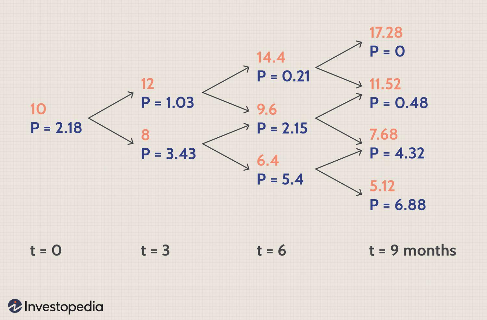

## Table of Contents

## What is the Binomial Option Pricing Model?

The Binomial Option Pricing Model is a way to figure out how much an option is worth. An option is like a bet on whether a stock will go up or down. This model breaks down the time until the option expires into smaller steps. At each step, it imagines the stock price could go up or down. By looking at all the possible paths the stock price could take, the model calculates the option's value.

This model is helpful because it's easy to understand and use. You don't need a fancy computer to do the math. It's especially good for teaching people about options because you can see how the stock price changes over time. However, it can be a bit slow for very complex options because you have to look at a lot of different paths. Still, it's a great starting point for anyone learning about options and how to price them.

## Who developed the Binomial Option Pricing Model?

The Binomial Option Pricing Model was developed by two economists named John Cox, Stephen Ross, and Mark Rubinstein. They came up with this model in the late 1970s. Before their work, people used other, more complicated ways to figure out how much options were worth. The binomial model made things simpler and easier to understand.

Cox, Ross, and Rubinstein wanted to create a model that anyone could use without needing a super powerful computer. Their model breaks down the time until an option expires into small steps. At each step, it imagines the stock price could either go up or down. By looking at all these possible paths, the model can calculate the option's value. This approach made it easier for people to learn about options and how to price them.

## How does the Binomial Option Pricing Model work?

The Binomial Option Pricing Model works by breaking down the time until an option expires into small steps. Imagine you're looking at a stock price over time. At each step, the model says the stock price can either go up a little bit or down a little bit. By looking at all the different paths the stock price could take, the model figures out how much the option is worth. It's like playing a game where you see all the possible moves and then decide what the prize is worth at the end.

To use the model, you start at the end, when the option expires. You look at the stock price at that time and see if the option is worth anything. Then, you work backward through all the steps, figuring out the value of the option at each point. You do this by taking the average of the two possible outcomes at each step and adjusting for the time value of money. This way, you end up with the option's value today, based on all the possible future paths the stock price could take.

## What are the key assumptions of the Binomial Option Pricing Model?

The Binomial Option Pricing Model makes a few important guesses about how the world works. First, it assumes that the stock price can only move up or down at each step. This means we don't look at tiny changes every second; instead, we break time into bigger chunks. Second, it assumes that the size of the up and down moves stays the same over time. This helps keep the math simple, but it might not always match what happens in real life.

Another key assumption is that there are no costs like taxes or trading fees that mess with the price of the option. The model also thinks that you can buy and sell the stock and the option without any trouble, and that you can do this as many times as you want. Lastly, it assumes that the risk-free [interest rate](/wiki/interest-rate-trading-strategies), which is used to figure out the time value of money, stays the same over the life of the option. These assumptions make the model easier to use, but they might not always fit perfectly with the real world.

## Can you explain the one-step binomial model?

The one-step binomial model is a simple way to figure out how much an option is worth. Imagine you have a stock today and you're looking one step into the future. At that step, the stock price can either go up to a higher price or down to a lower price. If you have an option, like the right to buy the stock at a certain price, you check if it's worth anything at the end of this one step. If the stock price is higher than the price you can buy it at, your option has value. If it's lower, it doesn't.

To find out the value of the option today, you look at both possible outcomes at the end of the step. You figure out how much the option would be worth if the stock goes up and how much it would be worth if it goes down. Then, you take an average of these two values, but you adjust it a bit to account for the time value of money. This gives you the value of the option right now. It's a simple way to understand how options work and how their value changes over time.

## How does the multi-step binomial model differ from the one-step model?

The multi-step binomial model is like the one-step model but it looks at more steps into the future. Instead of just one step, you break the time until the option expires into many smaller steps. At each step, the stock price can go up or down, just like in the one-step model. But now, you have to look at all the different paths the stock price could take over all these steps. It's like playing a game where you see all the possible moves over many turns, not just one.

To find the value of the option in the multi-step model, you start at the end, when the option expires. You look at all the possible stock prices at that time and see if the option is worth anything in each case. Then, you work backward through all the steps, figuring out the value of the option at each point. You do this by taking the average of the two possible outcomes at each step and adjusting for the time value of money. This way, you end up with the option's value today, based on all the possible future paths the stock price could take. It's more detailed and accurate than the one-step model, but it also takes more work to calculate.

## What is the role of risk-neutral valuation in the Binomial Option Pricing Model?

Risk-neutral valuation is a key part of the Binomial Option Pricing Model. It's a way to figure out how much an option is worth without worrying about how much risk someone is willing to take. Instead of guessing what people might do with their money, we pretend everyone is okay with any risk. This makes the math easier because we don't have to think about how scared or brave people are. We just use the risk-free interest rate, which is the rate you can get from a safe investment like a government bond.

In the model, we use risk-neutral valuation to work backward from the end of the option's life to today. At each step, we look at what the stock price might be and how much the option would be worth then. We take an average of these future values, but we adjust it using the risk-free interest rate. This gives us the value of the option today. By using risk-neutral valuation, we can figure out the option's price without getting caught up in how people feel about risk, making the whole process simpler and more straightforward.

## How do you calculate option prices using the Binomial Option Pricing Model?

To calculate option prices using the Binomial Option Pricing Model, you start by breaking down the time until the option expires into smaller steps. At each step, you imagine the stock price could either go up or down. You decide how much it could go up or down by choosing a percentage, like 10% up or 10% down. Then, you look at all the possible paths the stock price could take over these steps. At the end of all these steps, when the option expires, you check if the option is worth anything based on the stock price at that time. If it's a call option, it's worth something if the stock price is higher than the price you can buy it at. If it's a put option, it's worth something if the stock price is lower than the price you can sell it at.

Next, you work backward from the end to today. At each step, you take the average of the two possible outcomes (up and down) and adjust it using the risk-free interest rate. This rate is what you'd get from a safe investment like a government bond. By doing this for every step, you end up with the value of the option today. This method is called risk-neutral valuation because it doesn't worry about how much risk people are willing to take. It just uses the risk-free rate to figure out the option's price, making the whole process simpler and easier to understand.

## What are the advantages of using the Binomial Option Pricing Model over other models?

The Binomial Option Pricing Model is easier to understand and use than other models like the Black-Scholes model. It breaks down the time until an option expires into smaller steps, which makes it simpler to see how the stock price might change over time. You don't need a fancy computer to do the math because you can do it step by step with just a calculator. This makes it great for teaching people about options and how to price them. Also, it's good for pricing American options, which can be used before they expire, because you can see the value of the option at each step.

Another advantage is that the Binomial Option Pricing Model can handle more complex situations better than some other models. For example, it can deal with changes in the stock's [volatility](/wiki/volatility-trading-strategies) over time or different interest rates at different steps. This makes it more flexible and useful for real-world scenarios where things aren't always simple. Even though it can be slower to calculate because you have to look at a lot of different paths, the model's ability to show all these paths clearly is a big plus for anyone trying to understand how options work.

## What are the limitations of the Binomial Option Pricing Model?

The Binomial Option Pricing Model can be slow and hard to use for very complex options. This is because you have to look at a lot of different paths the stock price could take. Each step means more calculations, and if you have a lot of steps, it can take a long time. Also, the model assumes the stock price only goes up or down at each step, which might not be how it works in real life. The size of the up and down moves stays the same over time, but in the real world, this can change.

Another limitation is that the model makes some guesses that might not always be true. It thinks there are no costs like taxes or trading fees, but in real life, these can affect the price of an option. The model also assumes you can buy and sell the stock and the option as many times as you want without any trouble. But sometimes, it's not that easy. Lastly, it uses a risk-free interest rate that stays the same over time, but this rate can change, which might make the model less accurate.

## How can the Binomial Option Pricing Model be used to price American options?

The Binomial Option Pricing Model is great for pricing American options because it lets you see the value of the option at every step before it expires. An American option can be used at any time before it expires, not just at the end like a European option. With the binomial model, you break down the time until the option expires into small steps. At each step, you look at what the stock price might be and how much the option would be worth then. If the option is worth more by using it at that step than by waiting, you can choose to use it early. This makes the model perfect for American options because it shows you all the times you could use the option.

To use the model, you start at the end when the option expires and work backward through all the steps. At each step, you look at the two possible outcomes - the stock price could go up or down. You figure out how much the option would be worth in each case and take an average, adjusting for the time value of money using the risk-free interest rate. If at any step the option is worth more by using it than by waiting, you use that value instead. By doing this for every step, you end up with the value of the American option today. This way, the model helps you see all the possible paths and decide the best time to use the option.

## What advanced techniques can be applied to enhance the accuracy of the Binomial Option Pricing Model?

To make the Binomial Option Pricing Model more accurate, you can use something called "variable time steps." Instead of using the same size for each step, you can change the size of the steps. This can help the model match real-life stock prices better. Another way is to use "variable volatility." In the basic model, the size of the up and down moves stays the same over time. But in real life, how much a stock price might change can be different at different times. By letting the model change the size of the moves, you can make it more accurate.

Another advanced technique is called "control variates." This is a bit trickier, but it helps reduce the errors in the model. You use another model, like the Black-Scholes model, to help guide the binomial model. By comparing the two, you can make the binomial model's results more accurate. Also, you can use "accelerated binomial trees." This speeds up the calculations by making the model skip some steps that don't change the final result much. These techniques make the model more useful for real-life situations where things are more complicated than the basic model assumes.

## What is the Binomial Option Pricing Model?

The Binomial Option Pricing Model emerged as a significant advancement in financial modeling following its development in the late 1970s by John C. Cox, Stephen Ross, and Mark Rubinstein. This model presents a structured yet intuitive approach to price options by discretizing the time to expiration of an option into multiple intervals or steps. Such segmentation allows analysts to model the possible price paths an underlying asset might take over the option's life, ultimately aiding in determining the value of the option.

The core principle of the binomial model is the creation of a binomial tree. This structure forecasts potential future prices of the underlying asset at each time step. The model assumes that with each step, the asset price can move to one of two states: an upward movement or a downward movement. This assumption aligns well with the concept of discrete probability distribution, where the possible states of the underlying asset price at each point in time can be quantified and analyzed.

In constructing the binomial tree, one begins by outlining a two-dimensional array of nodes. Each node in the tree represents a potential future price of the underlying asset. The dynamics of the tree are dictated by parameters such as the initial asset price, the up [factor](/wiki/factor-investing), the down factor, and the respective probabilities of these movements. For each upward movement, the asset price at a node is multiplied by the up factor, while for each downward movement, it is multiplied by the down factor.

Mathematically, the price at a given node can be expressed as:

$$
S_{u} = S \cdot u
$$

$$
S_{d} = S \cdot d
$$

Here, $S$ is the initial asset price, $u$ is the up factor, and $d$ is the down factor. The up and down movements typically align with the constraints $d < 1 < u$ and are inversely related, indicating that $d = \frac{1}{u}$ might hold in simple models.

The model also utilizes risk-neutral probabilities to ensure that the expected return of the option aligns with the risk-free rate. This concept underscores the idea that the actual probabilities of price movements do not impact the model as much as the risk-neutral probabilities, which help in eliminating [arbitrage](/wiki/arbitrage) opportunities. The risk-neutral probability $p$ for an upward movement is calculated as:

$$
p = \frac{e^{r \Delta t} - d}{u - d}
$$

where $r$ is the risk-free interest rate and $\Delta t$ is the time increment for each step.

As the tree is constructed, one can work backward from the expiration, calculating the option's value at each node based on potential future payoffs. This backward induction process captures the recursive nature of the binomial model, enabling the determination of option prices at preceding nodes based on subsequent ones. Through this stepwise valuation process, the binomial model effectively captures the path-dependent nature of options, providing a comprehensive technique to assess their fair market value.

## How does the Binomial Model work: A step-by-step approach?

The Binomial Option Pricing Model is an intuitive and methodical approach to valuing options by modeling possible future trajectories of an asset's price. The core idea is to break down the time to expiration into discrete intervals and use a binomial tree structure to evaluate potential asset prices at each interval. Here's a step-by-step guide to how the model works:

### Setting Parameters
1. **Initial Parameters:** Begin by defining the initial asset price $S_0$, the strike price $K$, the time to expiration $T$, and the volatility $\sigma$.
2. **Other Inputs:** The risk-free interest rate $r$, and the number of time steps $n$, which determine the tree's depth, are also necessary inputs.

### Calculating Step Size and Factors
1. **Time Step Calculation:** Divide the total time to expiration into $n$ periods, each of length $\Delta t = \frac{T}{n}$.
2. **Up and Down Factors:**
   - Calculate the up factor ($u$) and down factor ($d$) using the volatility. A common choice is:
$$
     u = e^{\sigma \sqrt{\Delta t}}

$$
$$
     d = e^{-\sigma \sqrt{\Delta t}} = \frac{1}{u}

$$

### Constructing the Binomial Tree
1. **Initial Node:** Begin with the initial asset price $S_0$ at the tree's root.
2. **Price Nodes:** At each subsequent step, the price moves up to $S_{i+1,j} = S_{i,j} \cdot u$ or down to $S_{i+1,j+1} = S_{i,j} \cdot d$.

### Risk-Neutral Probabilities
1. **Probability Calculation:** The risk-neutral probability $p$ of an up move is derived from the no-arbitrage condition:
$$
   p = \frac{e^{r \Delta t} - d}{u - d}

$$
   where $(1-p)$ is the probability of a down move.

### Backward Induction for Option Valuation
1. **Terminal Payoffs:** At expiration ($t = T$), calculate the option's payoff at each node:
   - For a call option: $\max(S_n - K, 0)$
   - For a put option: $\max(K - S_n, 0)$
2. **Recursive Valuation:** Starting from the final nodes, work backward using:
$$
   C_{i,j} = e^{-r \Delta t} (p \cdot C_{i+1,j} + (1-p) \cdot C_{i+1,j+1})

$$
   This computes the expected option value by discounting the expected future payoffs.

### Example
For a practical implementation, consider a Python snippet:

```python
import numpy as np

def binomial_option_pricing(S0, K, T, r, sigma, n, option_type='call'):
    dt = T / n
    u = np.exp(sigma * np.sqrt(dt))
    d = 1 / u
    p = (np.exp(r * dt) - d) / (u - d)

    # Initialize asset prices at maturity
    prices = np.asarray([S0 * (u ** j) * (d ** (n-j)) for j in range(n + 1)])

    # Calculate option payoffs at maturity
    if option_type == 'call':
        option_values = np.maximum(prices - K, 0)
    else:
        option_values = np.maximum(K - prices, 0)

    # Recursively calculate option price at earlier nodes
    for i in range(n-1, -1, -1):
        option_values[:i+1] = np.exp(-r * dt) * (p * option_values[1:i+2] + (1-p) * option_values[:i+1])

    return option_values[0]

# Example parameters
print(binomial_option_pricing(S0=100, K=100, T=1, r=0.05, sigma=0.2, n=3))  # returns the option value
```

This method, while simple conceptually, offers flexibility in applications such as modeling American options, which can be exercised anytime before expiration, by incorporating checks at each node if an early exercise is optimal. This flexibility makes the binomial model a valuable tool in financial analysis and [algorithmic trading](/wiki/algorithmic-trading).

## How can Binomial Models be applied in Algorithmic Trading?

Algorithmic trading utilizes computer algorithms to execute trades with exceptional speed and precision, capitalizing on minuscule price fluctuations across markets. The binomial option pricing model, with its structured and discrete framework, lends itself well to algorithmic trading strategies. This compatibility arises from several core attributes inherent to the binomial model, which facilitate the development of trading algorithms that can anticipate and respond to market movements efficiently.

The binomial model's discrete nature is one of its most significant advantages in algorithmic trading. Unlike continuous models, such as Black-Scholes, the binomial model evaluates the possible movements of an asset's price in discrete time intervals, forming a binomial tree. Each node on this tree represents a potential future price of the underlying asset, modeled through potential upward or downward movements. This structured representation aligns seamlessly with the algorithmic decision-making process, which requires clear and repeatable steps to process data and trigger trading actions.

In constructing a binomial tree, the algorithm begins by establishing parameters such as the initial asset price, strike price, time to expiration, and volatility. These parameters are used to calculate the size of each step and the factors by which the asset price may rise or fall within each interval. The algorithm then computes risk-neutral probabilities, which are essential for evaluating expected option values at each node based on future payoffs. The risk-neutral probability $p$ is typically determined by the formula:

$$
p = \frac{e^{rt} - d}{u - d}
$$

where $u$ and $d$ are the upward and downward movement factors, $r$ is the risk-free interest rate, and $t$ is the time step.

To implement this model in practice, consider the python code snippet below which demonstrates the binomial tree construction for a European call option:

```python
import numpy as np

def binomial_tree_option_pricing(S, K, T, r, sigma, steps):
    dt = T/steps
    u = np.exp(sigma * np.sqrt(dt))
    d = 1/u
    p = (np.exp(r * dt) - d) / (u - d)

    # Initialize asset prices at maturity
    asset_prices = np.zeros((steps + 1, steps + 1))
    option_values = np.zeros((steps + 1, steps + 1))

    for i in range(steps + 1):
        for j in range(i + 1):
            asset_prices[j, i] = S * (u ** (i - j)) * (d ** j)

    # Compute option values at maturity
    option_values[:, steps] = np.maximum(asset_prices[:, steps] - K, 0)

    # Backward induction for option price
    for i in range(steps - 1, -1, -1):
        for j in range(i + 1):
            option_values[j, i] = np.exp(-r * dt) * (p * option_values[j, i + 1] + (1 - p) * option_values[j + 1, i + 1])

    return option_values[0, 0]

# Example parameters
S = 100      # Initial stock price
K = 100      # Strike price
T = 1.0      # Time to expiration in years
r = 0.05     # Risk-free rate
sigma = 0.2  # Volatility
steps = 100  # Number of steps in the binomial tree

price = binomial_tree_option_pricing(S, K, T, r, sigma, steps)
print(f"The estimated option price is: {price:.2f}")
```

This algorithmic approach enables traders to simulate various trading scenarios by adjusting parameters and observing outcomes. The flexibility of this model allows for customized strategy development, enabling traders to account for changing market conditions and unique financial products. The computational efficiency afforded by the binomial model also ensures timely execution, which is critical for capitalizing on short-lived trading opportunities.

In summary, the binomial option pricing model is an effective tool in algorithmic trading due to its discrete structure and compatibility with automated processes. It aids in the formulation of precise, repeatable trading strategies that can swiftly and accurately assess potential trades, aligning well with the requirement for speed and precision in the modern financial markets.

## References & Further Reading

[1]: Cox, J. C., Ross, S. A., & Rubinstein, M. (1979). ["Option Pricing: A Simplified Approach"](https://www.sciencedirect.com/science/article/pii/0304405X79900151)90015-1). Journal of Financial Economics, 7(3), 229-263.

[2]: Hull, J. C. (2020). *Options, Futures, and Other Derivatives*. Pearson Education.

[3]: Rendleman, R. J., & Bartter, B. J. (1979). ["Two-State Option Pricing"](https://www.semanticscholar.org/paper/Two-State-Option-Pricing-Rendleman-Bartter/dd4b8bcf882072a783b4d2a6391b7cb2967b1984). Journal of Finance, 34(5), 1093-1110.

[4]: Wilmott, P. (2006). *Paul Wilmott Introduces Quantitative Finance*. John Wiley & Sons.

[5]: Haug, E. G. (2007). *The Complete Guide to Option Pricing Formulas*. McGraw-Hill.

[6]: Boyle, P., Broadie, M., & Glasserman, P. (1997). ["Monte Carlo Methods for Security Pricing"](https://www.sciencedirect.com/science/article/pii/S0165188997000286)00901-1). Journal of Economic Dynamics and Control, 31(6), 1267-1325.