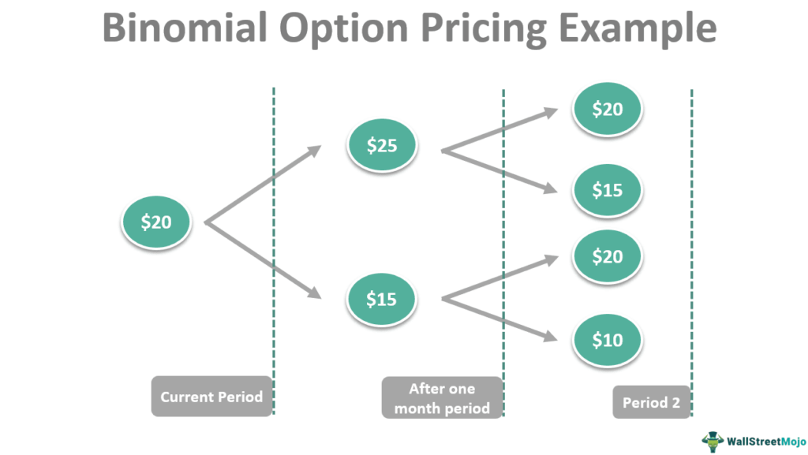

The world of finance is intricate and multi-faceted, involving a range of complex instruments that are designed to manage risk and enhance returns. Among these financial instruments, options play a critical role. As a key financial derivative, options grant the holder the right, but not the obligation, to buy or sell an underlying asset, such as stocks or commodities. This unique feature of options allows market participants to leverage them for various purposes, including risk management and speculative activities.

The accurate pricing of options is essential for maintaining market efficiency. To achieve this, robust methodologies are employed, with the Binomial Option Pricing Model being a widely recognized tool. Developed in the late 1970s by John Cox, Stephen Ross, and Mark Rubinstein, the binomial model is designed to simulate potential price paths of an underlying asset over time. This approach assists in determining an option's value by accounting for multiple scenarios in which the asset's price can move either up or down.



Incorporating a discrete time framework, the binomial model constructs a binomial tree representing possible future prices of the underlying asset. As a result, it not only offers an adaptable structure for pricing options but also contributes to a deeper understanding of market dynamics, enhancing decision-making processes in trading.

The relevance of the binomial model extends into the realm of algorithmic trading, where its principles and mechanics can be applied effectively. By integrating this model into trading algorithms, traders and financial institutions can enhance their capability to anticipate market movements and execute trades with increased precision. Consequently, the binomial option pricing model remains a valuable asset for traders and analysts pursuing both theoretical and applied financial strategies.

## Table of Contents

## Understanding Financial Derivatives and Options

Financial derivatives are financial instruments whose value is dependent on an underlying asset, such as stocks, bonds, currencies, interest rates, or commodities. These derivatives serve an essential purpose in finance by enabling speculation on the future price movements of the underlying assets and offering mechanisms for risk management through hedging strategies. Among the diverse types of financial derivatives, options hold a position of significant importance due to their unique characteristics and versatility.

Options are contracts that grant the holder the right, but not the obligation, to buy or sell an underlying asset at a predetermined price, known as the strike price, on or before a specified expiration date. This right allows option holders to capitalize on favorable price movements while limiting their potential losses to the premium paid for acquiring the option. There are two primary types of options: call options and put options.

A call option provides the holder with the right to purchase the underlying asset at the strike price within the opted time frame. This type of option is typically used when the holder anticipates that the asset's price will rise, allowing them to purchase the asset at the lower strike price and potentially sell it at a higher market price. Conversely, a put option enables the holder to sell the underlying asset at the strike price before the option expires. Put options are generally utilized when the asset's holder expects the asset's price to decline, offering them the ability to sell at a higher strike price than the anticipated market price.

Options provide substantial flexibility as financial instruments, making them useful for multiple trading strategies. They are powerful tools for risk management because they can be used to hedge against potential adverse price movements in an investor's portfolio. For instance, purchasing put options on a stock can offset potential losses due to declining stock prices, acting as an insurance mechanism. Besides risk mitigation, options attract speculative traders looking to leverage their predictions on price directions for profit opportunities without having to commit significant capital upfront as they would when trading the underlying assets directly.

The flexibility of options also extends to their use in constructing complex trading strategies, such as straddles, strangles, and spreads. These strategies allow traders to take advantage of varying market conditions by optimizing the risk-reward profile of their investment positions. Given their adaptability and the depth they add to financial markets, options remain indispensable tools in crafting diversified and strategic approaches within the realm of trading and investment.

## The Binomial Option Pricing Model

The Binomial Option Pricing Model was introduced by John Cox, Stephen Ross, and Mark Rubinstein as a method to price options via a discrete time framework. This approach uses a binomial tree to represent possible future movements in the price of an underlying asset. At each node of the tree, the asset price can move in one of two directions: up or down. This binary nature of movement allows for the modeling of numerous potential pathways that an asset's price might follow until the option's expiration.

To construct a binomial tree, an initial asset price is determined. From this point, asset prices can be multiplied by an "up" [factor](/wiki/factor-investing) $u$ or a "down" factor $d$ over a series of discrete time intervals. These factors are determined by:

$$
u = e^{\sigma \sqrt{\Delta t}}
$$
$$
d = e^{-\sigma \sqrt{\Delta t}}
$$

where $\sigma$ represents the volatility of the underlying as a standard deviation, and $\Delta t$ is the length of each time step.

Central to the model are risk-neutral probabilities, which adjust for the time value of money and ensure price valuations are consistent with the risk-free rate of return. The risk-neutral probability $p$ that reflects the likelihood of an upward price movement is given by:

$$
p = \frac{e^{r \Delta t} - d}{u - d}
$$

where $r$ is the continuous compounding risk-free interest rate. These probabilities are used to discount future payoffs, aligning estimated option values with those expected under a risk-free investment assumption.

The binomial model's design enables it to accommodate complexities found in real market scenarios, offering a more adaptable framework compared to models assuming constant asset [volatility](/wiki/volatility-trading-strategies) or European-style options. By providing a systematic approach for considering multiple potential future asset prices, the binomial model assists in determining an option's fair market value through a tree that traces paths from expiration back to the present.

## How the Binomial Model Works: A Step-by-Step Approach

To implement the binomial option pricing model, one begins by establishing a set of initial parameters that are crucial for subsequent computations. These include the current asset price ($S_0$), the option's strike price ($K$), the time to expiration, and the volatility ($\sigma$) of the underlying asset. Additionally, it is important to define the risk-free rate ($r$) and the number of time steps ($N$) to be used in the model.

The process then involves calculating the step size ($\Delta t$) and the multiplicative factors that represent the up and down movements in price. The time interval is expressed as $\Delta t = \frac{T}{N}$, where $T$ is the time to expiration. The upward movement factor ($u$) and the downward movement factor ($d$) are typically determined using the volatility and $\Delta t$, as expressed below:

$$

u = e^{\sigma \sqrt{\Delta t}}
$$
$$

d = e^{-\sigma \sqrt{\Delta t}} = \frac{1}{u}
$$

Next, the model calculates the risk-neutral probabilities for the asset's price moving upward or downward. This ensures that the expected option price aligns with the risk-free rate return, maintaining the absence of [arbitrage](/wiki/arbitrage) in the market. The risk-neutral probability ($p$) is given by:

$$

p = \frac{e^{r \Delta t} - d}{u - d}
$$

With these factors determined, the construction of the binomial tree is initiated. At each node in the tree, there exist two possible subsequent nodes, representing the potential upward or downward movement of the asset price. 

Following the construction of the lattice, the final step is to evaluate the option's value using backward induction. This involves calculating the option payoff at each final node of the tree (time of expiry) and working backward to the present. For a call option, the terminal payoff is $\max(S_i - K, 0)$, where $S_i$ is the asset price at node $i$. Conversely, the terminal payoff for a put option is $\max(K - S_i, 0)$.

The present value at any node (other than the terminal nodes) is calculated by discounting the expected option values from the next time step back to the current node, using the risk-neutral probabilities:

$$

C = e^{-r \Delta t} \times (p \times C_{\text{up}} + (1-p) \times C_{\text{down}})
$$

This recursive process continues until the root of the tree, which gives the current fair market value of the option. Utilizing computational tools such as Python, this entire process can be efficiently implemented and scaled to handle complex financial instruments. Here is a Python code snippet illustrating a basic implementation of the binomial model:

```python
import math

def binomial_option_pricing(S0, K, T, r, sigma, N, option_type='call'):
    # Calculate time step
    dt = T / N
    # Calculate up and down factors
    u = math.exp(sigma * math.sqrt(dt))
    d = 1 / u
    # Calculate risk-neutral probability
    p = (math.exp(r * dt) - d) / (u - d)

    # Initialize asset prices at maturity
    asset_prices = [S0 * (u ** j) * (d ** (N - j)) for j in range(N + 1)]

    # Initialize option values at maturity
    if option_type == 'call':
        option_values = [max(price - K, 0) for price in asset_prices]
    elif option_type == 'put':
        option_values = [max(K - price, 0) for price in asset_prices]

    # Step back through the tree
    for step in range(N - 1, -1, -1):
        for i in range(step + 1):
            option_values[i] = math.exp(-r * dt) * (p * option_values[i + 1] + (1 - p) * option_values[i])

    return option_values[0]

# Example parameters
S0 = 100
K = 100
T = 1
r = 0.05
sigma = 0.2
N = 3
option_price = binomial_option_pricing(S0, K, T, r, sigma, N, option_type='call')
print(f"Option Price: {option_price}")
```

This approach ensures the binomial option pricing model is both robust and adaptable, suitable for integration into [algorithmic trading](/wiki/algorithmic-trading) systems and other financial applications.

## Comparing Binomial and Black-Scholes Models

The comparison between the binomial and Black-Scholes models for option pricing hinges on their differing methodologies and applications. The binomial option pricing model is praised for its versatility, as it can effectively handle both European and American options. Its structure allows for easy adjustments to a variety of market conditions, such as changes in volatility, interest rates, and dividend yields. The model is constructed around a binomial tree, where each node represents a possible price of the underlying asset at a given time step. This discrete approach accommodates the exercise features of American options, which can be exercised at any time before expiration. By calculating the option price at each possible state of the world and working backwards through the tree using risk-neutral probabilities, the binomial model provides a means to derive a theoretically sound option price.

In contrast, the Black-Scholes model is fundamentally more streamlined due to its reliance on a closed-form solution to price European options. The model assumes constant volatility and interest rates, with the underlying asset price following a geometric Brownian motion. This assumption simplifies the model, generating a single formula for the option price without the need to simulate multiple paths as in the binomial model. The core Black-Scholes formula is expressed as:

$$
C = S_0 N(d_1) - X e^{-rT} N(d_2)
$$

where 
$$
d_1 = \frac{\ln(S_0/X) + (r + \sigma^2/2)T}{\sigma \sqrt{T}}
$$
$$
d_2 = d_1 - \sigma \sqrt{T}
$$

Here, $C$ represents the price of a call option, $S_0$ the current price of the asset, $X$ the strike price, $r$ the risk-free [interest rate](/wiki/interest-rate-trading-strategies), $T$ the time to expiration, $\sigma$ the volatility of the asset, and $N(\cdot)$ the cumulative distribution function of the standard normal distribution.

For practitioners, the choice between these models is typically dictated by the nature of the options being priced and the prevailing market conditions. The binomial model is often preferred when dealing with American options or markets experiencing significant volatility or uncertainties in interest rates, owing to its flexibility and adaptability. Conversely, the Black-Scholes model is frequently utilized in scenarios where its assumptions hold true, particularly for European options, providing efficiency in computation and ease of application.

Ultimately, the decision to employ one model over the other is highly contingent upon the specific trading strategy and the needs of the financial institution or individual employing the model. Each model offers distinct advantages and limitations, making them complementary tools in the domain of financial derivatives pricing.

## Applying Binomial Models in Algorithmic Trading

Algorithmic trading utilizes mathematical models and computational algorithms to execute trades with speed and precision. The binomial option pricing model is particularly beneficial in this context due to its discrete time structure, which aligns well with the iterative and systematic nature of algorithmic trading.

The binomial model constructs a lattice or tree to represent the potential evolution of an asset's price over time, allowing for a detailed exploration of possible future states. This model's step-by-step approach is conducive to algorithmic trading, where rapid calculations are essential. By setting the initial parameters, such as the asset price and volatility, and defining the interval or step size, traders can simulate different scenarios efficiently.

Python and similar computational tools significantly enhance the application of binomial models in algorithmic trading systems. Python's libraries, such as NumPy for numerical computing and Pandas for data manipulation, offer robust support for implementing the binomial pricing model. For example, Python code can be used to generate the binomial tree and calculate option prices:

```python
import numpy as np

# Parameters
S = 100  # Initial stock price
K = 100  # Strike price
T = 1  # Time to expiration in years
r = 0.05  # Risk-free interest rate
sigma = 0.2  # Volatility
n = 100  # Number of steps

# Calculate delta t
dt = T / n

# Calculate up and down factors
u = np.exp(sigma * np.sqrt(dt))
d = 1 / u

# Risk-neutral probabilities
p = (np.exp(r * dt) - d) / (u - d)

# Initialize asset price tree
asset_prices = np.zeros((n + 1, n + 1))
asset_prices[0, 0] = S

# Construct the binomial tree
for i in range(1, n + 1):
    asset_prices[i, 0:i + 1] = S * u ** np.arange(i, -1, -1) * d ** np.arange(0, i + 1)

# Initialize option price tree
option_values = np.zeros_like(asset_prices)

# Calculate option values at maturity
option_values[-1, :] = np.maximum(0, asset_prices[-1, :] - K)

# Perform backward induction
for i in range(n - 1, -1, -1):
    option_values[i, :i + 1] = np.exp(-r * dt) * (p * option_values[i + 1, :i + 1] + (1 - p) * option_values[i + 1, 1:i + 2])

# Option price today
option_price = option_values[0, 0]
```

The output of the above code gives the option's present value. Algorithmic trading systems can utilize such Python implementations for real-time market analysis and strategy execution, leveraging the model's adaptability to varying conditions.

Additionally, the scalability of Python allows for integration with large datasets and external data sources, which are crucial for robust trading systems. The discrete structure of the binomial model also means adjustments to parameters can be seamlessly incorporated, giving traders the flexibility to refine strategies based on real-time data and evolving market conditions. The result is enhanced precision and the ability to execute trades with optimized timing and accuracy.

## Real-World Application and Examples

Financial institutions prominently employ the binomial option pricing model as a tool for portfolio management and implementing hedging strategies. Its utility extends to pricing complex derivatives, which require a nuanced understanding of potential future states of the associated underlying assets. The model’s flexibility in handling American options, which can be exercised at any time before expiration, is particularly advantageous in diverse trading scenarios. 

A key aspect of the binomial model’s application is its strategic approach to risk management. By constructing a binomial tree, financial institutions can systematically evaluate potential price movements and corresponding option payoffs. This capability allows for the assessment of various hedging strategies, effectively managing potential losses or locking in desired gains.

The integration of programming languages, particularly Python, enhances the automation and scalability of using the binomial model in trading systems. Python's robust libraries, such as NumPy and Pandas, facilitate efficient computation and data manipulation capabilities, enabling comprehensive simulations of binomial trees. Here is a sample Python code snippet that illustrates the calculation of a European call option price using the binomial model:

```python
import numpy as np

def binomial_option_pricing(S, K, T, r, sigma, steps):
    dt = T/steps
    u = np.exp(sigma * np.sqrt(dt))
    d = 1/u
    p = (np.exp(r * dt) - d) / (u - d)

    # Initialize asset prices at maturity 
    asset_prices = np.zeros(steps + 1)
    option_values = np.zeros(steps + 1)

    asset_prices[-1] = S * (u ** steps)
    for i in range(steps - 1, -1, -1):
        asset_prices[i] = asset_prices[i+1] * d

    # Calculate option values at maturity
    for i in range(steps + 1):
        option_values[i] = max(0, asset_prices[i] - K)

    # Backward induction to calculate option value at t=0
    for j in range(steps - 1, -1, -1):
        for i in range(j + 1):
            option_values[i] = (p * option_values[i+1] + (1 - p) * option_values[i]) * np.exp(-r * dt)

    return option_values[0]

# Example usage
S = 100  # Current stock price
K = 100  # Strike price
T = 1    # Time to maturity in years
r = 0.05 # Risk-free interest rate
sigma = 0.2 # Volatility
steps = 100 # Number of binomial steps

option_price = binomial_option_pricing(S, K, T, r, sigma, steps)
print(f"Option Price: {option_price}")
```

This code illustrates the use of a discretized step approach to assess option values at each node of the tree, taking into account risk-neutral probabilities and real-world constraints. This example demonstrates how financial institutions can harness the power of computational tools to refine their derivative pricing and risk management strategies, ensuring a comprehensive understanding of market movements and derivative behavior.

## Conclusion

The binomial option pricing model provides a robust and adaptable framework for accurately valuing options within dynamic and multi-faceted financial markets. This model, despite the emergence of newer methodologies, maintains its significance due to its inherent flexibility and precision. By allowing analysts to adjust parameters such as time steps and volatility, the binomial model can accommodate complex market movements, making it highly applicable in settings that require detailed scenario analysis.

The adaptability of the binomial model facilitates its use in a variety of financial contexts, including the evaluation of American options, which can be exercised at any point before expiration. This feature distinguishes it from closed-form solutions such as the Black-Scholes model, which are typically restricted to European options with fixed exercise dates.

One of the key strengths of the binomial model is its straightforward structure. The model constructs a binomial tree to simulate potential price paths, using backward induction to determine the option's value. This process not only improves comprehension of underlying market dynamics but also serves as a foundational tool for constructing algorithmic trading strategies.

Despite the complexity often associated with pricing financial derivatives, the binomial model offers an elegant balance between simplicity and thoroughness. Its methodical approach can be readily implemented through computational tools like Python, which enhance its scalability and usefulness in modern trading systems. As a result, the binomial option pricing model continues to be a valuable resource for traders and financial analysts seeking to manage risk and optimize portfolio performance.

## References & Further Reading

[1]: Cox, J. C., Ross, S. A., & Rubinstein, M. (1979). ["Option Pricing: A Simplified Approach."](https://www.sciencedirect.com/science/article/pii/0304405X79900151) Journal of Financial Economics, 7(3), 229-263.

[2]: Hull, J. C. (2017). ["Options, Futures, and Other Derivatives."](https://elibrary.pearson.de/book/99.150005/9781292410623) Pearson Education.

[3]: Black, F., & Scholes, M. (1973). ["The Pricing of Options and Corporate Liabilities."](https://www.cs.princeton.edu/courses/archive/fall09/cos323/papers/black_scholes73.pdf) Journal of Political Economy, 81(3), 637-654.

[4]: Wilmott, P. (2006). ["Paul Wilmott Introduces Quantitative Finance."](https://www.amazon.com/Paul-Wilmott-Introduces-Quantitative-Finance/dp/0470319585) John Wiley & Sons.

[5]: J. Cox, S. Ross, & M. Rubinstein (1979). ["Binomial Option Pricing Model Tutorial."](https://www.sciencedirect.com/science/article/pii/0304405X79900151) Finance Train.