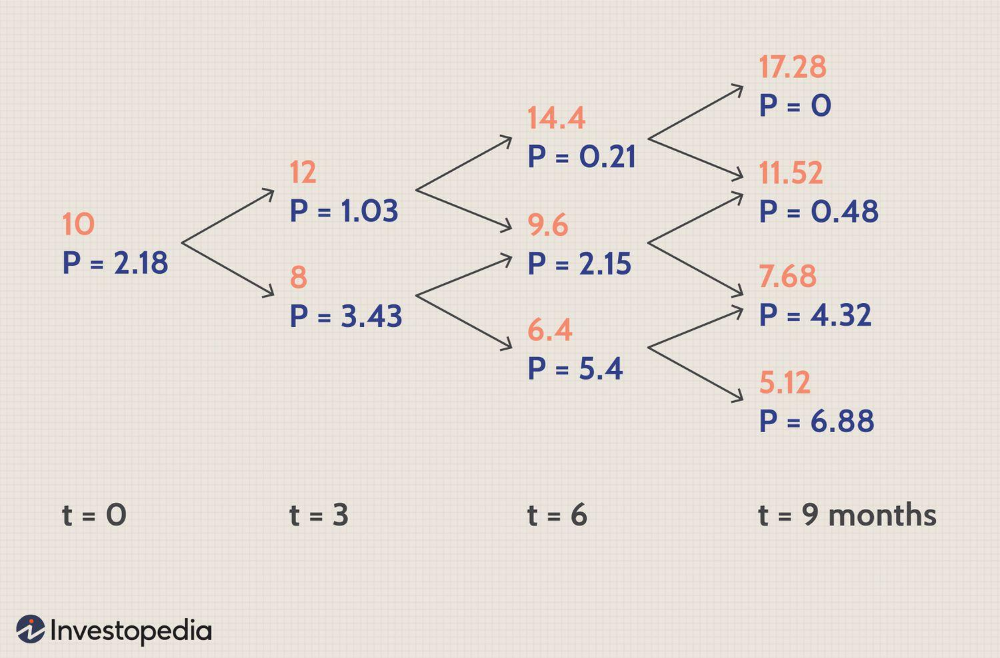

## Table of Contents

## What is the Binomial Options Pricing Model?

The Binomial Options Pricing Model is a way to figure out how much an option is worth. An option is like a bet on whether a stock's price will go up or down. In this model, we imagine the stock price can only go up or down in steps, like climbing a ladder. We start at the bottom of the ladder and look at all the possible paths the stock price could take until the option expires. By calculating the value of the option at each step, we can work backward to find out what the option is worth right now.

This model is useful because it breaks down the complex problem of pricing an option into simpler steps. It's especially handy for teaching people about options because it's easy to see how the stock price and time affect the option's value. However, it can be a bit time-consuming for very short time periods or if the stock price changes a lot. Despite this, the Binomial Model is a great tool for understanding and pricing options in a straightforward way.

## Who developed the Binomial Options Pricing Model?

The Binomial Options Pricing Model was developed by Cox, Ross, and Rubinstein in 1979. They wanted to make it easier for people to understand how options are priced. Before their model, options pricing was a bit tricky and hard to grasp. Cox, Ross, and Rubinstein came up with a simple way to break down the problem into smaller, manageable steps.

Their model uses a tree-like structure to show how the price of a stock can go up or down over time. This makes it easier to see all the possible paths the stock price could take until the option expires. By working backward from the end of the tree to the start, you can figure out what the option is worth right now. This model has been really helpful for teaching people about options and is still used today, even though there are more complex models out there.

## How does the Binomial Options Pricing Model work?

The Binomial Options Pricing Model works by breaking down the problem of figuring out an option's price into smaller, easy-to-understand steps. Imagine you have a stock and you want to know the value of an option on that stock. The model creates a tree-like diagram where each branch represents a possible future price of the stock. At each step, the stock price can either go up or down. You start at the bottom of the tree, where the stock is now, and look at all the different paths it could take until the option expires. By calculating the value of the option at each step, you can work backward from the end of the tree to the beginning to find out what the option is worth right now.

This model is great because it makes it easy to see how different things affect the option's value. For example, you can see how the stock price, the time until the option expires, and other factors like interest rates and dividends change the option's price. It's like playing a game where you try different scenarios to see what happens. Even though it can be a bit time-consuming if you have a lot of steps or if the stock price changes a lot, the Binomial Model is a handy tool for understanding and pricing options in a way that's easy to grasp.

## What are the key assumptions of the Binomial Options Pricing Model?

The Binomial Options Pricing Model makes a few important guesses to keep things simple. One big guess is that the stock price can only go up or down at each step. This means the model breaks time into small pieces, and at the end of each piece, the stock price either jumps up by a certain amount or drops down by another amount. This makes it easier to draw the tree-like diagram that shows all the possible paths the stock price could take. Another guess is that the model uses a risk-free interest rate. This is like saying there's a safe way to invest money without any risk, and this rate helps figure out how much the option is worth today compared to what it might be worth in the future.

Another key assumption is that there are no costs like transaction fees or taxes that affect the price of the option. This keeps the calculations clean and simple. The model also assumes that you can buy or sell any amount of the stock or the option without affecting the price. This is called perfect liquidity, and it helps make the math easier. Lastly, the model assumes that the stock doesn't pay any dividends during the time the option is alive. If the stock does pay dividends, you'd have to adjust the model to account for that. These assumptions help make the Binomial Model a useful tool for understanding how options are priced, even if they don't perfectly match the real world.

## Can you explain the one-step binomial model?

The one-step binomial model is a simple way to figure out what an option might be worth. Imagine you have a stock, and you want to know the value of an option on that stock after just one step in time. In this model, the stock price can only go up or down at the end of that step. If it goes up, it jumps to a higher price, and if it goes down, it drops to a lower price. You decide how much it can go up or down based on how risky the stock is. At the end of the step, you look at the value of the option if the stock price goes up and if it goes down. Then, you use a risk-free interest rate to figure out what the option is worth right now, before the step happens.

This model is great for beginners because it's easy to understand. You can see how the stock price moving up or down affects the option's value. For example, if the stock price goes up, a call option (which gives you the right to buy the stock) becomes more valuable. If the stock price goes down, the call option becomes less valuable. By using the risk-free interest rate, you can work backward from the end of the step to find out what the option is worth today. Even though it's a simple model, it helps you get the basic idea of how options are priced and how different factors like the stock price and time affect that price.

## How does the multi-step binomial model differ from the one-step model?

The multi-step binomial model is like the one-step model but it looks at more steps in time. Instead of just one step, the multi-step model breaks time into many smaller pieces. At each step, the stock price can go up or down, just like in the one-step model. But now, you have to look at all the different paths the stock price could take over all those steps. It's like drawing a big tree with lots of branches, where each branch shows a different way the stock price could change. By the end, you have a lot more possible outcomes to consider, but you still work backward from the end to figure out what the option is worth today.

The main difference between the one-step and multi-step models is how they handle time and the number of possible outcomes. The one-step model is quick and simple, but it can't show how the stock price might change over a longer period. The multi-step model takes more time to calculate because you have to look at many more steps and paths, but it gives you a better picture of how the option's value changes over time. This makes the multi-step model more accurate and useful for real-world situations where options might last for weeks or months, not just one step.

## What is the role of risk-neutral valuation in the Binomial Options Pricing Model?

Risk-neutral valuation is a key part of the Binomial Options Pricing Model. It helps us figure out what an option is worth by pretending that everyone is okay with taking risks. In the real world, people might want to avoid risk, but in this model, we imagine a world where everyone is fine with it. This makes the math easier because we can use a risk-free interest rate to work backward from the end of the option's life to find its value today. It's like saying, "If no one cared about risk, what would this option be worth?"

By using risk-neutral valuation, we can simplify the problem of pricing an option. Instead of worrying about how risky the stock is, we focus on the possible future prices of the stock and how they affect the option's value. We calculate the expected value of the option at each step of the binomial tree, using the risk-free interest rate to discount those future values back to today. This method helps us see how the stock price, time, and other factors like dividends and interest rates all come together to determine the option's price. It's a clever trick that makes the complex world of options easier to understand and calculate.

## How do you calculate option prices using the Binomial Options Pricing Model?

To calculate option prices using the Binomial Options Pricing Model, you start by making a tree-like diagram that shows how the stock price can go up or down at each step in time. Imagine the stock price can only jump up or drop down by certain amounts at each step. You decide how much it can go up or down based on how risky the stock is. At the end of all the steps, you look at the value of the option for each possible final stock price. If it's a call option, you find the difference between the final stock price and the strike price of the option, but only if the stock price is higher than the strike price. If it's a put option, you find the difference between the strike price and the final stock price, but only if the stock price is lower than the strike price.

Once you know the value of the option at the end of all the steps, you work backward through the tree. At each step, you calculate the expected value of the option by looking at the two possible paths the stock price could take from that point (up or down). You use a risk-free interest rate to figure out what that expected future value is worth today. This process of working backward from the end to the start helps you find out what the option is worth right now. The more steps you include in your tree, the more accurate your calculation will be, but it also takes more time. Even though it can be a bit tricky, the Binomial Model is a great way to understand how options are priced and how different factors like the stock price and time affect that price.

## What are the advantages of using the Binomial Options Pricing Model over other models?

The Binomial Options Pricing Model is great because it's easy to understand and use. It breaks down the problem of figuring out an option's price into small steps, which makes it simpler to see how the stock price and time affect the option's value. You can draw a tree-like diagram to show all the different paths the stock price could take, and then work backward to find out what the option is worth right now. This model is also really helpful for teaching people about options because it shows how everything fits together in a clear way. Plus, you can use it for different kinds of options, like American options that you can use before they expire, which some other models can't handle as easily.

Another advantage of the Binomial Model is that it's flexible. You can change the number of steps to make the model more or less detailed, depending on what you need. If you want a quick estimate, you can use fewer steps, but if you need a more accurate price, you can use more steps. This makes it useful for different situations. Also, the model lets you see how changes in things like the stock's risk, interest rates, and dividends affect the option's price. Even though it can take more time to calculate with lots of steps, the Binomial Model's clear and flexible way of working makes it a valuable tool for understanding and pricing options.

## What are the limitations of the Binomial Options Pricing Model?

The Binomial Options Pricing Model can be a bit tricky to use because it can take a lot of time to calculate, especially if you want to look at a lot of steps. Imagine you're trying to figure out what an option is worth over many small steps in time. Each step means more calculations, and that can get slow and complicated. Also, the model assumes that the stock price can only go up or down by certain amounts at each step, which might not be exactly how the stock price moves in real life. This can make the model less accurate if the stock price changes a lot or in ways that don't fit the model's assumptions.

Another limitation is that the model needs you to guess how much the stock price can go up or down at each step. If you guess wrong, your calculation of the option's price might be off. The model also assumes there are no extra costs like fees or taxes, and that you can buy or sell as much of the stock or option as you want without changing the price. These assumptions might not match the real world, which can affect how well the model works. Despite these limitations, the Binomial Model is still a helpful tool for understanding options, especially when you're learning or need a simple way to estimate an option's price.

## How can the Binomial Options Pricing Model be used to price American options?

The Binomial Options Pricing Model is really useful for figuring out the price of American options. An American option is special because you can use it before it expires, unlike a European option which you can only use at the end. To price an American option with the Binomial Model, you draw a tree that shows all the different ways the stock price could go up or down over time. At each step, you look at the value of the option if you use it right then, and compare it to the value if you wait until the next step. If using the option now is worth more, you do that. If waiting is worth more, you wait. By working backward through the tree, you can find out what the option is worth right now, taking into account that you might use it early.

Even though the Binomial Model can be a bit slow if you have a lot of steps, it's great for American options because it lets you see how using the option early affects its price. You can change the number of steps to make the model more or less detailed, which is handy depending on how accurate you need to be. The model also helps you understand how things like the stock price, time, and interest rates all come together to decide the option's price. So, even with its limitations, the Binomial Model is a powerful tool for pricing American options and learning about how they work.

## What are some advanced techniques or modifications to the standard Binomial Options Pricing Model?

One advanced technique for the Binomial Options Pricing Model is called the trinomial model. Instead of just letting the stock price go up or down at each step, the trinomial model adds a third option where the stock price can stay the same. This can make the model more accurate because it matches how stock prices sometimes don't change much over short periods. Another modification is using different probabilities for the stock price going up or down at each step. In the standard model, these probabilities are the same at every step, but in real life, they might change based on new information or market conditions. By adjusting these probabilities, you can make the model fit the real world better.

Another advanced technique is the use of variable step sizes. Instead of breaking time into equal steps, you can use smaller steps when the stock price is changing a lot and bigger steps when it's not. This can help make the model more accurate without making it too slow. You can also add things like dividends or transaction costs to the model to make it more realistic. The standard model assumes these things don't exist, but in real life, they do affect the price of an option. By including them, you can get a better idea of what the option is really worth. These modifications make the Binomial Model more flexible and useful for different situations, even though they can make it a bit more complicated to use.

## What is the Binomial Option Pricing Model?

The Binomial Option Pricing Model was introduced by John Cox, Stephen Ross, and Mark Rubinstein as a method to price options via a discrete time framework. This approach uses a binomial tree to represent possible future movements in the price of an underlying asset. At each node of the tree, the asset price can move in one of two directions: up or down. This binary nature of movement allows for the modeling of numerous potential pathways that an asset's price might follow until the option's expiration.

To construct a binomial tree, an initial asset price is determined. From this point, asset prices can be multiplied by an "up" [factor](/wiki/factor-investing) $u$ or a "down" factor $d$ over a series of discrete time intervals. These factors are determined by:

$$
u = e^{\sigma \sqrt{\Delta t}}
$$
$$
d = e^{-\sigma \sqrt{\Delta t}}
$$

where $\sigma$ represents the volatility of the underlying as a standard deviation, and $\Delta t$ is the length of each time step.

Central to the model are risk-neutral probabilities, which adjust for the time value of money and ensure price valuations are consistent with the risk-free rate of return. The risk-neutral probability $p$ that reflects the likelihood of an upward price movement is given by:

$$
p = \frac{e^{r \Delta t} - d}{u - d}
$$

where $r$ is the continuous compounding risk-free interest rate. These probabilities are used to discount future payoffs, aligning estimated option values with those expected under a risk-free investment assumption.

The binomial model's design enables it to accommodate complexities found in real market scenarios, offering a more adaptable framework compared to models assuming constant asset [volatility](/wiki/volatility-trading-strategies) or European-style options. By providing a systematic approach for considering multiple potential future asset prices, the binomial model assists in determining an option's fair market value through a tree that traces paths from expiration back to the present.

## How does the Binomial Model work: A step-by-step approach?

To implement the binomial option pricing model, one begins by establishing a set of initial parameters that are crucial for subsequent computations. These include the current asset price ($S_0$), the option's strike price ($K$), the time to expiration, and the volatility ($\sigma$) of the underlying asset. Additionally, it is important to define the risk-free rate ($r$) and the number of time steps ($N$) to be used in the model.

The process then involves calculating the step size ($\Delta t$) and the multiplicative factors that represent the up and down movements in price. The time interval is expressed as $\Delta t = \frac{T}{N}$, where $T$ is the time to expiration. The upward movement factor ($u$) and the downward movement factor ($d$) are typically determined using the volatility and $\Delta t$, as expressed below:

$$

u = e^{\sigma \sqrt{\Delta t}}
$$
$$

d = e^{-\sigma \sqrt{\Delta t}} = \frac{1}{u}
$$

Next, the model calculates the risk-neutral probabilities for the asset's price moving upward or downward. This ensures that the expected option price aligns with the risk-free rate return, maintaining the absence of [arbitrage](/wiki/arbitrage) in the market. The risk-neutral probability ($p$) is given by:

$$

p = \frac{e^{r \Delta t} - d}{u - d}
$$

With these factors determined, the construction of the binomial tree is initiated. At each node in the tree, there exist two possible subsequent nodes, representing the potential upward or downward movement of the asset price. 

Following the construction of the lattice, the final step is to evaluate the option's value using backward induction. This involves calculating the option payoff at each final node of the tree (time of expiry) and working backward to the present. For a call option, the terminal payoff is $\max(S_i - K, 0)$, where $S_i$ is the asset price at node $i$. Conversely, the terminal payoff for a put option is $\max(K - S_i, 0)$.

The present value at any node (other than the terminal nodes) is calculated by discounting the expected option values from the next time step back to the current node, using the risk-neutral probabilities:

$$

C = e^{-r \Delta t} \times (p \times C_{\text{up}} + (1-p) \times C_{\text{down}})
$$

This recursive process continues until the root of the tree, which gives the current fair market value of the option. Utilizing computational tools such as Python, this entire process can be efficiently implemented and scaled to handle complex financial instruments. Here is a Python code snippet illustrating a basic implementation of the binomial model:

```python
import math

def binomial_option_pricing(S0, K, T, r, sigma, N, option_type='call'):
    # Calculate time step
    dt = T / N
    # Calculate up and down factors
    u = math.exp(sigma * math.sqrt(dt))
    d = 1 / u
    # Calculate risk-neutral probability
    p = (math.exp(r * dt) - d) / (u - d)

    # Initialize asset prices at maturity
    asset_prices = [S0 * (u ** j) * (d ** (N - j)) for j in range(N + 1)]

    # Initialize option values at maturity
    if option_type == 'call':
        option_values = [max(price - K, 0) for price in asset_prices]
    elif option_type == 'put':
        option_values = [max(K - price, 0) for price in asset_prices]

    # Step back through the tree
    for step in range(N - 1, -1, -1):
        for i in range(step + 1):
            option_values[i] = math.exp(-r * dt) * (p * option_values[i + 1] + (1 - p) * option_values[i])

    return option_values[0]

# Example parameters
S0 = 100
K = 100
T = 1
r = 0.05
sigma = 0.2
N = 3
option_price = binomial_option_pricing(S0, K, T, r, sigma, N, option_type='call')
print(f"Option Price: {option_price}")
```

This approach ensures the binomial option pricing model is both robust and adaptable, suitable for integration into [algorithmic trading](/wiki/algorithmic-trading) systems and other financial applications.

## How do the Binomial and Black-Scholes Models compare?

The comparison between the binomial and Black-Scholes models for option pricing hinges on their differing methodologies and applications. The binomial option pricing model is praised for its versatility, as it can effectively handle both European and American options. Its structure allows for easy adjustments to a variety of market conditions, such as changes in volatility, interest rates, and dividend yields. The model is constructed around a binomial tree, where each node represents a possible price of the underlying asset at a given time step. This discrete approach accommodates the exercise features of American options, which can be exercised at any time before expiration. By calculating the option price at each possible state of the world and working backwards through the tree using risk-neutral probabilities, the binomial model provides a means to derive a theoretically sound option price.

In contrast, the Black-Scholes model is fundamentally more streamlined due to its reliance on a closed-form solution to price European options. The model assumes constant volatility and interest rates, with the underlying asset price following a geometric Brownian motion. This assumption simplifies the model, generating a single formula for the option price without the need to simulate multiple paths as in the binomial model. The core Black-Scholes formula is expressed as:

$$
C = S_0 N(d_1) - X e^{-rT} N(d_2)
$$

where 
$$
d_1 = \frac{\ln(S_0/X) + (r + \sigma^2/2)T}{\sigma \sqrt{T}}
$$
$$
d_2 = d_1 - \sigma \sqrt{T}
$$

Here, $C$ represents the price of a call option, $S_0$ the current price of the asset, $X$ the strike price, $r$ the risk-free [interest rate](/wiki/interest-rate-trading-strategies), $T$ the time to expiration, $\sigma$ the volatility of the asset, and $N(\cdot)$ the cumulative distribution function of the standard normal distribution.

For practitioners, the choice between these models is typically dictated by the nature of the options being priced and the prevailing market conditions. The binomial model is often preferred when dealing with American options or markets experiencing significant volatility or uncertainties in interest rates, owing to its flexibility and adaptability. Conversely, the Black-Scholes model is frequently utilized in scenarios where its assumptions hold true, particularly for European options, providing efficiency in computation and ease of application.

Ultimately, the decision to employ one model over the other is highly contingent upon the specific trading strategy and the needs of the financial institution or individual employing the model. Each model offers distinct advantages and limitations, making them complementary tools in the domain of financial derivatives pricing.

## References & Further Reading

[1]: Cox, J. C., Ross, S. A., & Rubinstein, M. (1979). ["Option Pricing: A Simplified Approach."](https://www.sciencedirect.com/science/article/pii/0304405X79900151) Journal of Financial Economics, 7(3), 229-263.

[2]: Hull, J. C. (2017). ["Options, Futures, and Other Derivatives."](https://elibrary.pearson.de/book/99.150005/9781292410623) Pearson Education.

[3]: Black, F., & Scholes, M. (1973). ["The Pricing of Options and Corporate Liabilities."](https://www.cs.princeton.edu/courses/archive/fall09/cos323/papers/black_scholes73.pdf) Journal of Political Economy, 81(3), 637-654.

[4]: Wilmott, P. (2006). ["Paul Wilmott Introduces Quantitative Finance."](https://www.amazon.com/Paul-Wilmott-Introduces-Quantitative-Finance/dp/0470319585) John Wiley & Sons.

[5]: J. Cox, S. Ross, & M. Rubinstein (1979). ["Binomial Option Pricing Model Tutorial."](https://www.sciencedirect.com/science/article/pii/0304405X79900151) Finance Train.