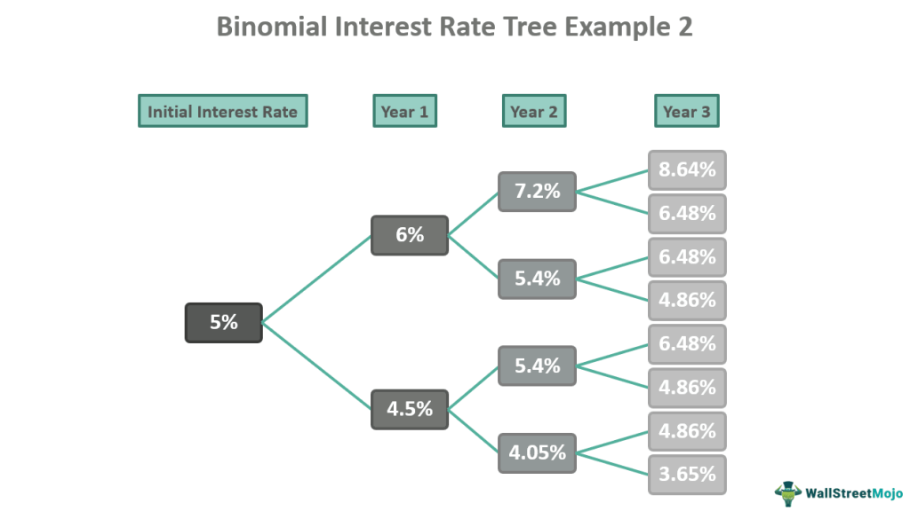

In the intricate world of finance, accurate pricing of options plays a pivotal role in ensuring market efficiency and profitability for traders. Options, as financial derivatives, provide the holder with the right, but not the obligation, to buy or sell an underlying asset at a predetermined price on or before a specified date. Due to their complex nature, determining the fair value of options necessitates sophisticated models, among which the binomial tree model holds significant importance.

The binomial tree model is a fundamental tool utilized in evaluating option values, particularly for American options. Unlike European options, which can only be exercised at expiration, American options can be exercised at any time before expiration. This characteristic requires a more complex analysis to account for the option's potential exercise at various stages until its expiration. The binomial model achieves this by representing different possible future price paths of the underlying asset through a tree structure, allowing for the consideration of various scenarios and early exercise strategies.



The article aims to explore the principles, mechanics, and applications of the binomial tree model, shedding light on its versatility in option pricing and its crucial role in algorithmic trading strategies. By systematically assessing the model's framework and implementations, the discussion underscores its enduring relevance in contemporary financial markets. The binomial model not only facilitates precise option valuation but also supports the development of algorithmic trading systems, offering a structured approach to decision-making as traders navigate the complexities of market dynamics.

## Table of Contents

## Understanding Financial Derivatives and Options

Financial derivatives, including options, are essential financial instruments that derive their value from the performance of underlying assets, such as stocks, commodities, currencies, or interest rates. These derivatives are essentially contracts established between two or more parties, with the terms of the contract dictating their value based on the fluctuation of the underlying asset's price. The ability to leverage these instruments allows traders and investors to hedge against risks or speculate on future price movements, enhancing potential returns. 

Options, a popular type of derivative, grant the holder the right, but not the obligation, to buy or sell an underlying asset at a predetermined price, known as the strike price, before a specified expiration date. This key feature distinguishes options from other types of derivatives and provides investors with flexibility and strategic opportunities. Options are classified mainly into two categories: call options and put options. A call option provides the holder with the right to purchase the underlying asset, while a put option allows the holder to sell the asset at the agreed strike price.

Understanding options is crucial for effective risk management and strategic trading. By using options, traders can protect against adverse price movements in their portfolios. For instance, purchasing a put option can serve as an insurance policy against a decline in the value of underlying stocks. Conversely, options can also be used to leverage positions, allowing traders to speculate on the direction of market movements with limited capital investment.

The pricing of options involves understanding several factors, including the current price of the underlying asset, the strike price, the time remaining until expiration (referred to as the "time value"), the [volatility](/wiki/volatility-trading-strategies) of the underlying asset, and the risk-free [interest rate](/wiki/interest-rate-trading-strategies). These factors are mathematically modeled to determine the fair value of an option.

Using Python, the pricing of a European call option can be demonstrated through the Black-Scholes formula, which assumes constant volatility and continuous trading of the underlying asset. The formula is:

$$
C = S_0 N(d_1) - Xe^{-rt}N(d_2)
$$

where:
- $C$ is the call option price
- $S_0$ is the current price of the underlying asset
- $X$ is the strike price of the option
- $r$ is the risk-free interest rate
- $t$ is the time to expiration
- $N$ is the cumulative distribution function of the standard normal distribution
- $d_1 = \frac{\ln(S_0/X) + (r + \sigma^2/2)t}{\sigma\sqrt{t}}$
- $d_2 = d_1 - \sigma\sqrt{t}$
- $\sigma$ is the volatility of the underlying asset

The comprehension of these pricing mechanisms equips traders with the ability to make informed decisions and execute various trading strategies tailored to their risk tolerance and market outlook. Consequently, options and financial derivatives are indispensable tools within the broader landscape of modern financial markets, providing pathways for effective risk management and speculative ventures.

## The Binomial Tree Model

The binomial tree model is a numerical method utilized for option pricing by simulating potential future price movements of the underlying asset. This model approximates the continuous price evolution of an asset through a discrete-time framework, where each period until the option's expiration can represent an upward or downward movement in the asset’s price.

The primary appeal of the binomial tree model lies in its versatility, particularly when valuing American options. Unlike European options, which can only be exercised at maturity, American options provide more flexibility as they can be exercised at any point before expiration. This capability aligns with the binomial model’s structure, where each node in the tree represents a potential decision point for exercising the option early. In each step of the model, the asset price can move to one of two possible states. 

To construct a binomial tree, the model divides the time to expiration into $N$ discrete intervals. At each interval, the asset price is assumed to undergo an up or down movement. The magnitude of these movements is determined by an up [factor](/wiki/factor-investing) ($u$) and a down factor ($d$), which are linked to the asset's volatility and the length of time intervals. A widely used approach to define these factors is:

$$
u = e^{\sigma\sqrt{\Delta t}}, \quad d = e^{-\sigma\sqrt{\Delta t}}
$$

where $\sigma$ is the volatility of the underlying asset and $\Delta t = \frac{T}{N}$ is the time increment for each step.

A crucial aspect of the binomial tree model is calculating the risk-neutral probabilities, which allow the valuation to exclude investor risk preferences. The risk-neutral probability ($p$) of an upward movement is given by:

$$
p = \frac{e^{r\Delta t} - d}{u - d}
$$

where $r$ is the risk-free interest rate. This formulation ensures that the expected value of the option aligns with its present value under a risk-neutral measure.

In summary, the binomial tree model provides a flexible framework for pricing options by discretizing potential price paths. Its applicability to American options, coupled with its ability to incorporate distinct volatilities at different intervals, makes it a valuable tool for traders and financial analysts.

## How the Binomial Model Works: A Step-by-Step Approach

The binomial model is a widely used method for pricing options by simulating various potential future paths of an underlying asset's price. The model operates by discretizing the time to expiration into small intervals, and for each interval, it projects possible upward or downward movements in the asset's price. Here's a detailed breakdown of how the binomial model is implemented:

### Setting up Parameters

Before constructing a binomial tree, it is essential to define the key parameters that will influence the option pricing:

- **Initial Asset Price ($S_0$)**: This is the current price of the underlying asset.
- **Strike Price ($K$)**: The predetermined price at which the option can be exercised. 
- **Time to Expiration ($T$)**: The time remaining until the option's expiration, typically expressed in years.
- **Volatility ($\sigma$)**: This represents the expected volatility of the asset's returns, often annualized.
- **Risk-Free Interest Rate ($r$)**: The theoretical rate of return on a riskless investment, such as a government bond.
- **Number of Steps ($N$)**: The number of intervals into which the time to expiration is divided.

### Constructing the Tree

In the binomial model, the price movement of the underlying asset is modeled over $N$ discrete time intervals, where at each step the price can either increase (up) or decrease (down). To construct the tree:

1. **Compute the Up and Down Factors**: 
$$
   u = e^{\sigma \sqrt{\Delta t}}, \quad d = \frac{1}{u}

$$
   where $\Delta t = \frac{T}{N}$ is the time interval.

2. **Initialize the Tree**: Begin with the initial asset price ($S_0$) and build the tree by calculating potential future prices at each node:
$$
   S_{i,j} = S_0 \cdot u^j \cdot d^{i-j}

$$
   where $S_{i,j}$ is the asset price at step $i$, after $j$ upward movements.

3. **Calculate Possible Prices**: Continue to grow the tree by computing the potential asset prices for each subsequent step until expiration.

### Risk-Neutral Valuation

The binomial tree model employs a risk-neutral valuation approach, which involves determining the option's price by using risk-neutral probabilities for upward and downward movements:

1. **Calculate Risk-Neutral Probabilities**:
$$
   p = \frac{e^{r \Delta t} - d}{u - d}

$$
   where $p$ is the risk-neutral probability of an upward move.

2. **Backward Induction**: Using the terminal payoffs at expiry, where the option's value at each final node is known, work backward through the tree to determine the option's price at the initial node. The option value at each node is given by:
$$
   C_{i,j} = e^{-r \Delta t} \cdot (p \cdot C_{i+1,j+1} + (1-p) \cdot C_{i+1,j})

$$
   For American options, adjust the option price at each node to account for early exercise by comparing it to the intrinsic value at that node.

This step-by-step methodology allows for the systematic valuation of both American and European options, providing traders with a comprehensive framework to estimate fair option prices under varying market conditions.

## Comparing Binomial and Black-Scholes Models

The binomial and Black-Scholes models are pivotal tools used for option pricing in financial markets, each with distinct features tailored to various types of options and market conditions. 

The binomial model offers notable flexibility, making it ideally suited for pricing American options. Unlike European options that can only be exercised at expiry, American options can be exercised any time before expiration, requiring a model that can accommodate this flexibility. The binomial approach accomplishes this by using a tree-based structure that models potential future asset prices at discrete time intervals. This allows the model to adjust for different stock paths and volatility scenarios, employing a multi-period binomial tree where each node represents a possible future stock price. Through this tree, traders can integrate real-world complexities such as varying interest rates and changing volatilities, providing a comprehensive evaluation of options.

On the other hand, the Black-Scholes model is renowned for its analytical solution, which simplifies the computational process. Intended primarily for European options, the model assumes constant volatility and interest rates throughout the option's life. Its formula provides a closed-form solution for pricing options, which is computationally efficient and produces quick results. Despite its assumptions, which may not always hold true in dynamic markets, the Black-Scholes model remains popular due to the ease of use it offers in situations where its assumptions align with market conditions.

The decision to use one model over the other largely depends on the specific requirements and constraints faced by traders. The binomial model is preferred when dealing with American options or in a dynamically volatile market where flexibility and precision are critical. Its adaptability allows traders to handle early exercise features and various assumptions about market movements. In contrast, the Black-Scholes model suits scenarios where speed is vital, and market conditions are stable enough to justify its assumption of constant volatility and interest rates.

Ultimately, choosing between these models involves evaluating the trade-off between computational efficiency and the need for adaptability to market complexities. Both models continue to play crucial roles in option pricing and risk management, serving as foundational tools in financial analysis.

## Applying Binomial Models in Algorithmic Trading

Algorithmic trading, which automates the execution of trades using complex mathematical models and computing power, benefits significantly from the structured framework of the binomial tree model. This model is particularly adept at handling the intricacies of trading American options, which feature the flexibility of being exercised at any time prior to expiration. The binomial tree structure, with its systematic approach to mapping potential future asset prices, provides a robust foundation for algorithmic strategies focused on precision and adaptability.

The process begins with setting up the binomial tree to capture potential price movements of an underlying asset. Each node in the tree represents a possible price at a given point in time, evolving from the initial asset price through successive potential upward or downward changes, typically denoted by factors $u$ and $d$. The model's flexibility allows it to adjust for various market conditions, including non-constant volatility, which is a key parameter in accurate price modeling.

In [algorithmic trading](/wiki/algorithmic-trading), the binomial tree's step-by-step process translates into clear, repeatable actions that can be programmed into trading algorithms. Given the discrete time steps of the model, it is possible to simulate numerous market scenarios, enabling traders to anticipate and swiftly respond to market developments. This is especially crucial in fast-paced market environments where decision-making speed can significantly impact profitability.

The binomial model applies risk-neutral valuation, a technique where asset prices are adjusted for risk by assuming a risk-free rate of return. By doing so, each node on the binomial tree is evaluated to derive the option's price as an expected value over its possible future states. The formula used for determining the risk-neutral probability $p$ is:

$$
p = \frac{e^{r \Delta t} - d}{u - d}
$$

where $r$ is the risk-free interest rate, and $\Delta t$ is the time increment per step in the model. This probability aids in calculating the fair price of the option at each node by working backward from the tree’s terminal nodes to the present, a method known as backward induction.

Python, with its rich ecosystem of financial libraries such as NumPy and Pandas, provides a powerful toolset for implementing the binomial model in algorithmic trading programs. Here's a simplified example of how to construct and evaluate a binomial tree for an American call option using Python:

```python
import numpy as np

# Parameters
S0 = 100  # Initial stock price
K = 100   # Strike price
T = 1.0   # Time to maturity in years
r = 0.05  # Risk-free interest rate
sigma = 0.2  # Volatility
N = 3  # Number of time steps

# Calculations
dt = T / N  # Time increment
u = np.exp(sigma * np.sqrt(dt))
d = 1 / u
p = (np.exp(r * dt) - d) / (u - d)

# Initialize asset prices at maturity
asset_prices = np.zeros((N+1, N+1))
asset_prices[0, 0] = S0

# Step through the tree
for i in range(1, N+1):
    asset_prices[:i, i] = asset_prices[:i, i-1] * u
    asset_prices[i, i] = asset_prices[i-1, i-1] * d

# Initialize option values at maturity
option_values = np.maximum(asset_prices[:, N] - K, 0)

# Backward induction for American option pricing
for i in range(N-1, -1, -1):
    option_values[:i+1] = np.exp(-r * dt) * (p * option_values[:i+1] + (1-p) * option_values[1:i+2])
    option_values[:i+1] = np.maximum(option_values[:i+1], asset_prices[:i+1, i] - K)

# Option value at the root of the tree
option_price = option_values[0]
print("The price of the American call option is:", option_price)
```

In this code snippet, the binomial model is employed to simulate potential asset prices and compute the price of an American call option. The iterative structure and calculations demonstrate the model's suitability for inclusion in algorithmic trading strategies, allowing programs to navigate complex market scenarios efficiently. By leveraging technology and the binomial approach, traders can enhance their decision-making processes, effectively managing risk and pursuing optimal trades amidst dynamic financial landscapes.

## Real-World Application and Examples

Financial institutions frequently employ the binomial tree model to price complex derivatives, manage portfolios, and mitigate associated risks. A primary application is in the pricing of American options, which distinguishes itself from European options by allowing the option holder the flexibility to exercise the option at any point before expiration. The ability to accurately determine the optimal exercise strategy and price such options is crucial for traders looking to maximize profitability.

In practical application, firms consider potential early exercise decisions by evaluating each node in the binomial model. The model generates a discrete approximation of the option's possible future paths, providing detailed insight into how the option may be valued under varying market conditions. At each node, traders must compare the intrinsic value of exercising the option immediately with the expected future value of holding the option, computed via backward induction through the tree.

Python, owing to its rich set of libraries and ease of use, is often employed to perform these complex analyses at scale. Tools such as NumPy and SciPy play an essential role in these calculations. A simplified Python implementation of a binomial tree for an American option might look like this:

```python
import numpy as np

def binomial_tree_american_option(S, K, T, r, sigma, N, option_type='call'):
    delta_t = T / N
    u = np.exp(sigma * np.sqrt(delta_t))
    d = 1 / u
    p = (np.exp(r * delta_t) - d) / (u - d)

    disc = np.exp(-r * delta_t)
    # Initialize asset price tree
    asset_prices = np.zeros((N + 1, N + 1))
    for i in range(N + 1):
        for j in range(i + 1):
            asset_prices[j, i] = S * (u ** (i - j)) * (d ** j)

    # Initialize option values at maturity
    option_values = np.zeros((N + 1, N + 1))
    if option_type == 'call':
        option_values[:, N] = np.maximum(0, asset_prices[:, N] - K)
    else:
        option_values[:, N] = np.maximum(0, K - asset_prices[:, N])

    # Backward induction
    for i in range(N - 1, -1, -1):
        for j in range(i + 1):
            hold_value = disc * (p * option_values[j, i + 1] + (1 - p) * option_values[j + 1, i + 1])
            exercise_value = asset_prices[j, i] - K if option_type == 'call' else K - asset_prices[j, i]
            option_values[j, i] = max(hold_value, exercise_value)

    return option_values[0, 0]

# Example Usage
S = 100  # Current stock price
K = 100  # Strike price
T = 1    # Time to maturity (in years)
r = 0.05 # Risk-free interest rate (annualized)
sigma = 0.2 # Volatility (annualized)
N = 100  # Number of binomial tree steps

option_price = binomial_tree_american_option(S, K, T, r, sigma, N, option_type='call')
print(f"The American call option price is: {option_price:.2f}")
```

This implementation computes the price of an American call option by constructing a binomial tree of potential future stock prices and applying the principle of risk-neutral valuation. Each node represents a possible future stock price, and the model calculates an option value by considering potential early exercise opportunities.

In addition to pricing, the binomial tree model is invaluable in risk management and portfolio strategy development. By simulating various price scenarios, institutions can estimate potential losses and gains, hedging against unfavorable market movements. The flexibility of the model allows it to incorporate changes in volatility, interest rates, and other critical parameters, making it a versatile and powerful tool in modern financial analysis.

## Conclusion

The binomial option pricing model remains a pivotal tool in financial markets due to its inherent flexibility and precision in accommodating diverse scenarios. Unlike more recent models, the binomial tree model uniquely offers the adaptability required to handle a broad range of market conditions, particularly important for pricing American options which can be exercised at any time before expiration. Its structured nature allows for meticulous consideration of each possible asset price pathway, enhancing the accuracy of option valuation.

In the fast-evolving world of finance, where algorithmic trading plays an increasingly dominant role, the binomial model's utility becomes even more pronounced. Its clear, step-by-step approach lends itself to algorithmic implementations, allowing traders to construct reproducible strategies that can swiftly respond to market changes. This model facilitates the simulation of numerous potential scenarios, enabling traders to anticipate and act on early exercise decisions effectively.

The enduring significance of the binomial model is further reinforced in risk management practices. By providing financial institutions with a robust framework for pricing complex derivatives, it aids in efficient portfolio management and risk mitigation. Whether employed individually or as part of a broader risk management strategy, the binomial model offers the precision and adaptability necessary in today’s dynamic financial environment. Consequently, it sustains its vital role in financial analysis and strategy development across the industry.

## References & Further Reading

[1]: Hull, J. C. (2017). ["Options, Futures, and Other Derivatives"](https://www.semanticscholar.org/paper/Options%2C-Futures%2C-and-Other-Derivatives-Hull/89bdee500c8623864fc9eb7a471546aa713acc44) (9th Edition). Pearson.

[2]: Cox, J. C., Ross, S. A., & Rubinstein, M. (1979). [“Option Pricing: A Simplified Approach.”](https://www.sciencedirect.com/science/article/pii/0304405X79900151) Journal of Financial Economics, 7(3), 229-263.

[3]: Black, F., & Scholes, M. (1973). ["The Pricing of Options and Corporate Liabilities,"](https://www.cs.princeton.edu/courses/archive/fall09/cos323/papers/black_scholes73.pdf) Journal of Political Economy, 81(3), 637-654.

[4]: Chriss, N. A. (1997). ["Black-Scholes and Beyond: Option Pricing Models."](https://archive.org/details/blackscholesbeyo00chri_0) McGraw-Hill.

[5]: Wilmott, P. (2006). ["Paul Wilmott Introduces Quantitative Finance."](https://www.amazon.com/Paul-Wilmott-Quantitative-Finance-Set/dp/0470018704) John Wiley & Sons.