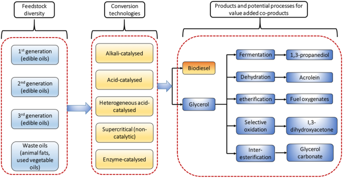

## Table of Contents

## What is biodiesel and how is it defined?

Biodiesel is a type of fuel that comes from natural sources like plants and animals. It is made by mixing oils or fats with alcohol, usually methanol, and a catalyst. This process creates a fuel that can be used in diesel engines, just like regular diesel fuel. Biodiesel is often made from vegetable oils, such as soybean oil or canola oil, but it can also be made from animal fats or even used cooking oil.

Biodiesel is considered a renewable energy source because it comes from materials that can be grown or collected again and again. This is different from regular diesel, which comes from oil that takes millions of years to form. Because biodiesel is made from natural sources, it can help reduce the amount of harmful gases released into the air when it is burned. This makes it a more environmentally friendly choice compared to traditional diesel fuel.

## How is biodiesel produced?

Biodiesel is made through a process called transesterification. This process involves mixing oils or fats with alcohol, usually methanol, and a catalyst, like sodium hydroxide or potassium hydroxide. The oils or fats can come from plants, like soybeans or canola, or from animals, or even from used cooking oil. When these ingredients are mixed together and heated, they react to form biodiesel and glycerin. The glycerin is removed, leaving behind the biodiesel, which can then be used as fuel.

After the transesterification process, the biodiesel needs to be cleaned to remove any leftover impurities. This is done by washing the biodiesel with water or using other methods like dry washing. Once it's clean, the biodiesel is ready to use. It can be mixed with regular diesel fuel or used on its own in diesel engines. Making biodiesel this way helps turn waste materials into useful fuel and can be better for the environment than using regular diesel.

## What are the primary feedstocks used in biodiesel production?

The main things used to make biodiesel are called feedstocks. These are usually oils from plants or fats from animals. The most common plant oils used are soybean oil and canola oil. These oils are popular because they are easy to get and work well in the biodiesel making process. Sometimes, other oils like palm oil or sunflower oil are used too, depending on where the biodiesel is being made.

Another important feedstock for biodiesel is animal fat. This can come from places like meat processing plants. Using animal fat is a good way to turn waste into something useful. Also, used cooking oil from restaurants can be collected and turned into biodiesel. This helps reduce waste and is good for the environment.

In some places, they also use other things like algae or waste from making other products. Algae can be grown quickly and can make a lot of oil. Using different feedstocks helps make sure there is enough to meet the demand for biodiesel and can help keep the cost down.

## What are the environmental benefits of using biodiesel?

Using biodiesel instead of regular diesel can help the environment in many ways. One big benefit is that biodiesel burns cleaner. When you use biodiesel, it makes less harmful smoke and gases, like carbon dioxide, which can make the air better to breathe. This is important because these gases can cause problems like climate change. Also, biodiesel can help reduce the amount of tiny particles in the air, which can be bad for our health.

Another good thing about biodiesel is that it comes from things that can grow back, like plants and used cooking oil. This means we can keep making more of it without using up all the Earth's resources. Using biodiesel helps us depend less on oil, which comes from underground and can run out. By using renewable sources, we can have a more sustainable way of getting energy and help protect the planet for the future.

## How does biodiesel compare to conventional diesel in terms of performance?

Biodiesel and conventional diesel can both be used in diesel engines, but they have some differences in how they perform. Biodiesel usually has a higher cetane number, which means it ignites more easily and can help the engine start faster and run smoother. This can lead to better performance in cold weather. However, biodiesel might have less energy in it compared to regular diesel, so you might need a bit more of it to go the same distance. This is something to keep in mind when using biodiesel.

Another thing to consider is how biodiesel affects the engine over time. Biodiesel can be a bit harder on some engine parts because it can dissolve certain materials and might cause more wear. But, modern engines are often made to handle biodiesel, and many people use it without any big problems. Also, biodiesel can help keep the engine cleaner inside because it burns more completely than regular diesel. This can lead to less buildup and a longer-lasting engine if it's taken care of properly.

## What are the economic implications of switching to biodiesel?

Switching to biodiesel can have both good and challenging effects on the economy. On the positive side, using biodiesel can create new jobs in farming, collecting used oils, and making the fuel. This can help the economy grow, especially in areas where these activities happen. Also, because biodiesel comes from things that can grow back, like plants and used cooking oil, it can help countries rely less on oil from other places. This can save money and make the economy more stable by not depending so much on other countries for fuel.

However, there are some challenges too. Making biodiesel can sometimes cost more than making regular diesel, especially if the price of the oils and fats used to make it goes up. This could mean higher fuel prices for people and businesses, which might affect how much they can spend on other things. Also, the cost of changing engines and fuel systems to work well with biodiesel can be high. If people and businesses have to pay for these changes, it might slow down the switch to biodiesel. But over time, as more people use it and technology gets better, these costs could go down and make biodiesel a more affordable choice.

## What are the challenges and limitations in biodiesel production and use?

Making and using biodiesel can face some challenges. One big problem is that the oils and fats used to make biodiesel can be expensive or hard to get. If too many people start using biodiesel, it might use up all the oils and fats we have, making prices go up. Also, making biodiesel needs a lot of energy, and if this energy comes from non-renewable sources, it might not be as good for the environment as we hope. Another challenge is that biodiesel can be harder on some engine parts. It can dissolve certain materials in the engine, causing more wear and tear. This means that engines might need to be changed or fixed more often, which can cost a lot of money.

Another issue is that biodiesel might not work as well in very cold weather. It can start to turn into a solid, which can clog up the fuel system and make it hard to start the engine. This can be a big problem in places with cold winters. Also, not all places have the right rules or systems in place to make and use biodiesel easily. This can make it hard to switch to biodiesel and can slow down how quickly we can start using it more. But, as technology gets better and more people learn about biodiesel, these problems might get easier to solve.

## How does biodiesel impact engine maintenance and durability?

Using biodiesel can affect how often you need to take care of your engine and how long it lasts. Biodiesel can be a bit harder on some engine parts because it can dissolve certain materials like rubber and some plastics. This might cause more wear and tear over time. If you use biodiesel a lot, you might need to check and fix things like fuel filters and seals more often than you would with regular diesel. This can mean more trips to the mechanic and might cost more money in the long run.

On the other hand, biodiesel can also help keep the engine cleaner inside. It burns more completely than regular diesel, which means less buildup of gunk and soot. This can make the engine last longer if it's taken care of properly. But, it's important to use the right kind of biodiesel for your engine and to follow the maker's advice on how to use it. If you do that, biodiesel can be a good choice that helps keep your engine running well.

## What are the current global trends and policies regarding biodiesel?

Around the world, more and more countries are starting to use biodiesel because it's good for the environment. Many places have rules that say a certain amount of fuel has to be biodiesel. For example, some countries have laws that say all diesel fuel sold must have a little bit of biodiesel mixed in. This is called a biodiesel blend. These rules help make sure that biodiesel is used more often and can help lower the bad gases that come from cars and trucks. Also, some countries give money to people and companies that make biodiesel to help them grow their businesses. This is because using biodiesel can help the environment and create new jobs.

Another big trend is that more people are learning about biodiesel and how it can help the planet. This is making more people want to use it. Big companies and governments are working together to make more biodiesel and find new ways to make it cheaper and easier to use. They are also trying to find new things to use to make biodiesel, like algae or waste from other industries. This can help make sure there is enough biodiesel for everyone who wants to use it. But, even with all these good things, there are still some challenges, like making sure biodiesel doesn't cost too much and that it works well in all kinds of weather.

## What advancements have been made in biodiesel technology?

Scientists and engineers have been working hard to make biodiesel better. One big step forward is finding new ways to make biodiesel from things like algae and waste from other industries. This can help make sure there is enough biodiesel for everyone who wants to use it. They've also made the process of turning oils and fats into biodiesel faster and more efficient. This means less energy is needed to make biodiesel, which is good for the environment.

Another important advancement is making biodiesel work better in cold weather. Scientists have found ways to stop biodiesel from turning into a solid when it gets cold, which can make engines hard to start. They've also made biodiesel that is less hard on engine parts, so engines can last longer and need less fixing. These improvements are helping more people and businesses feel good about using biodiesel because it's easier to use and can save money in the long run.

## How can biodiesel integration be optimized in existing fuel infrastructures?

To make biodiesel work well with the fuel systems we already have, we need to make some changes. First, we need to make sure that the places where fuel is stored and moved around can handle biodiesel. This might mean cleaning tanks and pipes to get rid of any leftover regular diesel that might mix with the biodiesel and cause problems. Also, we need to train the people who work with fuel to know how to handle biodiesel safely. They need to know that biodiesel can be different from regular diesel and might need special care.

Another important thing is to make sure that engines and fuel systems can use biodiesel without any issues. Some engines might need new parts, like different fuel filters or seals, that work better with biodiesel. This can help stop any wear and tear that might happen because biodiesel can be harder on some materials. Also, we need to keep an eye on how biodiesel is mixed with regular diesel to make sure it's the right blend. This can help make sure that engines run smoothly and that biodiesel works well in all kinds of weather. By making these changes, we can make biodiesel easier to use and help more people switch to this cleaner fuel.

## What is the future outlook for biodiesel in the context of renewable energy?

The future of biodiesel looks bright as part of renewable energy. More and more people are seeing how biodiesel can help the environment by making less harmful smoke and gases. Countries are making rules to use more biodiesel in their fuel, which helps make sure it's used more often. Scientists are also finding new ways to make biodiesel from things like algae and waste, which can help make sure there's enough for everyone who wants to use it. These new ways are also making biodiesel cheaper and easier to make, which is good for everyone.

Even with all these good things, there are still some challenges. Biodiesel can be harder on some engine parts, so we need to find ways to make it work better with engines. Also, we need to make sure that the places where fuel is stored and moved can handle biodiesel without any problems. But, as more people learn about biodiesel and as technology gets better, these challenges can be solved. In the future, biodiesel could be a big part of how we get energy in a way that's good for the planet.

## What is the role of biodiesel in alternative fuel and how can we understand it?

Biodiesel is a renewable alternative to traditional fossil fuels, produced through the transesterification of organic oils, including vegetable oils and animal fats. The transesterification process involves reacting these oils with an alcohol, typically methanol or ethanol, in the presence of a catalyst, such as sodium or potassium hydroxide. This chemical reaction results in the formation of fatty acid methyl esters (FAME), which is the chemical composition of biodiesel, along with glycerol as a byproduct. The formula for this reaction is:

$$
\text{Triglycerides} + \text{Alcohol} \xrightarrow{\text{Catalyst}} \text{Glycerol} + \text{Biodiesel (FAME)}
$$

Biodiesel offers several environmental advantages over conventional fossil fuels. Primarily, it is biodegradable and non-toxic, reducing the risk of environmental contamination due to spills. Additionally, the combustion of biodiesel emits significantly lower levels of carbon dioxide (CO₂), sulfur oxides (SOₓ), and particulate matter compared to petroleum-based diesel. This reduction in emissions contributes to decreased air pollution and a smaller carbon footprint.

In addition to its environmental benefits, biodiesel can be utilized in various applications. It serves as a vehicle fuel that can either be used in pure form (B100) or blended with conventional diesel in various proportions (e.g., B20, which is 20% biodiesel and 80% petroleum diesel). Biodiesel is also suitable as an aircraft fuel and heating oil, offering versatility across different sectors. Its similarity to traditional diesel allows it to be used in existing diesel engines with little or no modification, making it an attractive alternative in the transition to greener energy sources.

Despite its benefits, biodiesel faces several challenges and criticisms. One significant concern is its impact on food production, as the demand for feedstock to produce biodiesel can lead to competition with food crops, affecting food security and prices. This issue is particularly pronounced with crop-based biodiesel sources such as soybean or palm oil. Furthermore, the production costs of biodiesel can be higher compared to conventional diesel, affecting its market competitiveness. Technological advancements and identifying sustainable feedstock sources, like waste oils or algae, are critical in overcoming these challenges and ensuring biodiesel's role in the energy landscape continues to grow.

The production and use of biodiesel represent a vital component of the broader strategy to transition towards renewable energy sources. As global demand for cleaner fuel alternatives increases, continued research and innovation in biodiesel production methods and feedstock sourcing are necessary to maximize its potential and address its inherent challenges.

## References & Further Reading

[1]: Demirbas, A. (2009). ["Biodiesel: A Realistic Fuel Alternative for Diesel Engines."](https://link.springer.com/book/10.1007/978-1-84628-995-8) Springer Science & Business Media.

[2]: Knothe, G., Gerpen, J. V., & Krahl, J. (eds). (2010). ["The Biodiesel Handbook."](https://www.sciencedirect.com/book/9781893997622/the-biodiesel-handbook) AOCS Press.

[3]: Makridakis, S., Wheelwright, S. C., & Hyndman, R. J. (1998). ["Forecasting: Methods and Applications."](https://www.researchgate.net/publication/52008212_Forecasting_Methods_and_Applications) John Wiley & Sons, Inc.

[4]: Pyles, M. K. (2003). ["The Basics of Algorithmic Trading: Concepts and Strategies: Explained."](https://tradingstrategycourse.com/basics-algorithmic-trading/) De Gruyter.

[5]: Mitchell, C., & Connor, P. (2004). ["Renewable Energy Policy in the United Kingdom"](https://www.sciencedirect.com/science/article/pii/S0301421504000710). Renewable and Sustainable Energy Reviews, 8(1), 119-135. 

[6]: Lopez de Prado, M. (2018). ["Advances in Financial Machine Learning."](https://www.amazon.com/Advances-Financial-Machine-Learning-Marcos/dp/1119482089) Wiley.

[7]: U.S. Energy Information Administration (EIA). (2021). ["International Energy Outlook 2021."](https://www.eia.gov/outlooks/ieo/pdf/IEO2021_ReleasePresentation.pdf) 

[8]: International Energy Agency (IEA). (2019). ["Renewables 2019."](https://www.iea.org/reports/renewables-2019)

[9]: Vandezande, L., Meeus, L., Belmans, R., Saguan, M., & Glachant, J. M. (2010). ["Well-functioning electricity markets: Theory, modeling, and policy."](https://lirias.kuleuven.be/bitstream/handle/123456789/205873/Leen+vandezande_INFRA+2008.pdf?sequence=1) Energy Policy, 38(10), 6632-6640.