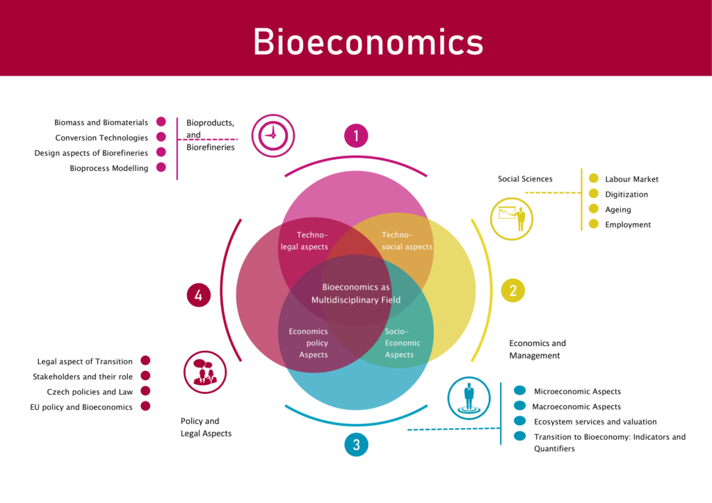

## Table of Contents

## What is bioeconomics?

Bioeconomics is a field that combines biology and economics to study how living things and economic activities interact. It looks at how we can use natural resources in a sustainable way to make products and energy. Bioeconomics helps us understand how to manage our resources so that we can keep using them without harming the environment.

One important part of bioeconomics is finding ways to use renewable resources, like plants and animals, instead of non-renewable ones, like oil and coal. This can help reduce pollution and protect the planet. By studying bioeconomics, scientists and economists work together to create new ways to grow food, make medicines, and produce energy that are good for both the economy and the environment.

## How does bioeconomics differ from traditional economics?

Bioeconomics and traditional economics both study how resources are used, but they look at things in different ways. Traditional economics focuses on money, markets, and how people make choices about buying and selling things. It's all about how to make the most profit and how to use resources to grow the economy. Traditional economics often doesn't pay much attention to where resources come from or how using them might affect the environment.

On the other hand, bioeconomics brings biology into the mix. It looks at how living things, like plants and animals, can be used as resources in a way that's good for the environment. Bioeconomics is all about sustainability, which means using resources in a way that we can keep using them in the future without hurting the planet. Instead of just focusing on making money, bioeconomics tries to balance economic growth with taking care of nature.

## What are the main principles of bioeconomics?

The main principles of bioeconomics focus on using living things in a way that helps both the economy and the environment. One big idea is sustainability, which means we should use resources in a way that we can keep using them in the future. Instead of using things like oil and coal that can run out, bioeconomics looks at using renewable resources like plants and animals. This helps us take care of the planet while still making things we need, like food, medicine, and energy.

Another important principle is thinking about the whole system, not just one part. In bioeconomics, we look at how everything in nature is connected. For example, if we use too much of one resource, it can hurt other parts of the environment. By understanding these connections, we can make better choices about how to use resources in a way that keeps the whole system healthy. This means working together with scientists, farmers, and businesses to find new ways to grow and make things that are good for both the economy and the environment.

## What are the key mechanisms that drive bioeconomics?

The key mechanisms that drive bioeconomics are all about using living things like plants and animals to make things we need, while also taking care of the environment. One big mechanism is using renewable resources. Instead of using things like oil and coal that can run out, bioeconomics focuses on things like crops, forests, and even waste from animals and plants. These resources can be grown again and again, which helps us keep using them without hurting the planet.

Another mechanism is innovation in technology and processes. Scientists and engineers work on new ways to turn these living resources into things like food, medicine, and energy. For example, they might find new ways to make biofuels from plants, or develop new kinds of crops that can grow in tough conditions. These innovations help make bioeconomics work better and help the environment at the same time.

Finally, bioeconomics is driven by policies and cooperation. Governments can make rules that encourage people to use renewable resources and protect the environment. They can also help fund research and new projects. At the same time, businesses, farmers, and scientists need to work together to share ideas and find the best ways to use resources. By working together, we can make sure that bioeconomics helps both the economy and the environment.

## How does bioeconomics incorporate ecological systems into economic models?

Bioeconomics incorporates ecological systems into economic models by looking at how living things and the environment are connected. In traditional economics, the focus is often just on money and how to make the most profit. But bioeconomics adds in the idea that the health of the environment matters too. It looks at how using resources like plants and animals affects the whole ecosystem. For example, if we cut down too many trees to make paper, it can hurt the forest and the animals that live there. By including these ecological connections in economic models, bioeconomics helps us see the bigger picture and make choices that are good for both the economy and the environment.

One way bioeconomics does this is by using the idea of sustainability. This means using resources in a way that we can keep using them in the future without hurting the planet. Instead of just using up non-renewable resources like oil, bioeconomics encourages us to use renewable resources like crops and forests. It also looks at how different parts of the ecosystem depend on each other. For instance, healthy soil is important for growing food, and clean water is important for both people and wildlife. By putting these ecological ideas into economic models, bioeconomics helps us find ways to grow the economy while also taking care of the environment.

## What role do renewable biological resources play in bioeconomics?

Renewable biological resources are super important in bioeconomics. These are things like plants, animals, and even waste from them that can be used again and again. Instead of using up resources like oil and coal that can run out, bioeconomics focuses on using these living things. This helps us take care of the planet because we're not using stuff that can't be replaced. For example, we can grow crops to make biofuels, which are a lot better for the environment than using oil.

By using renewable biological resources, bioeconomics helps us find new ways to make things like food, medicine, and energy. Scientists and farmers work together to come up with new ideas, like making new kinds of crops that can grow in tough places. This not only helps the environment but also helps the economy by creating new jobs and businesses. When we use these resources in a smart way, we can keep using them for a long time without hurting the planet.

## Can you provide examples of industries that operate under bioeconomic principles?

One industry that operates under bioeconomic principles is the biofuel industry. Instead of using oil and coal, which can run out and harm the environment, the biofuel industry uses plants like corn and sugarcane to make fuel. This helps reduce pollution because biofuels burn cleaner than oil. It also helps farmers because they can sell their crops to be turned into fuel. By using renewable resources like plants, the biofuel industry helps us take care of the planet while still meeting our energy needs.

Another example is the sustainable agriculture industry. This industry focuses on growing food in ways that are good for the environment. Farmers use methods like crop rotation and natural fertilizers to keep the soil healthy and grow food without harming the planet. They might also use less water and energy to grow their crops. By doing this, sustainable agriculture helps us have enough food to eat while also making sure we can keep using the land to grow food in the future.

The pharmaceutical industry also uses bioeconomic principles when it makes medicines from natural sources. Scientists can use plants, bacteria, and even animals to create new drugs that can help people get better. This not only helps the environment by using renewable resources but also helps people by giving them new ways to stay healthy. By using living things to make medicines, the pharmaceutical industry shows how bioeconomics can work to help both the economy and the planet.

## How do policies and regulations influence the development of bioeconomics?

Policies and regulations play a big role in helping bioeconomics grow. Governments can make rules that encourage people to use renewable resources instead of things like oil and coal that can run out. For example, they might give money to farmers who grow crops for biofuels or set up programs to help scientists find new ways to use plants and animals to make things. These rules help make it easier and cheaper for businesses to use bioeconomic ideas, which helps the environment and creates new jobs.

At the same time, regulations can also make sure that using these renewable resources doesn't hurt the environment. Governments can set up rules to protect forests, rivers, and wildlife while still letting people use these resources. This helps keep the balance between growing the economy and taking care of the planet. By having good policies and regulations, we can make sure that bioeconomics helps both the economy and the environment in the long run.

## What are the challenges faced by bioeconomics in terms of sustainability and scalability?

One big challenge for bioeconomics is making sure it stays sustainable. This means we need to use renewable resources like plants and animals in a way that we can keep using them without hurting the environment. But sometimes, using these resources a lot can still cause problems. For example, if we grow too many crops for biofuels, it might use up a lot of water and hurt the soil. We need to find the right balance so that we can use these resources without causing harm. Scientists and farmers have to work together to come up with new ways to grow things that are good for the planet.

Another challenge is making bioeconomics big enough to really make a difference. This is called scalability. It's one thing to use bioeconomic ideas on a small scale, but it's harder to do it on a big scale. For example, turning a lot of farms into sustainable ones that grow crops for biofuels takes a lot of time and money. It also needs new technology and ways of doing things. Governments and businesses have to work together to make this happen. They need to invest in new ideas and help people learn how to use them. If we can make bioeconomics bigger, it can help the economy and the environment a lot more.

## How does bioeconomics contribute to solving global issues like climate change and resource depletion?

Bioeconomics helps solve big problems like climate change by using renewable resources like plants and animals instead of things like oil and coal that can run out. When we use oil and coal, they make a lot of pollution that heats up the planet. But if we use plants to make biofuels, it makes less pollution. This helps slow down climate change because we're not putting as much bad stuff into the air. Plus, plants take in carbon dioxide, which is a gas that makes the planet hotter, so growing more plants can actually help cool things down.

Bioeconomics also helps with the problem of running out of resources. Instead of using things that we can't get back, like oil, we use things that can grow again, like crops and forests. This means we can keep using these resources without worrying about them running out. By doing this, we can make sure we have enough food, medicine, and energy for everyone, now and in the future. Bioeconomics helps us use the planet's resources in a smart way so that we can keep living well without hurting the earth.

## What are the latest research trends and innovations in the field of bioeconomics?

One of the latest research trends in bioeconomics is finding new ways to make biofuels from different kinds of plants and waste. Scientists are working on turning things like corn stalks, wood chips, and even food waste into fuel. This is great because it uses stuff that we usually throw away, which helps keep the planet clean. They're also trying to make these biofuels even better by making them burn cleaner and give more energy. This could help us use less oil and coal, which would be good for the environment and help fight climate change.

Another big trend is using biotechnology to make new kinds of crops that can grow in tough places. Scientists are making plants that can live with less water, in hot places, or in soil that's not very good. This means we can grow food and other useful plants in more places, which is important because the world's population is growing and we need more food. These new crops can also help farmers make more money and use fewer resources like water and fertilizers, which is good for the environment.

Lastly, researchers are looking into how we can use bioeconomics to make things like plastics and chemicals from living things instead of oil. They're working on making biodegradable plastics from plants, which break down naturally and don't hurt the environment. This could help us use less plastic that stays around forever and pollutes the planet. By using living things to make these products, we can keep using resources in a way that's good for the economy and the environment at the same time.

## How can bioeconomics be integrated into global economic strategies for long-term ecological and economic health?

Bioeconomics can be integrated into global economic strategies by focusing on using renewable resources like plants and animals instead of things like oil and coal that can run out. Governments can make rules and give money to help farmers grow crops for biofuels and to help scientists find new ways to use these resources. This can help the economy grow by creating new jobs and businesses, while also taking care of the planet. By working together, countries can share ideas and help each other use bioeconomics to make things like food, medicine, and energy in a way that's good for everyone.

To make sure bioeconomics helps both the economy and the environment in the long run, we need to think about how to keep using these resources without hurting the planet. This means finding the right balance so that we can grow food and make energy without using too much water or hurting the soil. It also means making sure that new technology and ways of doing things can be used on a big scale. By investing in these ideas and helping people learn how to use them, we can make bioeconomics a big part of our global economic strategy. This will help us fight problems like climate change and make sure we have enough resources for everyone in the future.

## References & Further Reading

[1]: Clark, C. W. (1990). ["Mathematical Bioeconomics: The Optimal Management of Renewable Resources"](https://archive.org/details/mathematicalbioe0002clar). Wiley-Interscience.

[2]: Gordon, H. S. (1954). ["The Economic Theory of a Common-Property Resource: The Fishery"](https://www.jstor.org/stable/1825571). Journal of Political Economy.

[3]: Hilborn, R., & Walters, C. J. (1992). ["Quantitative Fisheries Stock Assessment: Choice, Dynamics, and Uncertainty"](https://link.springer.com/book/10.1007/978-1-4615-3598-0). Springer.

[4]: McCormick, K., & Kautto, N. (2013). ["The Bioeconomy in Europe: An Overview"](https://www.mdpi.com/2071-1050/5/6/2589). Sustainability.

[5]: Pörtner, H. O., Roberts, D. C., Masson-Delmotte, V., Zhai, P., Poloczanska, E. S., Mintenbeck, K., et al. (2021). ["IPCC Special Report on the Ocean and Cryosphere in a Changing Climate"](https://www.ipcc.ch/srocc/cite-report/) - Intergovernmental Panel on Climate Change (IPCC).

[6]: Stuart, P. R. & El-Halwagi, M. M. (2012). ["Integrated Biorefineries: Design, Analysis, and Optimization"](https://www.taylorfrancis.com/books/edit/10.1201/b13048/integrated-biorefineries-mahmoud-el-halwagi-paul-stuart). CRC Press.

[7]: van der Werf, H., & Petit, J. (2002). ["Evaluation of the Environmental Impact of Agriculture at the Farm Level: A Comparison and Analysis of 12 Indicator-Based Methods"](https://www.sciencedirect.com/science/article/abs/pii/S0167880901003541). Agriculture, Ecosystems & Environment.

[8]: Wiedmann, T., & Lenzen, M. (2018). ["Environmental and Social Footprints of International Trade"](https://www.nature.com/articles/s41561-018-0113-9). Nature.