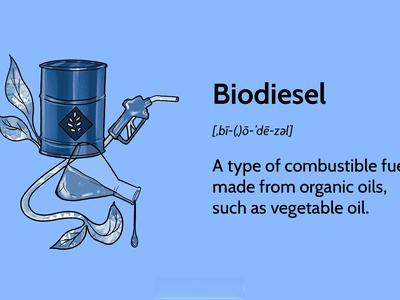

The increasing demands for sustainable energy solutions have propelled biofuels to a prominent position within the renewable energy landscape. As society strives to minimize its carbon footprint, biofuels offer a promising alternative to traditional fossil fuels, with the potential to significantly curb emissions across various sectors. This exploration into the current state of biofuels investigates into their potential advantages and inherent drawbacks, alongside examining the emerging role of algorithmic trading in the energy market.

Biofuels, derived from biological feedstocks such as corn and algae, are increasingly being recognized for their ability to reduce dependency on fossil fuels. Their use underscores a critical shift towards more sustainable energy practices. However, the journey to widespread adoption is laden with challenges, encompassing issues of scalability, cost, and resource allocation, particularly when it comes to feedstock availability and land use.



Simultaneously, algorithmic trading is making strides in the energy markets, driven by the volatile nature of renewable energy sources. This automated trading approach utilizes algorithms to analyze vast amounts of data and execute trading orders at optimal conditions, thus enabling more efficient and strategic energy trading. The integration of algorithmic trading into energy markets highlights its growing importance, seeking to maximize returns while navigating the complexities of energy supply and demand.

As both biofuels and algorithmic trading evolve, their combined potential offers a robust pathway towards reducing carbon emissions and enhancing market efficiency. Nevertheless, several obstacles remain to be addressed. The development of advanced biofuel technologies and regulatory frameworks that support innovation and market integrity will be crucial in realizing the full benefits of these solutions. Through a collaborative approach, integrating technological advancements and policy incentives, it is possible to harness the full power of biofuels and algorithmic trading in mitigating the impacts of climate change.

## Table of Contents

## Understanding Biofuel

Biofuels are classified as renewable energy sources derived from organic materials, or biological feedstocks, such as corn, sugarcane, and algae. These energy sources play a crucial role in reducing greenhouse gas emissions by providing a cleaner alternative to fossil fuels. The use of biofuels decreases the carbon footprint of energy production, as the carbon dioxide (CO₂) released during combustion is offset by the amount absorbed by the feedstocks during their growth phase. This cycle contributes to the designation of biofuels as a carbon-neutral energy source.

Biofuels are broadly categorized into two generations based on the type of feedstocks used and the processes involved in their production. First-generation biofuels are derived from food crops such as corn, sugarcane, and soybeans. These biofuels, primarily ethanol and biodiesel, are produced through fermentation and transesterification processes respectively. While they contribute to energy sustainability, their reliance on food crops raises concerns about food security and land use. The competition with agricultural resources for food and biofuel production can drive up food prices and lead to deforestation, affecting biodiversity and ecosystem services.

Next, there are next-generation biofuels, which address some limitations inherent to first-generation biofuels. These advanced biofuels are produced from non-food biomass, including lignocellulosic materials such as agricultural residues, wood chips, and dedicated energy crops like switchgrass. They can also be derived from microalgae, which require less arable land and have higher growth yields compared to terrestrial crops. The production of next-generation biofuels involves more complex biochemical or thermochemical conversion technologies, such as enzymatic hydrolysis, gasification, and pyrolysis. These processes enhance the sustainability of biofuels by utilizing waste materials and non-arable lands, although they present challenges in terms of scalability and production cost.

As biofuel technologies advance, the focus remains on increasing their economic feasibility and minimizing their environmental impacts. Ongoing research and development efforts aim to optimize conversion processes, improve biomass yields, and discover new feedstock sources, paving the way for more sustainable energy solutions in the global quest to reduce dependence on fossil fuels and mitigate climate change.

## Applications of Biofuel Beyond Automotive

Biofuels, traditionally used in the automotive sector, are increasingly being adopted in other industries due to their potential to mitigate carbon emissions. One notable application is in the aviation industry. Airlines are exploring biofuel blends as a way to reduce their carbon footprints. For example, sustainable aviation fuel (SAF), which can significantly cut lifecycle greenhouse gas emissions compared to conventional jet fuels, is gaining traction. According to the International Air Transport Association (IATA), SAF can reduce CO₂ emissions by up to 80% over the lifecycle of the fuel compared to fossil fuels.

In the marine sector, biofuels offer an alternative to heavy fuel oil, which is a significant source of pollution. Ships powered by biofuels can greatly reduce sulfur oxide emissions and particulate matter. The International Maritime Organization's regulations on sulfur emissions have prompted shipping companies to consider biofuels as a compliant and sustainable option.

The industrial sector also benefits from biofuel adoption, primarily for industrial heating and electricity generation. Biofuels provide a renewable alternative to coal and natural gas, thus helping industries lower their carbon emissions. For instance, bioethanol and biodiesel are being used in power plants to produce cleaner energy.

These applications highlight the versatility of biofuels. By reducing the dependency on fossil fuels, biofuels play a crucial role in transitioning various sectors toward a more sustainable energy system. Their use across different industries not only helps in carbon emission mitigation but also promotes energy diversification, contributing positively to energy security.

## Limitations and Challenges of Biofuel

Biofuels have emerged as a promising alternative to fossil fuels, yet they are not without their challenges. One of the primary concerns is the availability of feedstocks. The production of biofuels relies heavily on the biomass from which they are derived, such as corn, sugarcane, and algae. This reliance raises significant questions about sustainability and land use. The utilization of large areas of agricultural land for biofuel production can lead to deforestation and biodiversity loss, impacting ecosystems and carbon sequestration.

A critical challenge associated with first-generation biofuels, which are made from food crops like corn and sugarcane, is their competition with food production. This can lead to ethical concerns regarding food security, especially in regions where food scarcity is prevalent. As more agricultural land is diverted to produce biofuels, food prices may rise, exacerbating issues related to hunger and malnutrition. The "food vs. fuel" debate highlights the necessity of balancing energy needs with ethical responsibilities.

Second-generation biofuels present an improved sustainability profile as they utilize non-food biomass, including agricultural residues and woody crops, minimizing competition with food. However, they face other practical challenges, primarily related to scalability and cost-effectiveness. The processes required to convert these lignocellulosic materials into fuel are often complex and cost-intensive, hindering large-scale adoption. Current technology for processing these feedstocks is not yet developed to the point where it can be implemented broadly at a competitive price.

Additionally, the logistics of collecting, transporting, and storing vast quantities of biomass can drive up costs and limit the scalability of second-generation biofuels. Infrastructural investments are required for efficient processing and distribution networks, further increasing the financial barriers to entry. While technological advancements hold the promise of making these processes more efficient and cost-effective, significant research and development efforts are necessary to overcome existing hurdles.

Moreover, policy and regulatory frameworks play a crucial role in the development and deployment of biofuels. Incentives, subsidies, and mandates can drive investment and innovation in the sector, but inconsistent or unclear policies may deter potential investors. Achieving a balance across economic, environmental, and social dimensions is crucial for the sustainable expansion of biofuels.

In conclusion, while biofuels offer substantial benefits for reducing carbon emissions and lowering reliance on fossil fuels, they face significant limitations related to feedstock availability, ethical considerations, scalability, and cost. Overcoming these challenges will require concerted efforts in research, investment, and policy-making to realize their full potential as a sustainable energy source.

## Advancements and Future Prospects

Research into non-edible feedstocks and algae-based biofuels is advancing as scientists and engineers aim to address the challenges associated with traditional biofuels. Non-edible feedstocks, which include materials such as agricultural residues, forestry waste, and dedicated energy crops like switchgrass and miscanthus, offer a sustainable alternative to food-based biofuels. By leveraging these resources, the strain on food supplies and land use competition can be alleviated, mitigating ethical concerns associated with first-generation biofuels.

Algae-based biofuels present another promising frontier. Algae can be cultivated in a variety of environments, including non-arable land and saline water, reducing the competition for agricultural resources. Algae have the potential to produce higher yields of biomass compared to terrestrial plants due to their rapid growth rates and ability to undergo photosynthesis more efficiently. Moreover, algae cultivation can be integrated with carbon capture systems, using CO₂ emissions from industrial processes to enhance growth. This capability positions algae-based biofuels as a dual-purpose solution that can contribute to carbon mitigation efforts.

To overcome challenges related to scalability and cost, continued research is focusing on optimizing feedstock processing and conversion technologies. Techniques such as genetic engineering and metabolic pathway optimization are being explored to enhance the productivity and lipid content of algae, which directly influence biofuel yield. Similarly, advancements in pretreatment processes and enzymatic hydrolysis are being developed to enhance the efficiency of converting lignocellulosic biomass into fermentable sugars and ultimately, biofuels.

The role of regulatory support cannot be understated in the adoption of biofuels. Governments and international bodies play a crucial role in setting policies that encourage research investment, subsidize biofuel production, and establish mandates for renewable energy integration. Incentives for innovation, alongside stringent sustainability criteria, are essential to ensure that the development of biofuels does not inadvertently lead to adverse environmental impacts.

If these technological and regulatory hurdles are addressed, biofuels could significantly contribute to a low-carbon economy. By displacing fossil fuels across multiple sectors, including transportation, aviation, and industry, biofuels offer a pathway to reduce greenhouse gas emissions. Their successful integration into the energy matrix would help diversify energy supply, enhance energy security, and promote environmental sustainability. Hence, the collaboration of stakeholders in research, industry, and policy will be key to realizing the full potential of biofuels as a renewable energy source.

## Role of Algorithmic Trading in Energy Markets

Algorithmic trading is increasingly becoming a vital component in the energy markets, owing to its capacity to handle the inherent variability and unpredictability of renewable energy sources. This trading method employs advanced mathematical models and computer algorithms to execute trades at speeds and frequencies that are impossible for human traders. 

One principal advantage of [algorithmic trading](/wiki/algorithmic-trading) is its ability to assist traders in managing their positions efficiently. Algorithms can process vast amounts of data rapidly, adjusting trading strategies based on real-time market conditions. For instance, they can predict fluctuations in energy supply and demand by analyzing historical data, weather patterns, and other relevant variables, allowing traders to optimize their portfolios to maximize returns or minimize risks. The algorithms use complex logic, often rooted in [machine learning](/wiki/machine-learning) and [artificial intelligence](/wiki/ai-artificial-intelligence), to dynamically adjust trades in response to changing market conditions.

A typical example of an algorithm used in energy trading could involve a regression analysis model to forecast energy prices:

```python
import pandas as pd
from sklearn.model_selection import train_test_split
from sklearn.linear_model import LinearRegression

# Sample dataset
data = pd.read_csv('energy_prices.csv')
X = data[['historical_price', 'weather_forecast', 'demand_forecast']]
y = data['future_price']

# Splitting the dataset
X_train, X_test, y_train, y_test = train_test_split(X, y, test_size=0.2, random_state=42)

# Applying Linear Regression
model = LinearRegression()
model.fit(X_train, y_train)

# Predicted prices
predictions = model.predict(X_test)
```

This basic model highlights how regression analysis might be employed to forecast energy prices, an essential task in algorithmic trading. Such predictive capabilities are crucial for mitigating risks associated with the intermittency of renewable energy sources like solar and wind.

Moreover, due to the critical impact algorithmic trading can have on market dynamics, regulations are becoming more stringent. Institutions such as the U.S. Commodity Futures Trading Commission (CFTC) and European Securities and Markets Authority (ESMA) have introduced rules to ensure that algorithmic trading systems operate transparently and do not manipulate market conditions. These regulations often require algorithms to be tested rigorously before deployment, alongside continuous monitoring to ensure they adhere to market rules and ethical standards.

Ultimately, algorithmic trading offers a sophisticated mechanism to enhance trade efficiency in energy markets. However, it necessitates robust regulatory frameworks to maintain market integrity and protect against potential systemic risks associated with automated trading systems.

## Conclusion

Biofuels and algorithmic trading represent pivotal components in the transition towards sustainable energy solutions. As the demand for renewable energy intensifies, these technologies contribute significantly to reducing carbon footprints and enhancing the efficiency of the energy market, which is crucial for mitigating climate change impacts.

Biofuels, derived from biological feedstocks, offer a promising alternative to conventional fossil fuels by reducing reliance on non-renewable energy sources and cutting carbon emissions across various sectors. As research progresses, advancements in biofuel technologies are overcoming existing limitations such as feedstock availability and cost. Notably, exploring non-edible feedstocks and algae-based biofuels can provide more sustainable and scalable solutions, aligning with the global objective of a low-carbon economy. In this context, future advancements and regulatory support will be essential for the widespread adoption and integration of biofuels into the broader energy landscape.

Simultaneously, the integration of algorithmic trading into energy markets addresses the complexities and unpredictability inherent in renewable energy sources. By leveraging algorithms, traders can efficiently manage market positions, react to real-time conditions, and improve market [liquidity](/wiki/liquidity-risk-premium) and pricing accuracy. However, the rapid evolution of trading technologies necessitates stringent regulatory practices to ensure market transparency and integrity. These regulations are crucial to safeguarding against market manipulation and promoting fair trading practices.

The continued evolution and integration of biofuels and algorithmic trading are instrumental in tackling climate change challenges. Innovation in these areas promises to enhance energy sustainability and economic viability, thereby contributing to a greener future. Simultaneously, developing and enforcing comprehensive regulatory frameworks will be vital to successfully overcoming the challenges these technologies face. By harmonizing technological progress with regulatory measures, it is possible to unlock the full potential of biofuels and algorithmic trading in creating a sustainable energy ecosystem.

## References & Further Reading

[1]: Demirbas, A. (2008). "Biofuels: Securing the Planet’s Future Energy Needs." Springer. [Link to book](https://link.springer.com/book/10.1007/978-1-84882-011-1)

[2]: Gielen, D., Saygin, D., Crone, K., Wagner, N., & Denton, F. (2019). "Renewable Energy Prospects: Bioenergy." International Renewable Energy Agency (IRENA). [Link to report](https://www.sciencedirect.com/science/article/pii/S2211467X19300082)

[3]: Börjesson, P. (2009). "Good or Bad Bioethanol from a Greenhouse Gas Perspective – What Determines This?" Applied Energy, 86(5), 589-594. [Link to article](https://www.sciencedirect.com/science/article/pii/S0306261908003127)

[4]: Mourelatos, N., & Morel, A. (2002). "Algorithmic Trading in Practice: The Path to Dynamic Market Making." Journal of Financial Markets, 5(4), 317-343. [Link to article](https://www.sciencedirect.com/science/article/pii/S1386418102000890)

[5]: Tickner, J. (2018). "Algorithmic Trading and the Demand for FinTech." In Collier, P. M., & Randall, R., (Eds.), The Routledge Companion to Accounting and Risk. Routledge. 

[6]: "Sustainable Aviation Fuel: Review of Technical Pathways." International Air Transport Association (IATA). [Link to report](https://www.energy.gov/eere/bioenergy/articles/sustainable-aviation-fuel-review-technical-pathways-report)

[7]: Shukla, P. R., et al. (2019). "IPCC Special Report on Climate Change and Land: Summary for Policymakers." Intergovernmental Panel on Climate Change. [Link to report](https://www.ipcc.ch/srccl/chapter/summary-for-policymakers/)

[8]: Pradhan, A., et al. (2012). "Energy Life-Cycle Assessment of Soybean Biodiesel Revisited." Transactions of the ASABE, 55(6), 2257-2264. [Link to article](https://elibrary.asabe.org/abstract.asp?aid=37088)

[9]: "World Energy Outlook 2022." International Energy Agency (IEA). [Link to report](https://www.iea.org/reports/world-energy-outlook-2022)