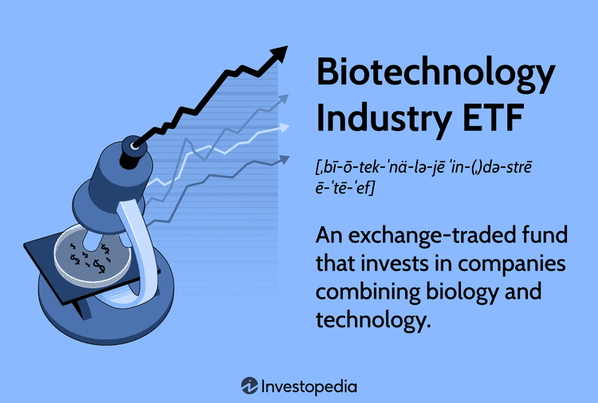

Biotechnology has swiftly become a pivotal sector, integrating biological processes with technological innovations to produce revolutionary products and services that span medicine, agriculture, and environmental management. The synthesis of biology and technology has paved the way for advancements such as genetic engineering, biopharmaceuticals, and new diagnostic techniques, significantly impacting global health and economies.

In parallel, exchange-traded funds (ETFs) focused on biotechnology provide investors with a strategic avenue to capitalize on the sector’s growth. Biotechnology ETFs pool investments into a diversified portfolio of biotech companies, reducing the risks inherent in selecting individual stocks. This diversified approach not only offers financial benefits but also aligns with the pioneering and innovative ethos of the biotech industry itself.

By examining biotechnology ETFs and automated trading strategies, investors can enhance their engagement with the sector. Automated trading employs algorithms to analyze market data and execute trades, potentially optimizing investment returns. This integration of data-driven insights with biotechnology investments exemplifies how technology continues to transform investment strategies, echoing the transformative nature of biotechnology in scientific fields.

## Table of Contents

## Understanding Biotechnology ETFs

Biotechnology Exchange-Traded Funds (ETFs) are financial instruments that allow investors to gain exposure to a collection of companies actively engaged in areas such as DNA technology, molecular biology, genetic engineering, and drug development. These ETFs track indices that group companies operating within the biotechnology sector, allowing investors to participate in the growth and innovation characteristic of this field.

By investing in biotechnology ETFs, investors achieve a diversified portfolio that encompasses a wide range of companies within the sector. This diversification is crucial as it mitigates the risks associated with investing in individual stocks, which can be highly volatile due to the dependency on regulatory approvals, technological breakthroughs, and market adoption of biotech products.

Some of the prominent biotechnology ETFs that investors often consider include the iShares Biotechnology ETF (IBB), SPDR S&P Biotech ETF (XBI), and ARK Genomic Revolution ETF (ARKG). Each of these ETFs offers a distinct approach to investment in the biotechnology space:

1. **iShares Biotechnology ETF (IBB)**: This ETF primarily tracks the NASDAQ Biotechnology Index, providing exposure to a broad range of biotech companies, including those focused on genetic research and treatment of diseases. IBB represents a mixture of large-cap and mid-cap companies, offering stability and growth potential.

2. **SPDR S&P Biotech ETF (XBI)**: Unlike IBB, XBI is based on the S&P Biotechnology Select Industry Index. It provides equal-weight exposure, ensuring smaller and mid-sized companies have a similar impact on the ETF's performance as larger entities. This structure can result in higher volatility but also offers substantial upside opportunities when smaller companies experience significant breakthroughs.

3. **ARK Genomic Revolution ETF (ARKG)**: Unlike the passively managed IBB and XBI, ARKG is actively managed, focusing on companies at the forefront of genomic and biotechnological innovation. ARKG aims to capture disruptive trends in the genomics sector, investing in firms involved in next-generation sequencing, gene editing, and molecular diagnostics.

Investing in these biotechnology ETFs allows investors to benefit from the overall growth of the biotech sector without the need to analyze and select individual stocks. As the sector continues to thrive on scientific advancements, these funds provide a strategic avenue for capitalizing on the broad array of opportunities within biotechnology.

## Types of Biotechnology ETFs

Exchange-traded funds (ETFs) in the biotechnology sector are a versatile tool for investors looking to gain exposure to companies involved in DNA technology, molecular biology, genetic engineering, and drug development. Primarily, these ETFs can be categorized based on their management style and focus. 

Passive management ETFs, such as the iShares Biotechnology [ETF](/wiki/etf-trading-strategies) (IBB) and the SPDR S&P Biotech ETF (XBI), track specific market indexes. These funds provide investors with broad exposure to a range of biotechnology companies by mirroring the performance of dedicated biotech indices. The passive nature of these ETFs ensures a lower cost, as they do not require active management efforts to select and weigh individual securities. By investing in such passively managed ETFs, investors can benefit from the overall growth of the biotech sector without needing to predict which individual companies will succeed.

On the other hand, actively managed ETFs, like the ARK Genomic Revolution ETF (ARKG), take a more targeted approach by focusing on specific technology themes within biotechnology, such as genomic advancements. These funds rely on expert management teams to select stocks that align with particular themes or innovations within the industry. Actively managed ETFs may incorporate insights into emerging technologies and market trends to capitalize on potential high-growth opportunities, albeit often with a higher expense ratio compared to their passive counterparts.

Sector-specific ETFs offer another investment strategy, concentrating on niche areas of biotechnology, such as genomics and molecular diagnostics. These ETFs enable investors to narrow their investments to specific subsectors that may have unique growth prospects or technological breakthroughs, potentially offering higher returns compared to broader-based funds. However, with the concentrated focus comes increased risk, as fortunes of these ETFs are closely tied to the performance and developments within their targeted sectors. 

Overall, choosing between different types of biotechnology ETFs depends on an investor's preference for exposure, risk tolerance, and investment objectives, given the variety of strategies available in the market.

## Benefits of Investing in Biotechnology ETFs

Biotechnology ETFs offer several advantages for investors, especially those looking to engage with the dynamic and often volatile biotech sector. One of the primary benefits is diversification. By investing in a biotechnology ETF, investors gain exposure to a basket of biotech companies rather than relying on the performance of a single firm. This diversification helps mitigate the risks associated with individual stock investments, such as company-specific setbacks or failures in drug trials, which can significantly affect the stock price of a single company.

Liquidity and flexibility are also notable benefits of biotechnology ETFs. Unlike some mutual funds, which can only be traded at the end of the trading day at the net asset value (NAV), ETFs are traded on exchanges just like stocks. This means investors can buy and sell shares of biotechnology ETFs throughout the trading day at the current market price. The ability to execute trades flexibly can be an advantage in a sector that sees rapid changes and requires timely decision-making.

Cost-effectiveness is another important [factor](/wiki/factor-investing) to consider. Biotechnology ETFs generally have lower expense ratios than actively managed mutual funds. The reduced costs stem from the passive management style of many ETFs, which typically track a specific index composed of biotech companies. Lower expense ratios result in savings for investors, making ETFs a cost-efficient option for those looking to allocate assets towards sector-specific strategies. This cost advantage can contribute to better net returns over time compared to more expensive investment options.

In summary, the benefits of investing in biotechnology ETFs include diversification to spread risk, [liquidity](/wiki/liquidity-risk-premium) and flexibility for timely trades, and cost-effectiveness due to their typically lower expense ratios. These attributes make biotechnology ETFs an attractive option for investors seeking exposure to the biotech sector's growth potential while managing investment risk and costs effectively.

## Algorithmic Trading in Biotechnology ETF Investing

Algorithmic trading, commonly referred to as algo trading, is a method of executing trades using automated and pre-programmed trading instructions to account for variables such as timing, price, and [volume](/wiki/volume-trading-strategy). In the context of biotechnology ETFs, this approach involves the use of sophisticated algorithms to identify optimal entry and [exit](/wiki/exit-strategy) points in the trading cycle. By analyzing large datasets and leveraging real-time data, [algorithmic trading](/wiki/algorithmic-trading) can significantly improve the efficiency of trading decisions and execution.

The primary advantage of algorithmic trading in biotechnology ETFs is its ability to process vast amounts of data at speeds unattainable by human traders. Algorithms can make decisions based on multiple data sources such as stock prices, economic indicators, and company-specific data, which provides a comprehensive and multidimensional view of the market. For instance, an algorithm may incorporate the moving average convergence divergence (MACD) or the relative strength index (RSI) to determine when a biotech ETF might be overbought or oversold.

Furthermore, algo trading can optimize trade execution by minimizing the impact of market fluctuations and slippage, thereby reducing transaction costs. This is achieved through techniques such as VWAP (Volume Weighted Average Price) and TWAP (Time Weighted Average Price), which execute trades in a manner that distributes the total order over a certain period to minimize market impact. These strategies ensure that the ETF trades closer to its fair value, enhancing the overall return on investment.

Another critical aspect of algorithmic trading in this sector is improved market timing. Given the high [volatility](/wiki/volatility-trading-strategies) often associated with biotechnology stocks, particularly during events such as clinical trials or regulatory approvals, accurate timing becomes crucial. Algorithms can respond to market events in milliseconds, allowing investors to capitalize quickly on short-term opportunities or mitigate potential losses.

In summary, algorithmic trading has the potential to significantly enhance the management and performance of biotechnology ETF investments by optimizing execution, reducing costs, and leveraging data-driven insights for precise market timing. However, it is important for investors to continually evaluate the algorithms to ensure they adapt to the dynamic market conditions inherent in the biotechnology sector.

## Risks and Considerations

Regulatory Risks: The biotechnology sector is heavily regulated, primarily by agencies such as the U.S. Food and Drug Administration (FDA). The FDA's stringent approval processes can significantly influence the fortunes of biotech companies and, by extension, the ETFs that include them in their portfolios. Companies must undergo rigorous clinical trials and provide substantial evidence of a product's efficacy and safety. This requirement can lead to delays in product launches and increased costs, which in turn can affect company valuations and the performance of biotechnology ETFs. Investors should be aware that even after approval, ongoing compliance with regulatory standards is mandatory, and any infraction could result in fines or restrictions that impact business operations.

Market Volatility: The biotechnology sector is characterized by high volatility, driven by the speculative nature of biotech investments and the rapid pace of technological and scientific advancements. Market sentiments can rapidly change based on clinical trial results, regulatory news, or broad market trends. The speculative aspect is often due to investors betting on the success of a company's pharmaceutical innovations. This volatility can result in significant price swings in biotech stocks, which are mirrored in the performance of ETFs in the sector. For investors in biotech ETFs, understanding this volatility is crucial, as it can lead to substantial gains but also considerable losses.

Long Development Cycles: One of the inherent challenges in the biotechnology sector is the extended development cycles associated with new biotech products. From initial discovery to market release, the process can take several years and involves significant upfront investments in research and development (R&D). This lengthy timeline can be attributed to the complex nature of biological systems and the necessity of exhaustive testing to ensure safety and efficacy. Long development periods can strain a company's financial resources and impact its stock price, which in turn can affect the performance of ETFs holding these stocks. Investors must consider these timelines and the associated risks when evaluating biotechnology ETFs, as the extended period before profitability can affect the overall investment strategy and returns.

## Conclusion

Biotechnology ETFs provide an attractive investment option for individuals seeking to capitalize on advancements within healthcare and life sciences. These ETFs enable investors to access a diversified portfolio of companies driving innovation in areas such as genetic engineering, molecular biology, and drug development. This diversification reduces the risks typically associated with high-volatility individual biotech stocks.

Incorporating algorithmic trading strategies into biotechnology ETF investments can significantly enhance decision-making processes. These automated strategies utilize complex algorithms to analyze vast datasets and leverage real-time data, identifying optimal entry and exit points for trades with greater precision than human traders. As a result, investors can improve trade execution efficiency, reduce transaction costs, and potentially achieve better market timing, thereby optimizing performance.

However, while biotechnology ETFs offer substantial benefits, investors must remain cognizant of inherent risks. The biotechnology sector is frequently subject to regulatory scrutiny, with stringent approval processes impacting company valuations. Moreover, biotech markets are characterized by high volatility and speculative trading, both of which can influence ETF performance. Investors should also consider the extended development cycles typical for many biotech products, which require significant upfront research and development investments.

Ultimately, a balanced approach, weighing the benefits of biotechnology ETFs and the refining potential of algorithmic trading against associated risks, is crucial. Staying informed about regulatory developments and market dynamics is essential for making judicious investment decisions in this rapidly evolving field.

## References & Further Reading

[1]: ["Advances in Financial Machine Learning"](https://www.amazon.com/Advances-Financial-Machine-Learning-Marcos/dp/1119482089) by Marcos Lopez de Prado

[2]: ["Machine Learning for Algorithmic Trading"](https://github.com/stefan-jansen/machine-learning-for-trading) by Stefan Jansen

[3]: ["Quantitative Trading: How to Build Your Own Algorithmic Trading Business"](https://www.amazon.com/Quantitative-Trading-Build-Algorithmic-Business/dp/1119800064) by Ernest P. Chan

[4]: ["Evidence-Based Technical Analysis: Applying the Scientific Method and Statistical Inference to Trading Signals"](https://www.amazon.com/Evidence-Based-Technical-Analysis-Scientific-Statistical/dp/0470008741) by David Aronson

[5]: Hortobágyi, G. N., & Thall, P. F. (1998). [“Chapter 3: Clinical Trials in Biotechnology Products.”](https://www.nejm.org/doi/full/10.1056/NEJM199810013391407) In Biotechnology for Biomedical Engineers (pp. 49-59). Academic Press.