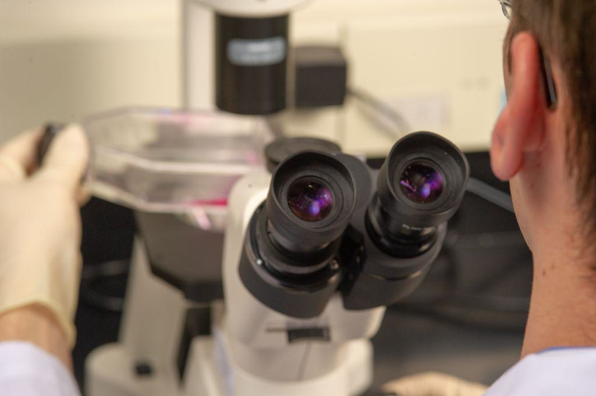

## Table of Contents

## What is biotechnology?

Biotechnology is the use of living things, like plants, animals, and microbes, to make or change products for human use. It combines biology with technology to solve problems and improve life. For example, biotechnology helps farmers grow better crops and helps doctors treat diseases.

One common use of biotechnology is in making medicine. Scientists use biotechnology to create drugs that can fight diseases like cancer or diabetes. They do this by changing the genes of cells to make them produce helpful substances. Another use is in agriculture, where biotechnology helps create stronger plants that can resist pests and grow in tough conditions. This can lead to more food for people around the world.

## What is the pharmaceutical industry?

The pharmaceutical industry makes medicines and vaccines. It works to find new ways to treat diseases and keep people healthy. This industry uses science and technology to create pills, liquids, and other forms of medicine that help people feel better when they are sick.

Companies in the pharmaceutical industry spend a lot of time and money on research. They test new drugs to make sure they are safe and work well. After testing, they need to get permission from the government before they can sell the medicine. This process can take many years, but it's important to make sure the medicines are safe for everyone to use.

## How do biotechnology and pharmaceuticals differ in their focus?

Biotechnology focuses on using living things to make useful products. It's like using nature's tools to solve problems. For example, biotechnology can change the genes of plants to make them grow better or create new medicines by changing how cells work. It's all about using biology to make new things or improve what we already have.

Pharmaceuticals, on the other hand, focus on making medicines and vaccines. They work to find new ways to treat diseases and keep people healthy. This industry uses science to create drugs that can help people feel better when they are sick. They do a lot of research and testing to make sure the medicines are safe and work well before they can be sold.

While biotechnology can be a part of making new medicines, it's a broader field that goes beyond just pharmaceuticals. Biotechnology can be used in many areas like agriculture, the environment, and even energy. Pharmaceuticals, though, are all about making and improving medicines for human health.

## What are the primary products of biotechnology?

The primary products of biotechnology include medicines and vaccines. Scientists use biotechnology to change the genes of cells so they can make substances that help fight diseases like cancer or diabetes. These medicines can be very important for people who are sick and need special treatments. Vaccines are another big product. They help our bodies fight off diseases before we get sick. Biotechnology helps make these vaccines safer and more effective.

Another main product of biotechnology is improved crops. By changing the genes of plants, scientists can make them grow better, resist pests, and survive in tough conditions. This can lead to more food for people around the world, which is very important in places where food is hard to find. Biotechnology also helps make biofuels, which are fuels made from plants. These can be a cleaner way to power cars and machines.

Biotechnology also produces things like enzymes and other chemicals that are used in many industries. For example, enzymes can help make better detergents for washing clothes or improve the way food is processed. These products might not be as well-known as medicines or crops, but they are very useful in everyday life.

## What are the main products developed by the pharmaceutical industry?

The main products developed by the pharmaceutical industry are medicines and vaccines. Medicines help people feel better when they are sick. They can be pills, liquids, or other forms that people take to treat diseases like cancer, diabetes, or infections. Vaccines are important too. They help our bodies fight off diseases before we get sick. Vaccines are often given as shots and help protect us from things like the flu or measles.

The pharmaceutical industry also makes other products like over-the-counter drugs. These are medicines you can buy without a prescription, like pain relievers or allergy medicine. They help people manage common health problems at home. Another product is medical devices, which are tools used to help treat or diagnose health issues. These can include things like inhalers for asthma or blood sugar monitors for diabetes. All these products are made to help people stay healthy and feel better.

## How do the research and development processes differ between biotechnology and pharmaceuticals?

The research and development process in biotechnology often starts with finding or changing genes. Scientists look at the DNA of plants, animals, or microbes to see how they can be used to make new products. For example, they might change a plant's genes to make it grow better or use bacteria to make a new medicine. This process can take a long time because it involves a lot of testing in labs and sometimes in the field. Biotechnology research can be used in many different areas, like making better crops, creating biofuels, or developing new medical treatments.

In the pharmaceutical industry, research and development focus on making new medicines and vaccines. Scientists start by looking for chemicals or substances that can treat a disease. They test these in labs to see if they work and are safe. Then, they do more tests with people to make sure the medicine works well and doesn't have bad side effects. This process can take many years and costs a lot of money. The main goal is to get approval from the government so the medicine can be sold and help people.

While both fields use science to make new products, biotechnology has a wider focus and can work on things beyond just medicines. The pharmaceutical industry is more specific, aiming to create drugs and vaccines that can be used to treat or prevent diseases. Both need a lot of testing and research, but they start with different goals and end up with different kinds of products.

## What role does genetic engineering play in biotechnology?

Genetic engineering is a big part of biotechnology. It's like changing the instructions inside living things to make them do new things or do them better. Scientists can take a gene from one plant or animal and put it into another. This helps them make plants that grow better or animals that are healthier. For example, they can make crops that can fight off bugs or grow in tough places. This can help farmers grow more food and feed more people.

Genetic engineering is also used to make medicines. Scientists can change the genes in cells to make them produce helpful substances. These substances can be used to treat diseases like cancer or diabetes. It's a way to make new medicines that can save lives. But it's important to be careful because changing genes can have big effects, so scientists do a lot of testing to make sure it's safe.

In short, genetic engineering is a powerful tool in biotechnology. It helps create better crops, new medicines, and other useful products. By changing the genes of living things, scientists can solve big problems and improve life for people around the world.

## How do regulatory processes for biotechnology products compare to those for pharmaceuticals?

The regulatory processes for biotechnology products and pharmaceuticals are similar in many ways, but they can also be different depending on what the product is used for. For both, the main goal is to make sure the products are safe and work well. Governments have rules that companies must follow before they can sell their products. For pharmaceuticals, the process usually involves many steps of testing, starting in labs and moving to tests with people. These tests check if the medicine is safe and if it helps treat the disease. After the tests, the company has to ask the government for permission to sell the medicine. This can take many years and costs a lot of money.

For biotechnology products, the regulatory process can be more complex because these products can be used in many different areas, not just medicine. If a biotechnology product is a new medicine, it goes through the same kind of testing and approval process as other pharmaceuticals. But if the product is something like a new type of crop or a biofuel, different rules might apply. These products might need to be tested in the field to see how they affect the environment or how well they work. The government will look at these tests to decide if the product is safe to use and good for the public. So, while the core idea of making sure products are safe and effective is the same, the specifics can change based on what the biotechnology product is meant to do.

## What are the ethical considerations unique to biotechnology?

Biotechnology can do amazing things like making better crops and new medicines, but it also brings up some big ethical questions. One big worry is about changing the genes of living things. When scientists change the genes of plants or animals, it can affect the environment in ways we don't fully understand. For example, a new type of crop might be good for farmers, but it could also harm other plants or animals. People worry about what might happen if these changes get out of control.

Another ethical issue is about using biotechnology on people. Scientists can change human genes to treat diseases, but this raises questions about who gets to decide what changes are made. There's a worry that changing human genes could lead to trying to make "perfect" babies or changing people in ways that aren't fair. It's important to think about how these changes might affect society and make sure everyone has a say in these decisions.

## How have biotechnology and pharmaceuticals collaborated in the past?

Biotechnology and pharmaceuticals have worked together in the past to make new medicines. Biotechnology helps by changing the genes of cells to make new substances that can fight diseases. Pharmaceutical companies then use these substances to make medicines. For example, they worked together to make insulin for people with diabetes. Biotechnology helped make the insulin using special cells, and then the pharmaceutical companies turned it into medicine that people can use. This teamwork has helped create many important medicines that save lives.

Another way they have collaborated is in making vaccines. Biotechnology can change viruses or bacteria to make them safe but still able to teach our bodies how to fight diseases. Pharmaceutical companies then use these changed viruses or bacteria to make vaccines. A good example is the work on the COVID-19 vaccines. Biotechnology helped create the new types of vaccines, and pharmaceutical companies made them ready for people to use. This collaboration has been very important for keeping people healthy and safe from diseases.

## What are the future trends in biotechnology and pharmaceuticals?

In the future, biotechnology and pharmaceuticals will keep working together to make new medicines and treatments. One big trend will be personalized medicine. This means doctors will use a person's genes to make treatments just for them. It's like making a medicine that fits someone perfectly. Biotechnology will help by finding out what genes are important for different diseases. Then, pharmaceutical companies will make medicines that target those genes. This can make treatments work better and help people feel better faster.

Another trend will be using biotechnology to make new kinds of vaccines. Scientists are already working on vaccines that can protect against many diseases at once. This can be really helpful because it means fewer shots and more protection. Also, biotechnology can help make vaccines that work against new diseases quickly. This was important during the COVID-19 pandemic, and it will be important in the future too. By working together, biotechnology and pharmaceuticals can keep making new ways to keep people healthy.

## How do advancements in biotechnology influence pharmaceutical drug development?

Advancements in biotechnology help make new medicines faster and better. Scientists use biotechnology to look at genes and find out what causes different diseases. Then, they can make medicines that target those genes directly. This makes the medicines more effective because they work exactly where they need to. For example, biotechnology helped make new treatments for cancer that attack cancer cells without hurting healthy cells. This means people can get better treatments that work well and have fewer side effects.

Biotechnology also helps speed up the process of making new medicines. It can take many years to make a new drug, but biotechnology can make this faster. Scientists can use biotechnology to test new medicines in labs before trying them on people. This saves time and money because they can find out if a medicine will work before doing big tests. Also, biotechnology helps make medicines that are easier to use, like pills instead of shots. This makes it easier for people to take their medicine and stay healthy.

## References & Further Reading

[1]: Glick, J. L., & Paxton, A. (2017). ["Essential Biotech Investment Guidelines: Scientific and Financial Considerations"](https://archive.org/details/molecularbiotech0000glic_q6r0). Journal of Commercial Biotechnology.

[2]: Baum, R. (2021). ["How to Invest in Biotechnology: A Guide for Beginners"](https://www.fool.com/investing/how-to-invest/beginner-stocks/). Forbes.

[3]: Thomas, C. (2020). ["Investing in Pharmaceutical Stocks: Understanding the Sector"](https://investingnews.com/daily/life-science-investing/pharmaceutical-investing/investing-pharmaceutical-companies-what-you-need-to-know/). Investopedia.

[4]: Krattiger, A., Mahoney, R. T., & Nelsen, L. (2007). ["Intellectual Property Management in Health and Agricultural Innovation: A Handbook of Best Practices"](https://scholars.unh.edu/law_facpub/126/) Intellectual Property Management.

[5]: DePristo, M. A. (2014). ["The Real Cost of Sequencing an Entire Genome"](https://www.ncbi.nlm.nih.gov/pmc/articles/PMC3083463/). Nature.