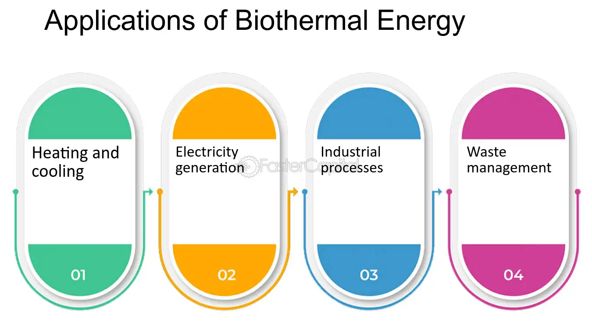

## Table of Contents

## What is biothermal energy?

Biothermal energy is a type of energy that comes from living things or things that were once alive. It uses materials like plants, animal waste, and other organic matter to create heat or electricity. This energy is often called biomass energy because it comes from biological sources. People can burn these materials to make heat, or they can turn them into gases or liquids to use in engines or power plants.

Using biothermal energy is good for the environment because it uses waste that would otherwise be thrown away. For example, farmers can use animal manure to create energy instead of letting it pollute the land and water. Also, biothermal energy can help reduce our use of fossil fuels, which are bad for the environment. By using biothermal energy, we can make our planet cleaner and more sustainable.

## How is biothermal energy produced?

Biothermal energy is made from things that were once alive, like plants and animal waste. To make this energy, people collect these materials and then burn them to create heat. This heat can be used directly to warm homes or buildings, or it can be used to boil water and make steam. The steam can then turn turbines to make electricity. This process is a lot like how we use coal or natural gas, but instead of using fossil fuels, we use organic materials.

There are also other ways to make biothermal energy. One way is to let the organic materials break down without air, in a process called anaerobic digestion. This creates a gas called biogas, which is mostly methane. People can burn this biogas to make heat or electricity. Another way is to turn the organic materials into a liquid fuel, like bio-oil, through a process called pyrolysis. This bio-oil can then be used in engines or power plants, just like gasoline or diesel.

Using biothermal energy helps the environment because it uses waste that would otherwise be thrown away. It also means we don't have to use as much fossil fuel, which is bad for the planet. By using biothermal energy, we can make our world cleaner and more sustainable.

## What are the main sources of biothermal energy?

The main sources of biothermal energy come from things that were once alive. These include plants like wood, crops, and grasses. Farmers can grow these plants just to use them for energy. Another big source is waste from animals, like cow manure. People can also use food waste and other garbage that comes from plants or animals. Even parts of plants that we don't eat, like corn stalks, can be used to make biothermal energy.

These sources are all around us, and we can find them in many places. For example, forests have a lot of wood that can be turned into energy. Farms have animal waste and leftover crops that can be used too. Cities also have a lot of food waste and other organic garbage that can be turned into energy. By using these materials, we can make energy in a way that is good for the environment and helps us use less of the dirty fossil fuels.

## What are the environmental benefits of using biothermal energy?

Using biothermal energy is good for the environment because it helps us use less of the dirty fossil fuels like coal and oil. These fossil fuels make a lot of pollution when we burn them. By using biothermal energy instead, we can reduce the amount of harmful gases that go into the air. This makes the air cleaner and helps slow down climate change. Biothermal energy also helps us use waste that would otherwise be thrown away, like animal manure and food scraps. Instead of letting this waste pollute the land and water, we can turn it into useful energy.

Another benefit is that biothermal energy comes from things that grow back, like plants and trees. This means we can keep making more energy without running out of the resources we need. It's a renewable way to make energy, unlike fossil fuels which will eventually run out. Using biothermal energy also helps support farmers and rural communities because they can grow crops or use waste to make energy. This can create jobs and help the local economy. Overall, using biothermal energy is a smart way to make our planet cleaner and more sustainable.

## How does biothermal energy contribute to sustainability?

Biothermal energy helps make our world more sustainable because it comes from things that can grow back, like plants and animal waste. When we use biothermal energy, we're not using up resources that will run out, like coal and oil. Instead, we can keep growing new plants and using waste to make energy over and over again. This means we can have energy without worrying about running out of it in the future.

Using biothermal energy also helps keep our planet clean. It makes less pollution than burning fossil fuels, which means cleaner air and water. By turning waste like animal manure and food scraps into energy, we stop this waste from polluting the land and rivers. This helps protect the environment and makes our communities healthier places to live. Overall, biothermal energy is a smart choice for a sustainable future because it helps us use renewable resources and keep our planet clean.

## What are the common applications of biothermal energy in residential settings?

In homes, biothermal energy is often used to heat the house. People can use special stoves or boilers that burn wood, pellets, or other biomass to make heat. This heat can warm up the rooms, making the home cozy and comfortable. Some people even use biothermal energy to heat water for showers and baths. It's a good way to use renewable resources and save money on energy bills.

Another way biothermal energy is used in homes is by turning waste into biogas. Families can use small digesters to break down food scraps and animal waste. This creates a gas that can be used to cook meals or heat the home. It's a smart way to use waste that would otherwise be thrown away, and it helps the environment by reducing pollution. Using biothermal energy at home is a simple way to make life more sustainable and eco-friendly.

## How is biothermal energy utilized in industrial processes?

In factories and big businesses, biothermal energy is used to make heat and electricity. They burn things like wood chips, agricultural waste, or even trash to create steam. This steam can power big machines or heat up the whole factory. It's a good way to use waste that would just be thrown away and helps the factory save money on energy. Plus, it's better for the environment than using coal or oil.

Biothermal energy is also used to make biofuels. Big plants take in organic materials like corn or sugarcane and turn them into liquids like ethanol or biodiesel. These biofuels can then be used to run vehicles or machines that need fuel. This process helps reduce the use of fossil fuels and makes transportation greener. By using biothermal energy, industries can work in a way that's more sustainable and helps protect the planet.

## What are the economic implications of implementing biothermal energy systems?

Using biothermal energy can help save money over time. At first, it might cost a lot to set up the systems that turn plants and waste into energy. But once they are running, the cost of the fuel is usually lower than fossil fuels like coal or oil. This is because the materials used, like wood chips or animal manure, are often cheaper and can be found nearby. This means businesses and homes can spend less on energy bills. Also, using biothermal energy can create new jobs in places like farms and factories that grow or process the materials needed for this energy.

There are other economic benefits too. When communities use biothermal energy, they can become less dependent on buying expensive energy from other places. This can help local economies grow stronger because the money stays in the community. Farmers can sell their waste or grow special crops for energy, which gives them another way to make money. Plus, using biothermal energy can make a place more attractive for businesses that want to be green and sustainable. This can bring more investment and jobs to the area. Overall, biothermal energy can be good for the economy by saving money, creating jobs, and helping local areas grow.

## What technological advancements have been made in biothermal energy conversion?

Technology has made big steps in making biothermal energy better. One big change is in how we turn organic materials into biogas. Scientists have made digesters that work better and faster. These new digesters can break down waste like food scraps and animal manure more quickly and make more biogas. This means we can get more energy from the same amount of waste. Another cool thing is that we can now clean up the biogas to make it even better for use in homes and factories. This makes biothermal energy more useful and easier to use.

Another important advance is in making biofuels like ethanol and biodiesel. We now have ways to turn plants like corn and sugarcane into these fuels more efficiently. This means we can make more fuel from the same amount of plants. Also, new technology helps us turn different kinds of waste into energy, not just the usual stuff. This is good because it means we can use more types of materials to make energy. These advancements make biothermal energy a bigger and better part of how we power our world.

## How does the efficiency of biothermal energy systems compare to traditional energy sources?

Biothermal energy systems can be pretty good at making energy, but they are not as efficient as some traditional energy sources like natural gas. When we burn biomass like wood or waste to make heat or electricity, about 20-30% of the energy in the biomass turns into useful energy. This is less than the 40-50% efficiency you can get from a natural gas power plant. But, biothermal energy has other benefits. It uses waste that would just be thrown away, so it's good for the environment and can save money over time.

Even though biothermal energy systems are not the most efficient, new technology is making them better. Scientists are working on ways to turn more of the energy in biomass into useful energy. For example, newer gasification and pyrolysis methods can turn biomass into gas or liquid fuels more efficiently than just burning it. These advancements are helping biothermal energy become a bigger part of how we make energy, even if it's still not as efficient as some traditional sources.

## What are the challenges and limitations associated with biothermal energy?

One of the big challenges with biothermal energy is that it's not as efficient as some other types of energy, like natural gas. When we burn things like wood or waste to make energy, a lot of the energy is lost as heat. This means we don't get as much useful energy out of it as we could from other sources. Another problem is that growing the plants or collecting the waste we need for biothermal energy can take up a lot of space and resources. This can be hard, especially in places where land is scarce or expensive.

There are also some limitations to think about. Biothermal energy can be hard to transport because the materials are heavy and bulky. This means it's usually best to use it close to where the biomass is made, which can limit where it can be used. Also, making biothermal energy can sometimes create pollution if it's not done right. Burning biomass can release smoke and other harmful stuff into the air. So, we need to be careful and use the right technology to keep the air clean. Despite these challenges, biothermal energy is still a good choice because it helps us use waste and renewable resources to make energy.

## What future developments are expected in the field of biothermal energy?

In the future, we can expect to see a lot of new ideas and improvements in biothermal energy. Scientists are working on making the process of turning plants and waste into energy even better. They are creating new machines that can turn more of the energy in biomass into useful energy. This means we can get more heat and electricity from the same amount of waste. Also, they are finding ways to use different kinds of waste, not just the usual stuff like wood and animal manure. This will help us use even more of the things we throw away to make energy.

Another big change we might see is in how we use biothermal energy. Right now, it's mostly used to make heat and electricity, but in the future, it could be used in more ways. For example, we might see more cars and trucks running on biofuels made from plants. Also, new technology could make it easier to use biothermal energy in homes and factories. This would help more people use this green energy and make our world cleaner. Overall, the future of biothermal energy looks bright with lots of new ideas and ways to use it to help the planet.

## References & Further Reading

[1]: Bergstra, J., Bardenet, R., Bengio, Y., & Kégl, B. (2011). ["Algorithms for Hyper-Parameter Optimization."](https://dl.acm.org/doi/10.5555/2986459.2986743) Advances in Neural Information Processing Systems 24.

[2]: ["Advances in Financial Machine Learning"](https://www.amazon.com/Advances-Financial-Machine-Learning-Marcos/dp/1119482089) by Marcos Lopez de Prado

[3]: ["Evidence-Based Technical Analysis: Applying the Scientific Method and Statistical Inference to Trading Signals"](https://www.amazon.com/Evidence-Based-Technical-Analysis-Scientific-Statistical/dp/B01FIZ8X7I) by David Aronson

[4]: ["Machine Learning for Algorithmic Trading"](https://github.com/stefan-jansen/machine-learning-for-trading) by Stefan Jansen

[5]: ["Quantitative Trading: How to Build Your Own Algorithmic Trading Business"](https://www.amazon.com/Quantitative-Trading-Build-Algorithmic-Business/dp/1119800064) by Ernest P. Chan