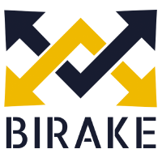

## Table of Contents

## What is the Birake Cryptocurrency Platform?

The Birake Cryptocurrency Platform is a service that helps businesses add cryptocurrency trading to their websites or apps. It is like a tool that makes it easy for companies to let their customers buy, sell, and trade digital currencies without having to build everything from scratch. Birake takes care of the complicated parts, like connecting to different cryptocurrencies and keeping everything secure.

Using Birake, a business can quickly set up a trading platform that looks and feels like part of their own service. This means they can offer their customers a way to trade cryptocurrencies without needing to know a lot about how it all works behind the scenes. Birake handles the technical stuff, so the business can focus on serving their customers better.

## How does Birake help businesses integrate cryptocurrency?

Birake makes it easy for businesses to add cryptocurrency trading to their websites or apps. They don't need to know a lot about cryptocurrencies because Birake takes care of the hard parts. It connects to different cryptocurrencies and keeps everything safe and secure. This means a business can quickly set up a trading platform that looks like it's part of their own service.

By using Birake, businesses can focus on helping their customers without worrying about the technical details. Birake handles things like making sure trades happen smoothly and keeping customer information safe. This way, businesses can offer their customers a way to buy, sell, and trade digital currencies without having to build everything from scratch.

## What are the key features of the Birake platform?

Birake makes it easy for businesses to add [cryptocurrency](/wiki/cryptocurrency) trading to their websites or apps. It connects to different cryptocurrencies so businesses don't have to worry about setting up everything themselves. Birake handles the hard parts like making sure trades happen smoothly and keeping everything safe and secure. This means businesses can focus on helping their customers without needing to know a lot about how cryptocurrencies work.

Another key feature of Birake is that it lets businesses set up a trading platform that looks like it's part of their own service. This helps businesses offer their customers a way to buy, sell, and trade digital currencies without starting from scratch. Birake takes care of the technical stuff, so the business can serve their customers better and make their website or app more useful.

## How can someone start using Birake for their business?

To start using Birake for your business, you first need to sign up on their website. It's easy to do, and you'll need to give some basic information about your business. Once you're signed up, Birake will help you set up a trading platform that looks like it's part of your own website or app. They'll take care of the hard parts, like connecting to different cryptocurrencies and making sure everything is safe and secure.

After you're set up, you can start letting your customers buy, sell, and trade digital currencies. Birake handles all the technical stuff in the background, so you can focus on helping your customers. If you need any help along the way, Birake has support to guide you through the process. This way, you can quickly add cryptocurrency trading to your business without having to build everything from scratch.

## What types of cryptocurrencies does Birake support?

Birake supports a lot of different cryptocurrencies. Some of the main ones they work with are Bitcoin, Ethereum, and Litecoin. They also connect to other popular digital currencies, so businesses can offer their customers a wide range of options for trading.

This means that when you use Birake, your customers can trade many different types of cryptocurrencies without you having to set up everything yourself. Birake takes care of the connections to these digital currencies, making it easy for your business to offer a complete trading platform.

## What are the security measures implemented by Birake?

Birake takes security very seriously to make sure that businesses and their customers are safe when trading cryptocurrencies. They use strong encryption to protect data and keep transactions secure. This means that the information shared on their platform is hard for others to see or steal. Birake also follows strict rules to make sure that they meet high security standards.

Another important security measure Birake uses is two-[factor](/wiki/factor-investing) authentication. This adds an extra step to log in, making it harder for someone else to access your account. They also keep an eye on the platform all the time to catch any strange activity quickly. By doing all these things, Birake helps keep everything safe and secure for businesses and their customers.

## How does Birake handle transaction fees and what is its fee structure?

Birake has a clear way of handling transaction fees that makes it easy for businesses to understand and plan for. They charge a fee for each trade that happens on their platform. This fee is usually a small percentage of the total amount of the trade. The exact percentage can change depending on things like how much trading is happening and what kind of cryptocurrencies are being traded.

Businesses using Birake don't have to worry about figuring out these fees themselves because Birake takes care of it all. The fees are automatically taken out of each trade, so businesses and their customers can focus on trading without needing to do extra calculations. This makes the whole process smooth and straightforward, helping businesses offer a good trading experience to their customers.

## Can Birake be integrated with existing payment systems?

Birake can be integrated with existing payment systems, making it easier for businesses to add cryptocurrency trading to their services. This means that if a business already has a way for customers to pay for things, they can connect Birake to it. Birake takes care of making sure everything works together smoothly, so businesses don't need to worry about setting up new payment systems from scratch.

By integrating with existing payment systems, Birake helps businesses offer a seamless experience for their customers. Customers can use the same payment methods they're used to, but now they can also trade cryptocurrencies. This makes it easier for businesses to expand their services without causing confusion or extra work for their customers.

## What are the benefits of using Birake compared to other cryptocurrency platforms?

Using Birake has some big advantages over other cryptocurrency platforms. One of the main benefits is how easy it is to set up. Birake does all the hard work, like connecting to different cryptocurrencies and making sure everything is safe and secure. This means businesses don't need to know a lot about how cryptocurrencies work. They can quickly add trading to their website or app without building everything from scratch.

Another benefit is that Birake can be connected to a business's existing payment systems. This makes things easier for both the business and their customers. Customers can use the same payment methods they're used to, but now they can also trade cryptocurrencies. This smooth integration helps businesses offer a complete trading experience without causing any confusion or extra work.

## How does Birake ensure compliance with financial regulations?

Birake makes sure it follows financial rules by working closely with regulators and keeping up with the latest laws. They have strict checks in place to make sure all the trading on their platform is done the right way. This helps businesses stay on the right side of the law when they use Birake to let their customers trade cryptocurrencies.

By following these rules, Birake helps businesses avoid any legal trouble. They keep everything transparent and report what's needed to the right authorities. This way, businesses can feel safe knowing that Birake is doing what it needs to do to stay compliant with financial regulations.

## What kind of support and resources does Birake offer to its users?

Birake offers a lot of help and resources to make sure businesses can use their platform easily. They have a support team that is always ready to answer questions and help with any problems. If you're setting up the trading platform or if something goes wrong, you can reach out to them and get the help you need. They also have guides and tutorials that explain how to use Birake step by step, so even if you're new to cryptocurrencies, you can get started without feeling lost.

In addition to direct support, Birake provides resources like a knowledge base where you can find answers to common questions. This is useful if you want to learn more about how to use the platform or if you need to understand something specific about trading cryptocurrencies. Birake also keeps its users updated with news and information about the latest developments in the world of digital currencies, helping businesses stay informed and make the best use of the platform.

## What are the future development plans for Birake and its roadmap?

Birake is always working on making its platform better. They want to add more cryptocurrencies so businesses can offer even more choices for their customers. They are also looking at new ways to make the trading experience smoother and easier to use. Birake is thinking about adding new features that can help businesses manage their trading platforms more effectively, like better tools for tracking trades and understanding customer behavior.

Another big part of Birake's future plans is improving security. They want to make sure their platform is even safer for businesses and their customers. This includes looking at new ways to protect against hacking and keeping up with the latest security technology. By focusing on these areas, Birake hopes to stay ahead in the world of cryptocurrency trading and continue helping businesses grow.

## References & Further Reading

[1]: Bergstra, J., Bardenet, R., Bengio, Y., & Kégl, B. (2011). ["Algorithms for Hyper-Parameter Optimization."](https://papers.nips.cc/paper/4443-algorithms-for-hyper-parameter-optimization) Advances in Neural Information Processing Systems 24.

[2]: ["Advances in Financial Machine Learning"](https://www.amazon.com/Advances-Financial-Machine-Learning-Marcos/dp/1119482089) by Marcos Lopez de Prado

[3]: ["Evidence-Based Technical Analysis: Applying the Scientific Method and Statistical Inference to Trading Signals"](https://www.amazon.com/Evidence-Based-Technical-Analysis-Scientific-Statistical/dp/0470008741) by David Aronson

[4]: ["Machine Learning for Algorithmic Trading"](https://github.com/stefan-jansen/machine-learning-for-trading) by Stefan Jansen

[5]: ["Quantitative Trading: How to Build Your Own Algorithmic Trading Business"](https://www.amazon.com/Quantitative-Trading-Build-Algorithmic-Business/dp/1119800064) by Ernest P. Chan