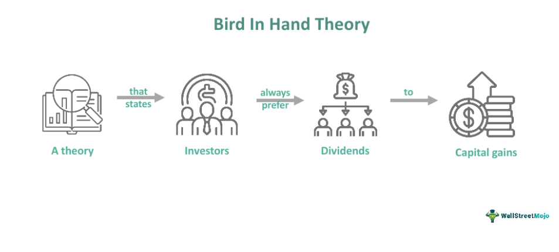

Investment strategies are designed to meet the varying preferences of investors, aiming to strike a balance between risk and reward. The Bird in Hand Theory, introduced by Myron Gordon and John Lintner, posits that investors often prefer dividends over potential capital gains due to the certainty they offer. This theory challenges the Modigliani-Miller theorem, which suggests that dividend policy does not affect a company's valuation in a perfect market. The Bird in Hand Theory, however, emphasizes the tangible and predictable nature of dividends, suggesting that they carry more weight in an investor's decision-making process than uncertain future price appreciations.

By valuing immediate and reliable returns, the theory sheds light on both traditional and modern investing dynamics. As economic landscapes evolve and markets become more complex, understanding the motivations behind investor preferences remains crucial. This article will explore various aspects of investment strategies, highlighting how the Bird in Hand Theory influences investor behavior and investing methodologies.



## Table of Contents

## Understanding the Bird in Hand Theory

The Bird in Hand Theory, developed by Myron Gordon and John Lintner, stands as a notable paradigm within the investment field, challenging the proposition established by the Modigliani-Miller dividend irrelevance theory. While the Modigliani-Miller theorem asserts that the dividend policy of a company is irrelevant to its valuation and that investors are indifferent between dividends and capital gains, the Bird in Hand Theory takes an opposing stance. It posits that investors inherently prefer receiving dividends over the possibility of achieving potential future capital gains due to the certainty and tangibility associated with dividends.

This theoretical perspective argues that dividends represent a more stable and predictable return on investment compared to the often volatile and uncertain nature of capital gains. This stems from the belief that dividends are a realized gain, paid out of the company's earnings, providing investors with immediate income. In contrast, capital gains necessitate the appreciation of stock value, which is subject to market fluctuations and economic variables, often placing it beyond the immediate control or prediction of the investor.

The influence of the Bird in Hand Theory extends into the valuation processes of companies. It implies that firms with a consistent and reliable dividend payout strategy are likely to be valued more favorably by investors than those that do not emphasize dividends. This preference translates into a lower cost of equity for these firms, as the perceived risk is mitigated by regular dividend distributions. The stability provided by dividends is crucial, especially during periods of economic uncertainty, where predictability becomes highly valued. Consequently, companies aiming to attract conservative or income-focused investors may prioritize stable dividend policies as a strategic component of their financial management.

Through its emphasis on stable and regular dividend payouts, the Bird in Hand Theory continues to impact investor decision-making processes and the strategic financial decisions of companies, underscoring the intrinsic value of dividends as both a reliable income stream and a factor in corporate valuation.

## Modern Investment Context

In contemporary investing, the Bird in Hand Theory holds significant relevance as it continues to shape investor behavior and market dynamics. This theory underscores the preference for dividends over potential capital gains, arguing that dividends offer a tangible and reliable income stream. This preference is accentuated during periods of economic uncertainty when investors prioritize stability and certainty over the [volatility](/wiki/volatility-trading-strategies) of future capital appreciation.

Dividends serve as a crucial source of regular income, particularly appealing during turbulent economic times. Investors often favor companies with stable and consistent dividend payouts as these firms are perceived as financially robust and less susceptible to market fluctuations. Such companies typically belong to sectors like utilities, consumer staples, and healthcare, which are known for their resilience and steady cash flows.

Market conditions and personal financial goals significantly influence whether investors prioritize dividend yields or [growth stocks](/wiki/growth-stocks). During bull markets or when confidence in economic growth is strong, investors might gravitate towards growth stocks, seeking higher returns through capital gains. Conversely, during bear markets or periods of economic slowdown, the Bird in Hand Theory becomes more pronounced as risk-averse investors redirect their focus towards dividend-yielding stocks to ensure a continuous income stream.

Moreover, technological advancements and prevailing economic trends continue to affect how this theory is applied. The proliferation of data analytics and [machine learning](/wiki/machine-learning) techniques enables investors and fund managers to assess companies' dividend payout capabilities with greater precision. These technologies facilitate a more nuanced approach to investment, allowing stakeholders to model future dividend stability and growth potential accurately.

As global economic conditions evolve, so does investor sentiment. Factors such as geopolitical tensions, inflation rates, and changes in fiscal policies can alter the attractiveness of dividend-paying stocks compared to growth-focused equities. Investors' shifting risk appetites and the broader economic backdrop will likely guide the balance between these investment strategies.

Overall, the Bird in Hand Theory remains a cornerstone concept in modern investment, influencing both individual investment decisions and broader market trends. Its application, continuously shaped by technological and economic developments, underscores the ongoing importance of dividends in financial planning and portfolio management.

## Building a Portfolio with the Bird in Hand Theory

Building a portfolio based on the Bird in Hand Theory emphasizes selecting stocks that provide reliable and consistent dividend payouts. This approach aligns with the theory's preference for dividends over potential capital gains, as dividends offer a more certain and tangible return on investment.

Key sectors known for their robust dividend offerings include utilities, consumer staples, and healthcare. These sectors are typically characterized by stable earnings and resilient business models that allow companies to maintain regular dividend payments. Utilities companies, for instance, operate in industries that provide essential services, resulting in predictable revenue streams even during economic downturns. Consumer staples companies, which manufacture everyday necessities, tend to maintain consistent demand regardless of economic cycles, thereby supporting stable dividends. Similarly, the healthcare sector benefits from continuous demand due to the essential nature of its products and services.

When selecting stocks for a dividend-focused portfolio, it is crucial to evaluate the financial health of the company. A company's ability to sustain dividends depends on its financial stability, profitability, and cash flow generation. Investors should scrutinize key financial metrics such as earnings per share (EPS), return on equity (ROE), and free cash flow to assess a company's financial soundness.

Moreover, the payout ratio is an important metric to consider. It indicates the proportion of earnings distributed as dividends to shareholders. A moderate payout ratio suggests that a company retains enough profits to reinvest in growth while rewarding shareholders. Conversely, an excessively high payout ratio might indicate a lack of reinvestment opportunities or potential cash flow issues.

Dividend growth potential is also a vital [factor](/wiki/factor-investing) in building a sustainable dividend portfolio. Companies with a track record of gradually increasing their dividends are preferable as they might continue to raise payouts in the future, providing investors with an increasing income stream.

International diversification can enhance a dividend-focused portfolio by reducing regional risks and tapping into growth prospects of global markets. By investing in foreign companies that offer reliable dividends, investors can benefit from different economic environments and currency diversification, potentially boosting overall returns.

Finally, tax considerations play a significant role in dividend investing. Dividends may be taxed differently depending on the investor's jurisdiction and the nature of the account used for investing. For instance, dividends within tax-advantaged accounts such as IRAs or 401(k)s may enjoy deferred taxation, enhancing the compounding effect of reinvested dividends. Thus, understanding the tax implications is essential for optimizing after-tax returns in a dividend-focused strategy.

In summary, constructing a portfolio under the Bird in Hand Theory involves a careful selection of dividend-paying stocks characterized by consistent payouts, solid financial health, potential for dividend growth, and strategic diversification to mitigate risks and enhance returns.

## Comparative Analysis: Bird in Hand vs. Growth Investing

The Bird in Hand Theory primarily attracts conservative investors who prioritize income stability over high returns. This preference is rooted in the regularity and predictability that dividends provide, acting as a consistent income stream irrespective of market volatility. Dividends are often viewed as a signal of a company's robust financial health and commitment to returning profits to shareholders. As a result, investors who value financial security and a consistent cash flow may favor stocks with reliable dividend payouts.

In contrast, growth investing appeals to those willing to embrace higher risk in pursuit of greater capital appreciation. Growth investors typically target companies with strong potential for expansion, often reinvesting profits into the business rather than distributing them as dividends. This reinvestment is aimed at driving stock price appreciation, which can lead to substantial returns if the company's growth projections are realized. However, these investments [carry](/wiki/carry-trading) greater risk as they depend heavily on market conditions and the company's future performance.

Economic cycles significantly influence both strategies. During economic downturns, dividend-paying stocks may offer a stable refuge, thanks to their regular income streams. Conversely, in a booming economy, growth stocks might outperform, reflecting greater investor confidence and willingness to accept higher risks for potentially higher returns. Tax implications also differ between the two strategies. Dividends can be taxed at varying rates depending on jurisdiction and investor circumstances, potentially impacting net returns. Growth investing, on the other hand, typically incurs taxes only upon the sale of appreciated assets, giving potential tax efficiency advantages if managed properly.

Personal risk tolerance is another critical factor in determining the choice between these strategies. Conservative investors with lower risk tolerance may prioritize capital preservation and consistent returns, aligning with the Bird in Hand approach. In contrast, investors with higher risk tolerance might pursue growth investing, balancing short-term market fluctuations against potential long-term gains.

Many investors choose to diversify their portfolios with a combination of dividend and growth-oriented stocks to balance risks and rewards effectively. This approach allows for capturing stable incomes while also participating in the potential for capital gains. Optimizing this balance often involves a thorough analysis of individual financial goals, market conditions, and broader economic indicators. Implementing such a strategy can be facilitated by various financial tools and portfolio management software, which aid in analyzing and adjusting portfolios to align with changing market dynamics and personal investment objectives.

## The Role of Dividends in Algorithmic Trading

Algorithmic trading, a process that uses computer-driven methods to execute trading strategies, has increasingly integrated dividend-focused strategies due to their predictable income streams. These strategies harness the stability and regularity of dividends to make automated trading decisions, often leading to enhanced portfolio performance and risk management.

Algorithms in this context analyze vast datasets to identify patterns and trends in dividend yields. By examining historical data, algorithms can assess the reliability and growth potential of dividends from various stocks. For example, Python libraries such as `pandas` and `numpy` are frequently employed to manipulate and analyze such financial datasets. A basic workflow may involve importing stock data, calculating dividend yields, and using statistical methods to predict future performance:

```python
import pandas as pd
import numpy as np

# Load historical stock data
data = pd.read_csv('stock_data.csv')

# Calculate dividend yield
data['Dividend Yield'] = data['Dividend'] / data['Close']

# Identify patterns in dividend yields
mean_yield = data['Dividend Yield'].mean()
std_dev_yield = data['Dividend Yield'].std()

# Assume a normal distribution to predict future yields
data['Predicted Yield'] = np.random.normal(mean_yield, std_dev_yield, len(data))

# Filter for stocks with predicted yield above a certain threshold
dividend_stocks = data[data['Predicted Yield'] > 0.03]  # Example threshold

print(dividend_stocks)
```

The predictability of dividends is particularly useful in risk management. Unlike capital gains, which can be highly volatile and market-dependent, dividends offer a stable income stream. This stability allows algorithms to complement [momentum](/wiki/momentum)-focused strategies where trades are based on short-term price movements, balancing higher-risk trades with the reliability of dividends.

Furthermore, the adoption of [algorithmic trading](/wiki/algorithmic-trading) in dividend-based investing continues to gain traction. This growth can be attributed to the increasing availability of real-time data and advanced analytical tools, which allow for more sophisticated and reliable model developments. As a result, portfolios managed by such algorithms often exhibit improved robustness and resilience to market fluctuations, providing investors with a stable and reliable income stream while managing risk effectively.

Overall, the integration of dividend-focused strategies in algorithmic trading underscores the value dividends hold not only for human investors but also for automated trading systems, ensuring dividend-paying stocks remain a vital component of intelligent portfolio management.

## The Future of Investing with the Bird in Hand Theory

The Bird in Hand Theory's continued relevance in the investment landscape is attributed to its adaptability amidst changing market trends. This theory posits that investors often favor the certainty of dividends over uncertain capital gains, providing a foundation for conservative investment strategies. As markets become more data-driven, investors find themselves integrating both traditional dividend-focused and growth-oriented approaches to capitalize on diverse opportunities.

In the modern landscape, data analytics and technological advancements play a crucial role in shaping investment strategies. Investors utilize sophisticated tools and algorithms to analyze historical and real-time data, identifying patterns and trends that support informed decision-making. The integration of growth strategies alongside the Bird in Hand Theory allows for a more balanced approach, enabling investors to achieve a blend of income stability and potential capital appreciation.

Future investment trends are likely to see a hybrid approach, where technology, economic conditions, and investor sentiment converge to guide decisions. The increasing availability of big data and machine learning algorithms can optimize portfolio management by predicting dividend sustainability and growth potential. For instance, an algorithm could use historical dividend data to forecast future payouts and assess the financial health of companies. Here's a simple example of how an algorithm might look in Python:

```python
import numpy as np
from sklearn.linear_model import LinearRegression

# Sample historical dividend data
years = np.array([1, 2, 3, 4, 5]).reshape(-1, 1)
dividends = np.array([2.00, 2.10, 2.20, 2.30, 2.40])

# Linear regression model to predict future dividends
model = LinearRegression().fit(years, dividends)
predicted_dividend = model.predict(np.array([[6]]))
print(f"Predicted dividend for year 6: ${predicted_dividend[0]:.2f}")
```

As economic conditions fluctuate, the Bird in Hand Theory provides a valuable anchor for conservative investors seeking predictable income streams amidst volatility. These investors may prioritize sectors known for stable dividends, such as utilities or consumer staples, while remaining open to growth opportunities to enhance overall returns.

The Bird in Hand Theory continues to be pivotal in shaping conservative investment philosophies, offering a framework for balancing risk and reward in a dynamic marketplace. As investors and markets evolve, this theory's flexibility ensures its ongoing significance in guiding prudent financial planning and wealth management strategies.

## References & Further Reading

[1]: Gordon, M. J. (1959). ["Dividends, Earnings, and Stock Prices."](https://www.jstor.org/stable/1927792) The Review of Economics and Statistics, 41(2), 99-105.

[2]: Lintner, J. (1962). ["Dividends, Earnings, Leverage, Stock Prices and the Supply of Capital to Corporations."](https://www.semanticscholar.org/paper/Dividends%2C-Earnings%2C-Leverage%2C-Stock-Prices-and-the-Lintner/e4e8937d6b07d22ce64f686377dcdcfca18b2dc6) The Review of Economics and Statistics, 44(3), 243-269.

[3]: Modigliani, F., & Miller, M. H. (1958). ["The Cost of Capital, Corporation Finance and the Theory of Investment."](https://www.aeaweb.org/aer/top20/48.3.261-297.pdf) The American Economic Review, 48(3), 261-297.

[4]: ["Security Analysis"](https://hedgefundalpha.com/what-is-security-analysis/) by Benjamin Graham and David Dodd

[5]: Damodaran, A. (1999). ["Value and Return: The High Dividend Stock Myth."](https://pages.stern.nyu.edu/~adamodar/pdfiles/dcfveg.pdf) 

[6]: ["Dividend Policy: Its Impact on Firm Value"](https://www.semanticscholar.org/paper/Dividend-Policy%3A-Its-Impact-on-Firm-Value-Lease-John/729424dc0a79c499797a1609917d0f74b5f6f041) by Ronald C. Lease, Kose John, Avner Kalay, Uri Loewenstein, and Oded Sarig