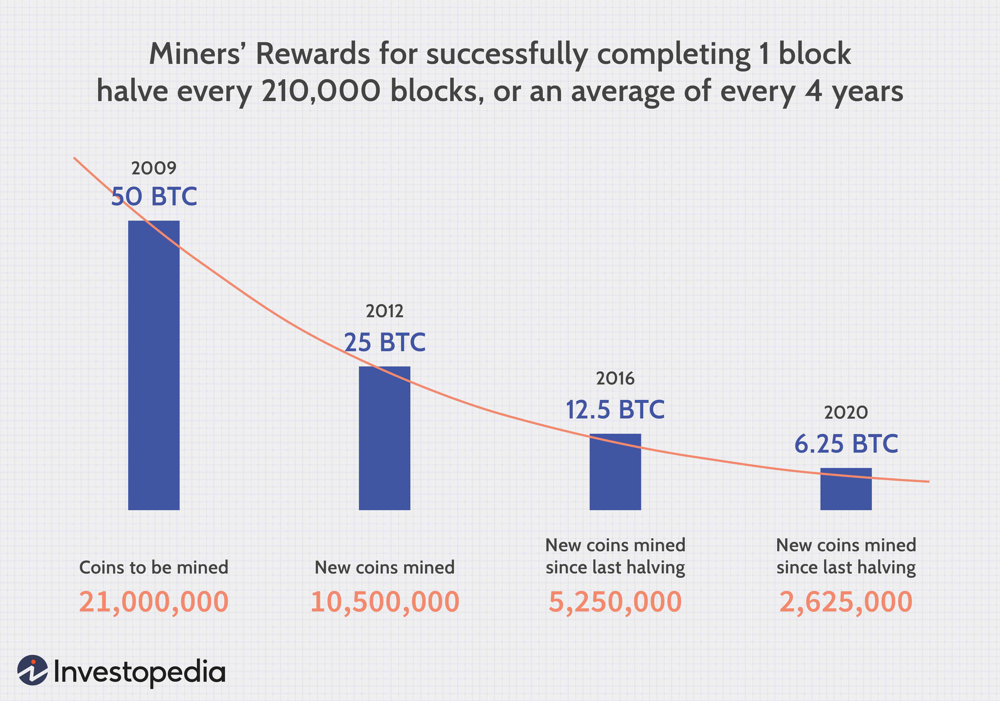

Cryptocurrency, a digital or virtual form of currency, has become a significant player in the modern digital economy. Unlike traditional currencies controlled by central banks, cryptocurrencies rely on decentralized systems typically underpinned by blockchain technology. This innovation not only decentralizes money but also enhances transparency and security, reshaping how we perceive financial transactions.

The primary focus of this article is to offer a comparative analysis between Bitcoin and Bit Gold, two pioneering concepts in the cryptocurrency landscape. Bitcoin, introduced by the pseudonymous Satoshi Nakamoto in 2009, is often regarded as the first successful implementation of a decentralized currency using blockchain technology. On the other hand, Bit Gold, conceptualized by Nick Szabo in 1998, is an early proposal that laid some foundational ideas for Bitcoin, despite never being implemented. By examining these two concepts, the article aims to shed light on their historical importance and influence on modern cryptocurrencies.



The growing interest in cryptocurrencies and automated trading systems has necessitated a deeper understanding of these technologies. As cryptocurrencies gain traction among businesses and individuals, algorithmic trading has emerged as a crucial tool in financial markets, offering speed, accuracy, and efficiency in trading decisions. Algorithmic trading in the context of cryptocurrencies introduces additional complexities and opportunities, given the inherent volatility and liquidity of digital assets.

This article sets the stage for an in-depth examination of the origins and functionalities of both Bitcoin and Bit Gold, as well as the burgeoning field of algorithmic trading. Readers can expect insights into the technological foundations of these financial innovations, the reasons behind Bitcoin's success, and the implications of algorithmic trading on the cryptocurrency market. Moreover, the article will explore the challenges and potential advantages of embracing algorithmic trading strategies in the ever-evolving cryptocurrency landscape, equipping readers with a comprehensive understanding of these transformative financial technologies.

## Table of Contents

## Understanding Bitcoin

Bitcoin, the first decentralized digital currency, was created by an individual or group of individuals using the pseudonym Satoshi Nakamoto. It was introduced in 2009 through a white paper titled "Bitcoin: A Peer-to-Peer Electronic Cash System," which outlined a novel approach to digital money unmediated by traditional financial institutions. Satoshi Nakamoto’s vision was to establish a system based on cryptographic proof instead of trust, thus enabling any two willing parties to transact directly without the involvement of a trusted third party.

One of the fundamental principles of Bitcoin is decentralization. Unlike traditional currencies that rely on central banks, Bitcoin operates on a decentralized network of computers, each maintaining a copy of the blockchain. The blockchain, a public ledger, ensures transparency and immutability of transactions. Each block in the blockchain contains a cryptographic hash of the previous block, a timestamp, and transaction data, forming a chain. This design inherently secures the system against double-spending and fraud.

Bitcoin is often referred to as "digital gold" due to its limited supply of 21 million coins, making it a deflationary asset. The mining process, through which new Bitcoins are created, follows a predefined schedule and will eventually discontinue once the cap is reached. This scarcity, combined with its decentralized nature, has bolstered Bitcoin’s status as a store of value, paralleling gold's role in traditional finance as a hedge against inflation and economic uncertainty.

The economic impact of Bitcoin is significant, as it has provided an alternative to traditional financial systems. During times of economic instability, Bitcoin is often viewed as a safe haven asset. Its borderless nature allows for a financial exchange in regions with deficient banking systems, offering an inclusive financial solution. Moreover, Bitcoin’s appreciation has made it an appealing investment vehicle, leading to the emergence of an entire industry around [cryptocurrency](/wiki/cryptocurrency) investments and financial products.

Bitcoin's adoption has seen a steady rise since its inception, with businesses and individuals across the globe increasingly recognizing its potential. Major companies, such as Tesla and Square, have invested significant amounts in Bitcoin, further legitimizing its value proposition. Additionally, various online and brick-and-mortar businesses now accept Bitcoin as a payment method, enhancing its usability as both a currency and a store of value. As the interest in digital assets continues to expand, Bitcoin remains at the forefront of the cryptocurrency revolution, shaping how value is perceived and exchanged in the digital economy.

## Exploring Bit Gold

Bit Gold is a concept introduced by computer scientist Nick Szabo in 1998, laying important groundwork for the development of decentralized digital currencies. Szabo proposed Bit Gold as a decentralized digital currency system that aimed to mimic the attributes of precious metals, such as scarcity and difficulty in extraction. While Bit Gold was never implemented, its conceptual framework influenced the creation of Bitcoin and other cryptocurrencies.

**Similarities and Differences Between Bit Gold and Bitcoin**

Bit Gold and Bitcoin share several fundamental similarities. Both systems were envisioned as decentralized digital currencies that eliminate the need for a central authority, relying instead on cryptographic proof and computational effort to secure transactions. A key feature of both concepts is the use of proof-of-work (PoW) algorithms to create consensus and validate transactions. In both frameworks, computational puzzles are solved by network participants to generate new units of currency, similar to mining physical gold.

However, there are notable differences between them. Bit Gold lacked a complete implementation plan and was primarily a theoretical construct. While Bit Gold proposed the use of digital timestamping and a chain of cryptographic hashes, it did not address the double-spending problem comprehensively. Bitcoin, on the other hand, solved this issue with its blockchain technology, which maintains a transparent and immutable ledger of all transactions. This innovation by Bitcoin's pseudonymous creator Satoshi Nakamoto facilitated the widespread adoption and implementation of Bitcoin as a functional currency.

**Bit Gold: A Precursor to Bitcoin**

Bit Gold is often regarded as a precursor to Bitcoin due to its visionary proposal of a decentralized system for digital currency. Despite never being fully realized, Bit Gold introduced crucial elements that informed the design of Bitcoin, such as the reliance on cryptographic methods and the decentralization of transaction verification. The concepts of timestamping and chaining cryptographic puzzles in Bit Gold significantly inspired the blockchain architecture utilized by Bitcoin.

**Contributions to Bitcoin's Development**

The theoretical ideas embedded in Bit Gold directly contributed to the development of Bitcoin and the broader field of cryptocurrencies. Szabo's foresight in conceptualizing problem-solving through computation and adopting a decentralized ledger inspired Satoshi Nakamoto's implementation of blockchain technology. Specifically, the concept of chaining blocks of data secured by cryptographic hashes became a cornerstone of Bitcoin's operation, resolving issues like double-spending and providing transparency to the network.

**Theoretical Importance and Inspiration for Subsequent Cryptocurrencies**

Bit Gold's significance extends beyond its direct influence on Bitcoin. It highlighted the potential of decentralized finance and contributed to the theoretical underpinnings of blockchain technology that many cryptocurrencies now utilize. Bit Gold's emphasis on ensuring scarcity and security in digital currency systems opened avenues for exploring new monetary systems. The concept underscored the importance of solving fundamental issues like trust without central authority, inspiring a wave of innovation that continues to shape the cryptocurrency landscape today.

In summary, Bit Gold's pioneering ideas laid the foundation for Bitcoin and other digital currencies, illustrating the potential of cryptography and decentralized networks in creating secure and trustless financial systems.

## Comparative Analysis: Bitcoin vs. Bit Gold

Bitcoin and Bit Gold are both seminal concepts in the development of cryptocurrencies, sharing certain technological aspirations while differing significantly in execution and realization. 

### Technological Foundations

Bitcoin, launched by the pseudonymous entity Satoshi Nakamoto in 2009, introduced a decentralized digital currency system built on blockchain technology. The blockchain functions as a public ledger that records all transactions in a secure and transparent manner. This structure employs cryptographic hash functions to ensure the immutability of the transaction data, and the consensus mechanism—proof of work (PoW)—validates transactions without needing a central authority.

Bit Gold, conceptualized by Nick Szabo in 1998, was never implemented, but it laid the groundwork for blockchain by proposing a mechanism for decentralized currency. Bit Gold envisioned a distributed ledger where proof-of-work strings are generated to form a chain of hash-based proofs, ensuring that computational resources are expended to create digital tokens. Although it proposed elements akin to blockchain and the use of cryptographic proofs, Bit Gold lacked a complete system for implementation, particularly in consensus and transaction processes.

### Historical Context, Objectives, and Use Cases

The late 1990s and early 2000s saw burgeoning interest in decentralized digital currencies as a response to centralized banking systems and the rise of internet commerce. Bit Gold aimed to create a secure, peer-to-peer digital currency independent of central trust, mirroring the objectives later fulfilled by Bitcoin. However, the technological ecosystem and public awareness during Bit Gold's inception were insufficient for its realization.

Bitcoin's emergence in 2009 coincided with global economic instability, casting doubt on traditional financial systems. Capitalizing on advancements in technology and the foundational ideas of Bit Gold, Bitcoin positioned itself as a digital gold standard, with use cases extending from a medium of exchange to a store of value and an investment asset.

### Reasons for Bitcoin's Success

Bitcoin succeeded where Bit Gold did not for several reasons:

1. **Technical Implementation:** Satoshi Nakamoto addressed key technical challenges, such as creating a complete and functioning decentralized network, implementing a distributed consensus mechanism via proof-of-work, and devising a solution to the double-spending problem.

2. **Network Effect:** Bitcoin’s operational model allowed it to grow rapidly, benefiting from the network effect as more users, developers, and miners engaged with the system.

3. **Community and Adoption:** Bitcoin quickly gathered a community of enthusiasts and developers who contributed to its codebase and advocated for its adoption, enabling its initial growth and laying the foundation for widespread acceptance.

4. **Timing and Market Conditions:** The 2008 financial crisis increased public skepticism of traditional financial institutions, creating an environment more receptive to decentralized solutions like Bitcoin.

### Approach to Trust and Double-Spending

Both Bitcoin and Bit Gold aimed to eliminate the need for central trust. Bit Gold outlined the use of cryptographic proofs to create a reliable sequence of transactions, but it lacked a comprehensive model to verify transactions across a decentralized network.

Bitcoin's blockchain architecture explicitly solves the double-spending issue using proof-of-work. Transactions are recorded on the blockchain only when validated through the computationally intensive mining process, preventing the possibility of spending the same tokens multiple times.

### Impact and Influence on the Cryptocurrency Ecosystem

Bitcoin's successful implementation and widespread adoption established the foundational framework for subsequent cryptocurrencies, thus solidifying its status as the progenitor of modern digital currencies. It demonstrated the viability of decentralized finance (DeFi) and inspired numerous blockchain-based projects.

Bit Gold, though never actualized, remains a crucial intellectual precursor to Bitcoin. Its innovative ideas about decentralized currency systems and the use of cryptographic proofs influenced Bitcoin's design and inspired developers to explore cryptocurrencies.

In summary, while Bit Gold laid the conceptual groundwork, Bitcoin actualized these concepts into a fully functioning system, profoundly influencing the cryptocurrency ecosystem and reshaping the landscape of digital finance.

## Algorithmic Trading in Cryptocurrencies

Algorithmic trading refers to the use of computer algorithms to automate trading decisions in financial markets. These algorithms execute trades at speeds and frequencies that are impossible for human traders. They analyze market data, make decisions based on pre-defined conditions, and execute buy or sell orders without manual intervention. In modern financial markets, [algorithmic trading](/wiki/algorithmic-trading) plays a crucial role, ensuring [liquidity](/wiki/liquidity-risk-premium), enhancing market efficiency, and reducing transaction costs.

In the context of cryptocurrency markets, algorithmic trading is particularly appealing due to its capability to handle the volatile and round-the-clock trading environment efficiently. Cryptocurrencies trade on various exchanges globally, 24/7, making manual trading arduous and exhausting. Algorithmic trading systems can continuously monitor market conditions, swiftly capitalize on [arbitrage](/wiki/arbitrage) opportunities, and respond to real-time changes without the delays inherent in manual trading.

**Benefits and Risks of Cryptocurrency Algorithmic Trading**

Cryptocurrency algorithmic trading offers numerous benefits. It provides increased speed and accuracy by swiftly executing trades based on predefined parameters, thereby reducing the potential for human error. Additionally, it can eliminate emotional bias from trading decisions, leading to more consistent outcomes. The automation allows traders to implement complex strategies that consider multiple variables simultaneously, something that is challenging to achieve manually.

However, algorithmic trading in cryptocurrencies also comes with risks. The market's inherent [volatility](/wiki/volatility-trading-strategies) can lead to significant losses if algorithms are not adequately tested or optimized for current market conditions. Additionally, technical failures or bugs in the trading software might lead to unintended outcomes. Furthermore, while algorithmic trading can process vast amounts of information quickly, it might also contribute to market instability if many algorithms react similarly to market events, causing rapid price swings.

**Algorithmic Trading Strategies**

Several strategies are employed in algorithmic trading within cryptocurrency markets:

1. **Arbitrage**: This strategy exploits price differences of the same asset across different exchanges. By buying from the cheaper exchange and selling on the more expensive one, traders can profit from the disparity. This strategy requires high speed and precision, making it ideal for algorithmic trading.

2. **Trend Following**: These algorithms identify and follow price trends. They base decisions on historical data trends, assuming that prices are likely to continue in the same direction. This strategy often uses technical indicators such as moving averages.

3. **Market Making**: Algorithms continuously place buy and sell orders to profit from the bid-ask spread. This strategy provides liquidity to markets but requires sophisticated systems to adjust to fast-changing market conditions.

**Tools and Platforms for Crypto Algorithmic Trading**

Several tools and platforms are available to facilitate algorithmic trading in cryptocurrencies. Platforms like 3Commas, HaasOnline, and Zenbot provide traders with customizable bots that can execute various strategies automatically. These platforms offer features like [backtesting](/wiki/backtesting), allowing users to test their strategies on historical data before deploying them in live markets. Some platforms also support programming languages like Python, enabling users to write custom scripts and algorithms tailored to their specific trading strategies.

In summary, algorithmic trading in cryptocurrencies enhances trading speed and efficiency, offering significant advantages in a market characterized by volatility and round-the-clock operation. However, it also necessitates careful strategy design and rigorous testing to mitigate inherent risks and ensure successful execution.

## Advantages and Challenges of Algo Trading in Cryptocurrencies

Algorithmic trading (algo trading) in cryptocurrencies offers several advantages, notably enhancing trading accuracy and minimizing emotional bias in decision-making. Automation allows traders to execute rules-based strategies consistently, which mitigates the impact of human emotions such as fear and greed. By employing pre-defined algorithms, traders can execute transactions based on data-driven insights at velocities unattainable by human traders, thus capitalizing on profitable opportunities rapidly and effectively.

Implementing algorithmic trading solutions, however, encompasses complexities necessitating significant expertise. The development of robust algorithms requires a deep understanding of financial markets, coding proficiency, and rigorous backtesting to evaluate performance under varied market conditions. Furthermore, algorithms must be diligently monitored and modified to adapt to evolving market dynamics, necessitating a continual commitment to system maintenance and improvement.

Market volatility and liquidity stand out as primary concerns in cryptocurrency trading. Cryptocurrencies, renowned for their price swings, can present challenges for algorithmic traders, as rapid market shifts might lead to unforeseen execution risks or slippage, where trades are executed at less favorable prices. Additionally, liquidity issues can occur, particularly in less popular cryptocurrencies or on smaller exchanges, leading to difficulties in entering or exiting positions without significantly impacting the market.

Regulatory considerations and security pose significant challenges as well. The evolving regulatory landscape for cryptocurrencies varies by jurisdiction, and compliance with these often fragmented regulations is crucial to avoid legal repercussions. Security is paramount, given the rise in cyber threats targeting exchanges and trading platforms. Ensuring secure API connections and employing rigorous cybersecurity measures is essential to protect trading algorithms from malicious attacks or unauthorized access.

Real-world examples of successful algo trading strategies in crypto markets illustrate the practicality and efficiency of these systems. Strategies such as arbitrage, where traders exploit price discrepancies across different exchanges to lock in profits, are popular in crypto markets where disparities can occur due to varying liquidity. Trend-following algorithms, which identify and capitalize on prevailing market trends, are also effective in the volatile crypto environment. These algorithms employ statistical analyses, such as moving averages, to determine trend directions and execution timings.

In conclusion, while algorithmic trading in cryptocurrencies offers substantial benefits in terms of accuracy and efficiency, it simultaneously presents challenges that necessitate careful consideration and robust system design. The successful implementation of algo trading strategies requires addressing technological complexities, market peculiarities, regulatory frameworks, and security imperatives.

## Future Trends in Cryptocurrency and Algo Trading

The landscape of cryptocurrency and algorithmic trading continues to evolve rapidly, heralding a wave of emerging trends and innovations poised to reshape the financial sector. One of the most noteworthy developments is the potential integration of [artificial intelligence](/wiki/ai-artificial-intelligence) (AI) and [machine learning](/wiki/machine-learning) (ML) in creating more sophisticated trading algorithms. These technologies promise to enhance decision-making processes by analyzing vast datasets more effectively and identifying complex patterns that human traders might overlook. For example, [reinforcement learning](/wiki/reinforcement-learning), a subset of machine learning, can be used to optimize trading strategies through trial-and-error methods, continually improving with each iteration.

```python
# Example of a simple reinforcement learning environment setup using Python's gym library
import gym

# Create a simple cryptocurrency trading environment
env = gym.make('TradingCrypto-v0')

# Initialize environment
state = env.reset()

done = False
while not done:
    # Implement a basic strategy or policy here
    action = env.action_space.sample()
    next_state, reward, done, info = env.step(action)
    state = next_state
```
In parallel with technological advances, regulatory landscapes surrounding cryptocurrencies and algorithmic trading are experiencing significant shifts. As governments strive to establish clearer regulations to protect investors and maintain market integrity, these evolving frameworks may influence how these markets expand and operate. Compliance requirements could increase operational costs for trading platforms, yet they may also lead to greater market legitimacy and broader acceptance.

The adoption of cryptocurrencies across diverse sectors continues to accelerate as businesses recognize their potential for more efficient transactions and new business models. Industries such as healthcare, supply chain management, and real estate are exploring blockchain technology to enhance transparency and streamline operations. As blockchain technology matures, its integration into various sectors is expected to further drive the adoption of cryptocurrencies.

These technological advancements, coupled with regulatory developments, hold significant implications for the global financial system. Cryptocurrencies and advanced algorithmic trading systems could democratize access to financial markets, empowering retail investors and fostering financial inclusion. Furthermore, the decentralized nature of blockchain technology could challenge traditional centralized financial institutions, prompting a re-evaluation of existing financial paradigms.

In summary, the confluence of AI, machine learning, regulatory changes, and increased cryptocurrency adoption stands to significantly impact the future of financial systems globally. As these trends develop, they will likely transform existing market structures, introducing both opportunities and challenges for investors, developers, and regulators alike.

## Conclusion

Bitcoin and Bit Gold, both pivotal in the evolution of digital currencies, highlight the development of decentralized financial systems. Bitcoin, created by Satoshi Nakamoto in 2009, emerged as the first successful cryptocurrency, spearheading the use of blockchain technology to ensure decentralized and secure transactions. It has solidified its status as "digital gold," offering an alternative hedge against traditional financial systems. Bit Gold, conceptualized by Nick Szabo in 1998, laid the theoretical groundwork for Bitcoin, though it was never implemented. Its foundational concepts inspired future implementations, emphasizing secure and trustless digital transactions.

Algorithmic trading in cryptocurrency markets leverages technology to enhance trading accuracy, efficiency, and speed. These advancements benefit traders by reducing emotional biases and enabling strategic decision-making through automated processes. However, market volatility, liquidity concerns, and regulatory challenges persist, requiring thoughtful engagement and robust implementation strategies.

Understanding these technologies is crucial for financial enthusiasts and investors aiming to harness their potential for shaping modern markets. As the digital economy continues to evolve, staying informed about the innovations and complexities of cryptocurrencies and algorithmic trading becomes ever more important. The integration of machine learning and artificial intelligence in trading systems promises further advancements, potentially transforming traditional financial paradigms.

Engaging with these financial technologies through continued research and adoption will enhance both expertise and practical applications, encouraging constructive participation in the future of global financial systems. By fostering a deeper understanding, stakeholders can effectively navigate the dynamic landscape of cryptocurrencies and algorithmic trading.

## References & Further Reading

[1]: Szabo, N. (1998). ["Bit Gold."](https://nakamotoinstitute.org/library/bit-gold/) Unenumerated Blog.

[2]: Nakamoto, S. (2008). ["Bitcoin: A Peer-to-Peer Electronic Cash System."](https://nakamotoinstitute.org/library/bitcoin/) Bitcoin.org.

[3]: Antonopoulos, A. M. (2014). ["Mastering Bitcoin: Unlocking Digital Cryptocurrencies."](https://books.google.com/books/about/Mastering_Bitcoin.html?id=k3qrBQAAQBAJ) O'Reilly Media.

[4]: Narayanan, A., Bonneau, J., Felten, E., Miller, A., & Goldfeder, S. (2016). ["Bitcoin and Cryptocurrency Technologies."](https://press.princeton.edu/books/hardcover/9780691171692/bitcoin-and-cryptocurrency-technologies) Princeton University Press.

[5]: Gomber, P., Arndt, B., Lutat, M., & Uhle, T. (2011). ["High-Frequency Trading."](https://papers.ssrn.com/sol3/papers.cfm?abstract_id=1858626) Business & Information Systems Engineering, 3(2), 123-136.

[6]: Lopez de Prado, M. (2018). ["Advances in Financial Machine Learning."](https://www.amazon.com/Advances-Financial-Machine-Learning-Marcos/dp/1119482089) Wiley.

[7]: Chan, E. P. (2009). ["Quantitative Trading: How to Build Your Own Algorithmic Trading Business."](https://github.com/ftvision/quant_trading_echan_book) Wiley.