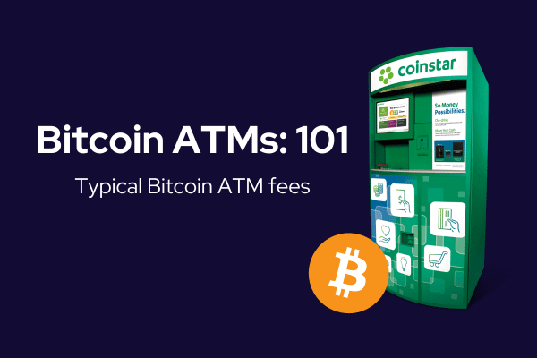

## Table of Contents

## What is a Bitcoin ATM?

A Bitcoin ATM is a machine that lets you buy or sell bitcoins. It's like a regular ATM, but instead of just dealing with regular money, it deals with bitcoins. You can find these machines in public places like shopping malls or convenience stores. To use one, you usually need to scan your phone's QR code or enter your Bitcoin wallet address, then put in cash or take out cash, depending on whether you're buying or selling bitcoins.

These machines make it easier for people to get bitcoins without needing to use a computer or a complicated exchange website. They are helpful because they let you quickly turn your regular money into bitcoins or the other way around. However, using a Bitcoin ATM can sometimes be more expensive than other methods because they often charge higher fees. It's important to check the fees before using one to make sure you're getting a good deal.

## How does a Bitcoin ATM work?

A Bitcoin ATM works by letting you buy or sell bitcoins easily. To use it, you go to the machine and start by choosing whether you want to buy or sell bitcoins. If you're buying, you'll need to scan your phone's QR code or enter your Bitcoin wallet address. Then, you put cash into the machine, and it sends the bitcoins to your wallet. If you're selling, you tell the machine how many bitcoins you want to sell, and it gives you cash in return. The whole process is quick and doesn't need a computer or a complicated website.

These machines are helpful because they make it easy to turn your regular money into bitcoins or the other way around. You can find them in places like shopping malls or convenience stores. But, using a Bitcoin ATM can cost more than other ways because they often charge higher fees. It's a good idea to check the fees before using one to make sure you're not spending too much.

## What are the benefits of using a Bitcoin ATM?

Using a Bitcoin ATM is easy and quick. You don't need a computer or to go through a complicated website to buy or sell bitcoins. Just go to the machine, choose if you want to buy or sell, and follow the steps. It's like using a regular ATM but for bitcoins. This makes it simple for anyone to get bitcoins, even if they are not good with technology.

Another benefit is that Bitcoin ATMs are often found in public places like shopping malls or convenience stores. This means you can use them when you're out and about, without having to go home or to an office. It's convenient and fits into your daily routine easily. However, you should know that using a Bitcoin ATM might cost more because they charge higher fees than other ways to buy or sell bitcoins. Always check the fees before you use one to make sure it's a good deal for you.

## What are the typical fees associated with Bitcoin ATMs?

Bitcoin ATMs usually charge fees that can be higher than other ways to buy or sell bitcoins. The fees can be different depending on the ATM and where it is located. Normally, you might pay around 5% to 10% of the amount you are buying or selling. For example, if you want to buy $100 worth of bitcoins, you might have to pay an extra $5 to $10 in fees.

It's a good idea to check the fees before using a Bitcoin ATM. Some ATMs might charge even more, especially if they are in busy places or if they offer quick service. Knowing the fees helps you decide if using a Bitcoin ATM is the best choice for you or if you should look for another way to get bitcoins.

## Where can I find a Bitcoin ATM near me?

To find a Bitcoin ATM near you, you can use websites or apps that show where these machines are located. Some popular websites are Coin ATM Radar and Bitcoin.com. Just type in your city or zip code, and they will show you a map with the nearest Bitcoin ATMs. You can also check if there are any in shopping malls, convenience stores, or other public places close to where you live or work.

Once you find a Bitcoin ATM near you, make sure to check the fees and reviews before you go. Some ATMs might charge more than others, and it's good to know this before you decide to use one. Also, reading reviews can help you see if other people had a good experience with that machine. This way, you can be ready and know what to expect when you go to buy or sell bitcoins.

## What are the differences between a Bitcoin ATM and a traditional ATM?

A Bitcoin ATM and a traditional ATM both let you do things with money, but they work with different kinds of money. A traditional ATM is for regular money, like dollars or euros. You use it to take out cash from your bank account or put money in. A Bitcoin ATM, on the other hand, is for buying or selling bitcoins. You can turn your regular money into bitcoins or sell your bitcoins for cash. To use a Bitcoin ATM, you need a Bitcoin wallet, which is like a special account for your bitcoins.

The way you use these ATMs is also different. With a traditional ATM, you usually need a bank card and a PIN to access your account. You can do things like check your balance, withdraw cash, or deposit money. A Bitcoin ATM doesn't need a bank card. Instead, you scan a QR code from your phone or enter your Bitcoin wallet address. Then, you put in cash to buy bitcoins or take out cash if you're selling bitcoins. Bitcoin ATMs often charge higher fees than traditional ATMs, so it's good to check the fees before using one.

## How do I buy Bitcoin using a Bitcoin ATM?

To buy Bitcoin using a Bitcoin ATM, first find a Bitcoin ATM near you. You can use websites like Coin ATM Radar or Bitcoin.com to find one. Once you're at the ATM, start by choosing the option to buy Bitcoin. The machine will ask you to scan a QR code from your phone or enter your Bitcoin wallet address. Make sure you have your Bitcoin wallet ready because you'll need it to receive the bitcoins.

Next, put cash into the ATM. The machine will tell you how much cash to insert based on how many bitcoins you want to buy. After you put in the money, the ATM will send the bitcoins to your wallet. The whole process is quick and easy, but remember that Bitcoin ATMs often charge higher fees than other ways to buy Bitcoin. Always check the fees before you use the ATM to make sure it's a good deal for you.

## Can I sell Bitcoin at a Bitcoin ATM, and how does that process work?

Yes, you can sell Bitcoin at a Bitcoin ATM. To do this, you go to the ATM and choose the option to sell Bitcoin. You'll need to enter how many bitcoins you want to sell and provide your Bitcoin wallet address so the ATM knows where to send the bitcoins from. After you enter this information, the ATM will tell you how much cash you'll get for your bitcoins.

Once you confirm the amount, the ATM will take the bitcoins from your wallet and give you cash. The whole process is quick and easy, but remember that selling Bitcoin at an ATM might cost you more because of the fees. Always check the fees before you use the ATM to make sure it's a good deal for you.

## What are the security measures in place at Bitcoin ATMs?

Bitcoin ATMs have several security measures to keep your money and information safe. When you use a Bitcoin ATM, it often asks for a phone number or an email to send you a verification code. This helps make sure it's really you using the machine. Some Bitcoin ATMs also have cameras to watch for anything suspicious. This can help stop people from trying to steal or mess with the machine.

Another security measure is encryption. This means the information you enter, like your Bitcoin wallet address, is turned into a special code that's hard for others to understand. This keeps your private information safe. Also, many Bitcoin ATMs are in busy places where people can see what's happening, which adds another layer of security. It's always a good idea to be careful and keep an eye on your surroundings when using a Bitcoin ATM.

## Are there any limits on the amount of Bitcoin I can buy or sell at an ATM?

Yes, there are limits on how much Bitcoin you can buy or sell at an ATM. These limits can be different depending on the ATM and where it is located. Usually, you might be able to buy or sell up to a certain amount of money each day, like $1,000 or $5,000. Some ATMs might let you do more if you go through extra steps, like giving more information about yourself.

These limits are there to keep things safe and to follow the rules. They help stop people from using Bitcoin ATMs for bad things, like money laundering. It's a good idea to check the limits before you go to a Bitcoin ATM so you know what to expect. If you need to buy or sell a lot of Bitcoin, you might need to use the ATM more than once or look for another way to do it.

## What are the regulatory considerations for Bitcoin ATMs?

Bitcoin ATMs have to follow rules set by governments to make sure they are used safely and legally. Different countries have different rules, but many require Bitcoin ATM operators to get a license or register with a financial authority. This helps keep track of who is running the ATMs and makes sure they follow the laws. Some places also have rules about how much Bitcoin you can buy or sell at an ATM to stop people from using them for illegal activities like money laundering.

These rules can change how Bitcoin ATMs work. For example, some countries might need users to give personal information or go through identity checks before they can use an ATM. This is to help stop fraud and make sure the ATMs are not used for bad things. It's important for people who want to use Bitcoin ATMs to know about these rules in their area so they can use the machines the right way and stay out of trouble.

## How does the future look for Bitcoin ATMs in terms of technology and adoption?

The future of Bitcoin ATMs looks promising as technology continues to improve and more people learn about cryptocurrencies. We might see Bitcoin ATMs that are easier to use and have better security features. For example, they could use better ways to check who you are, like face or fingerprint scanning, to make sure only you can use your account. Also, the machines might get faster and be able to handle more transactions at once, making it quicker to buy or sell Bitcoin.

As more people start using cryptocurrencies, we could see more Bitcoin ATMs in more places. Right now, they are mostly in big cities, but in the future, they might be in smaller towns too. This would make it easier for everyone to use Bitcoin, not just people in big cities. However, the rules about Bitcoin ATMs might change, and this could affect how many new ones are put in and where they can go. Overall, as long as people keep using and trusting cryptocurrencies, Bitcoin ATMs should keep growing and getting better.

## What are Bitcoin ATM fees and how can they be understood?

Bitcoin ATMs have emerged as a convenient option for conducting cryptocurrency transactions, providing a straightforward method for buying and selling Bitcoin. However, one must be aware that this convenience comes at a cost, often manifesting as higher fees compared to those found on online exchanges. These fees are generally composed of two primary components: a transaction fee and a margin on the exchange rate.

The transaction fee is a fixed or variable charge imposed by the ATM operator every time a transaction is made. This fee can vary widely, typically ranging from 5% to 20%. For instance, if you were to conduct a transaction worth $100, with a 10% transaction fee, the cost would be:

$$
\text{Transaction Cost} = \text{Transaction Amount} \times \text{Fee Percentage} = 100 \times 0.10 = \$10
$$

The second component, the margin on the exchange rate, is less apparent but equally significant. This margin represents the difference between the market exchange rate and the rate offered by the ATM, which is adjusted by the operator to include their profit margin. This means that users may pay more per Bitcoin than the current market rate, or receive less if they are selling.

For potential users, understanding these fees is essential for calculating the comprehensive cost of their Bitcoin transactions. Being informed about these charges not only aids in budgeting but also in evaluating whether using a Bitcoin ATM is the most cost-effective option for one's needs. 

Moreover, it is crucial to compare the total costs associated with Bitcoin ATMs to those of traditional online exchanges. While ATMs provide convenience and immediate transactions, online exchanges often offer more competitive fees and exchange rates, albeit with additional steps such as account creation and bank account linkage. Evaluating these alternatives in terms of both time and financial cost is advisable for anyone looking to engage with cryptocurrencies effectively. 

In conclusion, while Bitcoin ATMs are an accessible entry point into the world of [cryptocurrency](/wiki/cryptocurrency), prospective users should be cognizant of the associated fees to make well-informed transaction choices.

## References & Further Reading

[1]: ["Advances in Financial Machine Learning"](https://www.amazon.com/Advances-Financial-Machine-Learning-Marcos/dp/1119482089) by Marcos Lopez de Prado

[2]: Bergstra, J., Bardenet, R., Bengio, Y., & Kégl, B. (2011). ["Algorithms for Hyper-Parameter Optimization."](https://dl.acm.org/doi/10.5555/2986459.2986743) Advances in Neural Information Processing Systems 24.

[3]: ["Evidence-Based Technical Analysis: Applying the Scientific Method and Statistical Inference to Trading Signals"](https://www.amazon.com/Evidence-Based-Technical-Analysis-Scientific-Statistical/dp/0470008741) by David Aronson

[4]: ["Machine Learning for Algorithmic Trading"](https://github.com/PacktPublishing/Machine-Learning-for-Algorithmic-Trading-Second-Edition) by Stefan Jansen

[5]: ["Quantitative Trading: How to Build Your Own Algorithmic Trading Business"](https://www.amazon.com/Quantitative-Trading-Build-Algorithmic-Business/dp/1119800064) by Ernest P. Chan