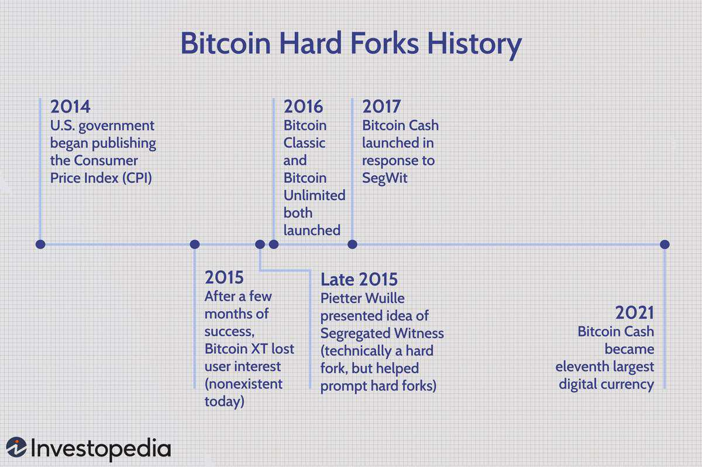

This article explores the intersection of Bitcoin Cash, cryptocurrency hard forks, and algorithmic trading, providing a detailed overview of each concept and how they interact. Bitcoin Cash (BCH) has established itself as a key player in the cryptocurrency market after its inception from a Bitcoin (BTC) hard fork. This development occurred as a response to ongoing debates within the Bitcoin community regarding transaction scalability, resulting in the formation of Bitcoin Cash in August 2017. Bitcoin Cash sought to address the scalability issues by increasing block sizes, aiming to facilitate faster and cheaper transactions compared to Bitcoin.

A comprehensive understanding of the mechanisms and strategies underlying hard forks and algorithmic trading is essential for cryptocurrency investors. Hard forks represent significant changes to a network's protocol, often resulting from disagreements or plans to upgrade the system. These events can lead to the creation of new blockchain versions, each with its own distinct market value and potential financial implications. It is within this space that algorithmic trading plays a pivotal role, offering strategies that leverage automated systems to execute trades based on predefined criteria. Algorithmic trading becomes particularly advantageous in the unpredictable cryptocurrency markets by mitigating risks and exploiting price discrepancies.



In examining how these elements function both independently and collectively, one can appreciate the dynamic nature of the cryptocurrency ecosystem. The convergence of Bitcoin Cash's evolution, the occurrence of hard forks, and the application of algorithmic trading showcases the continuous transformation and complexity within the digital asset landscape. Understanding these interactions not only aids investors in navigating the market but also highlights the ongoing development and innovation inherent in cryptocurrencies.

## Table of Contents

## What is Bitcoin Cash?

Bitcoin Cash (BCH) is a decentralized cryptocurrency that functions as a peer-to-peer electronic cash system, primarily emphasizing lower transaction fees compared to its predecessor, Bitcoin (BTC). This digital currency was established in August 2017 following a hard fork from Bitcoin, driven by disputes over the scalability of Bitcoin transactions. The primary motivation for this divergence was to increase the block size limit, which is a critical factor in enhancing transaction throughput on the blockchain. 

Bitcoin operates on a blockchain where transactions are grouped into blocks. Initially, Bitcoin had a block size limit of 1 MB, which constrained its transaction processing capability, leading to higher fees and slower transaction times during periods of high demand. To address this scalability issue, Bitcoin Cash implemented an increased block size of 8 MB at the time of its creation, later expanding it to 32 MB. This change allows more transactions to be processed per block, effectively reducing fees and speeding up the transaction process.

BCH itself has experienced further developments via hard forks. Notably, in November 2018, the network diverged again, resulting in the creation of two distinct projects: Bitcoin ABC (now often referred to simply as Bitcoin Cash) and Bitcoin SV (Satoshi Vision). This split was primarily a result of differing visions over the future path of the blockchain's development, particularly regarding further increases in block size and other technical features aimed at scalability and utility.

The creation and subsequent divisions of Bitcoin Cash highlight the dynamic and sometimes contentious nature of consensus in decentralized networks. Each fork represents both a technological adaptation to meet user demands and an ongoing community debate regarding the direction and governance of [cryptocurrency](/wiki/cryptocurrency) protocols. Bitcoin Cash continues to play an influential role in the cryptocurrency landscape by maintaining its core focus on affordability and transaction efficiency.

## Understanding Cryptocurrency Hard Forks

A hard fork in cryptocurrency networks is a significant alteration to a blockchain's protocol that results in the emergence of a new, distinct version of the blockchain, incompatible with previous iterations. This transition requires all nodes or participants in the network to upgrade to the latest protocol software; otherwise, they remain on the former chain, no longer compatible with the updated network.

Hard forks occur primarily due to disagreements within the cryptocurrency community, often revolving around critical issues such as scalability, transaction processing capabilities, or governance structures. For instance, miners, developers, and users may have conflicting opinions on how the network should evolve, making a consensus difficult to achieve. These debates can eventually lead to a hard fork as a method to ensure one set of improvements is implemented, while those opposed may continue to support the original blockchain or develop it in another direction. A notable example is the Bitcoin Cash (BCH) hard fork from Bitcoin (BTC), where debates on how best to increase transaction throughput led to a split.

Alternatively, hard forks may be introduced as part of a pre-planned upgrade to enhance network functionality or security. This approach often aims to incorporate new features, fix vulnerabilities, or optimize performance, ensuring the blockchain remains competitive and robust over time. Such planned hard forks generally have higher acceptance if communicated clearly and supported by a considerable portion of the network's stakeholders.

The implications of a hard fork are multifaceted, affecting technology, community, and market dynamics. One possible outcome is the creation of a new cryptocurrency token, as seen with Bitcoin Cash. This new token may have its own market price, which can fluctuate based on factors such as user adoption, market speculation, and perceived utility. As a result, holders of the original currency might experience gains or losses depending on how the market values the newly forked coin compared to the original blockchain.

From a market perspective, the economic implications of a hard fork can be complex. Traders and investors might face uncertainty due to potential [volatility](/wiki/volatility-trading-strategies) in both the original and newly created cryptocurrencies. For those actively involved in trading, a hard fork presents opportunities and risks, highlighting the importance of market analysis and risk management strategies.

In conclusion, cryptocurrency hard forks represent pivotal moments in the lifecycle of a blockchain, driven by the dual forces of community divergence and technological evolution. They underscore the decentralized ethos of cryptocurrencies, allowing participants to choose their preferred path while often reshaping the digital asset landscape.

## Algorithmic Trading in Cryptocurrency

Algorithmic trading involves the utilization of automated systems to execute buy and sell orders in cryptocurrency markets based on predefined strategies. This method is particularly advantageous in the inherently volatile environment of cryptocurrencies, as it assists in mitigating risks and capitalizing on price discrepancies that can occur within seconds. The use of algorithms in trading allows for swift decision-making, which human traders may not achieve due to the rapid changes in market conditions.

To effectively implement [algorithmic trading](/wiki/algorithmic-trading), a strong grasp of market dynamics and sophisticated coding skills are essential. Algorithms are designed to identify trading opportunities and act upon them without the delay associated with manual trading, thus providing traders with a competitive edge. In the context of cryptocurrencies, where market fluctuations can be significant, algorithms can analyze vast amounts of data and execute trades at electronic speed.

Implementing an algorithmic trading system requires the development of complex trading strategies. These strategies can range from simple moving averages to more complex [arbitrage](/wiki/arbitrage) or mean-reversion strategies. For instance, a basic moving average crossover strategy can be implemented in Python as follows:

```python
import pandas as pd
import numpy as np

# Assume df is a DataFrame with a DateTime index and 'Close' price column
short_window = 40
long_window = 100

signals = pd.DataFrame(index=df.index)
signals['signal'] = 0.0

# Short moving average
signals['short_mavg'] = df['Close'].rolling(window=short_window, min_periods=1, center=False).mean()

# Long moving average
signals['long_mavg'] = df['Close'].rolling(window=long_window, min_periods=1, center=False).mean()

# Create signals
signals['signal'][short_window:] = np.where(signals['short_mavg'][short_window:] > signals['long_mavg'][short_window:], 1.0, 0.0)
signals['positions'] = signals['signal'].diff()
```

In this example, the algorithm generates buy signals when the short-term moving average crosses above the long-term moving average, and sell signals when the opposite occurs. This kind of strategy exploits the directional [momentum](/wiki/momentum) embedded in asset prices.

The execution of such strategies necessitates precise timing and reliability, making robust code and [backtesting](/wiki/backtesting) procedures imperative. Backtesting involves simulating the trading algorithm on historical data to gauge its performance and refine strategies before applying them in live markets. Python libraries such as `[backtrader](/wiki/backtrader)` and `quantopian` are commonly used for this purpose.

Moreover, algorithmic trading in cryptocurrencies is not devoid of challenges. It requires addressing the unpredictability of market movements and ensuring systems are resistant to sudden changes or 'black swan' events. Traders must continuously adapt algorithms to encompass new market realities, including index events or major regulatory changes that might affect asset values overnight.

In conclusion, algorithmic trading stands as a pivotal component in cryptocurrency markets, providing both opportunities and challenges. Mastery over technical skills, combined with an agile response to market developments, forms the foundation for successful algorithmic trading strategies.

## Bitcoin Cash Hard Forks and Their Impact on Algo Trading

Bitcoin Cash's series of hard forks have provided algorithmic traders with unique opportunities to adjust their strategies and capitalize on ensuing market volatility. These forks lead to the creation of new coins and disrupt existing market patterns, offering algorithmic trading systems the chance to exploit price fluctuations and [liquidity](/wiki/liquidity-risk-premium) changes that typically accompany such events.

Algorithmic trading, which uses automated systems to execute pre-defined strategies, is particularly suited to navigating the high volatility that accompanies hard forks. These systems can be programmed to respond to specific triggers associated with hard forks, such as sudden changes in trading [volume](/wiki/volume-trading-strategy), price momentum, or [order book](/wiki/order-book-trading-strategies) depth. For example, traders may employ strategies that focus on arbitrage or trend-following to take advantage of discrepancies between the prices of the new coins and their parent currency immediately following a fork.

To optimize trading strategies during hard forks, a comprehensive understanding of Bitcoin Cash's hard fork history is essential. Significant events in Bitcoin Cash's history—such as the 2018 fork that resulted in the creation of Bitcoin SV—serve as reference points for understanding potential market reactions to similar occurrences in the future. Historical data analysis allows traders to discern patterns or behavior tendencies of the crypto markets, which can be crucial when developing algorithms that seek to leverage those insights.

```python
# Example of a simple algorithmic trading strategy using Python pseudocode
# Note: This is a simplified illustration and should not be used as is for trading

class Strategy:
    def __init__(self):
        self.position = None

    def evaluate_market(self, market_data):
        # Logic to detect potential opportunities based on price shifts
        if market_data['price_change'] > threshold:
            return "buy"
        elif market_data['price_change'] < -threshold:
            return "sell"
        return "hold"

    def execute_trade(self, signal):
        if signal == "buy" and self.position is None:
            self.buy()
        elif signal == "sell" and self.position is not None:
            self.sell()

    def buy(self):
        # Execute buy order
        self.position = "long"
        print("Buying...")

    def sell(self):
        # Execute sell order
        self.position = None
        print("Selling...")

# Example usage
strategy = Strategy()
market_data = {'price_change': 0.05} # Example market data input
signal = strategy.evaluate_market(market_data)
strategy.execute_trade(signal)
```

The high adaptability of algorithmic systems is critical in hard fork scenarios, where market conditions can change rapidly and unpredictably. However, these strategies do require meticulous tuning and validation to ensure their efficacy amidst the unique challenges posed by hard forks. This includes rigorous back-testing and stress-testing against historical data from previous forks.

Consequently, the intersection of Bitcoin Cash hard forks and algorithmic trading underscores the need for traders to remain nimble and informed, leveraging both historical insight and real-time data to optimize their algorithms for capturing opportunities that arise from market imperfections introduced by such events.

## Case Studies: BCH Hard Forks and Algorithmic Trading Success

Examining past Bitcoin Cash (BCH) hard forks reveals valuable insights into effective and ineffective trading strategies, particularly for algorithmic traders. These traders have utilized algorithms to navigate the price volatility and market inefficiencies that often accompany hard fork events. Key case studies include the initial BCH hard fork from Bitcoin (BTC) in August 2017 and the subsequent 2018 split into Bitcoin ABC and Bitcoin SV.

During the 2017 BCH fork, algorithmic traders capitalized on significant price movements. The market reaction created discrepancies between the value of BTC and the newly created BCH, offering arbitrage opportunities. Successful algorithms analyzed order [books](/wiki/algo-trading-books) and executed trades rapidly across multiple exchanges, aiming to profit from price differences before the market stabilized.

Similarly, the 2018 hard fork leading to the division of BCH into Bitcoin ABC and Bitcoin SV provided fertile ground for algorithmic strategies. The uncertainty surrounding which fork would gain broader acceptance resulted in increased market volatility. Algorithms that incorporated real-time news sentiment analysis and technical indicators, such as moving averages and volume-weighted average price (VWAP), could swiftly adapt to market shifts. For instance, algorithmic traders might utilize a Bollinger Bands strategy to capture profits from the price volatility. This approach could involve monitoring the price deviations from the bands and executing buy or sell orders when the price breaks beyond the established thresholds.

```python
import numpy as np
import pandas as pd
import talib

# Assuming `price_data` is a DataFrame with 'close' prices
price_data['upper_band'], price_data['middle_band'], price_data['lower_band'] = talib.BBANDS(price_data['close'], timeperiod=20)

# Example trading strategy based on Bollinger Bands
price_data['signal'] = 0  # Initialize signal column
price_data.loc[price_data['close'] < price_data['lower_band'], 'signal'] = 1  # Buy signal
price_data.loc[price_data['close'] > price_data['upper_band'], 'signal'] = -1  # Sell signal
```

Lessons from these instances underscore the importance of well-crafted trading algorithms that can process large datasets rapidly and discern market trends accurately. Such historical events highlight the necessity for algorithmic traders to prepare for potential changes in market sentiment and liquidity.

Further, these cases illustrate that algorithms must anticipate and mitigate the risks associated with heightened volatility, such as slippage and execution delay. Effective risk management strategies are paramount and might include setting stop-loss orders, diversifying portfolios, or incorporating advanced hedging techniques.

By drawing from past experiences, algorithmic traders can refine their strategies to better navigate the complexities of future hard fork events, recognizing that success hinges on adaptability and swift information processing.

## Challenges and Considerations for Algo Trading in Hard Fork Scenarios

Algorithmic trading in the context of cryptocurrency hard forks presents unique challenges and considerations that traders must navigate to maintain profitability. A critical [factor](/wiki/factor-investing) for success is the ability to continuously adapt to new market conditions that arise following a hard fork. The introduction of new blockchain versions can lead to significant market volatility, requiring algorithms to quickly adjust trading strategies to capitalize on these changes.

Risk management becomes especially important in these scenarios. The unpredictable nature of market behavior post-fork demands robust strategies to mitigate potential losses. Traders should implement dynamic risk management protocols such as stop-loss orders and position sizing adjustments to protect their portfolios. For example, an algorithm might adjust its trading strategy based on volatility measures such as the VIX. In Python, this could be implemented using a volatility calculation function:

```python
import numpy as np

def calculate_volatility(prices):
    returns = np.diff(prices) / prices[:-1]
    return np.std(returns) * np.sqrt(len(returns))

# Example usage with a list of closing prices
prices = [100, 105, 102, 97, 101]
volatility = calculate_volatility(prices)
```

In addition to technical considerations, legal and ethical implications are increasingly relevant in algorithmic trading during hard fork scenarios. The rapid advancement of technology in this domain poses challenges such as ensuring compliance with evolving regulations and maintaining transparency with clients. Traders must stay informed about legal changes to avoid inadvertent breaches that could result in penalties. Ethical considerations also prompt traders to ensure that their algorithms do not engage in manipulative practices, such as spoofing or wash trading, which can undermine market integrity.

Furthermore, as technological advancements continue to accelerate, ethical frameworks must evolve to address new scenarios and challenges that emerge with the advent of sophisticated trading systems. Traders and technology developers are encouraged to engage in continuous learning and collaboration with legal experts to ensure that their strategies and tools adhere to both the letter and spirit of the law. This vigilance and adaptability ensure the sustainability and success of algorithmic trading operations in dynamic cryptocurrency markets impacted by hard forks.

## The Future of Bitcoin Cash, Hard Forks, and Algo Trading

As cryptocurrency and blockchain technology evolve, the dynamics of hard forks and algorithmic trading are likely to become more complex. Bitcoin Cash (BCH) is a prime example of a cryptocurrency that demonstrates both the challenges and opportunities inherent in hard forks and algorithmic trading. With its capacity for low transaction fees and scalability, Bitcoin Cash aims to provide a more accessible financial system compared to its predecessors. As the digital economy continues to expand, BCH's role in facilitating smoother and more cost-effective transactions positions it as a key component in future financial infrastructures.

Algorithmic trading is expected to grow increasingly sophisticated, driven by advances in [machine learning](/wiki/machine-learning) and [artificial intelligence](/wiki/ai-artificial-intelligence). Traders will need to harness these emerging technologies to effectively navigate the rapidly changing crypto markets. For instance, machine learning algorithms can be designed to analyze historic and real-time market data, identify patterns, and predict price movements with greater accuracy. Consider a simple moving average crossover strategy:

```python
def sma_crossover_strategy(prices, short_window, long_window):
    short_sma = prices.rolling(window=short_window, min_periods=1).mean()
    long_sma = prices.rolling(window=long_window, min_periods=1).mean()

    signal = (short_sma > long_sma).astype(int)
    return signal.diff()

# Example usage:
import pandas as pd

# 'prices' would be a pandas Series of BCH prices
signal = sma_crossover_strategy(prices, short_window=50, long_window=200)
```

This code provides a simple illustration of how algorithms can be employed to make trading decisions based on predefined conditions. The strategy generates buy or sell signals based on the crossover of short and long moving averages, enabling traders to respond swiftly to market changes.

Hard forks, which are pivotal in creating new coins and altering the landscape of the cryptocurrency market, will continue posing unique challenges and opportunities for investors and algorithmic traders. The creation of new coins through hard forks offers potential for profit, provided traders can adapt their strategies to capitalize on the heightened volatility and new trading opportunities they present.

The landscape for both Bitcoin Cash and algorithmic trading is poised to become more intricate and interconnected as innovations continue to shape how markets operate. As these technologies advance, market participants must stay informed and adept, striving to integrate these complex dynamics into new and innovative trading strategies. This adaptability will be crucial as the market evolves, requiring a blend of strategic foresight and technological innovation to thrive in this ever-changing arena.

## Conclusion

Bitcoin Cash's evolution through multiple hard forks serves as a prominent illustration of the cryptocurrency market's inherent fluidity and complexity. These hard forks, driven by differing visions within the community and technological advancements, punctuate the need for agility among investors and traders. As the market adapts to these structural changes, algorithmic trading emerges as a crucial tool, enabling participants to harness opportunities arising from the inherent volatility and segmentation of digital assets.

Investors and traders are compelled to remain vigilant and responsive to market shifts. By staying informed about developments in blockchain technology and market conditions, they can enhance their trading strategies to maximize gains. Automated trading systems offer a significant advantage in this regard, as they can process large sets of data rapidly, executing trades based on pre-defined criteria. This capability is particularly advantageous during hard forks, where rapid price movements can occur.

Looking forward, the complexity and sophistication of trading mechanisms are expected to advance alongside technological innovations in blockchain and financial systems. With the potential revelation of novel algorithms and trading platforms, the landscape of cryptocurrency trading is poised for transformation. Such advancements will likely redefine how digital assets, including Bitcoin Cash, are perceived and utilized. As these trends unfold, the ability to adapt to these dynamic changes will determine the success of investors and traders in navigating the evolving cryptocurrency domain.

## References & Further Reading

[1]: Nakamoto, S. (2008). ["Bitcoin: A Peer-to-Peer Electronic Cash System."](https://nakamotoinstitute.org/library/bitcoin/) 

[2]: Antonopoulos, A. M. (2018). ["Mastering Bitcoin: Unlocking Digital Cryptocurrencies."](https://books.google.com/books/about/Mastering_Bitcoin.html?id=IXmrBQAAQBAJ) O'Reilly Media.

[3]: Antonopoulos, A. M., & Wood, G. (2021). ["Mastering Ethereum: Building Smart Contracts and DApps."](https://books.google.com/books/about/Mastering_Ethereum.html?id=nJJ5DwAAQBAJ) O'Reilly Media.

[4]: Roger Ver, the Bitcoin Cash Hard Fork, and the Bitcoin Wars. Retrieved from [Investopedia](https://www.investopedia.com/news/all-about-bitcoin-cash-hard-fork/)

[5]: Lo, A. W. (2005). ["Reconciling Efficient Markets with Behavioral Finance: The Adaptive Markets Hypothesis."](https://papers.ssrn.com/sol3/papers.cfm?abstract_id=1702447) Journal of Investment Consulting, 7(2), 21-44.

[6]: Poon, S.-H., & Granger, C. W. J. (2003). ["Forecasting Volatility in Financial Markets: A Review."](https://www.aeaweb.org/articles?id=10.1257/002205103765762743) Journal of Economic Literature, 41(2), 478-539.

[7]: Tsai, W. T., Blower, R., Zhu, Y., & Yu, L. (2016). ["A System View of Financial Blockchains."](https://ieeexplore.ieee.org/document/7473060) 2016 IEEE Symposium on Service-Oriented System Engineering (SOSE).

[8]: Lopez de Prado, M. (2018). ["Advances in Financial Machine Learning."](https://www.amazon.com/Advances-Financial-Machine-Learning-Marcos/dp/1119482089) Wiley.

[9]: Campello, M., Graham, J. R., & Harvey, C. R. (2010). ["The Real Effects of Financial Constraints: Evidence from a Financial Crisis."](https://www.sciencedirect.com/science/article/pii/S0304405X10000413) The Review of Financial Studies, 23(1), 143-187.