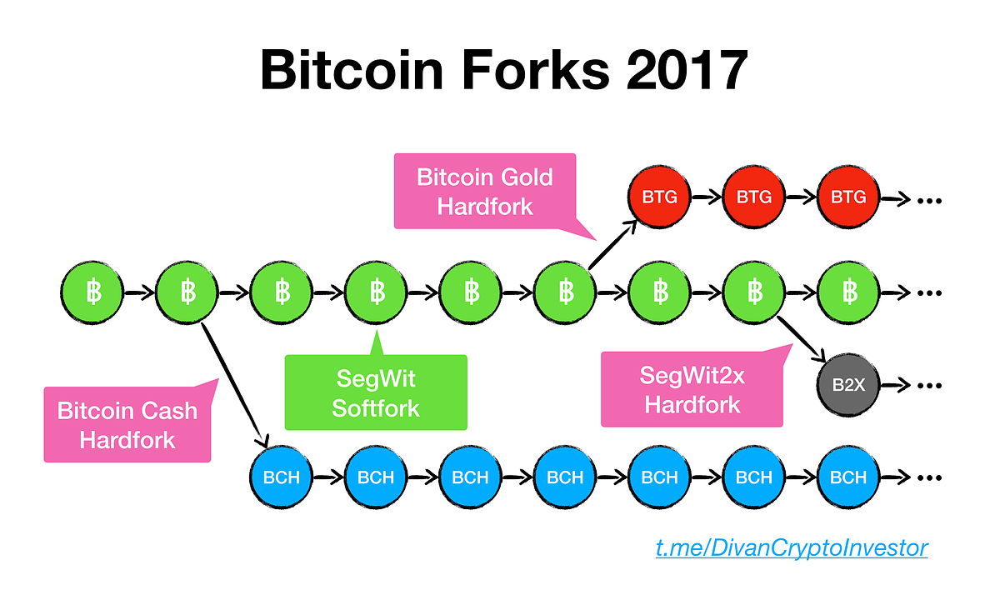

## Table of Contents

## What is Bitcoin Cash?

Bitcoin Cash is a type of digital money that you can use online. It started in 2017 when some people who liked Bitcoin decided to make a new version of it. They wanted to make it easier and faster to send money to each other. Bitcoin Cash is similar to Bitcoin, but it has some differences that make it unique.

One big difference is that Bitcoin Cash can handle more transactions at the same time. This means it can be quicker and cheaper to use than Bitcoin. People use Bitcoin Cash to buy things online, send money to friends, or even as an investment. Just like Bitcoin, Bitcoin Cash is kept safe using something called blockchain technology, which is like a big, secure list of all the transactions that have ever happened.

## What is a hard fork in cryptocurrency?

A hard fork in cryptocurrency is like making a big change to the rules of a game that everyone has to follow. Imagine you're playing a game and suddenly, the rules change so much that it's like playing a new game. In cryptocurrency, a hard fork happens when the people who take care of the cryptocurrency decide to change the way it works in a big way. When this happens, the old version of the cryptocurrency and the new version can both keep going, but they are separate from each other.

For example, if you have money in the old version, you might also get money in the new version after a hard fork. This is because the new version starts with the same history as the old one up to the point of the fork. But after the fork, they go their separate ways. Hard forks can happen for many reasons, like wanting to make the [cryptocurrency](/wiki/cryptocurrency) faster or more secure. It's a big decision because it can split the community of people who use and support the cryptocurrency.

## Why did the Bitcoin Cash hard fork occur?

The Bitcoin Cash hard fork happened because some people who used Bitcoin wanted to make it better. They thought Bitcoin was too slow and expensive to use for everyday things like buying a coffee or sending money to a friend. So, they decided to create Bitcoin Cash, which would be faster and cheaper. This change was so big that it couldn't be done without making a new version of Bitcoin, which is what a hard fork does.

When the hard fork happened in 2017, it split Bitcoin into two separate cryptocurrencies: the original Bitcoin and the new Bitcoin Cash. People who had Bitcoin before the fork got the same amount of Bitcoin Cash for free. This was because Bitcoin Cash started with the same history as Bitcoin up to the point of the fork. After the fork, Bitcoin and Bitcoin Cash went their own ways, with Bitcoin Cash focusing on being easier to use for everyday transactions.

## When did the Bitcoin Cash hard fork happen?

The Bitcoin Cash hard fork happened on August 1, 2017. This was when some people who used Bitcoin decided they wanted to make it better. They thought Bitcoin was too slow and expensive for everyday use, so they created Bitcoin Cash to fix these problems. The hard fork was a big change that couldn't happen without making a new version of Bitcoin.

When the hard fork happened, it split Bitcoin into two separate cryptocurrencies: the original Bitcoin and the new Bitcoin Cash. People who had Bitcoin before the fork got the same amount of Bitcoin Cash for free. This was because Bitcoin Cash started with the same history as Bitcoin up to the point of the fork. After the fork, Bitcoin and Bitcoin Cash went their own ways, with Bitcoin Cash focusing on being easier and cheaper to use for everyday transactions.

## What were the main reasons for the Bitcoin Cash hard fork?

The main reason for the Bitcoin Cash hard fork was that some people thought Bitcoin was too slow and expensive to use for everyday things. They wanted to make it easier and cheaper to send money to each other. So, they decided to change Bitcoin in a big way. This change was called a hard fork because it created a new version of Bitcoin called Bitcoin Cash.

When the hard fork happened, it split Bitcoin into two separate cryptocurrencies. People who had Bitcoin before the fork got the same amount of Bitcoin Cash for free. This was because Bitcoin Cash started with the same history as Bitcoin up to the point of the fork. After the fork, Bitcoin and Bitcoin Cash went their own ways. Bitcoin Cash focused on being faster and cheaper, which was what the people who made the hard fork wanted.

## What changes were introduced by the Bitcoin Cash hard fork?

The Bitcoin Cash hard fork introduced a big change to make transactions faster and cheaper. Before the hard fork, Bitcoin could only handle a few transactions at a time, which made it slow and expensive. Bitcoin Cash changed this by increasing the size of each block in the blockchain. This meant more transactions could be processed at once, making it quicker and less costly to use Bitcoin Cash for everyday things like buying coffee or sending money to friends.

After the hard fork, Bitcoin Cash became its own cryptocurrency, separate from Bitcoin. People who had Bitcoin before the fork got the same amount of Bitcoin Cash for free. This was because Bitcoin Cash started with the same history as Bitcoin up to the point of the fork. From then on, Bitcoin and Bitcoin Cash went their own ways. Bitcoin Cash focused on being easy and cheap to use, which was the main goal of the people who made the hard fork.

## How did the Bitcoin Cash hard fork affect the cryptocurrency market?

The Bitcoin Cash hard fork had a big impact on the cryptocurrency market. When it happened in 2017, it created a new cryptocurrency called Bitcoin Cash, which meant there were suddenly more digital coins for people to buy, sell, and trade. This made the market more exciting but also more confusing. Some people were happy because they got free Bitcoin Cash if they already had Bitcoin. Others were worried because they didn't know if Bitcoin Cash would be successful or if it would take value away from Bitcoin.

After the hard fork, the prices of both Bitcoin and Bitcoin Cash went up and down a lot. This is because people were trying to figure out what would happen next. Some people thought Bitcoin Cash was a good idea because it was faster and cheaper to use. Others thought it might not last long. All this uncertainty made the cryptocurrency market feel a bit like a roller coaster. But it also showed that the world of digital money was changing and growing, with new ideas and possibilities coming up all the time.

## What was the community's response to the Bitcoin Cash hard fork?

The Bitcoin Cash hard fork caused a lot of different feelings in the cryptocurrency community. Some people were excited about the new Bitcoin Cash because it promised to be faster and cheaper to use than Bitcoin. They liked the idea of being able to use digital money for everyday things without waiting a long time or paying a lot of fees. These people were happy to get free Bitcoin Cash if they already had Bitcoin, and they hoped it would become popular and valuable.

On the other hand, some people were worried or even upset about the hard fork. They thought it might confuse people and make the whole cryptocurrency world seem less stable. They were concerned that having two similar cryptocurrencies might take value away from Bitcoin, which they saw as the original and most important digital money. The hard fork also led to a lot of debates and disagreements within the community about the best way to make Bitcoin better. Overall, the hard fork showed that the world of digital money was changing and growing, but it also made things more complicated for a while.

## What are the technical differences between Bitcoin Cash before and after the hard fork?

Before the hard fork, Bitcoin Cash was just like Bitcoin. It had the same rules and worked the same way. Both cryptocurrencies could only handle a small number of transactions at once because each block in their blockchain was limited in size. This made them slow and expensive to use for everyday things like buying coffee or sending money to friends. People who wanted to use Bitcoin for these things had to wait a long time and pay high fees, which was frustrating.

After the hard fork, Bitcoin Cash changed to be different from Bitcoin. The main change was that Bitcoin Cash increased the size of each block in its blockchain. This meant it could handle more transactions at once, making it faster and cheaper to use. Now, people could use Bitcoin Cash for everyday things without waiting as long or paying as much in fees. This change was what the people who made the hard fork wanted, to make digital money easier and more useful for everyone.

## How did the Bitcoin Cash hard fork impact miners and mining?

The Bitcoin Cash hard fork changed things for miners, the people who use special computers to process transactions and add them to the blockchain. Before the hard fork, miners were working on Bitcoin. But when Bitcoin Cash was created, they had a choice. They could keep mining Bitcoin, start mining Bitcoin Cash, or do both. This choice was important because mining Bitcoin Cash was different. It had bigger blocks, which meant miners could process more transactions at once. This could be good for miners because they might earn more money if more people used Bitcoin Cash.

However, the hard fork also made things more complicated for miners. They had to decide which cryptocurrency to focus on, and this decision could affect their earnings. If they chose to mine Bitcoin Cash, they needed to make sure their computers could handle the bigger blocks. Some miners liked the idea of Bitcoin Cash and thought it could be more profitable in the long run. Others stayed with Bitcoin because it was more established and they didn't want to take the risk. Overall, the hard fork gave miners more options but also more to think about when it came to their mining work.

## What were the long-term effects of the Bitcoin Cash hard fork on its adoption and use?

The Bitcoin Cash hard fork had a big impact on how people used and adopted the new cryptocurrency. Right after the hard fork, many people were excited about Bitcoin Cash because it was faster and cheaper to use than Bitcoin. This made it easier for people to buy things online or send money to friends without waiting a long time or paying high fees. Some businesses and online stores started accepting Bitcoin Cash, which helped it grow in popularity. However, not everyone was sure about Bitcoin Cash, and some people stuck with Bitcoin because it was more well-known and trusted.

Over time, the adoption and use of Bitcoin Cash faced some challenges. While it did gain a loyal group of users who liked its speed and low fees, it didn't become as popular as some people hoped. Bitcoin Cash had to compete with other cryptocurrencies that also promised fast and cheap transactions. This competition made it harder for Bitcoin Cash to grow even more. Still, Bitcoin Cash kept its place in the cryptocurrency world, and it continued to be used by people who valued its features. The hard fork showed that the world of digital money was changing and growing, with new ideas and possibilities coming up all the time.

## How can one prepare for future hard forks in Bitcoin Cash or similar cryptocurrencies?

To prepare for future hard forks in Bitcoin Cash or similar cryptocurrencies, it's important to stay informed. This means keeping up with news and updates from the cryptocurrency community. You can do this by following official websites, social media accounts, and forums where people talk about these cryptocurrencies. If you own any of these cryptocurrencies, it's a good idea to know when a hard fork might happen and what changes it could bring. This way, you can decide if you want to keep your money in the old version, move it to the new version, or split it between both.

Another way to prepare is to think about how a hard fork might affect your money. Sometimes, after a hard fork, you get the same amount of the new cryptocurrency for free if you already have the old one. But the value of both cryptocurrencies can go up and down a lot. It's smart to have a plan for what you'll do with your money if this happens. You might want to talk to people who know a lot about cryptocurrencies or even a financial advisor to help you make the best choices. By staying informed and planning ahead, you can be ready for whatever changes a hard fork might bring.

## References & Further Reading

[1]: Nakamoto, S. (2008). ["Bitcoin: A Peer-to-Peer Electronic Cash System."](https://nakamotoinstitute.org/library/bitcoin/) 

[2]: Antonopoulos, A. M. (2018). ["Mastering Bitcoin: Unlocking Digital Cryptocurrencies."](https://books.google.com/books/about/Mastering_Bitcoin.html?id=IXmrBQAAQBAJ) O'Reilly Media.

[3]: Antonopoulos, A. M., & Wood, G. (2021). ["Mastering Ethereum: Building Smart Contracts and DApps."](https://books.google.com/books/about/Mastering_Ethereum.html?id=nJJ5DwAAQBAJ) O'Reilly Media.

[4]: Roger Ver, the Bitcoin Cash Hard Fork, and the Bitcoin Wars. Retrieved from [Investopedia](https://www.investopedia.com/news/all-about-bitcoin-cash-hard-fork/)

[5]: Lo, A. W. (2005). ["Reconciling Efficient Markets with Behavioral Finance: The Adaptive Markets Hypothesis."](https://papers.ssrn.com/sol3/papers.cfm?abstract_id=1702447) Journal of Investment Consulting, 7(2), 21-44.

[6]: Poon, S.-H., & Granger, C. W. J. (2003). ["Forecasting Volatility in Financial Markets: A Review."](https://www.aeaweb.org/articles?id=10.1257/002205103765762743) Journal of Economic Literature, 41(2), 478-539.

[7]: Tsai, W. T., Blower, R., Zhu, Y., & Yu, L. (2016). ["A System View of Financial Blockchains."](https://ieeexplore.ieee.org/document/7473060) 2016 IEEE Symposium on Service-Oriented System Engineering (SOSE).

[8]: Lopez de Prado, M. (2018). ["Advances in Financial Machine Learning."](https://www.amazon.com/Advances-Financial-Machine-Learning-Marcos/dp/1119482089) Wiley.

[9]: Campello, M., Graham, J. R., & Harvey, C. R. (2010). ["The Real Effects of Financial Constraints: Evidence from a Financial Crisis."](https://www.sciencedirect.com/science/article/pii/S0304405X10000413) The Review of Financial Studies, 23(1), 143-187.