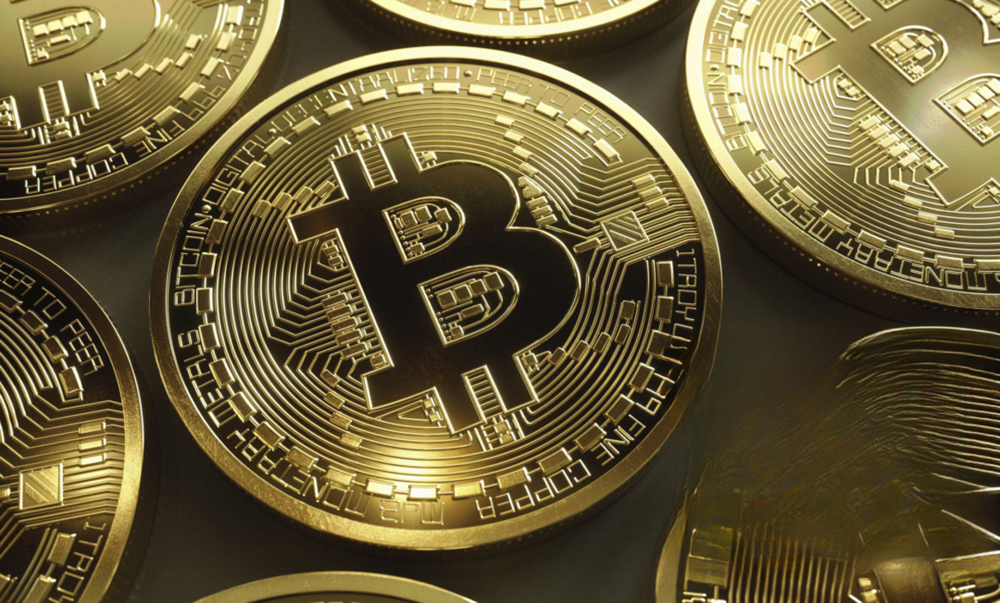

## Table of Contents

## What is Bitcoin Cash?

Bitcoin Cash is a type of digital money that started in 2017. It came from Bitcoin, which is another digital money. People made Bitcoin Cash because they wanted to fix some problems with Bitcoin. One big problem was that it was slow and expensive to send money with Bitcoin. Bitcoin Cash was made to be faster and cheaper to use.

Just like Bitcoin, Bitcoin Cash uses something called blockchain. This is like a big digital notebook that keeps track of all the money moving around. People can send Bitcoin Cash to each other without needing a bank. They just need the internet. Bitcoin Cash is used by people all over the world, and you can buy things with it or trade it for other money.

## How was Bitcoin Cash created?

Bitcoin Cash was created in August 2017. It came from a split in the Bitcoin community. Some people thought Bitcoin needed to change to work better. They wanted it to be faster and cheaper to use. So, they made a new version of Bitcoin, and they called it Bitcoin Cash. This process is called a "hard fork." It's like making a copy of Bitcoin but with some new rules.

When Bitcoin Cash was created, everyone who had Bitcoin got the same amount of Bitcoin Cash for free. If you had 1 Bitcoin, you got 1 Bitcoin Cash. This was done to make sure the new money was spread out fairly. After the split, Bitcoin and Bitcoin Cash became two different kinds of money. They both use blockchain technology, but they have different rules and goals. Bitcoin Cash focuses on being easy and cheap to use for everyday things.

## What are the main differences between Bitcoin and Bitcoin Cash?

Bitcoin and Bitcoin Cash started from the same place but now they are different. One big difference is how they handle transactions. Bitcoin has a limit on how much information it can process at once. This can make sending money slow and sometimes expensive. Bitcoin Cash, on the other hand, was made to handle more information at once. This means it can be faster and cheaper to send money with Bitcoin Cash.

Another difference is their goals. Bitcoin is often seen as a store of value, like digital gold. Many people buy it hoping its price will go up over time. Bitcoin Cash, however, wants to be used more like regular money. The people who made Bitcoin Cash want it to be easy for people to use it to buy things every day. So, while Bitcoin focuses on being valuable over time, Bitcoin Cash focuses on being useful for everyday spending.

## What is the block size limit of Bitcoin Cash and why is it important?

Bitcoin Cash has a bigger block size limit than Bitcoin. Its block size is set at 32 megabytes (MB), while Bitcoin's block size is only 1 megabyte (MB). The block size is important because it decides how much information can be put into each block on the blockchain. A bigger block size means more transactions can be added to each block. This makes the system faster and cheaper to use because it can handle more transactions at the same time.

Having a bigger block size is a big reason why Bitcoin Cash was created. The people who made Bitcoin Cash wanted to fix the problem of slow and expensive transactions in Bitcoin. By making the block size bigger, they hoped to make Bitcoin Cash a better choice for everyday spending. This way, more people could use it to buy things without waiting a long time or paying a lot in fees.

## How does Bitcoin Cash handle transaction fees?

Bitcoin Cash keeps transaction fees low by having a bigger block size. This means more transactions can fit into each block on the blockchain. When there's more room for transactions, people don't have to compete as much to get their transactions processed quickly. So, they don't have to pay as much in fees. This makes it cheaper for people to send and receive Bitcoin Cash.

The goal of Bitcoin Cash is to be used like regular money for everyday things. Low transaction fees help with this because people are more likely to use it if it's not expensive. If you want to buy a coffee or pay for a bus ticket with Bitcoin Cash, you won't have to pay a lot extra just for the transaction. This makes Bitcoin Cash more useful for small, everyday purchases.

## What is the mining process like for Bitcoin Cash?

Mining Bitcoin Cash is a lot like mining Bitcoin. Miners use special computers to solve hard math problems. When they solve a problem, they can add a new block to the Bitcoin Cash blockchain. This block has a list of all the new transactions that happened. Miners get paid in Bitcoin Cash for their work. This payment is called a "block reward," and it's how new Bitcoin Cash is made.

The mining process helps keep Bitcoin Cash safe and fair. It makes sure that no one can cheat the system. If someone tries to spend the same Bitcoin Cash twice, miners will find out and stop it. Also, because many different miners are working on the blockchain at the same time, no single person can control it. This is called "decentralization," and it's an important part of what makes Bitcoin Cash work well.

## How is the security of Bitcoin Cash maintained?

The security of Bitcoin Cash is kept strong by something called mining. Miners use powerful computers to solve math puzzles. When they solve a puzzle, they can add a new block to the Bitcoin Cash blockchain. This block has a list of all the new transactions. If someone tries to cheat by spending the same Bitcoin Cash twice, the miners will see it and stop it. This makes it very hard for anyone to trick the system.

Another way Bitcoin Cash stays safe is because many different miners work on it at the same time. This is called decentralization. It means no single person can control the whole system. If one miner tries to do something bad, the others can stop them. This spread-out control keeps Bitcoin Cash secure and fair for everyone who uses it.

## What are some common use cases for Bitcoin Cash?

People use Bitcoin Cash to buy things every day. It's good for small purchases like a cup of coffee or a bus ticket. Because the fees are low, you don't have to pay a lot extra just to use it. Some stores and online shops accept Bitcoin Cash as payment. This makes it easy for people to use their Bitcoin Cash to buy what they need.

Bitcoin Cash is also used to send money to friends and family, especially if they live in different countries. It's quick and the fees are low, so it's cheaper than using a bank or a money transfer service. This can be really helpful for people who need to send money home to their families in other countries.

## How can someone acquire Bitcoin Cash?

Someone can acquire Bitcoin Cash by buying it on a [cryptocurrency](/wiki/cryptocurrency) exchange. These are websites where you can trade regular money, like dollars or euros, for Bitcoin Cash. You just need to sign up for an account, put some money in, and then you can buy Bitcoin Cash. It's a bit like buying something online, but instead of getting a product, you get Bitcoin Cash in your digital wallet.

Another way to get Bitcoin Cash is by trading other cryptocurrencies for it. If you already have Bitcoin or another digital currency, you can swap it for Bitcoin Cash on an exchange. Some people also get Bitcoin Cash by mining it. Mining means using special computers to solve math problems and help keep the Bitcoin Cash network running. When you mine, you can earn Bitcoin Cash as a reward.

## What are the scalability solutions proposed or implemented by Bitcoin Cash?

Bitcoin Cash has made its blocks bigger to handle more transactions at once. Each block can be up to 32 megabytes, which is much larger than Bitcoin's 1 megabyte blocks. This means more transactions can fit into each block, making the system faster and cheaper. When there's more room for transactions, people don't have to wait as long or pay as much in fees. This is a big part of how Bitcoin Cash tries to be better for everyday use.

Another way Bitcoin Cash works on scalability is by using something called the "Graphene" protocol. Graphene helps make transactions smaller and faster to send across the network. This can save time and space, making the whole system run more smoothly. By using these ideas, Bitcoin Cash aims to be a digital money that's easy and quick to use for everyone.

## What are the future development plans for Bitcoin Cash?

The people who work on Bitcoin Cash want to keep making it better. One big goal is to make it even faster and cheaper to use. They plan to do this by making the blocks even bigger and finding new ways to handle more transactions at once. They also want to make it easier for businesses to accept Bitcoin Cash as payment. This way, more people can use it to buy things every day.

Another focus for the future is improving the technology behind Bitcoin Cash. The team wants to keep the system safe and easy to use. They are working on new tools and features that will help people use Bitcoin Cash without any problems. By doing all these things, they hope to make Bitcoin Cash a popular choice for digital money around the world.

## How does Bitcoin Cash fit into the broader cryptocurrency ecosystem?

Bitcoin Cash is part of the big world of cryptocurrencies. It started as a way to fix some problems with Bitcoin, like slow and expensive transactions. Bitcoin Cash wants to be used for everyday buying and selling, so it focuses on being fast and cheap. It's one of many cryptocurrencies that people can use to buy things, send money, or trade. Bitcoin Cash shares some ideas with other cryptocurrencies, like using blockchain to keep track of transactions, but it has its own special features, like bigger blocks.

In the cryptocurrency world, Bitcoin Cash has a place alongside other digital money like Bitcoin, Ethereum, and Litecoin. Each of these has its own goals and ways of working. Bitcoin Cash tries to be easy to use for regular people, which sets it apart from some other cryptocurrencies that might focus more on being valuable or supporting complex apps. Even though it's different, Bitcoin Cash works with many of the same tools and services that other cryptocurrencies use, like exchanges where people can buy and sell it. This helps it fit into the bigger picture of digital money.

## References & Further Reading

[1]: Antonopoulos, A. M. (2018). ["Mastering Bitcoin: Programming the Open Blockchain."](https://github.com/bitcoinbook/bitcoinbook) O'Reilly Media.

[2]: Antonopoulos, A. M., & Conrad, L. (2019). ["Mastering Ethereum: Building Smart Contracts and DApps."](https://www.amazon.com/Mastering-Ethereum-Building-Smart-Contracts/dp/1491971940) O'Reilly Media.

[3]: Narang, R. K. (2009). ["Inside the Black Box: The Simple Truth About Quantitative Trading."](https://onlinelibrary.wiley.com/doi/book/10.1002/9781118267738) Wiley.

[4]: Schatz, M. (2020). ["Bitcoin and Cryptocurrency Technologies"](https://press.princeton.edu/books/hardcover/9780691171692/bitcoin-and-cryptocurrency-technologies) offered by Princeton University on Coursera.

[5]: Tapscott, D., & Tapscott, A. (2016). ["Blockchain Revolution: How the Technology Behind Bitcoin and Other Cryptocurrencies is Changing the World."](https://archive.org/details/blockchainrevolu0000taps) Penguin Books.